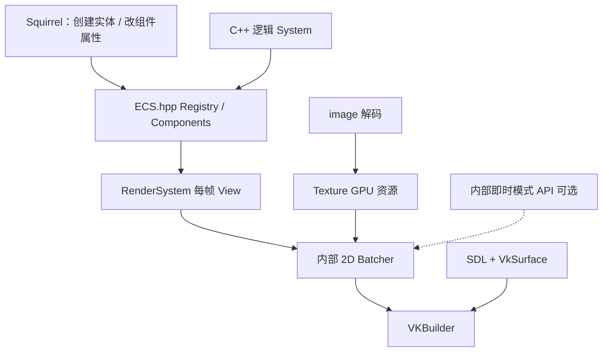
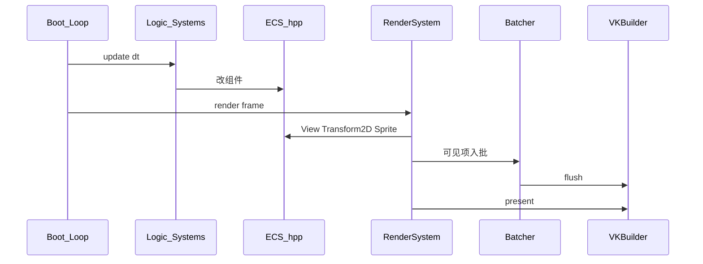

# 2D 渲染 API 设计

> 状态：第一期实现进行中（Vulkan 清屏/批绘路径 + ECS Renderable2D + RenderSystem 已合入；纹理 Sprite / 脚本绑定仍待做）。  
> 对外模型：**声明式** Entity + Renderable 组件（非每帧脚本命令式 draw）。  
> ECS 基础库：[sunxfancy/ECS.hpp](https://github.com/sunxfancy/ECS.hpp)（本仓库 `external/ECS.hpp` 子模块）。  
> 提交路径：C++ `RenderSystem` 遍历组件 → 内部 Batcher → VKBuilder。

关联文档：[模块设计.md](./模块设计.md)、[依赖项.md](./依赖项.md)、[整体架构.md](./整体架构.md)、[游戏模型设计.md](./游戏模型设计.md)  
现有骨架：[`src/modules/graphics/`](../src/modules/graphics/)、[`src/engine/common/ECS.h`](../src/engine/common/ECS.h)


## 1. 目标与非目标

### 1.1 为何不用脚本每帧命令式绘制

Love2D 式 `rectangle`/`draw` 若由 **Squirrel 每帧大量调用**，会把虚拟机调度、跨语言边界和字符串解析压在热路径上，效率差，也和本引擎「状态机 / 热更新 / 数据驱动」不一致。

正确分工：

| 层 | 职责 | 调用频率 |
|----|------|----------|
| 脚本 | **声明**实体与组件，**在状态变化时**改属性（位置、可见、贴图帧等） | 事件驱动 / 逻辑帧，非「每精灵一次 draw」 |
| C++ `RenderSystem` | 每帧 `ecs::View` 收集 Renderable → 排序 → 入批 → present | 每渲染帧一次，全在原生侧 |
| Batcher + VKBuilder | GPU 提交 | 每帧 |

### 1.2 第一期目标（A）

- 整合 **ECS.hpp**：替换未完成的自研 `eve::ECS`；C++ 侧可用 `ENTITY` / `COMPONENT` / `View`
- 接通 VKBuilder：Instance / Device / Surface / Swapchain / Present
- 与 SDL 单窗口对接：`VkSurfaceKHR`、viewport / resize
- **声明式渲染最小集**：`Transform2D` + `Sprite`（或等价 Renderable）组件 + `RenderSystem` + 清屏色 / 主摄像机
- 内部 Batcher（脚本不可见）
- 可验收：创建若干带 Sprite 的实体，改位置后每帧自动画出，脚本不调用 per-sprite draw

### 1.3 非目标（第一期不做）

- 脚本侧完整 Love2D 即时模式热路径（头文件里遗留的 `rectangle`/`circle` 等降为 **C++/DevTools 内部逃生舱**，不作为游戏脚本主 API）
- 场景树编辑器、tilemap 完整管线、法线光照摄像机、低像素专用旋转、3D model（见第 8 节）
- 字体、视频、粒子、多窗口

### 1.4 关键默认

| 项 | 默认 |
|----|------|
| 坐标系 | 原点左上，Y 向下 |
| 角度 | 弧度 |
| 颜色 | `glm::vec4` 0~1 RGBA |
| 混合 | 标准 alpha |
| ECS | `ecs::` 命名空间；引擎渲染组件放在 `eve::graphics` 或 `eve::render` |
| 深度 | 默认关；RenderPass 可预留 depth 附件供 B 期 |


## 2. 架构与数据流



### 2.1 职责切分

| 组件 | 职责 | 不负责 |
|------|------|--------|
| [ECS.hpp](https://github.com/sunxfancy/ECS.hpp) | Entity 继承、Component 存储、`View` 遍历（含子类） | 渲染、Vulkan |
| `eve` 集成层 [`ECS.h`](../src/engine/common/ECS.h) | include 上游、脚本注册桥、引擎约定 | 另造一套 Component 容器 |
| `RenderSystem` | 每帧收集 Renderable，写入 Batcher，调用 present | 游戏玩法逻辑 |
| `vulkan::Graphics` | 设备 / swapchain / 管线 / present | 实体生命周期 |
| 内部 Batcher | 按纹理/管线攒批 | 暴露给脚本 |
| `image` | CPU 像素 | 上屏 |

### 2.2 ECS.hpp 用法（引擎约定）

与上游一致（见 [Readme](https://github.com/sunxfancy/ECS.hpp)）：

```cpp
class Actor : public ecs::Entity {
public:
  ENTITY(Actor, ecs::Entity)
  void release() override;

  struct Transform2D { float x, y, rot, sx, sy; };
  struct Sprite {
    eve::graphics::Texture* texture = nullptr;
    int qx, qy, qw, qh;   // quad 像素域；或持有 Quad*
    int layer = 0;
    float r = 1, g = 1, b = 1, a = 1;
    bool visible = true;
  };

  COMPONENT(Transform2D, transform)
  COMPONENT(Sprite, sprite)
};

// 每帧（C++）
auto view = ecs::View<Actor, Actor::Transform2D, Actor::Sprite>();
for (auto it = view.begin(); it != view.end(); ++it) {
  auto [xf, sp] = *it;
  // → Batcher
}
```

继承：`Movable : Actor` 仍可被 `View<Actor, …>` 扫到，符合 ECS.hpp 设计。

### 2.3 与旧自研 ECS 的关系

| 旧 [`ECS.h`](../src/engine/common/ECS.h) | 新方案 |
|------------------------------------------|--------|
| 手写 `Component`/`ComponentRegister` 半成品 | **删除实现，改由 ECS.hpp 提供** |
| `ComponentManager::expose` 脚本钩子 | 保留为 `eve::exposeECS`，后续对接脚本侧 Entity 声明 |
| `test/ECS.cpp` 旧 API | 改为 ECS.hpp 风格用例 |

子模块路径：`external/ECS.hpp`（`src/ECS.hpp`）。依赖其 `#include "zeroerr.hpp"` 时，include 路径需包含 `external/zeroerr/include`（本仓库已通过 submodule 接入）。


## 3. 声明式公共 API（脚本 / 游戏逻辑）

### 3.1 脚本侧（目标形态）

脚本**不**每帧调用 `graphics.rectangle` 画世界。目标形态：

```squirrel
// 声明（或工厂创建）；状态变化时改字段
local e = Actor.create()
e.transform.x = 100
e.transform.y = 200
e.sprite.texture = tex
e.sprite.layer = 1

function eve::update(dt) {
    e.transform.x += dt * 10   // 只改状态
}
// 渲染由引擎 C++ RenderSystem 完成；脚本无 per-entity draw
```

第一期若 Squirrel 绑定未完成：C++ 单测 / 示例先跑通声明式路径；脚本绑定标 P1。

### 3.2 引擎侧渲染组件（第一期 P0）

| 组件 | 字段（草案） | 说明 |
|------|----------------|------|
| `Transform2D` | `x,y,rot,sx,sy` | 2D 变换；可后续拆 Parent 链接 |
| `Sprite` | texture、shader、quad、color、layer、visible | 主 Renderable；`shader=null` 用默认管线 |
| `Camera2D`（P1） | 位置、zoom、清屏色 | 缺省一台绑定主窗口 |
| `CanvasTarget`（P1） | 离屏目标 | 声明画到哪 |

### 3.3 内部逃生舱（非脚本热路径）

现有 [`Graphics.h`](../src/modules/graphics/Graphics.h) 中 `rectangle`/`circle`/`draw`/`push` 等：

- **保留给 C++**：实现 RenderSystem、DevTools 叠加层、调试用
- **不作为**游戏脚本每帧主 API
- 实现上仍汇入同一 Batcher，避免两套管线

| 内部 API | 期 | 用途 |
|----------|----|------|
| `present` / `setViewportSize` / `clear` | P0 | 帧与窗口；由 RenderSystem 或 boot 调用 |
| Batcher + 纹理 upload | P0 | Sprite 绘制后端 |
| 图元 tessellate | P2 | 调试形状、编辑器 gizmo |
| 自定义 Shader | P1 | `Graphics::newShader` / `newShaderFromSpv*`；`Sprite.shader` |

### 3.4 自定义 Shader 约定（2D）

```cpp
auto *sh = gfx->newShader(R"(#version 450
layout(location=0) in vec4 fragColor;
layout(location=1) in vec2 fragUV;
layout(location=0) out vec4 outColor;
layout(binding=0) uniform sampler2D MainTex;
layout(push_constant) uniform Externals { float data[32]; } u;
void main() { outColor = texture(MainTex, fragUV) * fragColor * u.data[0]; }
)");
sh->declareFloat("factor");
sh->sendFloat("factor", 0.5f);
entity->sprite()->shader = sh;   // 声明式
// 或 gfx->setShader(sh);       // 即时模式逃生舱
```

- 顶点输入固定为 TexturedVertex（pos / color / uv）；省略 vert 时用内置 `textured.vert`
- `MainTex`：`set=0, binding=0`
- Uniform：先 `declare*` 再 `send*`，按声明顺序写入 push-constant `data[]`（最多 32 floats）
- GLSL 编译依赖本机 `glslc`；无 glslc 时用预编译 SPIR-V（`newShaderFromSpv` / `newShaderFromSpvFile`）


## 4. VKBuilder 映射表

| 引擎概念 | VKBuilder | 说明 |
|----------|-----------|------|
| 初始化 | Instance / Device / Swapchain | SDL surface；一处 `VKB_IMPL` |
| 帧循环 | `Present` | RenderSystem 末尾 `drawFrame` |
| Sprite 批 | `HostVertexBuffer` + 纹理管线 | 按 texture/layer 排序减切换 |
| Texture | `TextureImage2D` + Sampler | 来自 image |
| 离屏 | `ColorAttachmentImage` | CanvasTarget 组件 |
| 默认管线 | `PipelineBuilder::useClassicPipeline` | 顶点色 + 可选一张纹理 |

CMake：链接 `Vulkan::Vulkan`；增加 `external/ECS.hpp/src` 与 zeroerr 头路径。


## 5. 帧生命周期



规则：

1. 脚本/逻辑 **禁止** 在 `RenderSystem` 持有的 command 录制期间做会破坏 swapchain 的事（对齐 event 里 render-pass 保护意图）。
2. 改 `Sprite.texture` 等只标 CPU 侧脏；Batcher 按当前组件状态建顶点，无需脚本 `draw`。
3. resize → 重建 swapchain；下一帧 View 照常。


## 6. 资源与 `image` 边界

- `image`：解码 → `ImageData`
- `graphics`：`ImageData` → GPU `Texture`（可被多个 Sprite 共享）
- Sprite 组件持有 `Texture*`（或句柄），不持有解码器


## 7. Squirrel 绑定约定

1. 实体类型最终应对齐 ECS.hpp 的「类 + 组件」模型（示例里的 `EntityContainer` 需迁到此模型）。
2. 不重载；模块单例 C++ 持有。
3. **禁止**把成百上千次 `graphics.draw` 绑成脚本热路径。
4. 第一期可先 C++ API + 测试；`exposeECS` 预留 `component` / 实体工厂注册。


## 8. 高级能力（B）边界

均建立在「组件 + View + Batcher」上，而不是新的脚本 draw API。

| 能力 | 建议组件 / 系统 | 依赖 A |
|------|-----------------|--------|
| 精灵表现扩展 | 扩展 `Sprite`（帧动画索引等）或 `AnimSprite` | Texture、Batcher、View |
| 场景 / 调试章节 | 激活某 World/Camera，或过滤 `layer`/`tag` | Camera2D、CanvasTarget |
| Tilemap | `TileLayer` 组件 + `map` 数据；`TileRenderSystem` 或合并进 RenderSystem | 图集 Texture、批四边形 |
| 摄像机光照 | `Camera2D` + 法线纹理字段 + 第二管线 key | Batcher pipeline key 扩展 |
| 低像素 | Sampler 最近邻 + 像素对齐字段 | Sampler 进批 key |
| 简单 3D | 独立组件与 Pass，**不**进 2D Sprite 批 | depth 附件、独立管线 |


## 9. 验收标准（第一期）

- [ ] 工程能编译并 `#include` ECS.hpp；`test/ECS.cpp` 用上游风格创建实体、改组件通过
- [ ] Vulkan 窗口清屏 + present 稳定
- [ ] C++ 创建 N 个带 `Transform2D`+`Sprite` 的实体，`RenderSystem` 每帧画出；**无**脚本 per-frame draw 循环
- [ ] 只改 transform 即可看到物体移动
- [ ] resize 不崩溃


## 10. 实现分期（确认设计后再做渲染编码）

1. **ECS 整合（进行中）**：子模块、CMake include、替换旧 ECS、测试用例  
2. Vulkan 清屏 + Window surface  
3. Texture upload + Batcher + `RenderSystem` + Sprite/Transform2D  
4. Camera2D / 清屏色组件化  
5. Squirrel 实体/组件绑定  
6. （之后）B 期 TileLayer / 光照等  

---

## 讨论检查清单

1. 第一期 Renderable 是否就用 `Transform2D` + `Sprite` 两个组件（是/否）  
2. 旧 `Graphics.h` 即时模式是否同意降为内部逃生舱  
3. 脚本绑定是否可放到 A 期末（先 C++ 跑通）  

确认后回复「可以开始实现」再继续 Vulkan/Batcher/RenderSystem 编码（ECS 子模块整合可先合入）。
