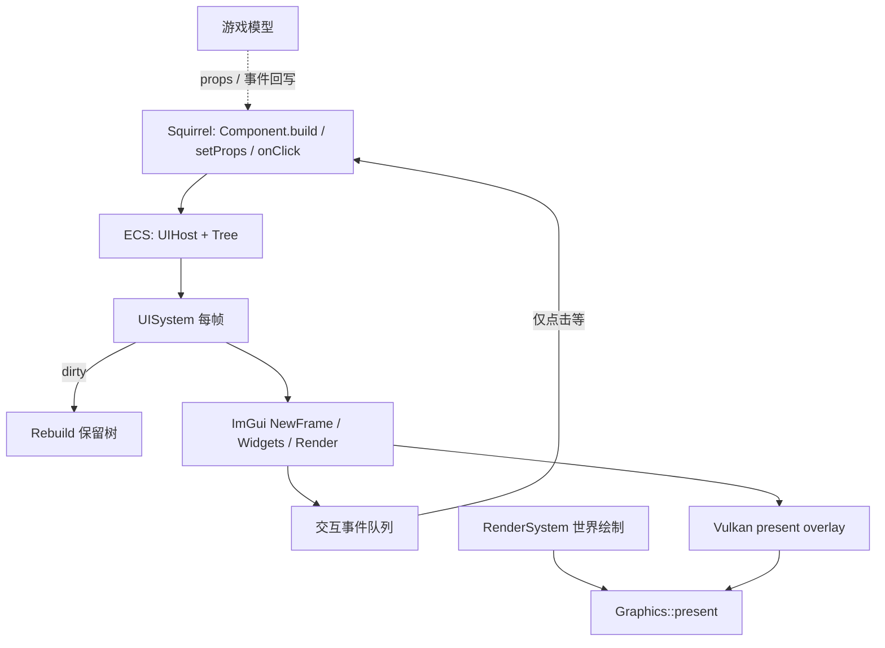
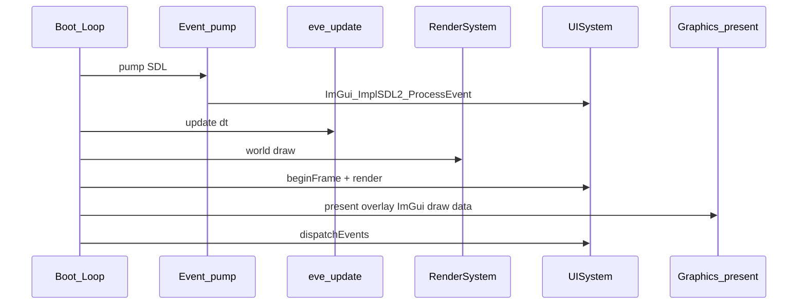

# 声明式游戏 GUI 框架设计

> 状态：B 期已完成（脚本 Component + 高级原语）；C 期 DevTools 待做。  
> 对外模型：**声明式** retained 组件树 + ECS `UIHost`（非每帧脚本命令式 ImGui）。  
> 后端：Dear ImGui（SDL 输入 + Vulkan 绘制），由 C++ `UISystem` 每帧 walk。  
> ECS 基础库：[sunxfancy/ECS.hpp](https://github.com/sunxfancy/ECS.hpp)（`external/ECS.hpp`）。

关联文档：[模块设计.md](./模块设计.md)、[依赖项.md](./依赖项.md)、[整体架构.md](./整体架构.md)、[游戏模型设计.md](./游戏模型设计.md)、[2D渲染API设计.md](./2D渲染API设计.md)  
代码落点：[`src/modules/ui/`](../src/modules/ui/)（抽象 [`UIBackend`](../src/modules/ui/UIBackend.h)；ImGui 实现 [`ui/imgui/`](../src/modules/ui/imgui/)）


## 1. 目标与非目标

### 1.1 为何不用脚本每帧命令式 ImGui

ImGui 本身是即时模式：每帧都要调用 `Begin`/`Button`/`End`。若由 **Squirrel 每帧大量调用**，会把 VM 调度与跨语言边界压在热路径上，也与引擎「状态机 / 热更新 / 数据驱动」及声明式渲染分工不一致。

正确分工：

| 层 | 职责 | 调用频率 |
|----|------|----------|
| 脚本 | **声明** UI 组件树，**在状态变化时**改 props / `setState`，注册事件回调 | 事件驱动，非「每控件一次 ImGui」 |
| C++ `UISystem` | dirty 时 rebuild 保留树；每帧 walk → ImGui | 每渲染帧，全在原生侧 |
| ImGui + SDL/Vulkan | 绘制与输入命中 | 每帧 |

### 1.2 第一期目标（A）

- CMake 接入 imgui（核心源 + `imgui_impl_sdl` + `imgui_impl_vulkan`）
- ECS：`UIHost`（Meta + Tree）+ `UISystem`
- 保留节点最小集：`Window` / `Text` / `Button` / 简单 `SameLine` 布局
- 脚本：`Component` 风格 `build` → `mount` / `setProps` / `setState` / `onClick`
- 帧序：游戏 `RenderSystem` → `UISystem` → `present`（UI overlay）
- 验收：挂一次面板，点按钮改模型文字；脚本无 per-frame UI 调用

### 1.3 非目标（第一期不做）

- 完整 React Virtual DOM / hooks 全家桶（仅 `build` + dirty 整树重建）
- 每个 Button 一个 ECS Entity
- 脚本侧原始 `imgui.begin/button` 热路径（即时模式仅 C++/DevTools 逃生舱）
- 反射自动生成 DevTools 属性面板（C 期）
- 富文本浏览器级布局、游戏内 WYSIWYG 编辑器

### 1.4 约定默认

| 项 | 默认 |
|----|------|
| React 深度 | 组件化 + `build()` + dirty 重建；不做精细 key-diff |
| ECS 挂载 | Host 为 Entity；控件树在 `Tree` 组件内 |
| 绑定 | props 单向流入；回写仅经事件回调（避免复杂双向 binding） |
| 枚举 | 短 string（≤15）；单返回值 |
| 命名空间 | C++ `eve::ui`；脚本 `eve.UI` / `eve.ui` |


## 2. 架构与数据流



### 2.1 职责切分

| 组件 | 职责 | 不负责 |
|------|------|--------|
| `UIHost` Entity | 一块屏幕/面板挂载点（可见性、layer、modal） | 玩法逻辑 |
| `Tree` 组件 | 保留 `UINode` 数组 + dirty + handler 表 | Vulkan |
| `UISystem` | rebuild、每帧 walk → ImGui、收集事件 | 游戏规则 |
| `UIBackend` | 输入/呈现抽象；默认 `createImGuiBackend()` | 控件树语义 |
| `ui/imgui/ImGuiBackend` | SDL 输入、Vulkan present overlay | 脚本 API |
| `graphics` | present 前调用 overlay 钩子 | UI 树语义 |

### 2.2 与交互层（游戏模型）的关系

对齐 [游戏模型设计.md](./游戏模型设计.md) 四层模型中的 **交互层**：

- UI 是 ViewModel 的可视化：改数据 → 改显示；用户操作 → 事件 → 改模型
- 交互对象可作为 component 挂到模型实体上（`UIHost`），与声明式渲染同表

### 2.3 与声明式 2D 渲染的同构

| 渲染 | GUI |
|------|-----|
| `Renderable2D` + `Transform2D`/`Sprite` | `UIHost` + `Meta`/`Tree` |
| `RenderSystem::render` | `UISystem::render`（`View<UIHost,…>`，含继承子类） |
| 脚本改组件字段 | `select(name)` 后 `setText` / 或直接改 `host->tree()` |
| 禁止 per-sprite `draw` | 禁止 per-frame `imgui.button` |

**ECS 约定：**

- 每个面板一个 `UIHost` 实体；`Meta.name` 用于 `findHost` / `select` / `mountBuildAs`
- 可 `class Hud : public UIHost` 挂玩法组件；仍被 `View<UIHost, Meta, Tree>` 扫到
- `Meta.ownerId` 把 UI 挂到游戏实体 id（`bindOwner` / `findHostByOwner`）
- 点击全局队列：`consumeClick()` → `"hostName/nodeId"`
- 控件仍在 `Tree` 内（不做每 Button 一 Entity）


## 3. ECS 组件

```cpp
namespace eve::ui {

enum class NodeType : uint8_t { Window, Text, Button, SameLine, Group };

struct UINode {
  NodeType type = NodeType::Text;
  std::string id;          // 稳定 id（事件路由）
  std::string text;        // 标题 / 标签
  bool visible = true;
  int firstChild = -1;
  int nextSibling = -1;
  uint32_t handlerClick = 0; // 0 = none；索引进 Host handler 表
};

class UIHost : public ecs::Entity {
public:
  ENTITY(UIHost, ecs::Entity)
  void release() override;

  struct Meta {
    bool visible = true;
    int layer = 0;
    bool modal = false;
    UIHost *entity = nullptr;
  };

  struct Tree {
    bool dirty = true;
    std::vector<UINode> nodes;
    int root = -1;
    // 脚本/C++ 回调槽；实现侧可用 std::function 或 squirrel 句柄
  };

  COMPONENT(Meta, meta)
  COMPONENT(Tree, tree)
};

class UISystem {
public:
  static void beginFrame();   // ImGui NewFrame（SDL 事件已泵）
  static void render();       // walk hosts → widgets → ImGui::Render
  static void dispatchEvents(); // 帧末把点击投递给脚本
};

}  // namespace eve::ui
```

规则：

1. **不**为每个 Button 建 Entity；Host 少、树在组件内，利于 ImGui 连续 walk。
2. Dirty：`setProps` / `setState` / 结构变化 → `tree.dirty = true`；rebuild 整棵 Host 树（A 期）。
3. 多个 Host：`ecs::View<UIHost, Meta, Tree>`，按 `layer` 排序后绘制。


## 4. 可组合声明式 API

### 4.1 C++（`WidgetDesc`）

```cpp
#include "ui/Widget.h"
using namespace eve::ui;

ui->mount(window("Inventory", {
    text("Hello", "label"),
    group({
        button("Use", "use", [&]{ /* ... */ }),
        sameLine(),
        button("Drop", "drop"),
    }),
}));
ui->setText("label", "Ready");
```

### 4.2 脚本（栈式 builder，挂一次）

```squirrel
ui.beginBuild()
ui.beginWindow("Inventory", "root")
  ui.text("Ready", "status")
  ui.beginGroup("actions")
    ui.button("Use", "use")
    ui.sameLine("")
    ui.button("Drop", "drop")
  ui.end()
ui.end()
ui.mountBuild()

// 状态变化时改 props（非每帧重建）
ui.setText("status", "Used")

// 点击：dispatchEvents 之后
local id = ui.consumeClick()
while (id != "") {
    if (id == "use") { /* 改模型 */ }
    id = ui.consumeClick()
}
```

| 概念 | 含义 |
|------|------|
| `WidgetDesc` / builder | 可任意嵌套 Window/Text/Button/Group/SameLine |
| `id` | 稳定键；`setText` / `setVisible` / 点击路由 |
| `mount` / `mountBuild` | 声明一次；后续只改 props |
| `onClick`（C++） / `consumeClick`（脚本） | 仅交互时处理 |
### 4.3 C++ Component（B）

```cpp
class InventoryPanel : public eve::ui::Component {
  std::vector<std::string> items{"Sword"};
  int gold = 10;
  WidgetDesc build() override {
    return window("Inv", {
      text("Gold " + std::to_string(gold), "gold"),
      listButtons("items", items),
      when(gold > 0, button("Buy", "buy")),
    });
  }
};

InventoryPanel panel;
panel.mountAs("inv");
panel.gold = 9;
panel.markDirty();
panel.updateIfDirty();  // key reconcile when structure stable
```

### 4.4 脚本 List / 主题（B）

```squirrel
ui.beginBuild()
ui.beginWindow("Shop", "root")
  ui.beginList("goods")
    ui.listItem("Apple", "goods/0")
    ui.listItem("Bread", "goods/1")
  ui.end()
  ui.separator("s")
  ui.checkbox("Member", false, "mem")
ui.end()
ui.mountBuildAs("shop")
ui.setThemeDark()
ui.setNavKeyboard(true)
```

### 4.5 脚本 Component（B）

```squirrel
class ShopPanel extends eve.UIComponent {
    gold = 10
    constructor(uiRef) {
        base.constructor(uiRef)
        gold = 10
    }
    function build() {
        local u = ui()
        u.beginWindow("Shop", "root")
        u.text("Gold " + gold, "gold")
        u.slider("Tax", 0.1, 0.0, 1.0, "tax")
        u.progress(gold / 100.0, "bar", "")
        if (gold > 0) u.button("Buy", "buy")
        u.end()
    }
}

local panel = ShopPanel(ui)
panel.mountAs("shop")
// 状态变化时：
panel.gold = 9
panel.setState()
panel.updateIfDirty()  // remountBuildAs + key reconcile
```

`eve.Component` 是 `eve.UIComponent` 的别名。


## 5. 保留树 vs ImGui

1. `WidgetDesc`（脚本构建）→ flatten 为 `UINode` arena。
2. 每帧：`UISystem` 只读节点调 `ImGui::*`，**不进入 Squirrel**（除非本帧有待派发事件）。
3. 命中控件后推入 `Event{host, nodeId, kind}`，在 `dispatchEvents` 调脚本。
4. B 期：列表 `key`、局部 dirty。


## 6. 帧生命周期



规则：

1. SDL 事件在 `event.pump` 时交给 ImGui（若 UI 模块已初始化）。
2. `WantCaptureMouse/Keyboard` 为真时，游戏逻辑可选择忽略对应输入。
3. Overlay 在 swapchain render pass 内、`endRenderPass` 之前绘制。
4. modal Host 依赖 ImGui 焦点与捕获标志挡住下层。


## 7. 模块与依赖

- 模块名：`ui`（C++ `eve::ui::UI`，脚本 `eve.UI`）
- 依赖：Window（SDL）、Graphics（Vulkan present 钩子）、ECS.hpp、imgui
- third-party：补齐 imgui 头文件；CMake 编 `imgui` 静态库并安装头路径


## 8. 分期

### A — 最小可玩（进行中）

1. imgui CMake + SDL/Vulkan backend
2. `UIHost` / `Tree` / `UISystem`；Window / Text / Button
3. Graphics present overlay 钩子
4. 脚本 mount / setProps / onClick；C++ 验收测试

### B — 组合与列表

- [x] `List` / `listButtons` / 脚本 `beginList`+`listItem`
- [x] 条件子树 `when` / `whenElse`
- [x] `Component`（C++ `build` / `setState` / `rebuild` / key reconcile）
- [x] 按 key 局部 dirty（`setTreeReconcile` / `applyTreeReconcile`）
- [x] 主题 `Theme` + `setThemeDark` / `setThemeLight`；键盘导航开关
- [x] 原语扩展：`Separator` / `Checkbox`
- [x] 脚本侧 `class X extends eve.UIComponent { build() }`（`eve.Component` 别名）
- [x] 高级原语：`Slider` / `Progress` / `InputText` / `CollapsingHeader` / `Child`
- [x] `consumeChange` / `setValue` / `WantCapture*` / `setHostModal`

### C — DevTools

- 同一 `UISystem`；反射属性面板（见 [界面设计.md](./界面设计.md)）
- 原始 ImGui 逃生舱仅限 C++ DevTools


## 9. 验收标准（第一期）

- [x] 工程可编译并链接 imgui；`#include <imgui.h>`
- [x] C++ 创建 `UIHost`，树含 Window+Text+Button；`UISystem` 每帧画出路径存在；**无**脚本 per-frame UI 循环（见 `test/UISystem.cpp`）
- [x] 点击 Button 触发回调并改 Text（C++ handler + `dispatchEvents`）
- [x] `setProps` / `setLabelText` 后保留树字段更新
- [x] 与 boot 帧序对接（`src/scripts/load.nut`）
- [x] 与现有 `RenderSystem` 同帧 Vulkan overlay 实机冒烟（`test/UIOverlaySmoke.cpp`）


## 10. 内部逃生舱

| API | 用途 |
|-----|------|
| 直接 `ImGui::*`（C++） | DevTools、调试 |
| `UISystem::render` | 游戏主路径 |
| 脚本 `imgui.*` | **不提供**为热路径 |
