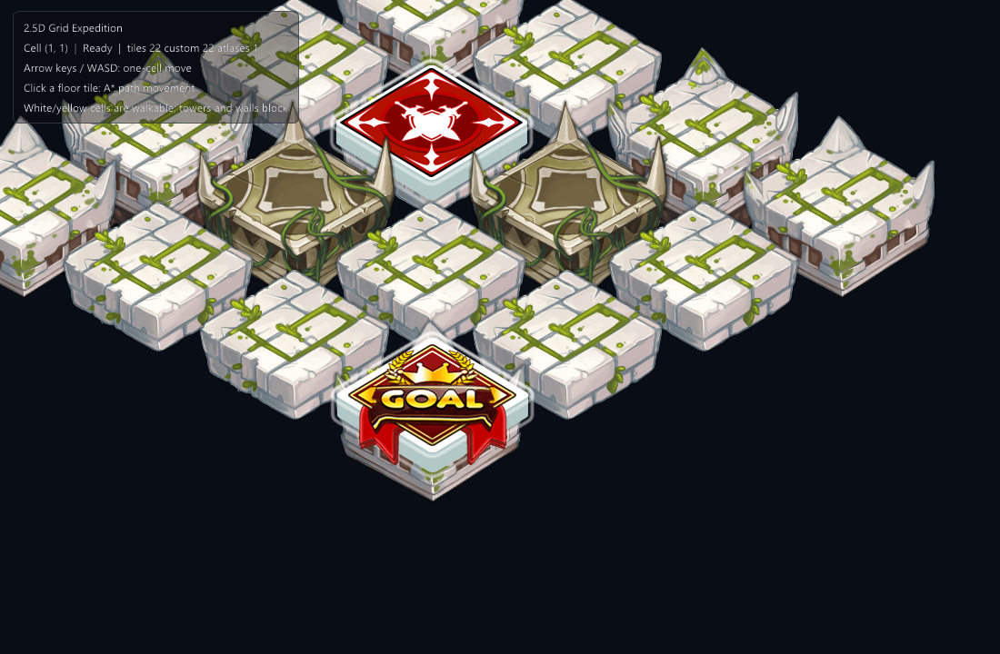

# EVEngine 2.5D Tilemap 工具链开发者评估

评估日期：2026-08-24  
评估对象：EVEngine 当前工作树 + Windows SDK v0.1.0  
测试素材：`C:\baidunetdiskdownload\C629\格子`  
实测项目：`examples/iso-grid-walk`

## 结论

当前 2.5D tilemap **运行时核心已达到“可快速做玩法原型”水平，但资产生产工具链尚未闭环**。等距投影、格子/世界坐标换算、鼠标拾取、四方向 A*、阻挡语义等核心能力都可以直接组合；真正影响开发效率的是从“每格一张独立 2.5D PNG”到“引擎可批量渲染的 tileset + 锚点 + footprint + 碰撞/阻挡元数据”的导入过程。

综合开发体验：**6.3/10**。运行时核心约 **7.8/10**，资产工具链约 **4.5/10**。

适合立即开始：小型战棋、棋盘解谜、回合制移动、原型关卡。  
不建议直接内容量产：大地图、多套地块皮肤、大量动态单位、需要策划持续编辑的项目。

## 本次制作的小样

小样是一个 8×8 的等距棋盘游戏：

- 方向键或 WASD 每次移动一个逻辑格；
- 点击可行走格后，使用 `Map.newPathfinder(layer)` 计算四方向 A* 路径并逐格移动；
- 塔和墙写入逻辑 `TileLayer` 为阻挡 GID；
- `tileToWorld*` 负责渲染位置，`worldToTile*` 负责鼠标拾取；
- 地块、障碍、目标和玩家按 `x + y` 的等距深度顺序绘制；
- 使用素材中的 `tile_4/6/9/75/76/77/80.png`，没有重新绘制素材。



运行命令：

```powershell
eve run examples/iso-grid-walk
```

## 素材导入实测

素材目录共包含约 175 张 PNG，其中主体 tile 多为 300×300，另有 900×900、225×180、124×88 等尺寸。素材的视觉 footprint 大致是菱形，但透明画布中还包含高度、装饰和阴影，视觉尺寸与逻辑格尺寸不是同一概念。

这与当前标准 `TileLayer` 的假设存在明显错位：标准路径希望得到规则 atlas、统一 tile region、first GID 和 columns；本素材则是独立纹理，而且不同 tile 的视觉高度与脚点不同。因此本次采用“不可见逻辑 TileLayer + 手工独立纹理渲染”的兼容路径。

兼容路径证明引擎可以完成玩法，但带来四个成本：

1. 游戏脚本必须维护素材 ID 到纹理的映射；
2. 游戏脚本必须自己处理脚点偏移和 painter order；
3. 每种 tile 是独立纹理，难以获得标准 atlas batching；
4. 阻挡、footprint、视觉锚点与素材文件之间没有统一资产描述。

## 开发体验评分

### 等距投影与拾取：8/10

`orientation=isometric`、`tileToWorldX/Y`、`worldToTileX/Y` 的职责清楚，逻辑格与显示投影分离正确。开发者不需要重复实现等距公式，点击拾取也可直接复用同一配置。

不足是脚本侧只有分开的 X/Y 查询，缺少返回结构体/元组的便利接口；对带高度的独立 PNG，也没有视觉脚点或锚点参与拾取。

### 方格移动与寻路：8/10

Pathfinder 与投影解耦是正确设计。等距地图的 `auto` 拓扑默认四方向，正好匹配“走方格”玩法；阻挡 GID、动态格成本、Flow Field 也为后续扩展留出了空间。

不足是从路径到“按格移动的 actor controller”仍需游戏层编写计时、插值、取消与重规划逻辑。可以考虑提供轻量 grid mover 示例或组件，但不必塞进 Pathfinder。

### Tiled 标准工作流：7/10

设计与源码已覆盖 Tiled JSON、isometric/staggered/hex、base64+zlib/gzip、对象层、dual-grid、热重载和统一 2D 绘制队列。对于规则 atlas，这是相对完整的基础。

边界也很明确：不支持无限地图 chunks、外部 TSX、zstd、GID 翻转/旋转。它们对小项目可接受，但对成熟 Tiled 项目迁移会形成导入约束。

### 独立 2.5D PNG 资产工作流：4/10

这是本次最明显的短板。缺少批量 atlas packer、自动裁透明边、脚点/footprint 标注、GID 元数据生成、碰撞/阻挡语义编辑和导入预览。开发者可以用现有 API 绕过去，但会把工具链工作转移到游戏脚本。

### 遮挡与深度排序：6/10

引擎的统一 2D 队列与 `depthY` 方向正确，规则 tile 与 Renderable2D 可按脚点穿插。但独立纹理的立即绘制路径没有自然进入同一 tile 队列，本次只能按 `x+y` 手工排序。对于 1×1 高地块尚可；多格建筑、跨格装饰、飞行物和高角色会迅速复杂化。

### SDK / 示例一致性：5/10

Windows SDK v0.1.0 可以在约 0.36 秒内显示首帧，Vulkan、纹理和 UI 初始化顺利。但仓库示例使用的全局 `key_just_pressed` 在该 SDK 中不存在，首次运行产生逐帧错误；改为 `keyboard.isDown` + 边沿状态后正常。发布 SDK 应对所有随附/推荐示例做版本化冒烟测试。

另外，按仓库说明尝试 `make test/win32-debug FILTER=map.projection.isometric` 时，`ensure-built/win32-debug` 的 POSIX shell 片段被 Windows `cmd` 解释，出现 `'[' is not recognized` 等错误。这不是 tilemap 运行时缺陷，但会损害 Windows 开发者验证体验。

## 已验证与未验证

已验证：

- Windows SDK v0.1.0 启动；
- 七张独立 PNG 纹理加载；
- isometric TileLayer 初始化；
- GID 阻挡与 A* 初始化；
- 单格输入状态与持续运行无帧错误；
- Vulkan/UI 首帧与素材透明混合呈现；
- 热重载监视注册。

未做生产级验证：

- 1 万格以上地图的帧时间和显存；
- 大量独立纹理导致的 draw call/descriptor 成本；
- 动态单位与高 tile 的统一遮挡；
- 多格 footprint、坡度/高度差、跳跃和桥下穿行；
- 移动端/WebGPU 的同素材表现；
- 素材许可证与署名合规。素材目录没有随附可识别的授权文件，发布前必须向素材来源方确认。

## 建议路线图

### P0：补齐资产导入器

提供一个命令行或编辑器导入流程：扫描独立 PNG，自动裁透明边，保留原始 pivot，打包 atlas，生成 GID、UV、视觉包围盒、脚点、逻辑 footprint、阻挡/地形标签。允许开发者在预览中修正自动结果。

建议资产描述至少包含：

- `texture/region`；
- `pivotX/pivotY` 或 `footX/footY`；
- `footprintW/footprintH`；
- `visualBounds`；
- `terrainTags`、`walkable`、`cost`；
- 可选 `height`、`occlusionClass`、`sortBias`。

### P0：锁定 SDK 与示例兼容矩阵

每次 SDK 发布后，用该 SDK 运行仓库标记为“SDK 示例”的项目，至少检查脚本编译、首帧、资源加载和 5 秒无帧错误。文档要明确示例所需的最低 SDK 版本。

### P1：引入 2.5D TileSet 资产类型

让 TileLayer 不只接受规则 atlas，也能接受“GID → atlas region/独立纹理 + pivot + bounds”的 TileSet 描述。运行时仍应尽可能把独立图片预打包或放入 texture array，而不是让脚本逐张绘制。

### P1：编辑器中的投影与语义预览

编辑器应同时显示逻辑格、footprint、脚点、当前 depthY、阻挡、A* 路径和最终遮挡结果。开发者要能在不运行游戏的情况下发现“看起来在这个格，逻辑上却在邻格”的问题。

### P2：生产性能路径

补充视锥裁剪、chunk、脏区更新、atlas/texture-array batching 和可观察统计：可见 tile 数、draw item 数、纹理切换数、排序耗时、上传量。性能问题需要可测量，而不是只依靠 API 约定。

## 最终判断

如果项目目标是先验证玩法，当前工具链已经够用：一名熟悉 Squirrel 的开发者可在半天内完成等距格移动、阻挡和 A* 原型。若目标是让策划/美术持续生产大量 2.5D 关卡，当前瓶颈不在 map 算法，而在资产转换、元数据、编辑预览、SDK 版本一致性和批渲染路径。建议在扩大内容团队前先完成 P0，再以一个真实 200×200 地图作为 P1/P2 的验收基准。

## 2026-08-24 路线图实施回访

按“基础构建、项目自组工作流”的产品原则，P0/P1 的基础闭环已经落地：

- `tools/tile-pipeline/` 提供阶段注册表、项目 JSON、Python 插件协议和四个可替换参考阶段；
- `eve.tileset/1` 成为命令行、项目编辑器与运行时之间的稳定契约；
- `TileLayer` 支持不规则 region、pivot、sortBias 与 gameplay 元数据，同时保留规则 atlas 回退；
- 小样已从手工逐纹理绘制迁移为 pipeline 生成 atlas/manifest 后由 TileLayer 统一队列渲染；
- `Map` 提供可见 tile、自定义 visual 与 atlas 数量三个无 UI 统计构件；
- 编辑器继续复用 `EditorSession` / overlay / inspector 协议，未引入封闭的专用编辑器产品。

尚未伪装成“已完成”的部分：chunk/culling、增量缓存和 SDK 发布矩阵仍应作为后续独立能力建设；当前契约已为它们预留组合位置，但没有把未经大地图基准验证的实现塞进本次改动。
