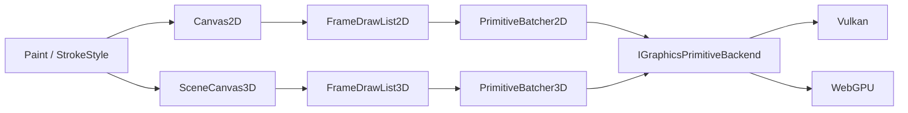

# 2D 与 3D 基础图形绘制 API 设计

> 目标：提供接近 Skia Canvas 的基础图形接口，并将相同的画笔、路径和批处理思想扩展到 3D 场景。
>
> 当前实现状态：共享 Paint、2D Path/Canvas、3D SceneCanvas、screen/world 粗线与
> 虚线、cap/join、coverage AA、2D 填充规则、3D 线框/填充空间图形、LOD/cache、
> PrimitiveScene generation handle/批量事务/脚本 proxy，以及 Vulkan/WebGPU 真实
> depth/blend/cull pass 已落地。Box2D debug draw 和 editor GizmoSnapshot 已迁移到共享
> 图元层。Vulkan/WebGPU 的 2D+3D 离屏读回、完整与 `runtime-3d`
> 裁剪组合均已验收。GPU picking attachment 仍是后续扩展；当前实现只保留
> `objectId` 数据，不把它描述为可读回的 picking 能力。

关联：[`3D渲染管线.md`](./3D渲染管线.md)、[`模块编排与裁剪架构.md`](./模块编排与裁剪架构.md)、
[`重构代码质量与系统完整性规范.md`](./重构代码质量与系统完整性规范.md)。

## 1. 范围

本 API 服务 2D 程序图形、编辑器覆盖层，以及 3D 场景中的线、折线、虚线、箭头、网格、圆弧、
AABB、OBB、球、胶囊、圆柱、圆锥和视锥。物理调试、导航和 Gizmo 应复用它，不再各自创建临时 Mesh。

它不替代 Sprite、Tilemap、模型、粒子等声明式系统，不提供 Skia 全量的 SVG/PDF/排版/复杂滤镜，
也不让基础图形默认参与阴影、GBuffer、PBR 或物理碰撞。长期、受光照的游戏对象仍使用正式 Mesh。

## 2. 总体结构



2D/3D 共享 `Color`、`Paint`、线帽、连接、虚线、fill/stroke、抗锯齿、混合和状态栈；但入口分开：
2D 使用 Canvas 坐标和 clip，3D 使用世界坐标、Camera、深度和可选屏幕空间线宽。不要把几十个高层
方法继续塞进 `Graphics`，也不要用一个充满无意义参数的 `Canvas<T>`。

### 2.1 公共值类型

```cpp
enum class PaintMode { Fill, Stroke, FillAndStroke };
enum class LineCap { Butt, Square, Round };
enum class LineJoin { Miter, Bevel, Round };
enum class WidthSpace { ScreenPixels, WorldUnits };
enum class DashSpace { ScreenPixels, WorldUnits };
enum class DepthMode { TestAndWrite, TestOnly, Ignore };
enum class CullMode { None, Back, Front };

struct DashPattern {
    std::vector<float> intervals; // draw, gap, draw, gap...
    float phase = 0.f;
    DashSpace space = DashSpace::ScreenPixels;
};

struct StrokeStyle {
    float width = 1.f;
    WidthSpace widthSpace = WidthSpace::ScreenPixels;
    LineCap cap = LineCap::Butt;
    LineJoin join = LineJoin::Miter;
    float miterLimit = 4.f;
    std::optional<DashPattern> dash;
};

struct Paint {
    Color color = Color::white();
    PaintMode mode = PaintMode::Fill;
    StrokeStyle stroke{};
    BlendMode blend = BlendMode::Alpha;
    bool antialias = true;
};
```

dash 数组必须非空、数量为偶数、每项有限且大于零；宽度、尺寸和半径必须有限且非负。参数违约用
`EV_PARAM_CHECK`。GPU 容量等可恢复失败由帧提交返回结构化 `Result<DrawStatistics>`，不使用
`lastError`。Canvas 记录时复制 owning value，不保留调用方 span 或栈上顶点指针。

## 3. 2D Canvas

```cpp
class Canvas2D {
public:
    virtual ~Canvas2D() = default;
    virtual void save() = 0;
    virtual void restore() = 0;
    virtual void concat(const glm::mat3&) = 0;
    virtual void clipRect(Rect) = 0;

    virtual void drawPoint(glm::vec2, const Paint&) = 0;
    virtual void drawLine(glm::vec2, glm::vec2, const Paint&) = 0;
    virtual void drawPolyline(std::span<const glm::vec2>, bool closed, const Paint&) = 0;
    virtual void drawRect(Rect, const Paint&) = 0;
    virtual void drawRoundedRect(Rect, CornerRadii, const Paint&) = 0;
    virtual void drawCircle(glm::vec2 center, float radius, const Paint&) = 0;
    virtual void drawEllipse(Rect bounds, const Paint&) = 0;
    virtual void drawArc(Rect bounds, Angle start, Angle sweep, const Paint&) = 0;
    virtual void drawPath(const Path2D&, const Paint&) = 0;
};
```

`Path2D` 首期支持 move、line、二次/三次 Bézier、close，以及 non-zero/even-odd 填充规则。它是 CPU
owning value，可缓存细分结果；Canvas 记录不可变快照或缓存 handle。默认坐标原点左上、Y 向下、
单位为 Canvas 像素，线宽按屏幕像素。纹理和文字暂由现有 `IGraphics2D` 提供，后续可迁入同一门面。

## 4. 3D Scene Canvas

```cpp
struct SceneDrawContext {
    glm::mat4 view, projection;
    glm::vec3 cameraPosition;
    glm::ivec2 viewportSize;
    float nearPlane, farPlane;
};

struct ScenePaint : Paint {
    DepthMode depth = DepthMode::TestOnly;
    CullMode cull = CullMode::None;
    std::uint32_t layer = 0;
    std::uint64_t objectId = 0; // 0 = 不参与 picking
};

class SceneCanvas3D {
public:
    virtual ~SceneCanvas3D() = default;
    virtual void save() = 0;
    virtual void restore() = 0;
    virtual void concat(const glm::mat4& model) = 0;

    virtual void drawPoint(glm::vec3, const ScenePaint&) = 0;
    virtual void drawLine(glm::vec3, glm::vec3, const ScenePaint&) = 0;
    virtual void drawPolyline(std::span<const glm::vec3>, bool closed, const ScenePaint&) = 0;
    virtual void drawRay(glm::vec3 origin, glm::vec3 direction, float length,
                         const ScenePaint&) = 0;
    virtual void drawArrow(glm::vec3 from, glm::vec3 to, const ArrowStyle&,
                           const ScenePaint&) = 0;
    virtual void drawTriangle(glm::vec3, glm::vec3, glm::vec3, const ScenePaint&) = 0;
    virtual void drawQuad(glm::vec3 center, glm::quat rotation, glm::vec2 size,
                          const ScenePaint&) = 0;
    virtual void drawDisk(glm::vec3 center, glm::vec3 normal, float radius,
                          const ScenePaint&) = 0;
    virtual void drawArc(glm::vec3 center, glm::vec3 normal, glm::vec3 zeroDirection,
                         float radius, Angle start, Angle sweep, const ScenePaint&) = 0;
    virtual void drawGrid(const Grid3D&, const ScenePaint&) = 0;
    virtual void drawAabb(const Aabb&, const ScenePaint&) = 0;
    virtual void drawObb(const Obb&, const ScenePaint&) = 0;
    virtual void drawSphere(glm::vec3 center, float radius, const ScenePaint&) = 0;
    virtual void drawCapsule(glm::vec3 a, glm::vec3 b, float radius, const ScenePaint&) = 0;
    virtual void drawCylinder(glm::vec3 a, glm::vec3 b, float radius, const ScenePaint&) = 0;
    virtual void drawCone(glm::vec3 apex, glm::vec3 axis, float height, float radius,
                          const ScenePaint&) = 0;
    virtual void drawFrustum(const FrustumCorners&, const ScenePaint&) = 0;
    virtual void drawPath(const Path3D&, const ScenePaint&) = 0;
};
```

Canvas 由当前 3D pass 根据 `SceneDrawContext` 创建，不持有 `Camera3D*` 或 Scene 指针。Context 是
单帧值快照。Canvas 为 render-thread affine，同步记录命令，不调用脚本或未知 callback。

### 4.1 3D 粗线

不能依赖 Vulkan 原生宽线：设备支持不一致，也无法可靠实现 join、cap 和 dash。统一使用
shader-expanded segment/ribbon：

- `ScreenPixels` 在裁剪空间展开，远近保持恒定像素宽，适合 Gizmo 和调试图；
- `WorldUnits` 在世界空间形成朝向摄像机的 ribbon，透视下自然缩小；
- segment 先在 view space 裁剪 near plane，避免投影后爆线；
- 折线携带前后方向，miter 超限退化为 bevel，round cap/join 使用解析覆盖或小扇形；
- 零长度 segment 退化为 point，不产生 NaN。

世界单位粗线仍是 billboard ribbon，不是固定圆截面管道；后者应使用 filled cylinder 或正式 Mesh。

### 4.2 虚线

虚线沿整条 polyline 累计弧长，不能每个 segment 重启。顶点携带累计距离，fragment shader 以
`(distance + phase) mod period` 计算覆盖。

- screen dash 的视觉节奏不随相机距离变化；world dash 表达真实世界长度；
- 闭合路径按总长度处理接缝，避免首尾双 gap；
- dash cap 服从 `LineCap`，边缘使用 coverage AA，不依赖 MSAA；
- 动画只更新 phase，几何缓存可复用；
- 首期 screen dash 按投影端点近似，曲线按屏幕误差自适应细分，双后端算法与误差上限一致。

### 4.3 空间图形

| 图形 | Stroke | Fill |
|---|---|---|
| AABB / OBB / Frustum | 边线 | 面三角形 |
| Sphere | 三个正交大圆 | UV sphere / icosphere |
| Capsule | 轴向边 + 端圆弧 | capsule 网格 |
| Cylinder / Cone | 端圈、轮廓、母线 | 带端盖网格 |
| Disk / Arc / Grid | 边线/网格线 | disk/sector；Grid 不填充 |

细分使用共享 CPU unit-geometry cache，按质量档位复用索引，变换/颜色走 instance。默认 Medium，也可
按屏幕误差选 LOD。API 不返回临时 Mesh，不建立第二套几何资源真源。

## 5. 即时与长期绘制

Canvas/DrawList 只在当前帧有效。长期图形由 `PrimitiveScene` 唯一持有 descriptor：

```cpp
using PrimitiveHandle = RuntimeHandle<PrimitiveTag>;
[[nodiscard]] Result<PrimitiveHandle> add(PrimitiveDescriptor);
[[nodiscard]] Result<UpdateStatus> update(PrimitiveHandle, PrimitiveDescriptor);
[[nodiscard]] Result<RemoveStatus> remove(PrimitiveHandle);
```

RenderSystem 每帧只读快照并投影到 DrawList。句柄在删除、clear、reload 后用 generation/owner epoch
检测 stale。它不创建 ECS Entity；若图形是游戏实体表现，由对应 ECS component 做权威 owner。

脚本首期只暴露长期 handle API，避免 Squirrel 每帧逐图形调用；即时 Canvas 服务 C++、编辑器和
DevTools。脚本 proxy 不持有 Canvas 裸指针。

## 6. Pass、排序与 Picking

3D 图形分为读场景 depth 的 `TestAndWrite`/`TestOnly` pass 和最后绘制的 `Ignore` x-ray pass。
默认 `TestOnly`，避免调试线污染后续深度。命令按 layer、depth、pipeline key 排序；透明 fill 在
同 layer 内后向前排序。顺序敏感调用方使用 layer，不承诺碰巧按调用顺序绘制。

`objectId != 0` 时可写 primitive picking attachment，与现有 Scene picking 共用读回协议。ID 由调用方
分配，图形系统只透传。后端不支持时必须通过 capability 明确报告，不能静默伪造命中。

## 7. 后端与批处理

新增窄接口 `IGraphicsPrimitiveBackend`。高层 tessellation、排序在 backend-neutral `graphics` 中；
Vulkan/WebGPU 只做 buffer upload、pipeline、bind 和 draw。

每帧：记录 owning 命令；resolve transform/curve/shape；按维度、fill/stroke、depth、blend、AA、
picking 组成 pipeline key；合并到 frame ring buffer；按 batch draw；fence 后复用。

容量从软预算增长到硬上限；超硬上限返回 `Result` diagnostic，并报告 dropped 数，禁止无日志截断。
统计至少包含 command、segment、triangle、batch、上传字节、缓存命中和 dropped 数。

## 8. 用法示例

```cpp
ScenePaint route;
route.color = Color(0.2f, 0.8f, 1.f, 1.f);
route.mode = PaintMode::Stroke;
route.stroke.width = 3.f;
route.stroke.cap = LineCap::Round;
route.stroke.join = LineJoin::Round;
route.stroke.dash = DashPattern{{12.f, 6.f}, 0.f, DashSpace::ScreenPixels};
route.depth = DepthMode::TestOnly;

scene.drawPolyline(routePoints, false, route);
scene.drawArrow(routePoints[routePoints.size() - 2], routePoints.back(), {}, route);

ScenePaint bounds = route;
bounds.color = Color(1.f, 0.7f, 0.1f, 0.8f);
bounds.stroke.dash.reset();
scene.drawObb(selectionBounds, bounds);
```

## 9. 实现分期与验收

### P0：线与框架

- Paint、DrawList、状态栈；2D/3D point、line、polyline；
- screen/world width，cap/join，screen/world dash，AABB、OBB、Grid、Arrow；
- Vulkan/WebGPU 共享 contract test、capability present/absent 测试；
- 真实 Camera + depth 的 Canvas readback 图像测试。

### P1：路径与空间图形

- 2D Path/Bézier、rect、rounded rect、circle、ellipse、arc；
- 3D disk、arc、sphere、capsule、cylinder、cone、frustum；
- fill/stroke、透明排序、LOD/cache；
- 物理 debug draw 和 editor gizmo 各迁移一条生产路径，删除重复实现。

### P2：长期对象与工具

- PrimitiveScene generation handle、批量更新、脚本 proxy；
- picking、离屏目标、统计、硬预算 failure injection、裁剪 profile；
- 迁移导航、路径、骨骼/碰撞体等真实消费者。

只有接口和 mock 单测不算完成。每期必须有生产 consumer、双后端契约测试、裁剪构建、失败注入，
以及通过引擎 framebuffer readback 得到的真实画面证据。

## 10. 架构契约

- 消费者依赖 Canvas/PrimitiveScene 窄接口，不依赖 Vulkan/WebGPU 类；
- PrimitiveScene 或 ECS component 是唯一权威 owner，DrawList 只是单帧投影；
- Canvas 不跨帧、不保留临时 raw pointer，公开 API 标明 ownership/lifetime/thread/reentrancy；
- `Result`、handle 和提交结果均 `[[nodiscard]]`，脚本绑定投影结构化错误；
- 不新增第二套状态、`lastError`、含混 bool 或无预算 TODO/allowlist；
- 实现交付前执行 architecture contracts、模块依赖图、严格绑定、focused tests 和 `git diff --check`。
