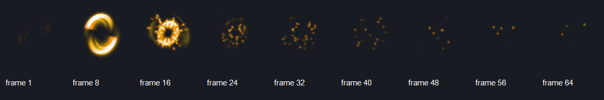

# 2D 序列帧动画 API 评估（素材 19）

评估日期：2026-08-24  
评估视角：使用 Squirrel 编写横版技能特效的普通游戏开发者  
测试素材：`.../01- 376套/19`（64 张 PNG）

## 实施后结论

本轮已经把原先断开的帧时间、独立 PNG 导入、Quad UV、精灵变换和渲染提交串成脚本可用的端到端路径。64 张 PNG 无需预处理即可在运行时合成一个共享图集，并可用同一 Clip 创建不同速度和方向的实例。

- 播放、暂停、恢复、循环、跳转、逐帧时长和全局速度倍率已经具备。
- Tween 足以计算平移、缩放和旋转角度，但只输出数值，调用者必须每帧手动写回目标。
- C++ 的 `Renderable2D` 渲染路径支持位置、缩放、中心旋转和 Quad UV。
- Squirrel 公开接口没有把上述三部分连接起来：脚本不能创建/配置 `Renderable2D`，公开的 `drawTexturedRect` 又不接受 Quad/UV 或旋转。
- `SpriteSheet` 只支持单纹理图集矩形；本次常见素材格式是 64 个独立纹理，没有目录/文件序列加载器，也没有运行时多纹理帧 Clip。

实施后综合评分：**8/10（底层实现 8.5/10，脚本开发体验 8/10）**。尚未覆盖的生产能力主要是 pivot/anchor、TexturePacker/Aseprite 元数据、图集裁边与批处理统计。

## 本轮已补齐

- `anim.newSpriteSheetFromSequence(gfx, pattern, first, last, columns)`：按显式数字范围载入并在运行时生成共享图集。
- `SpriteClip.addRange`、`setFPS/getFPS`：等帧率序列不再需要逐帧添加。
- `SpriteAnim.playReverse`、负速度、循环/完成事件消费。
- `gfx.newSprite2D()`：完整暴露位置、旋转、缩放、尺寸、Quad、纹理、颜色、层级、可见性和混合模式。
- `gfx.renderSprites()`：把所有存活的脚本精灵统一提交到 2D 渲染队列。
- 修复 `Renderable2D` 旋转没有传入 `DrawItem2D` 的已有缺陷。
- 新增 `examples/sprite-animation-vfx`，实测 0.5×、1×、2×、倒放以及平移、旋转、缩放叠加。
- `SpriteAnim` 支持独立时间轴的分段线性速度曲线，可循环/重置并与正负基础速度相乘。
- `Sprite2D` 支持归一化旋转 pivot/anchor 和独立 UV 水平/垂直翻转。
- 运行时图集为每帧生成 1 像素边缘扩展，避免线性采样时出现跨帧串色。

## 素材检查



- 文件数：64。
- 总大小：241,999 bytes。
- 每帧尺寸：全部为 128×128。
- 像素格式：全部为 32-bit ARGB，适合透明技能特效。
- 命名：`懒人素材 (1).png` 到 `懒人素材 (64).png`；必须按括号中的数字自然排序，普通字典序会把 10 排在 2 前面。
- 适配判断：尺寸和通道高度规整，但**不是 SpriteSheet**。在现有 API 下必须先用外部工具打成 8×8、1024×1024 图集，或绕过 `SpriteAnim` 自己加载 64 张纹理并手写计时/切换。

## 实施前基线与缺口

以下逐项分析记录了修改前的 API 状态，用于说明本轮实现针对的具体问题；不代表当前工作树的最终能力。

### 能否方便编写和使用？

目前不能。理想脚本应当是“加载目录 → 设 FPS → 播放 → 绘制/挂到节点”，当前则需要：外部合图、手建 Sheet、手建 64 个 Clip 条目、创建 Quad、创建 Player、显式 `anim.update(dt)`，最后仍缺少脚本侧把 Quad 送入 2D 渲染队列的公开路径。

文档中的“把 quad 挂到 `Renderable2D.sprite.quad`”在当前 Squirrel API 中不可执行：`Renderable2D` 没有脚本类绑定，组件字段也没有 setter。`gfx.drawTexturedRect` 仅绘制整张纹理，无法消费 Player 更新过的 Quad。

### 能否自由调整速度？

时间内核可以，而且设计合理：

- `SpriteClip.addFrame(frame, duration)` 支持每帧不同时长。
- `SpriteAnim.setSpeed(multiplier)` 支持播放倍率，`0` 可实现时间冻结。
- `setTime` 支持定位，`setLoop` 可覆盖 Clip 循环设置。
- `pause/resume/stop` 和非循环完成状态齐全。

限制：速度不允许负值，所以不支持反向播放；没有 `setFPS` / `setFrameDurationAll` 便利方法，也没有运行时统一改 Clip 全部帧时长的 API。对本素材设置 12/24/30 FPS，需要循环 64 次传入 `1.0/fps`，或用 Player speed 间接缩放预先写死的时长。

### 能否方便做平移、旋转等程序化动作？

底层能做，脚本体验不方便。

- Tween 支持多命名标量、缓动、delay、repeat、yoyo；角度有最短路径专用接口。
- Scene 节点支持 position / rotation / scale 和父子变换传播。
- C++ `Renderable2D::Transform2D` 支持 x/y、rot、sx/sy，渲染时围绕矩形中心旋转。

但 Tween 不绑定对象属性，需要 `tween.get("x")` 后手动调用 setter；脚本侧又缺少 Renderable2D setter。可以通过 Scene 节点间接做程序化变换，但创建一个可链接的 2D 精灵仍缺公开入口。直接绘制 API 也没有旋转或 UV 版本。因此“能力存在”不等于“游戏脚本可方便组合”。

## 实施前 API 完整性矩阵

| 能力 | C++ 内核 | Squirrel 可调用 | 本素材端到端 | 评价 |
|---|---:|---:|---:|---|
| 等时/变时长帧序列 | 是 | 是 | 需外部合图 | 基础完整 |
| 播放/暂停/循环/跳转 | 是 | 是 | 需外部合图 | 完整 |
| 播放速度倍率 | 是 | 是 | 需外部合图 | 完整但无倒放 |
| 独立 PNG 序列导入 | 否 | 否 | 否 | 关键缺口 |
| 自然数字排序 | 否 | 否 | 否 | 关键缺口 |
| 图集自动生成/元数据导入 | 否 | 否 | 否 | 关键缺口 |
| Quad/UV 动画绘制 | 是 | 否 | 否 | 阻断性缺口 |
| 位置/缩放/中心旋转 | 是 | 部分（Scene） | 否 | 组合链断裂 |
| Tween 程序动作 | 是 | 是 | 手动写回 | 可用但样板多 |
| 完成/循环事件回调 | 状态轮询 | 状态轮询 | 可轮询 | 不够易用 |
| 批量实例与资源复用 | 可实现 | 无高层 API | 困难 | 待补齐 |

## 源码与测试证据

- `SpriteSheet`：`src/modules/animation/SpriteSheet.{h,cpp}`，只保存图集像素矩形，不拥有 Texture。
- `SpriteClip`：`src/modules/animation/SpriteClip.{h,cpp}`，逐帧 duration、loop、time-to-frame 映射完整。
- `SpriteAnim`：`src/modules/animation/SpriteAnim.{h,cpp}`，`time += dt * speed`，能绑定 Quad。
- Squirrel 绑定：`src/modules/animation/Animation.cpp:687-744`。
- 2D 变换与旋转渲染：`src/modules/graphics/RenderSystem.h:65-100`、`RenderSystem.cpp:343-364`。
- 公开 Graphics 脚本 API：`src/modules/graphics/Graphics.cpp:718-727`，只公开整纹理矩形绘制。
- 逻辑单测：`test/animation_sprite_spine.cpp:52-119` 覆盖网格、命名帧、逐帧时长、倍率、暂停、循环与 Quad 同步。

实施后已完成 Windows Vulkan 实机窗口验证并生成测试游戏截图；新增的四个精确回归测试全部通过。素材抽帧图用于验证透明帧序列与自然顺序。

## 推荐的 API 收敛方案

### P0：打通可绘制的脚本路径

提供一个脚本可构造的 `Sprite2D`（推荐）或完整暴露 `Renderable2D`：

```squirrel
local sprite = gfx.newSprite2D();
sprite.setTexture(atlas);
sprite.setQuad(player.getQuad());
sprite.setPosition(400, 270);
sprite.setScale(2, 2);
sprite.setRotation(30); // degrees, center pivot by default
```

同时提供直接绘制逃生口：`drawTexturedRectUV`、`drawTexturedRectRotated` 和 `drawQuad(texture, quad, transform, tint)`。动画对象最好直接拥有/返回当前 Quad，而不是要求用户理解 ECS 组件内存布局。

### P0：支持常见独立 PNG 序列

建议增加资源层工厂：

```squirrel
local clip = animation.loadSpriteSequence({
    pattern = "fx/19/懒人素材 ({n}).png",
    first = 1,
    last = 64,
    fps = 24,
    loop = false,
    trim = false
});
```

实现可以选择纹理数组、多纹理帧，或在加载时自动打图集；用户不应被迫先使用外部工具。目录加载必须明确自然排序规则。

### P1：提供开发者友好的播放控制

- `clip.addRange(first, last, fps)`、`clip.setFPS(fps)`。
- `player.play(clip, {speed=1, loop=false, startFrame=0})`。
- `player.setFrame(index)`、`step(frames)`、`setDirection(1|-1)`。
- `onLoop`、`onComplete` 或可靠的事件队列，减少每帧轮询。
- 明确 `speed=0`、负速度、极大 dt 和零时长帧的语义。

### P1：把程序动作和精灵对象组合起来

提供目标绑定或高层序列：

```squirrel
animation.tween(sprite, 0.6)
    .to({x=620, rotation=180, scaleX=1.4, scaleY=1.4})
    .ease("outQuad")
    .play();
```

如果继续保持“Tween 只算值”的哲学，至少提供官方 `applyToSprite` / `applyToNode` 适配器和完整示例，避免每帧重复样板代码。

### P2：面向特效素材的生产能力

- pivot / anchor、翻转、裁剪空白、原始帧偏移。
- additive / screen 等混合模式的精灵级 API。
- 预加载、引用计数、纹理预算与批处理统计。
- JSON/TexturePacker/Aseprite 导入。
- 一个使用独立 PNG 和一个使用图集的 SDK 示例，并在脚本集成测试中截帧比较。

## 建议验收标准

1. 不预处理本素材，10 行左右脚本可按自然顺序加载 64 帧并播放。
2. 运行中可切换 0.5×、1×、2×、倒放，并保持帧定位正确。
3. 同一对象同时执行播放、平移、缩放、绕可配置 pivot 旋转。
4. 非循环播放只触发一次完成事件；循环播放准确触发 loop 事件。
5. 100 个实例共享帧资源，不重复上传 64 套纹理，并能查看 draw call/显存指标。
6. Windows Vulkan 与 WebGPU 后端均有相同脚本行为和截图回归测试。
