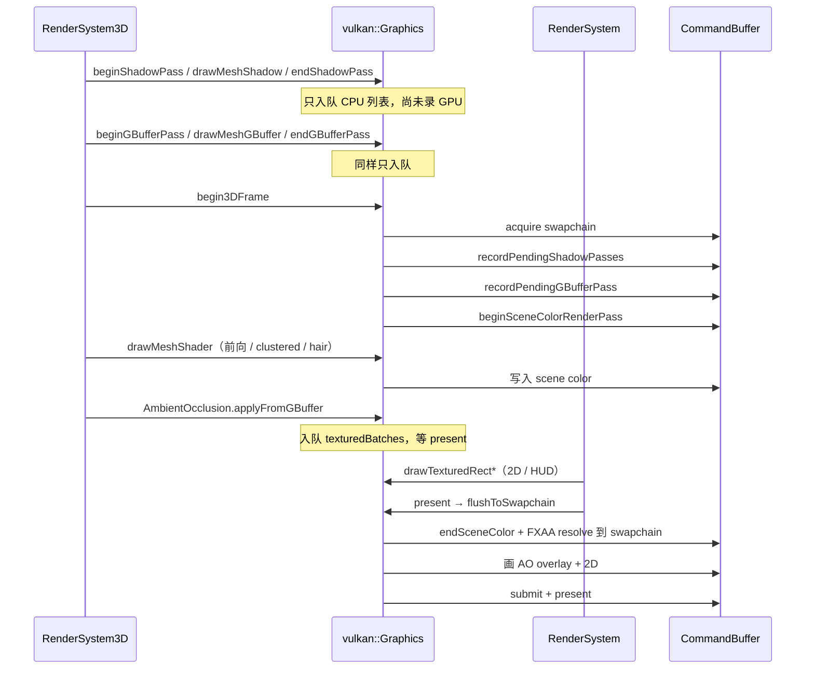
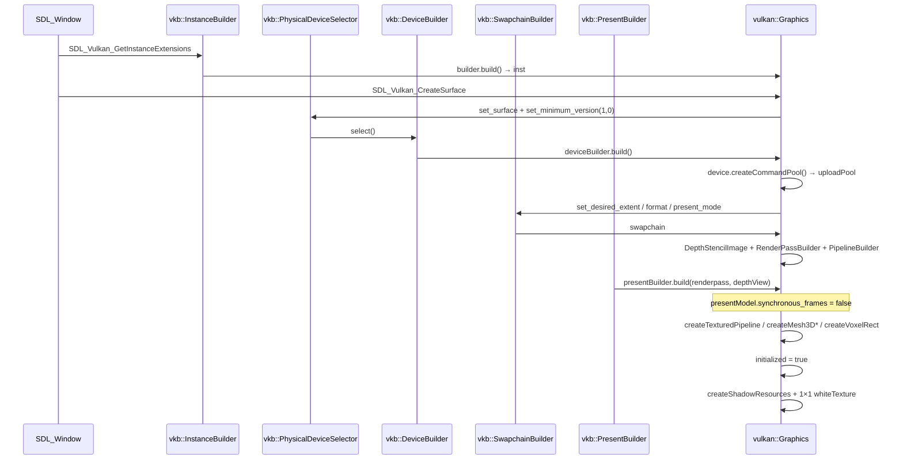
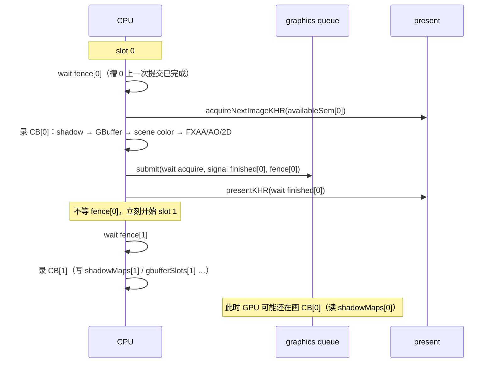

# 3D 渲染管线（buffers / 数据流 / 函数 / shader）

> 面向调试：启动时怎么建 Vulkan 对象、一帧里 GPU 上有哪些图、谁写入、谁采样、CPU 调用顺序、以及帧间异步怎么提交。  
> 后端：`src/modules/graphics/vulkan/Graphics.cpp`。底层构造器：`third-party/VKBuilder/include/vkbuilder.hpp`（`vkb::`）。投影：`perspectiveVulkanRH_ZO`（RH、ZO、Vulkan Y 向下，见 `ClipSpace.h`）。

关联：[`环境光遮蔽模块设计.md`](./环境光遮蔽模块设计.md)、[`全局光照模块设计.md`](./全局光照模块设计.md)、[`抗锯齿模块设计.md`](./抗锯齿模块设计.md)、[`模块设计.md`](./模块设计.md) §4、[`2D渲染API设计.md`](./2D渲染API设计.md) §4。

---

## 1. 一帧谁调用谁

典型游戏 / ClassicScenes：

```
RenderSystem3D::render(gfx)     // 3D：shadow → gbuffer → scene color → 排队 AO
RenderSystem::render(gfx)       // 2D sprite + gfx.present()
```

脚本侧 `gfx.render3D()` 只包一层 `RenderSystem3D::render`，**不会 present**。真正提交 swapchain 的是 `RenderSystem::render` 末尾的 `Graphics::present()` → `flushToSwapchain()`。



**CPU 入队 vs GPU 录制**：shadow / GBuffer 的 `begin*Pass` 不立刻 `vkCmdBeginRenderPass`。真正录进当前帧 command buffer 的时机是 `begin3DFrame()` 里的 `recordPendingShadowPasses()` / `recordPendingGBufferPass()`，保证和 scene color 同一份 submit，shadow map / GBuffer 在前向采样前已经写完。

---

## 2. GPU 图（当前默认 3D）

资源按帧槽双缓冲：`kAsyncResourceCopies = 2`（`vulkan/Graphics.h`）。索引随 swapchain `current_frame`。

| 名称 | 格式 / 尺寸 | 写入 | 采样 | 查询 API |
|------|-------------|------|------|----------|
| **CSM shadow** | `D32Sfloat` 2D array，3 cascade × 1024² | Shadow pass | mesh3d `shadowMap` (binding 5) | `RenderControl.hasPass("shadow")`（不是 GBuffer Texture） |
| **GBuffer normal** | RGBA8，swapchain 像素尺寸 | GBuffer MRT0 | 3D AO `NormalTex` | `GBuffer.getNormalTexture()` |
| **GBuffer depthColor** | RGBA8，R=线性 0..1 | GBuffer MRT1 | Canvas / volumetric / 图像审计 | `GBuffer.getDepthTexture()` |
| **GBuffer albedo** | RGBA8，RGB=albedo，A=线性深度 | GBuffer MRT2 | 可选（SSGI 回退） | `GBuffer.getAlbedoTexture()` |
| **GBuffer hwDepth** | `D32Sfloat`，`Sampled`，`.r`=Vulkan NDC z（0 近 1 远） | GBuffer depth attachment，`storeOp=Store`，final `ShaderReadOnlyOptimal` | 3D AO（及手动 SSGI） | `GBuffer.getHwDepthTexture()` |
| **scene color** | swapchain 同格式 RGBA，A=1 清屏（天空），mesh 写 A=线性深度；`"msaa"` 开时为 MSAA color（Nx）+ subpass resolve 到 1x | 前向 mesh | FXAA `MainTex`；手动 `getSceneColorTexture()` | `Graphics.getSceneColorTexture()` |
| **scene color depth** | 与 swapchain 相同的 HW depth；MSAA 开时为 Nx depth | 前向 z-test | **不采样**（`storeOp=DontCare`） | — |
| **swapchain** | WSI 图像 | FXAA resolve + AO overlay + 2D | present / 可选 CPU readback | `newImageData` / `getPixel`（需 `setScreenReadbackEnabled(true)`） |

深度约定（调试时最容易混）：

| 用途 | 通道 | 含义 |
|------|------|------|
| HW D32 / `getHwDepthTexture().r` | NDC z | `ndcToViewZ`：`viewZ = near*far / (far - ndc*(far-near))` |
| `getDepthTexture().r`、scene color A、albedo A | 线性 0..1 | `(viewZ-near)/(far-near)`，**不能**当 clip.z 重建世界坐标 |

---

## 3. Pass 顺序与代码入口

`RenderControl::compile()` 产出有序 pass 名：`shadow` → `gbuffer` → `forward` → `hair`。`aa` / `ao` / `gi` 不是独立 pass 名，而是在 forward 之后由 Graphics / RenderSystem3D 插入。

| 顺序 | 开关 | CPU 入口 | GPU 录制 | Shader |
|------|------|----------|----------|--------|
| 1 Shadow | `"shadow"` | `RenderSystem3D::render` → `beginShadowPass(c)` / `drawMeshShadow` / `endShadowPass` | `recordPendingShadowPasses` | `mesh3d_shadow.vert` + `.frag` |
| 2 GBuffer | `"gbuffer"`（`ao`/`gi` 会强制打开） | `beginGBufferPass` / `drawMeshGBuffer` / `endGBufferPass` | `recordPendingGBufferPass` | `mesh3d_gbuffer.vert` + `.frag` |
| 3 Scene color | `"forward"` / `"hair"`（MSAA 由 `"msaa"` + `gfx.setMsaaSamples` 控制） | `begin3DFrame` → `drawMeshShader` | `beginSceneColorRenderPass` 内直接 draw（MSAA 时 subpass resolve 到 1x） | 见下表 mesh |
| 4 FXAA resolve | `"aa"`（关则阈值拉满≈拷贝） | `flushToSwapchain` → `queueSceneColorResolve` | swapchain pass 第一张全屏四边形（采样已 resolve 的 1x scene color） | `aa_fxaa.frag`（`textured.vert`） |
| 5 AO overlay | `"ao"` | `AmbientOcclusion::applyFromGBuffer`（仍在 scene color 打开时**入队**） | swapchain pass，FXAA 之后 | `ao_from_depth.frag` |
| 6 2D / HUD | — | `RenderSystem::render` | 同 swapchain pass | `textured.*` / `lit2d.*` / `color.*` |
| 7 Present | — | `Graphics::present` | `presentModel.end` + `drawFrame` | — |

**当前 3D 默认不叠 fullscreen SSGI。** `"gi"` 仍默认开（隐含 `gbuffer`+`gbufferAlbedo`），间接光走 mesh 半球天空/地面 + wrap（`mesh3d.frag`）。`GlobalIllumination::applyFromScene` 仅手动/测试调用；直接采样 lit scene color 会把邻物印到地面上。

---

## 4. Mesh 前向：函数与 shader

选择逻辑在 `RenderSystem3D::drawMeshWithMaterial` / `applyLighting`：

| 条件 | Pipeline | Vert | Frag |
|------|----------|------|------|
| 默认 PBR，灯数 ≤ 8 | `mesh3dPipeline` | `mesh3d.vert` | `mesh3d.frag` |
| 默认 PBR，灯数 > 8 且 `"clustered"` | `mesh3dClusteredPipeline` | `mesh3d_clustered.vert` | `mesh3d_clustered.frag` |
| `Material` 自定义 / toon / hair | `Shader::mesh3dPipeline` | `mesh3d_toon.vert` / `mesh3d_hair.vert` 等 | 对应 frag |
| 阴影 caster | `shadowPipeline` | `mesh3d_shadow.vert` | `mesh3d_shadow.frag` |
| GBuffer | `gbufferPipeline` | `mesh3d_gbuffer.vert` | `mesh3d_gbuffer.frag` |
| 体素实例 | `voxelRectPipeline` | `voxel_rect.vert` | `voxel_rect.frag` |

`mesh3d.frag` 额外做：Cook-Torrance、CSM 采样、半球 GI、wrap fill、可选 IBL cubemap、`tonemapPeak`。输出 `outColor.a = linear01`（给旧 SSGI 打包路径，3D AO 不读它）。

---

## 5. 数据怎么传到 GPU

### 5.1 后处理全屏四边形（`texSetLayout`）

2D textured / FXAA / AO / 手动 GI 共用 **2 个 combined-image sampler**：

| Binding | 典型 | AO 3D | 手动 SSGI |
|---------|------|-------|-----------|
| 0 | 颜色 `MainTex` | HW D32 | scene color |
| 1 | 第二张（无则绑自身占位） | GBuffer world normal | HW D32 |

调用：`drawTexturedRectShader` / `drawTexturedRectShaderDepth`。参数走 **push constants**（`Shader::kPushConstantBytes`，最多 32 个 float）。AO `ao_from_depth`：`invViewProj` + near/far/radius/bias/intensity/power/sampleCount/texel/hasNormal。

入队对象：`texturedBatches`。`queueSceneColorResolve` 把 FXAA **插到队列头**，保证先 resolve 再叠 AO/2D。

### 5.2 Mesh3D descriptor（`mesh3dSetLayout`）

| Set0 binding | 类型 | 内容 |
|--------------|------|------|
| 0 | UBO std140 `Frame` | mvp/model/view、主光、最多 8 盏 `Light3D`、ambient、texBomb、parallax、clip |
| 1 | sampler2D | albedo |
| 2 | sampler2D | normal（无则 1×1 flat） |
| 3 | samplerCube | env（无则黑 cubemap） |
| 4 | UBO std140 `ShadowFrame` | 3× `lightVP`、splits、bias |
| 5 | sampler2DArray | CSM |
| 6 | sampler2D | height / POM（无则 flat） |

Clustered 变体：binding 4/5 为 light SSBO + cluster 表，shadow 后移；见 `mesh3d_clustered.frag`。CPU 建簇：`buildClusteredLighting`（`ClusteredLight.cpp`），网格 16×9×24，最多 256 灯、每簇 32。

每 draw 一份 host-visible UBO（`mesh3dSetFor`），`updateLocal` 后 bind。Shadow UBO 来自 `setMesh3DShadows(buildDirectionalCSM(...))`。

### 5.3 Shadow / GBuffer push

- Shadow：`pushConstants` 一个 `mat4` = `lightVP[cascade] * model`
- GBuffer：push `mvp` + model 三行 + `clip(near, far, packedTint)`

### 5.4 相机 / 投影

`RenderSystem3D` 每 mesh：

```
view = lookAtRH(eye, target, up)
proj = perspectiveVulkanRH_ZO(fov, aspect, near, far)
setMesh3DViewProj(proj * view)
```

AO：`AmbientOcclusion::setCamera` 算同一套 `inv(proj*view)` 送进 shader。重建世界坐标必须用 **NDC z（D32）**，不要用 8-bit 线性深度当 clip.z。

CSM：`buildDirectionalCSM`，级联按 **view-space +Z**（`max(-viewPos.z,0)`）选，最远 `ShadowConfig::kMaxDistance`（64m）。

---

## 6. 关键文件索引

| 主题 | 文件 |
|------|------|
| 帧编排 | `src/modules/graphics/RenderSystem3D.cpp` `render()` |
| 2D + present | `src/modules/graphics/RenderSystem.cpp` `drawItems(..., present=true)` |
| 特性 / pass 列表 | `src/modules/graphics/RenderControl.cpp` |
| GBuffer 包装 | `src/modules/graphics/GBuffer.h` |
| Vulkan 录制 / 资源 | `src/modules/graphics/vulkan/Graphics.cpp`：`initWithWindow`、`createSwapchainAndPipeline`、`begin3DFrame`、`createGBufferResources`、`createSceneColorResources`、`flushToSwapchain` |
| VKBuilder | `third-party/VKBuilder/include/vkbuilder.hpp`：`Present` / `PresentBuilder` / `PipelineBuilder` / `executeImmediately` |
| 投影 | `src/modules/graphics/ClipSpace.h` |
| CSM CPU | `src/modules/graphics/Shadow.cpp` |
| Clustered CPU | `src/modules/graphics/ClusteredLight.cpp` |
| AO | `AmbientOcclusion.cpp` + `shaders/ao_from_depth.frag` |
| FXAA | `AntiAliasing.cpp` + `shaders/aa_fxaa.frag` |
| SSGI（手动） | `GlobalIllumination.cpp` + `shaders/gi_ssgi.frag` |
| 前向 PBR | `shaders/mesh3d.vert` / `mesh3d.frag` |
| GBuffer MRT | `shaders/mesh3d_gbuffer.vert` / `.frag` |
| SPIR-V 生成 | `scripts/compile_graphics_*_shaders.py` → `shaders/*_spv.inc` |

---

## 7. 调试检查清单

1. **3D 没画上**：`begin3DFrame` 在 surface 未就绪时 soft-fail。查 `had3DThisFrame()`，不要只看 CTest 通过。
2. **AO 条纹 / 错深度**：3D 必须采 `getHwDepthTexture()`（D32）。`getDepthTexture()` 是 8-bit 线性，当 clip.z 会花屏。
3. **地面邻物鬼影**：fullscreen SSGI 不要自动叠。若手动 `applyFromScene`，会从 scene color 把帘子/柱子印到地上。
4. **AO 画在锯齿上**：AO 在 FXAA resolve **之后**叠到 swapchain，这是故意的。
5. **阴影大块错**：CSM 是 nearest 采样 + shader 里比较，不是 HW PCF。级联距离用 view +Z，不要用欧氏距离。
6. **改 shader 不生效**：改 `.frag` 后跑对应 `scripts/compile_graphics_*_shaders.py`（需 `glslc`），再编 `EVGraphics`。
7. **读像素是旧帧**：`setScreenReadbackEnabled(true)` 且在 `present` 之后；MAILBOX present **不会**卡住 CPU 循环。打开 readback 会装 `after_render_before_present`，**强制** `drawFrame` 等本帧 fence，异步重叠消失。
8. **多测连续开窗失败**：`vk::PhysicalDevice::getSurfaceCapabilitiesKHR: ErrorUnknown` 多半是 GPU/surface 耗尽，不是逻辑断言。
9. **改 sampler / 换贴图像素 / morph 网格后 TDR**：这些路径会 `waitForAllFrames()` 再改共享资源。若跳过等待，in-flight 帧仍在读旧 image / VBO。
10. **Canvas 离屏卡顿**：`flushToOffscreen` 先 `waitForAllFrames` 再 `executeImmediately`（单图，不能 ping-pong），会把 CPU 和 GPU 串起来。

ClassicScenes 飞掠 PNG：`build/win32-debug/test/out/classic_scenes/`。观感节奏：`EVENGINE_VIEW_SECONDS` / `EVENGINE_VIEW_HZ`。

---

## 8. 管线初始化

入口：`Graphics::initWithWindow(SDL_Window*)`。只跑一次；resize / 后台恢复走 `createSwapchainAndPipeline` / `recreateSurfaceForResume`，**不会**重建 mesh3d / textured 管线。



### 8.1 启动时立刻创建

| 步骤 | 函数 | VKBuilder | 产物 |
|------|------|-----------|------|
| Instance | `initWithWindow` | `InstanceBuilder.require_api_version(1,0)` + SDL 扩展；可选 `request_validation_layers` / `use_default_debug_messenger`（`EVENGINE_VULKAN_VALIDATION`） | `vkb::Instance` |
| 设备 | 同上 | `PhysicalDeviceSelector.set_surface` → `DeviceBuilder.build`；各向异性 feature 按物理设备打开 | `vkb::Device`、`uploadPool` |
| Swapchain | `createSwapchainAndPipeline` | `SwapchainBuilder.set_desired_extent` / `set_desired_format(B8G8R8A8Unorm)` / `set_desired_present_mode` / `add_image_usage_flags(TransferSrc)` / `set_old_swapchain` / `build` | `vkb::Swapchain` |
| Swapchain depth | 同上 | `DepthStencilImage{device, w, h, D32}` | 给 Present framebuffer 的 depth view |
| Swapchain pass | 同上（只建一次） | `RenderPassBuilder.addPresentAttachment` + `addDepthAttachment` + `SubpassBuilder` + `addDependency` | `renderpass` |
| 2D 顶点色管线 | 同上（只建一次） | `PipelineBuilder.useClassicPipeline` + `VertexInputStateBuilder.addInputBinding<ColorVertex>` + `setDynamicStatesViewportScissor` + `setRasterizer(..., CullMode::eNone)` + `build(renderpass)` | `pipeline` |
| Present | 同上（每次重建 swapchain） | `PresentBuilder.build(renderpass, depthView)` | `presentModel`：2 个 CB / fence / acquire+present semaphore、swapchain framebuffer |
| 2D textured | `createTexturedPipeline` | `DescriptorSetLayoutBuilder.image(0).image(1).createUnique`；shader 模块 `PipelineBuilder::createShaderModule`；自己填 `vk::GraphicsPipelineCreateInfo` | `texSetLayout`、`descriptorPool`、`texPipeline`、`shaderPipelineLayout`（push constants） |
| Lit 2D | `createLit2DPipeline` | 同上 layout builder（再加 UBO binding 2） | `lit2dPipeline` |
| Mesh3D | `createMesh3DPipeline` | layout builder：UBO+4 张图+shadow UBO+CSM；`createShaderModule` + 手写 PSO | `mesh3dPipeline` |
| Clustered | `createMesh3DClusteredPipeline` | layout 含 SSBO | `mesh3dClusteredPipeline` |
| Voxel | `createVoxelRectPipeline` | layout + `createShaderModule` | `voxelRectPipeline` |
| Shadow | `createShadowResources` | 手写 2D array image / RP / PSO；`SamplerBuilder`（shadow compare）；`executeImmediately` 清每一层 | `shadowMaps[2]` |
| 白贴图 | `newTexture(1,1,…)` | `TextureImage2D` + `upload` + `SamplerBuilder` + `DescriptorSetBuilder` | 缺 albedo 时的占位 |

Present 模式：vsync 开 → 优先 `MAILBOX`，回退 `FIFO`；关 vsync → `IMMEDIATE`，再 `MAILBOX` / `FIFO`。MAILBOX 不阻塞 CPU 循环，所以必须双缓冲可变 GPU 资源（见 §10）。

### 8.2 懒创建（第一次用到才建）

| 资源 | 触发 | 说明 |
|------|------|------|
| GBuffer MRT + hwDepth | `beginGBufferPass` → `createGBufferResources` | `kAsyncResourceCopies` 套；手写 image / RP / PSO，**不用** `ColorAttachmentImage` |
| Scene color | `begin3DFrame` → `createSceneColorResources` | 同上，格式跟 swapchain |
| Offscreen 2D | 第一次 `Canvas` flush → `ensureOffscreenPipelines` | `RenderPassBuilder.addColorAttachment` + `PipelineBuilder` 顶点色管线 |
| 自定义 Shader PSO | `newShader` / `ensureShaderOffscreenPipeline` | `createTexturedStylePipeline` 或 mesh3d 变体 |
| 每 draw UBO / descriptor | `mesh3dSetFor` / `currentLighting2dUbo` | `GenericBuffer.allocate`（够大就复用 handle）+ `DescriptorSetBuilder` + `DescriptorSetUpdater` |
| 2D 批顶点缓冲 | `flushToSwapchain` | 每帧槽一份 `HostVertexBuffer`，`allocate` 后 `updateLocal` |

GBuffer / scene color / shadow 的 **image 本身**走 `device->createImage`（需要 Sampled+Attachment、MRT、2D array）。VKBuilder 的 `ColorAttachmentImage` 只给 Canvas 离屏用。

Swapchain 重建（`swapchainDirty` / `needs_recreate` / 后台恢复）：`device->waitIdle` → 拆 Present / depth / 2D 帧缓冲 → 新建 swapchain + Present。mesh3d / textured PSO **保留**。GBuffer / scene color 若分辨率变了，下一帧 `create*` 会 `destroy` 再分配。

---

## 9. VKBuilder 调用表

头文件：`vkbuilder.hpp`。Graphics 里 `#include "vkbuilder.hpp"`，实现文件定义 `VKB_IMPL` 一次。

### 9.1 启动 / 呈现

| `vkb::` | 引擎调用 | 作用 |
|---------|----------|------|
| `SystemInfo::query().is_extension_available` | macOS/iOS 检测 portability | 决定是否 `enable_extension(PORTABILITY_ENUMERATION)` |
| `InstanceBuilder` | `require_api_version` / `enable_extension` / `set_headless` / `add_flags` / `build` | VkInstance |
| `PhysicalDeviceSelector` | `set_surface` / `set_minimum_version` / `add_required_extension` / `select` | 选 GPU |
| `DeviceBuilder` | `build` | 逻辑设备 + 队列 |
| `Device::createCommandPool` | `uploadPool`、Present 内部 | 上传用 vs 每帧录制用，**两套 pool** |
| `Device::getQueue(QueueType::graphics)` | 纹理 upload、`executeImmediately` | graphics 队列 |
| `SwapchainBuilder` | 见 §8.1 | WSI 图像 |
| `DepthStencilImage` | swapchain depth | Present framebuffer 附件 |
| `RenderPassBuilder` / `SubpassBuilder` | swapchain pass、offscreen Canvas | 2D present / 离屏色附件 |
| `PipelineBuilder` | **仅** 2D `color` 管线 + offscreen solid | `useClassicPipeline` 会自己建一个**空 layout** 的 PSO |
| `PipelineBuilder::createShaderModule` | textured / mesh3d / gbuffer / shadow / voxel / hair | 只编 SPIR-V；PSO 手写（需要自定义 layout、MRT、无 color） |
| `VertexInputStateBuilder` | `addInputBinding<T>` / `addAttributeDescription<T>` | `T::getBindingDescription` |
| `PresentBuilder::build` | 每次新建 swapchain | CB×FIF、fence×FIF、semaphore×FIF、framebuffer×image_count |
| `Present` | 见 §10 | acquire / record / submit / present |

`PipelineBuilder.build()` 内部 `createPipelineLayout` 不带 descriptor set。3D / textured 必须自己 `device->createPipelineLayout` + `createGraphicsPipeline`。

### 9.2 描述符 / 采样 / 缓冲 / 图

| `vkb::` | 方法 | 引擎用法 |
|---------|------|----------|
| `DescriptorSetLayoutBuilder` | `.buffer(binding, type, stages, count)` / `.image(...)` / `.createUnique(device)` | `texSetLayout`（2 sampler）、`mesh3dSetLayout`、clustered、lit2d、voxel |
| `DescriptorSetBuilder` | `.layout(layout).build(device, pool)` | 每张 Texture、每组 mesh3d (albedo,normal,env,height)、post2 组合 |
| `DescriptorSetUpdater` | `.beginDescriptorSet` / `.beginImages` / `.image(sampler, view, layout)` / `.beginBuffers` / `.buffer` / `.update` | `writeCombinedImageDescriptor`、`mesh3dSetFor`、GBuffer 采样包装 |
| `SamplerBuilder` | `.magFilter` / `.minFilter` / `.addressModeU/V` / `.anisotropyEnable` / `.build` | `createVkSampler`；GBuffer/scene color 包装用 nearest+clamp |
| `TextureImage2D` | 构造 `(device, w, h, mips)` → `.upload(pool, queue, bytes)` | `newTexture`；upload 内部 `executeImmediately` |
| `TextureImageCube` | 构造 + `.upload` | `newCubemap` |
| `ColorAttachmentImage` | Canvas | 离屏 2D；`setLayout` 在 `executeImmediately` 里切 attachment ↔ sampled |
| `GenericBuffer` | `.allocate(device, usage, size, HostVisible\|HostCoherent)` / `.updateLocal` / `.release` | mesh UBO、shadow UBO、clustered SSBO、2D lighting UBO。**无析构**，swapchain 拆时必须 `release()` |
| `HostVertexBuffer` | `.allocate<T>(device, verts)` | 2D 批、mesh VBO；host-visible，直接 map 写 |
| `executeImmediately` | `(device, pool, queue, lambda)` | **同步**：单独 CB + fence，等完才返回。纹理上传、shadow 首次 clear、Canvas 离屏、swapchain readback |

### 9.3 每帧 Present API（热路径）

`flushToSwapchain` / `begin3DFrame` 实际打到：

```
presentModel.begin()              // acquireForFrame + begin CB
  recordPendingShadowPasses()     // 同一份 CB，swapchain pass 之前
  recordPendingGBufferPass()
  beginSceneColorRenderPass()     // 手写 RP，不是 Present 的 beginRenderPass
  … drawMeshShader …
presentModel.beginRenderPass(...) // FXAA / AO / 2D 画到 swapchain
presentModel.endRenderPass()
presentModel.end()                // vkEndCommandBuffer
presentModel.drawFrame()          // submit + presentKHR；默认不等本帧 fence
```

`getCurrentCommandBuffer()` 按 `swapchain.current_frame`（0/1）取槽，**不是** WSI image index。

---

## 10. 异步：两帧重叠怎么完成

不是线程池，也不是 `vkQueueSubmit` 后立刻 `waitIdle`。模型是 **CPU 录 N+1，GPU 画 N**，同步点只有「这个帧槽上次提交的 fence」。

### 10.1 槽位

```
Present::frames_in_flight = min(2, image_count)   // PresentBuilder 写死上限 2
Graphics::kAsyncResourceCopies = 2                 // shadow / GBuffer / scene color
swapchain.current_frame ∈ {0, 1}                   // drawFrame 末尾 +1 % FIF
```

FIF 故意 **不等于** swapchain 图像数：present 用的 semaphore 若在 WSI 还握着时被下一帧复用，驱动容易 TDR。

可变 GPU 资源都按槽索引，避免写正在被上一帧采样的图：

| 资源 | 选槽 |
|------|------|
| Present CB / fence / semaphore | `swapchain.current_frame` |
| 2D `HostVertexBuffer`、lit2d UBO | `currentFrameSlot()` |
| mesh3d / clustered UBO 池 | 同上，每帧 `drawIndex = 0` 从头复用 |
| clustered SSBO、voxel instance | 同上 |
| shadow map / GBuffer / scene color | `currentFrameSlot() % kAsyncResourceCopies` |

`acquireForFrame` 已经 `waitForFences(in_flight_fences[slot])`，所以 **覆盖本槽** 的 UBO / 顶点缓冲是安全的。不能覆盖的是 **另一槽** 仍在飞的那份。

### 10.2 一帧时间线

`synchronous_frames = false`（`createSwapchainAndPipeline` 里设置）：



`drawFrame` 里 **会** 等的情况：

1. `synchronous_frames == true`（引擎已关掉）
2. `after_render_before_present` 非空 → `setScreenReadbackEnabled(true)` 装的 capture hook。hook 里再 `executeImmediately` 做 `copyImageToBuffer`

否则 CPU 在 present 返回后就可以改 **下一个槽** 的资源。

### 10.3 两种「立刻执行」

| 路径 | 同步 | 用途 |
|------|------|------|
| Present CB + `drawFrame` | 异步（只等本槽旧 fence） | 游戏帧：shadow / GBuffer / 前向 / FXAA / 2D |
| `vkb::executeImmediately` | 提交后 `waitForFences` 本 submission | 纹理 upload、shadow 初始化 clear、Canvas 离屏、读回 swapchain |
| `presentModel.waitForAllFrames()` | 等 **两个** in-flight fence | 改共享资源前：换 sampler、换贴图像素、morph VBO、Canvas 切回 attachment |

`executeImmediately` **不会** `device.waitIdle()`（那会排空另一帧）。它只等自己那次 submit。但 Canvas 离屏仍要先 `waitForAllFrames`：离屏色图只有一份，上一帧 swapchain 可能还在采样它。

Shadow / GBuffer 的 `begin*Pass` 只往 CPU 列表塞 draw。GPU 命令写进 **当前 Present CB**，和 scene color 一次 submit。这样前向采样时，同一 CB 里的 shadow/GBuffer 已经 `endRenderPass`，靠 render pass `finalLayout = ShaderReadOnlyOptimal` + subpass dependency，不需要额外 queue 同步。

### 10.4 和「看起来在异步」相关的坑

- **MAILBOX / IMMEDIATE**：CPU 可以远快于刷新率，必须 FIF=2 + 资源双缓冲。FIFO 会在 present 卡住，问题被掩盖。
- **Validation 层**：`EVENGINE_VULKAN_VALIDATION=1` 时每 draw 校验，CPU 侧会慢一个数量级，重叠仍在，只是更难测出 CPU-bound。
- **`GenericBuffer` / `Present` 无析构**：拆 swapchain 必须 `presentModel.destroy()`（内部 `waitIdle`，因为 presentKHR 的 semaphore 没有 fence 覆盖）和 `HostVertexBuffer.release()`。
- **descriptor 不能在飞的 CB 上 `vkUpdateDescriptorSets`**：所以 mesh3d 是「每 draw 新 UBO + 缓存的 set」，而不是改绑定中的那份。
