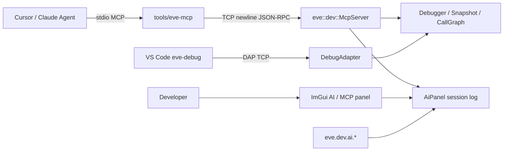
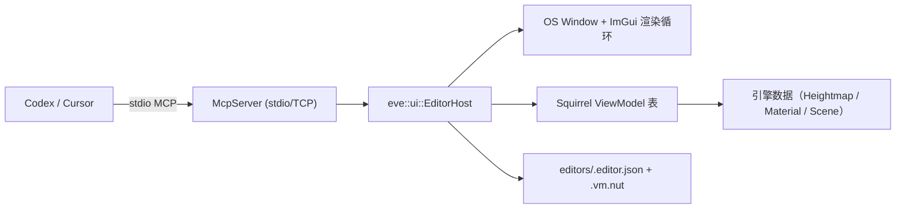

# AI 生成 / 辅助开发与 MCP 支持

> 状态：首版落地（嵌入式 MCP + DevTools AI 面板 + Cursor stdio 桥）。
> 代码：[`src/engine/devtools/McpServer.*`](../../src/engine/devtools/McpServer.hpp)、
> [`AiPanel.*`](../../src/engine/devtools/AiPanel.hpp)、[`DevTool.*`](../../src/engine/devtools/DevTool.hpp)；
> 桥接：[`tools/eve-mcp/`](../../tools/eve-mcp/)。

## 目标

让 EVEngine 对 **AI 生成游戏** 与 **AI 辅助开发** 提供底层可测接口：

1. 运行时嵌入 **MCP 服务器**（与 DAP 同级），供 Agent 驱动暂停 / 求值 / 快照 / 错误切片。
2. DevTools 增加 **AI / MCP** 面板与脚本 API，人类与 Agent 共享会话日志。
3. 通过 `tools/eve-mcp` 把引擎 TCP MCP 接到 Cursor / Claude Desktop 的 stdio MCP。

非目标（本版不做）：云端 LLM 推理、自动写关卡的生成管线、替换 VS Code DAP。

## 架构



| 组件 | 职责 |
|------|------|
| `McpServer` | JSON-RPC 2.0（MCP tools / resources / prompts），localhost TCP，换行分帧 |
| `AiPanel` | 工具调用 / 笔记日志；可选 ImGui 窗口；`eve.dev.ai` |
| `DevTool` | `startMcp` / `poll` 与 DAP 并列；`drawAiPanel` |
| `tools/eve-mcp` | stdio ↔ TCP 桥，给 IDE Agent 用 |

桌面 Debug 构建才链接 `EVDevTools`；Android / iOS 精简运行时不含 MCP。

## 启动

```bash
eve run --debug --mcp-port=7529 .
# 可与 DAP 同时开：
eve run --debug --dap-port=4711 --mcp-port=7529 .
```

`--mcp-port` 隐含 `--debug`。stderr 会打印：

```text
MCP listening on 127.0.0.1:7529 (newline JSON-RPC; use tools/eve-mcp for Cursor stdio)
```

游戏循环里已有的 `eve.dev.poll()`（`load.nut`）会同时泵 DAP 与 MCP。

## MCP 能力

### Tools（节选）

| 名称 | 用途 |
|------|------|
| `eve_status` | 附着 / 暂停 / 端口 / callgraph 摘要 |
| `eve_ui_tree` / `eve_ui_get` / `eve_ui_click` | 普通游戏 retained UI 的语义树查询、控件状态读取和按 ID 点击；与 `eve_host_*` 编辑器宿主互补 |
| `eve_eval` | 求值表达式 |
| `eve_pause` / `eve_continue` / `eve_step_*` | 运行控制 |
| `eve_stack` / `eve_locals` | 栈与局部变量 |
| `eve_set_breakpoint` / `eve_list_breakpoints` | 断点 |
| `eve_watch_*` | Watch |
| `eve_snapshot_*` | 脚本状态快照（AI 测试可复位） |
| `eve_error_slice` | 最近错误后向切片 |
| `eve_run_script` | 在活 VM 上跑短片段 |
| `eve_ai_note` / `eve_ai_log` | 写入 / 读取 DevTools AI 日志 |
| `eve_scene_status` / `eve_scene_nodes` / `eve_scene_node_get` / `eve_scene_node_set` | 运行时场景 / 实体查询与变换 |
| `eve_scene_director_install` / `eve_scene_director_status` / `eve_scene_reset` / `eve_scene_modify` / `eve_scene_info` / `eve_camera_generate` | AI 场景导演：搭台 kit 安装 / 状态 / 清场 / 摆物调光摄像机 / 场景真值 / 生成机位（见 [AI 场景导演](AI场景导演.md)） |
| `eve_procgen_recipes` / `eve_procgen_map` / `eve_procgen_mesh` | 程序化生成：算法/配方枚举、生成地图网格、构建网格 |
| `eve_physics_new_world` / `eve_physics_list_worlds` / `eve_physics_raycast` / `eve_physics_remove_world` | 2D 物理世界与射线检测 |
| `eve_render_status` / `eve_screenshot` | 渲染状态、当前帧截图（PNG）；相对路径按项目根解析并返回绝对路径与字节数 |
| `eve_screenshot_image` | 把当前帧作为 MCP image content 返回（客户端没有共享文件系统时也能看到画面） |
| `eve_console_read` / `eve_console_write` / `eve_console_clear` | 运行期控制台：按 `seq` 游标增量读取 Squirrel `print` / 脚本错误 / 引擎 stderr（level `engine`）/ `eve.dev.console.*` / Agent 标记行 |
| `eve_crash_report` | 崩溃取证：读取持久化 `eve.log`，给出会话/崩溃计数、最近崩溃时间、上一个会话是正常结束还是崩溃、以及有界 tail |
| `eve_render_describe` | 采集当前帧 + 渲染参数，交给配置的视觉模型，返回文字描述与「渲染参数↔画面效果」对应关系 |
| `eve_render_vision_config` | 设置 / 读取视觉模型配置（baseUrl/apiKey/model/path/timeoutMs，密钥掩码） |
| `eve_particles_status` / `eve_particles_emit` | 粒子系统状态与发射 |
| `eve_audio_status` / `eve_audio_set_volume` / `eve_audio_stop_all` | 音频主控 |
| `eve_editor_target_list` / `eve_editor_target_create` | 编辑器目标发现：列出当前工程可创建的目标类型（带 cap），并按类型创建；`provider` 为空时用该列表现查现建，避免 schema 与实现漂移 |
| `eve_decal_status` / `eve_decal_project` / `eve_decal_remove` / `eve_decal_clear` / `eve_decal_set_limit` | 贴花查询与投影（`IDecalQuery`）：当前贴花、把包围盒/射线投到网格、清理与上限 |
| `eve_physics_sphere_cast` | 3D 物理球体扫描（世界由脚本创建；返回命中点/法线/距离） |
| `eve_world_project_down` | 相机障碍投影（`ICameraObstructionQuery`）：从机位向下取可用落点，供无人值守取景 |
| `eve_profiler_frame` / `eve_profiler_report` | CPU profiler 采样：当前帧 zone 树与聚合报告（总时长/自耗时/热点） |
| `eve_sensing_last_query` | 感知模块最近一次查询结果（谁看见了什么，便于排查 AI/视线问题） |
| `eve_gameplay` | 共享玩法协议：`domains` / `instances` 发现 + `observe` / `actions` / `submit` / `advance` / `events` 驱动玩家的背包、经济账本、对话与手牌（见「玩法域」） |

### Resources

- `eve://status`
- `eve://error-report`
- `eve://ai-session`
- `eve://callgraph`
- `eve://crash-log`（`eve.log` 的尾部，按 64 KiB 截断；结构化版本用 `eve_crash_report`）

### 普通游戏 UI 自动化

`eve_ui_*` 面向游戏内通过 `UIHost` / `ui.mountBuildAs()` 创建的 retained UI；
`eve_host_*` 则面向 `eve mcp` 的 JSON EditorHost。两套 UI 都通过 MCP 暴露，但不会互相绕过
各自的事件和绑定模型。

```text
eve_ui_tree  { "host": "editor-v2" }
eve_ui_get   { "host": "editor-v2", "widget": "asset-tree" }
eve_ui_click { "host": "editor-v2", "widget": "asset-tree" }
```

`eve_ui_click` 把 click 排入普通 UI 的 pending event 队列。事件仍由
`ui.dispatchEvents()` 分发，再由下一帧游戏逻辑通过 `ui.consumeClick()` 或注册回调消费；
它不会直接调用业务函数。省略 `host` 时，widget id 必须在全部 host 中唯一，否则返回歧义错误。

### 运行期控制台与截帧（无人值守诊断）

`eve_console_read` 暴露引擎内的 `ConsolePanel` 环形缓冲：Squirrel `print()`、脚本错误、
`eve.dev.console.*` 以及 Agent 自己写入的标记行。stdio 传输下 stdout 只承载 JSON-RPC 帧、
所有诊断都走 stderr，因此在此之前 Agent 根本无法通过 MCP 看到 `print()` 输出。

每行带一个进程内单调递增的 `seq`：

```text
eve_console_read { "sinceSeq": 0, "limit": 200, "level": "error" }
→ {"ok":true,"attached":true,"firstSeq":12,"cursor":30,"nextSeq":31,"droppedThrough":11,
   "truncated":false,"count":19,
   "lines":[{"seq":12,"time":"10:31:02","level":"print","text":"boss phase 1"}]}
```

- 游标语义：只返回 `seq > sinceSeq` 的行；`sinceSeq=0` 返回最新若干行。
- **把响应里的 `cursor` 原样回传作为下一次的 `sinceSeq`**。`nextSeq` 只是「下一行将要使用的
  序号」，用它当游标会正好跳过一行。
- `eve_console_clear` 只丢行、不回退游标。被丢弃的行通过 `droppedThrough` 与 `truncated`
  显式上报，Agent 不会把“行被丢弃”误判成“没有新输出”。
- `limit` 上限 1000；`level` 过滤可选（`debug|info|warn|error|print|cmd|result|engine`）。
- 单行上限 64 KiB，超长时附带 `[console: truncated …]` 标记，不再静默截断到 1 KiB。
- **引擎 stderr 也在内**：`ConsolePanel::attach()` 把描述符 2 重定向进管道，drain 线程一边把字节
  原样转发回真实 stderr、一边按行投递到控制台（level `engine`）。`fprintf(stderr, …)` 与
  `std::cerr` 这两条互不相通的输出路径因此都能出现在 `eve_console_read {"level":"engine"}` 里，
  `[startup]` 计时、Vulkan/驱动告警、校验层 VUID 都包含在内。脚本 `print`/错误经
  `capturePrint`/`captureError` 转发到 stderr 会被去重：只丢弃与上一条脚本行完全相同的回声，
  引擎自身的连续重复行保留。`eve_console_read` 的 `stderrCaptured` 字段报告该捕获是否生效。

截帧契约（`eve_screenshot` / `eve_screenshot_image`）：readback 打开后，交换链拷贝要到
**下一次 present** 才可取回，所以单次调用无法既开启又读回。首次调用返回
`{"ok":false,"retryable":true,"reason":"no-presented-frame","readbackEnabled":false}`，
等一帧后重试即可——这是可重试状态而不是失败，无人值守循环应继续轮询。`eve_screenshot`
的相对路径按项目根解析，响应返回绝对路径、字节数、像素尺寸；`eve_screenshot_image` 直接
返回 MCP image content（`maxBytes` 默认 2 MiB，超出时返回 `image-too-large` 而不截断图片）。

### 崩溃取证（重启后的第一手证据）

MCP server 与它服务的进程同生共死，所以“上一次运行为什么死了”只能由持久日志回答。
`common/CrashLog.h` 在进程启动时写会话开始标记、退出时写会话结束标记（带退出码），崩溃处理器
写异常码与符号化栈；`eve_crash_report` 把这些读成结论：

```text
eve_crash_report { "lines": 60 }
→ {"ok":true,"exists":true,"path":"<root>/eve.log","bytes":1582,"scannedBytes":1582,
   "sessions":2,"crashes":1,"lastCrashAt":"2026-09-18 22:55:07",
   "previousSessionEnded":false,"previousSessionCrashed":true,
   "tail":["…","[crash] code=0xc0000005 at 0x…"]}
```

- `previousSession*` 描述**当前会话之前**那一个会话块，因此重连后就能判定上次是崩溃还是正常退出；
  仅当日志窗口里只剩一个会话块时这两个字段才不出现。
- 计数与 tail 都是**窗口内**统计（默认读取文件末尾 512 KiB），`scannedBytes` 与 `bytes` 分别给出
  窗口大小与文件总大小。
- `eve_status.crashLog` 只做 stat（`path`/`exists`/`bytes`）不读文件；`eve://crash-log` 资源返回
  日志尾部 64 KiB 文本，便于客户端直接挂载。
- 控制台中 level 为 `error` 的行会同时写入 `eve.log`，崩溃前的脚本错误也在工件里。
- `EVE_LOG_DIR` 决定日志目录，默认是启动时的当前目录；`crashLogPath()` 报告实际路径。

### 脚本导出 MCP 工具（`eve.mcp`）

开发者用 Squirrel 描述的领域模型可以直接成为一等 MCP 工具，出现在 `tools/list` 里并按名调用，
不再只能靠 `eve_run_script` / `eve_host_script` 这类不可发现的逃生口。

```squirrel
// main.nut（`eve run --debug`）或 mcp.nut（`eve mcp`，保存后自动重载）
eve.mcp.tool("game_npcs", {
    description = "列出存活 NPC",
    inputSchema = { type = "object", properties = { lane = { type = "string" } } },
    handler = function(args) {
        local lane = ("lane" in args) ? args.lane : "all";
        return { count = npcs.len(), lane = lane };
    }
});

eve.mcp.tools();              // -> ["game_npcs"]
eve.mcp.remove("game_npcs"); // -> bool
eve.mcp.clear();              // -> 移除数量
```

- `handler(args)` 收到的是由 `arguments` 还原的 Squirrel 表（缺省时是空表），返回值序列化为 JSON
  作为工具结果；抛异常会变成 `isError` 的工具错误而不是协议错误。
- 名字必须是 `[a-z][a-z0-9_]{2,63}`，且不得占用内置前缀（`eve_` / `inspect_` / `set_` /
  `capture_` / `get_`）：内置工具在派发时优先，被遮蔽的工具将永远不可达，所以注册直接拒绝。
- 边界：本接口用于**观测/驱动游戏领域状态**。修改可编辑文档仍然走编辑器命令协议
  （`editor.registerScriptCommand` + `eve_editor_execute`，由它持有事务、校验与撤销）；不要再为
  同一份文档开第二条写入路径。
- 上限：128 个工具、描述 512 字符、`inputSchema` 16 KiB、序列化参数/结果最多 16 层嵌套；
  被拒绝的注册会以 `warn` 写进运行期控制台，便于开发者自查。
- 同名重复注册是**替换**（热重载 `mcp.nut` 不会堆积或泄漏闭包）；VM 分离时引用被释放。

### 玩法域（gameplay domains）

`eve.mcp.tool` 让开发者自己描述领域，但引擎侧已经有完整实现的玩法域不应该再各写一套脚本投影：
它们通过共享玩法协议（`eve_gameplay` 工具 / `eve.dev.gameplay(...)`）发布，Agent 与玩家走**同一条
权威写入路径**，而不是调试旁路。协议 schema 为 `evengine.gameplay-control-request` v1。

| op | 作用 |
|----|------|
| `domains` | 列出当前注册的领域（每个领域唯一 provider） |
| `instances` | 列出可枚举的领域及其实例；无法枚举的领域单独出现在 `unenumerable`，与「没有实例」区分开 |
| `observe` | 读取一个实例的权威观察结果（含 `revision` / `tick`） |
| `actions` | 列出该实例对当前 `access` 档位**合法**的动作（不会广播会被拒绝的动作） |
| `submit` | 提交一条命令：需带 `observedTick` / `expectedRevision`，过期即 `conflict` |
| `advance` | 推进该实例的注入式 tick（必须递增，回退即 `conflict`） |
| `events` | 按实例内 `afterSequence` 游标增量取事件（新增事件带 `causationCommandId`） |

发现实例不需要 session：`instances` 只回答「有什么」。`observe`/`actions`/`submit` 需要
`session.access`（`player` / `test-driver` / `developer-cheat`）与 `controlledSubjects`；`player`
档位必须控制实例 owner，发放类动作（`inventory:add-item`、`economy:credit`、`card:set-attribute`）
对 `player` 档位既不广播也不接受。

```jsonc
// eve_gameplay { "request": { ... } }
{ "schemaId": "evengine.gameplay-control-request", "schemaVersion": 1, "op": "observe",
  "domain": "inventory", "instance": "<uuid>",
  "session": { "id": "mcp", "access": "player", "controlledSubjects": ["<owner-uuid>"] } }
```

已发布的领域（都在模块内提供 `publishGameplay(instanceId, ownerId, ...)`，脚本可直接调用；
instance / owner 必须是规范持久 id）：

| 领域 | 实例 | 动作 | 权限与披露 |
|------|------|------|-----------|
| `inventory` | 一副 `Bag` + 可选 `EquipmentSet` | `remove-item` / `move-slot` / `equip` / `unequip` + `add-item` | `add-item` 仅 test-driver / developer-cheat；`remove-item` 沿用容器「最多取 N」语义，实际生效量以 `quantity` 出现在收据与事件里 |
| `economy` | 一个玩家账本 | `debit` + `credit` | `credit` 仅非玩家档位；超上限部分不谎报成功，另发 `economy.wasted` 事件；未知资源类型报 `not_found` |
| `dialogue` | 对话运行器（一次一个对话，最多一个实例） | `start` / `advance` / `select` | 观察结果给出当前节点、说话人、文本与**路由词表**，Agent 无需猜 route id；自动化启动没有 Squirrel 调用帧，绑定表为空（`"bindings":"empty"`） |
| `card` | 一副手牌 | `draw` / `play` / `set-attribute` | `set-attribute` 仅非玩家档位；出牌需要游戏自己的支付账户，未绑定时 `observe` 报 `"payment":"unbound"`，零费卡照常出牌、收费卡得到明确诊断（而不是动作消失） |
| `npc_ai` | —（**未发布**，见下） | — | 该模块目前没有 `Module` 实例、也没有脚本面（`NpcAiWorld` 只在模块内部与 editor 中被引用），因此没有「游戏能从脚本发布」的挂点 |

多实例：一个领域只注册一个 provider（路由器要求领域唯一），provider 内部按实例分派。
`inventory` / `economy` / `card` 支持同时发布多个实例（每个玩家一份），`dialogue` 的运行器
全局唯一，因此重复发布直接返回 `conflict` 并报出已占用它的实例 id。

`npc_ai` 的正确做法不是加一个 C++-only 适配器：先让该模块拥有模块实例与脚本面（现在脚本
既不能构造 `NpcAiWorld`，也就无从发布 agent）。这属于模块设计变更，需要在架构评审里单独决策，
本文件如实记录现状而不静默跳过。

真实会话自检（示例工程 `examples/inventory` 已发布玩家背包）：

```bash
# 1) 启动带 MCP 的游戏进程
cd examples/inventory && ../../build/win32-debug/src/engine/eve run --mcp-port 8791
# 2) 走 TCP 单行 JSON-RPC：initialize -> tools/call eve_gameplay
#    op=instances 拿到 instance uuid，再用同一 uuid observe / actions / submit / events
```

### Prompts

- `debug_failure` — 用切片排查失败
- `test_scenario` — 暂停 → 快照 → 断言 → 恢复
- `ai_game_review` — 审查 AI 生成内容的运行态风险

协议版本在 `2024-11-05` / `2025-03-26` / `2025-06-18` 之间协商：客户端请求其中之一时按该版本应答，
请求其他版本时返回服务端最新支持的 `2025-06-18`（不再原样回显客户端字符串）。传输：TCP + **单行
JSON**（与 MCP stdio 一致，载荷内不得含裸换行）。

## DevTools AI 面板

- ImGui 窗口标题：`EVEngine AI / MCP`（需本帧已 `ui.beginFrameAndRender`）
- `F9` 切换显示（`load.nut`）
- 脚本：

```squirrel
eve.dev.ai.status();
eve.dev.ai.note("boss phase entered");
eve.dev.ai.log();
eve.dev.ai.setVisible(true);
eve.dev.ai.draw(); // load.nut 每帧在 present 前调用
```

面板显示 MCP 端口 / 连接状态、客户端名、最近 tool 调用与笔记。

## 视觉模型描述（RenderVision）

引擎可把当前帧截图 + 渲染参数交给一个 **OpenAI 兼容** 的视觉模型，返回文字描述，
并说明「渲染参数 ↔ 画面效果」的对应关系，供其他 LLM 调试渲染问题。

- **按需**：调用 MCP 工具 `eve_render_describe`（`fresh=false` 返回上次缓存，
  `fresh=true` 重新采集+推理；可选 `reason` 备注触发原因）。
- **断点 / 错误自动触发**：调试器命中脚本断点或运行时错误暂停时，会记录一个待处理
  标记，随后在 `McpServer::poll`（主线程，读回安全）自动完成一次采集+推理，结果缓存。
- 配置：`eve_render_vision_config` 或环境变量（首次使用生效）：

```text
EVE_VISION_BASE_URL   e.g. http://127.0.0.1:11434/v1  （须为明文 HTTP；
                       引擎未链接 TLS/OpenSSL）
EVE_VISION_API_KEY    可选 Bearer
EVE_VISION_MODEL      e.g. llava / gpt-4o-mini / qwen2-vl
EVE_VISION_PATH       默认 /chat/completions
EVE_VISION_TIMEOUT_MS 默认 20000
```

说明：请求走 `HTTPClientSession`（无 TLS），用 base64 data URL 的 JSON body
（`POST {baseURL}{path}`），兼容 Ollama / vLLM / LM Studio 等本地 OpenAI 兼容服务。

## Cursor 接入

见 [`tools/eve-mcp/README.md`](../../tools/eve-mcp/README.md)。先起游戏再连 bridge。

## Headless MCP 主机（`eve mcp`）

> 状态：v1 落地。命令 + stdio/TCP 传输 + `eve_host_*` 工具 + EditorHost（MVVM 编辑器宿主）。

`eve mcp` 在命令行启动一个**无头 MCP 主机**：不先起游戏、不创建窗口，进程就绪后等 AI
通过 MCP 下令。AI 调用 `eve_host_editor_apply` 提交一份 JSON 编辑器（View），主机随即
创建窗口、每帧渲染，并把 View 与 AI 注册的 Squirrel 表（ViewModel）做 MVVM 双向绑定。
这样每个项目都能长出风格与功能完全不同的地形编辑器、材质编辑器、事件编辑器——由 AI
按项目定制，不再受统一 IDE 样式约束。

### 启动

```bash
# stdio（Codex / Claude / Cursor 直接接入，无需 Node 桥）
eve mcp

# TCP（给 tools/eve-mcp 或自定义客户端）
eve mcp --port 7529 --root /path/to/project
```

Codex 配置（`.codex/config.toml` 或项目 `mcpServers`）：

```json
{ "mcpServers": { "evengine-host": {
    "command": "eve", "args": ["mcp"]
} } }
```

stdout 专用于 MCP 帧；所有诊断 / 脚本 `print()` 走 stderr。窗口 quit、
`eve_host_shutdown` 或 stdin EOF 时退出。桌面平台可用；Android / iOS / 浏览器返回不可用。

### 架构



- `McpServer` 新增 stdio 传输：后台读线程把 stdin 行入队，`poll()` 在主线程同步分发，
  stdout 只写 JSON-RPC。
- `EditorHost`（`src/modules/ui/EditorHost.{h,cpp}`，Pimpl、头文件不含 imgui.h）：
  惰性建窗、每帧渲染所有编辑器面板、执行绑定、截图、运行 Squirrel、持久化。
- 帧序：Event pump → `eve_host_update(dt)` → `gfx.clearScreen()` → `eve_host_render()`
  → `ui.beginFrameAndRender()` → 绘制面板 → `gfx.present()` → `ui.dispatchEvents()`。

### 编辑器 JSON 协议（View）

```jsonc
{
  "id": "terrain",               // 唯一 ID（必填）
  "title": "Terrain Editor",
  "vm": "TerrainVM",             // 绑定的 ViewModel 表名
  "x": 80, "y": 60, "width": 520, "height": 640,
  "layout": "vertical",          // vertical | horizontal
  "theme": { "preset": "dark", "accent": [0.2, 0.7, 0.45],
             "bg": [0.1, 0.11, 0.13], "panel": [0.14, 0.15, 0.18],
             "text": [0.92, 0.93, 0.95], "radius": 4.0, "fontScale": 1.0 },
  "children": [ /* 控件树 */ ]
}
```

控件目录 v1：`label / text / separator / spacer / progress / plot / input /
slider / slider2 / slider3 / color / checkbox / dropdown / listbox / button /
tree / group / tabs / tab / table / viewport`；通用字段 `id / label / visible /
enabled / tooltip`（可交互控件必须 `id`）。`viewport` 是预览画布：脚本用
`eve.host.widgetRect(editor, widget)` 查询矩形后自己绘制。

绑定规则（v1，不做任意表达式求值）：

| 字段 | 方向 | 说明 |
|------|------|------|
| `bind` | 双向 | 点路径 `vm.brushSize` / `vm.mat.roughness`，标量/字符串/bool/数组 |
| `command` | View→VM | 按钮点击调 VM 方法 `(editorId, widgetId)` |
| `onChange` | View→VM | 值变化回调 `(widgetId, value)` |
| `bind:options` / `bind:label` / `bind:visible` / `bind:enabled` | VM→View | 单向同步 |

### ViewModel（Squirrel 表）

AI 通过 `eve_host_vm_register` 把 Squirrel 源编译进主机 VM 并注册为表；表方法里用
`this.` 访问兄弟字段（调用时宿主把表作为 `this` 传入）：

```squirrel
::TerrainVM <- {
    brushSize = 12, strength = 0.3, tool = "Raise",
    grassColor = [0.3, 0.55, 0.25], wireframe = false,
    tools = ["Raise", "Flatten", "Carve", "Smooth"],

    onChange = function(widget, value) {
        if (widget == "strength") this.refreshPreview();
    },
    apply = function(editor, widget) {
        // 读写引擎数据（eve.Procgen / Heightmap / Material ...）
    }
};
```

### 工具一览

`eve_host_status`、`eve_host_window_open/close/state`、
`eve_host_editor_apply/remove/list/state/set_value/save/unload`、
`eve_host_vm_register/unregister`、`eve_host_events`（读取并清空
`{editor,widget,type:click|change,value}`）、`eve_host_widget_rect`、
`eve_host_capture`、`eve_host_script`、`eve_host_resource_reload`、
`eve_host_hot_reload_status`、`eve_host_shutdown`。

Editor 事务工具包括 `eve_editor_commands`、`eve_editor_target_create`、
`eve_editor_target_close`、`eve_editor_inspect`、`eve_editor_plan`、
`eve_editor_commit`、`eve_editor_execute`、`eve_editor_execute_observe`、
`eve_editor_observe_start/poll/close`、`eve_editor_cancel`、
`eve_editor_undo`、`eve_editor_redo` 与 `eve_editor_diagnostics`。

完整 Agent 游戏开发使用 `eve_agent_session_start/advance/evidence/status/complete/abort` 把工具调用组织为
`Discover -> Modify -> Run -> Observe -> Verify`。会话在开始时声明验收条件，只有 required 条件均有
passing evidence 才能完成；失败可显式进入 Recover 后回到 Modify/Run。协议、所有权和两条端到端路径见
[`Agent游戏开发范式.md`](Agent游戏开发范式.md)。
`eve_renderable3d_get` 用完整的 `entityId` + `generation` 返回 live Renderable3D 的位置、
字段材质和渲染开关；旧 generation 返回 `status: stale`，Agent 应重新获取当前 identity，
而不是继续向已复用的 entity id 提交事务。
`eve_editor_target_create` 的 `type` 支持 `scene`、`material`、`scene-host` 和
`material-renderable3d`；前两者创建由 Editor 持有的 document，`scene-host` 必须提供已有
SceneHost 的 `host` 名称，`material-renderable3d` 必须提供运行中 Renderable3D 的
`entityId` 与 `generation`。live target 只借用 ECS 对象，关闭 target 不会销毁 host 或
renderable；实体被销毁、generation 不匹配、graphics/scene 模块被裁剪时会返回结构化
`conflict` / `unsupported` / `not-found`。当前 live material 只接受没有 packed Material、
贴图或自定义 shader 覆盖的字段材质，避免首次事务丢失无法从 Editor document 重建的资产引用。
`eve_editor_execute_observe` 用显式 `observer` 选择运行时观察器：`renderable3d`（默认）使用
完整 ECS identity，`scene-node` 使用节点 id 与可选命名 host。工具先验证 observer/provider，再经
Editor 事务写入，并在一个响应中关联 live `before`、事务回执、Editor snapshot 和 live `after`。
可选 `expect` 是对观察结果的递归 JSON 子集约束，`tolerance`（默认 `0.001`）控制数值误差；响应直接给出
`converged`、`maxError` 与 `expectation.mismatches`。字段不存在、类型不兼容或非法容差会返回
`invalid-expectation`，且不会执行 Editor 事务；合法但尚未命中的期望仍返回完整观察结果和
`converged: false`。provider 缺失、generation 陈旧或场景节点不存在同样会在写入前拒绝，避免
“提交成功但无法观察”的半闭环。`examples/ai-editor/editor_demo.py` 展示完整 Agent 收敛循环：提交候选 →
读取引擎判定的 `converged/maxError` → 再次调用同一工具修正，并用多步 undo/redo 证明候选和修正都进入
同一可回放事务历史。

跨多次 Agent 调用需要持续观察时，先调用 `eve_editor_observe_start`。它立即验证 observer/provider、
采样初值并返回 `sessionId + event`；`eve_editor_observe_poll` 在主线程重新采样 live runtime，经过 Editor
持有的 RX `Subject + distinctUntilChanged` 后只返回变化事件；`eve_editor_observe_close` 显式 dispose
订阅并释放会话。初值只在 start 响应返回，不会在第一次 poll 重放。provider 被裁剪、generation 变旧、
节点消失等状态会作为 `observation-unavailable` 变化事件进入同一流，Agent 可据此停止写入或重新发现
identity。当前 v1 是按需 poll 的确定性采样，不在后台线程调用脚本或引擎对象；Editor 是会话和订阅的
唯一所有者，MCP 只负责 runtime 采样与 JSON 适配，避免出现第二份权威状态。

首次 `editor_apply` 自动开默认窗口（1280×800）；`editor_save` 把 View + VM 源持久化到
项目 `editors/<id>.editor.json` 与 `editors/<id>.vm.nut`，`eve mcp` 启动时自动恢复。

### MCP 模式资源与脚本热更新

`eve mcp` 会监听项目目录，并在主循环内对文件事件做 100 ms 防抖。以下文件保存后无需
重新编译或重启主机；当前 MCP 连接、窗口和编辑器会话保持不变：

- `mcp.nut`：项目级 MCP 主机扩展脚本，启动时自动执行，后续保存自动重载。
- `mcp/**/*.nut`：可拆分的主机脚本。
- `editors/<id>.vm.nut`：对应编辑器的 Squirrel ViewModel。
- `editors/<id>.editor.json`：对应编辑器的 JSON View；JSON 内 `id` 必须与文件名一致。
- 其他资源交给已有 `IAssetReloader`（材质、着色器等）按扩展名认领。

View 或 ViewModel 成功替换后，主机会恢复该编辑器现有的控件值，避免滑杆、输入框等
交互状态因改代码而重置。脚本编译失败或 JSON 无效时，旧版本继续运行；失败详情只进入
诊断状态，不会终止 MCP 进程。运行期错误仍应避免在脚本顶层产生不可逆副作用。

Agent 可用 `eve_host_resource_reload {"path":"mcp.nut"}` 主动触发一次确定性重载，
并用 `eve_host_hot_reload_status` 查询 `enabled / watchCount / reloadCount /
failureCount / lastPath / lastResult`。Squirrel 内可调用同构接口
`eve.host.reloadResource(path)` 与 `eve.host.hotReloadStatus()`。

### 脚本 API

`eve.host`：`status / openWindow / closeWindow / windowState / applyEditor /
removeEditor / setValue / events / registerVM / unregisterVM / widgetRect /
capture / save / runScript / reloadResource / hotReloadStatus`。脚本可定义
`eve_host_update(dt)` 与 `eve_host_render()`
钩子参与每帧更新与绘制（用 `eve.host.widgetRect` 在 viewport 内自绘预览）。

`eve.mcp`：`tool(name, spec) / remove(name) / tools() / clear()`，见上文
[脚本导出 MCP 工具](#脚本导出-mcp-工具evemcp)。

### 测试

```bash
./build/<platform>-debug/test/unit_test --testcase='^devtools\.(mcp|ai)\..*$'
./build/<platform>-debug/test/unit_test --testcase='^gameplay\.control\.(inventory|economy|dialogue|card).*$'
```

玩法域用例：`gameplay.control.inventory*`（vocabulary 对等、多实例路由、权限档位、修订号账本、
JSON 门面、脚本发布）、`gameplay.control.economy*`（账本观察、上限浪费、未知类型、多账本隔离）、
`gameplay.control.dialogue*`（节点/路由观察、start→select→advance 全流程、单实例发布规则）、
`gameplay.control.card*`（手牌与支付边界观察、抽牌与零费出牌、作弊档位改属性）。

新增用例：`devtools.mcp.stdioTransport`（stdio 握手 + tools/list）、
`devtools.mcp.hostEditorBinding`（VM 注册、双向绑定、onChange、事件、
save→unload→reload 持久化往返）、`devtools.mcp.hostResourceHotReload`
（View / ViewModel / mcp.nut 重载、状态保留、错误回退、路径隔离与诊断）、
`devtools.mcp.consoleCursorSurvivesEvictionAndClear`（seq 游标、淘汰与 clear 后的
`droppedThrough`/`truncated` 语义）、`devtools.mcp.consoleToolsRoundTripScriptPrint`
（MCP 读回 Squirrel `print()`、Agent 标记、非法 level 拒绝、clear 后无新行）、
`devtools.mcp.everyDeclaredToolIsRouted`（tools/list 声明的每个工具都必须被
tools/call 路由，防止 schema 表与 dispatcher 漂移）、
`devtools.mcp.initializeNegotiatesSupportedProtocol`（未知版本不回显）、
`devtools.mcp.stderrCaptureFeedsConsole`（`fprintf(stderr)` 与 `std::cerr` 都进控制台、
level 为 `engine`、detach 后关闭捕获）、`devtools.mcp.engineLineDropsScriptEchoOnly`
（只去重脚本回声，引擎自身重复行保留）、`devtools.mcp.crashReportExplainsPreviousRun`
（会话/崩溃计数、`previousSessionCrashed` 与 `previousSessionEnded`、`eve_status.crashLog`）、
`devtools.mcp.scriptToolExportRoundTrip`（脚本注册→tools/list→tools/call 参数与返回值、
抛异常报错、remove 后从发现中消失、反遮蔽不变量、detach 不遗留 handler）、
`devtools.mcp.scriptToolNameRules`（命名规则与非法注册拒绝）。

## 测试

```bash
./build/<platform>-debug/test/unit_test --testcase='^devtools\.(mcp|ai)\..*$'
```

## 后续可扩展

- Streamable HTTP 传输（多客户端）
- GPU 资源绑定列表枚举（纹理/网格/着色器；当前后端未暴露公开查询 API）
- 3D 物理世界与 Box3D 工具（当前仅 2D World）
- 音频波形 / 素材来源加载类工具（当前为主音量、停止控制）
- 与 `eve test` 场景脚本联动的 MCP 资源
- AI 生成内容的静态校验（nut AST / 资源清单）
- 编辑器 JSON：更多控件（image/视频预览、节点图）、多 OS 窗口、编辑器间拖拽
- 玩法域：`npc_ai` 需要先有模块实例与脚本面（`NpcAiWorld` 目前只在模块内部与 editor 中被引用），
  之后才有「游戏能发布 agent」的挂点
- 玩法域（结构性）：`weapon` / `climbing` / `rpg.battle` / `rpg.product` 是**每实例一个
  provider**。路由器现在按实例分派：当同一领域有多个 provider 时，用
  `IGameplayInstanceCatalog` 找出声明了该实例的那一个——恰好一个就直接路由，多个同时声明报
  `conflict: several gameplay providers claim that instance`，谁都不声明则保持原来的
  `conflict: multiple gameplay providers publish the same domain`。路由器**不会**靠"逐个调用
  看谁成功"来猜，那等于为了回答路由问题去执行未知副作用。全部 10 个 provider 都已实现
  `IGameplayInstanceCatalog`，`domains` 也已对重复域去重
