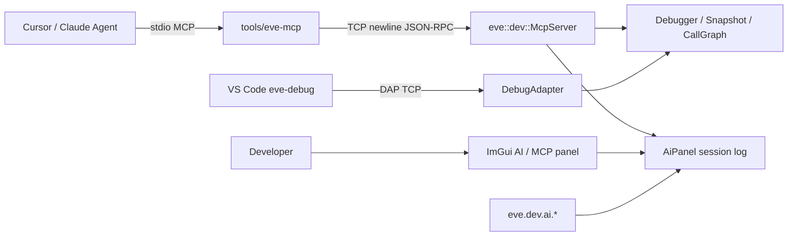

# AI 生成 / 辅助开发与 MCP 支持

> 状态：首版落地（嵌入式 MCP + DevTools AI 面板 + Cursor stdio 桥）。
> 代码：[`src/engine/devtools/McpServer.*`](../../src/engine/devtools/McpServer.hpp)、
> [`AiPanel.*`](../../src/engine/devtools/AiPanel.hpp)、[`DevTool.*`](../../src/engine/devtools/DevTool.hpp)；
> 桥接：[`tools/eve-mcp/`](../../tools/eve-mcp/)。

## 目标

让 EVEngine 对 **AI 生成游戏** 与 **AI 辅助开发** 提供底层可测接口：

1. 运行时嵌入 **MCP 服务器**（与 DAP 同级），供 Agent 驱动暂停 / 求值 / 快照 / 错误切片。
2. DevTools 增加 **AI / MCP** 面板与脚本 API，人类与 Agent 共享会话日志。
3. 通过 `tools/eve-mcp` 把引擎 TCP MCP 接到 Cursor / Claude Desktop 的 stdio MCP。

非目标（本版不做）：云端 LLM 推理、自动写关卡的生成管线、替换 VS Code DAP。

## 架构



| 组件 | 职责 |
|------|------|
| `McpServer` | JSON-RPC 2.0（MCP tools / resources / prompts），localhost TCP，换行分帧 |
| `AiPanel` | 工具调用 / 笔记日志；可选 ImGui 窗口；`eve.dev.ai` |
| `DevTool` | `startMcp` / `poll` 与 DAP 并列；`drawAiPanel` |
| `tools/eve-mcp` | stdio ↔ TCP 桥，给 IDE Agent 用 |

桌面 Debug 构建才链接 `EVDevTools`；Android / iOS 精简运行时不含 MCP。

## 启动

```bash
eve run --debug --mcp-port=7529 .
# 可与 DAP 同时开：
eve run --debug --dap-port=4711 --mcp-port=7529 .
```

`--mcp-port` 隐含 `--debug`。stderr 会打印：

```text
MCP listening on 127.0.0.1:7529 (newline JSON-RPC; use tools/eve-mcp for Cursor stdio)
```

游戏循环里已有的 `eve.dev.poll()`（`load.nut`）会同时泵 DAP 与 MCP。

## MCP 能力

### Tools（节选）

| 名称 | 用途 |
|------|------|
| `eve_status` | 附着 / 暂停 / 端口 / callgraph 摘要 |
| `eve_eval` | 求值表达式 |
| `eve_pause` / `eve_continue` / `eve_step_*` | 运行控制 |
| `eve_stack` / `eve_locals` | 栈与局部变量 |
| `eve_set_breakpoint` / `eve_list_breakpoints` | 断点 |
| `eve_watch_*` | Watch |
| `eve_snapshot_*` | 脚本状态快照（AI 测试可复位） |
| `eve_error_slice` | 最近错误后向切片 |
| `eve_run_script` | 在活 VM 上跑短片段 |
| `eve_ai_note` / `eve_ai_log` | 写入 / 读取 DevTools AI 日志 |
| `eve_scene_status` / `eve_scene_nodes` / `eve_scene_node_get` / `eve_scene_node_set` | 运行时场景 / 实体查询与变换 |
| `eve_procgen_recipes` / `eve_procgen_map` / `eve_procgen_mesh` | 程序化生成：算法/配方枚举、生成地图网格、构建网格 |
| `eve_physics_new_world` / `eve_physics_list_worlds` / `eve_physics_raycast` / `eve_physics_remove_world` | 2D 物理世界与射线检测 |
| `eve_render_status` / `eve_screenshot` | 渲染状态、当前帧截图（PNG） |
| `eve_particles_status` / `eve_particles_emit` | 粒子系统状态与发射 |
| `eve_audio_status` / `eve_audio_set_volume` / `eve_audio_stop_all` | 音频主控 |

### Resources

- `eve://status`
- `eve://error-report`
- `eve://ai-session`
- `eve://callgraph`

### Prompts

- `debug_failure` — 用切片排查失败
- `test_scenario` — 暂停 → 快照 → 断言 → 恢复
- `ai_game_review` — 审查 AI 生成内容的运行态风险

协议版本默认协商 `2025-06-18`。传输：TCP + **单行 JSON**（与 MCP stdio 一致，载荷内不得含裸换行）。

## DevTools AI 面板

- ImGui 窗口标题：`EVEngine AI / MCP`（需本帧已 `ui.beginFrameAndRender`）
- `F9` 切换显示（`load.nut`）
- 脚本：

```squirrel
eve.dev.ai.status();
eve.dev.ai.note("boss phase entered");
eve.dev.ai.log();
eve.dev.ai.setVisible(true);
eve.dev.ai.draw(); // load.nut 每帧在 present 前调用
```

面板显示 MCP 端口 / 连接状态、客户端名、最近 tool 调用与笔记。

## Cursor 接入

见 [`tools/eve-mcp/README.md`](../../tools/eve-mcp/README.md)。先起游戏再连 bridge。

## 测试

```bash
./build/<platform>-debug/test/unit_test --testcase='^devtools\.(mcp|ai)\..*$'
```

## 后续可扩展

- Streamable HTTP 传输（多客户端）
- GPU 资源绑定列表枚举（纹理/网格/着色器；当前后端未暴露公开查询 API）
- 3D 物理世界与 Box3D 工具（当前仅 2D World）
- 音频波形 / 素材来源加载类工具（当前为主音量、停止控制）
- 与 `eve test` 场景脚本联动的 MCP 资源
- AI 生成内容的静态校验（nut AST / 资源清单）
