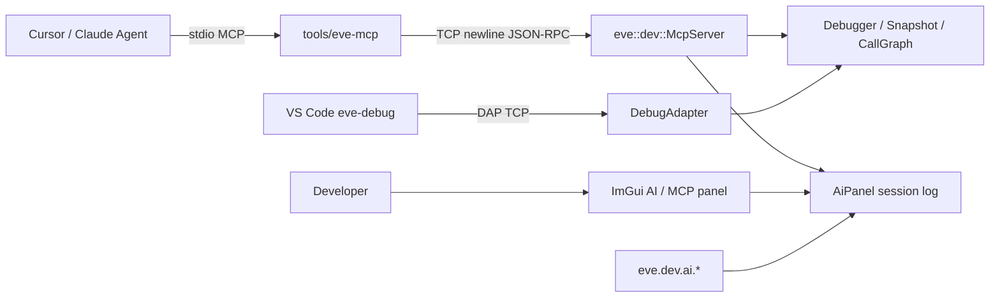
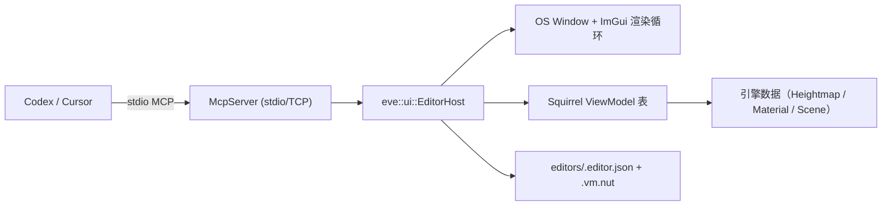

# AI 生成 / 辅助开发与 MCP 支持

> 状态：首版落地（嵌入式 MCP + DevTools AI 面板 + Cursor stdio 桥）。
> 代码：[`src/engine/devtools/McpServer.*`](../../src/engine/devtools/McpServer.hpp)、
> [`AiPanel.*`](../../src/engine/devtools/AiPanel.hpp)、[`DevTool.*`](../../src/engine/devtools/DevTool.hpp)；
> 桥接：[`tools/eve-mcp/`](../../tools/eve-mcp/)。

## 目标

让 EVEngine 对 **AI 生成游戏** 与 **AI 辅助开发** 提供底层可测接口：

1. 运行时嵌入 **MCP 服务器**（与 DAP 同级），供 Agent 驱动暂停 / 求值 / 快照 / 错误切片。
2. DevTools 增加 **AI / MCP** 面板与脚本 API，人类与 Agent 共享会话日志。
3. 通过 `tools/eve-mcp` 把引擎 TCP MCP 接到 Cursor / Claude Desktop 的 stdio MCP。

非目标（本版不做）：云端 LLM 推理、自动写关卡的生成管线、替换 VS Code DAP。

## 架构



| 组件 | 职责 |
|------|------|
| `McpServer` | JSON-RPC 2.0（MCP tools / resources / prompts），localhost TCP，换行分帧 |
| `AiPanel` | 工具调用 / 笔记日志；可选 ImGui 窗口；`eve.dev.ai` |
| `DevTool` | `startMcp` / `poll` 与 DAP 并列；`drawAiPanel` |
| `tools/eve-mcp` | stdio ↔ TCP 桥，给 IDE Agent 用 |

桌面 Debug 构建才链接 `EVDevTools`；Android / iOS 精简运行时不含 MCP。

## 启动

```bash
eve run --debug --mcp-port=7529 .
# 可与 DAP 同时开：
eve run --debug --dap-port=4711 --mcp-port=7529 .
```

`--mcp-port` 隐含 `--debug`。stderr 会打印：

```text
MCP listening on 127.0.0.1:7529 (newline JSON-RPC; use tools/eve-mcp for Cursor stdio)
```

游戏循环里已有的 `eve.dev.poll()`（`load.nut`）会同时泵 DAP 与 MCP。

## MCP 能力

### Tools（节选）

| 名称 | 用途 |
|------|------|
| `eve_status` | 附着 / 暂停 / 端口 / callgraph 摘要 |
| `eve_ui_tree` / `eve_ui_get` / `eve_ui_click` | 普通游戏 retained UI 的语义树查询、控件状态读取和按 ID 点击；与 `eve_host_*` 编辑器宿主互补 |
| `eve_eval` | 求值表达式 |
| `eve_pause` / `eve_continue` / `eve_step_*` | 运行控制 |
| `eve_stack` / `eve_locals` | 栈与局部变量 |
| `eve_set_breakpoint` / `eve_list_breakpoints` | 断点 |
| `eve_watch_*` | Watch |
| `eve_snapshot_*` | 脚本状态快照（AI 测试可复位） |
| `eve_error_slice` | 最近错误后向切片 |
| `eve_run_script` | 在活 VM 上跑短片段 |
| `eve_ai_note` / `eve_ai_log` | 写入 / 读取 DevTools AI 日志 |
| `eve_scene_status` / `eve_scene_nodes` / `eve_scene_node_get` / `eve_scene_node_set` | 运行时场景 / 实体查询与变换 |
| `eve_scene_director_install` / `eve_scene_director_status` / `eve_scene_reset` / `eve_scene_modify` / `eve_scene_info` / `eve_camera_generate` | AI 场景导演：搭台 kit 安装 / 状态 / 清场 / 摆物调光摄像机 / 场景真值 / 生成机位（见 [AI 场景导演](AI场景导演.md)） |
| `eve_procgen_recipes` / `eve_procgen_map` / `eve_procgen_mesh` | 程序化生成：算法/配方枚举、生成地图网格、构建网格 |
| `eve_physics_new_world` / `eve_physics_list_worlds` / `eve_physics_raycast` / `eve_physics_remove_world` | 2D 物理世界与射线检测 |
| `eve_render_status` / `eve_screenshot` | 渲染状态、当前帧截图（PNG） |
| `eve_render_describe` | 采集当前帧 + 渲染参数，交给配置的视觉模型，返回文字描述与「渲染参数↔画面效果」对应关系 |
| `eve_render_vision_config` | 设置 / 读取视觉模型配置（baseUrl/apiKey/model/path/timeoutMs，密钥掩码） |
| `eve_particles_status` / `eve_particles_emit` | 粒子系统状态与发射 |
| `eve_audio_status` / `eve_audio_set_volume` / `eve_audio_stop_all` | 音频主控 |

### Resources

- `eve://status`
- `eve://error-report`
- `eve://ai-session`
- `eve://callgraph`

### 普通游戏 UI 自动化

`eve_ui_*` 面向游戏内通过 `UIHost` / `ui.mountBuildAs()` 创建的 retained UI；
`eve_host_*` 则面向 `eve mcp` 的 JSON EditorHost。两套 UI 都通过 MCP 暴露，但不会互相绕过
各自的事件和绑定模型。

```text
eve_ui_tree  { "host": "editor-v2" }
eve_ui_get   { "host": "editor-v2", "widget": "asset-tree" }
eve_ui_click { "host": "editor-v2", "widget": "asset-tree" }
```

`eve_ui_click` 把 click 排入普通 UI 的 pending event 队列。事件仍由
`ui.dispatchEvents()` 分发，再由下一帧游戏逻辑通过 `ui.consumeClick()` 或注册回调消费；
它不会直接调用业务函数。省略 `host` 时，widget id 必须在全部 host 中唯一，否则返回歧义错误。

### Prompts

- `debug_failure` — 用切片排查失败
- `test_scenario` — 暂停 → 快照 → 断言 → 恢复
- `ai_game_review` — 审查 AI 生成内容的运行态风险

协议版本默认协商 `2025-06-18`。传输：TCP + **单行 JSON**（与 MCP stdio 一致，载荷内不得含裸换行）。

## DevTools AI 面板

- ImGui 窗口标题：`EVEngine AI / MCP`（需本帧已 `ui.beginFrameAndRender`）
- `F9` 切换显示（`load.nut`）
- 脚本：

```squirrel
eve.dev.ai.status();
eve.dev.ai.note("boss phase entered");
eve.dev.ai.log();
eve.dev.ai.setVisible(true);
eve.dev.ai.draw(); // load.nut 每帧在 present 前调用
```

面板显示 MCP 端口 / 连接状态、客户端名、最近 tool 调用与笔记。

## 视觉模型描述（RenderVision）

引擎可把当前帧截图 + 渲染参数交给一个 **OpenAI 兼容** 的视觉模型，返回文字描述，
并说明「渲染参数 ↔ 画面效果」的对应关系，供其他 LLM 调试渲染问题。

- **按需**：调用 MCP 工具 `eve_render_describe`（`fresh=false` 返回上次缓存，
  `fresh=true` 重新采集+推理；可选 `reason` 备注触发原因）。
- **断点 / 错误自动触发**：调试器命中脚本断点或运行时错误暂停时，会记录一个待处理
  标记，随后在 `McpServer::poll`（主线程，读回安全）自动完成一次采集+推理，结果缓存。
- 配置：`eve_render_vision_config` 或环境变量（首次使用生效）：

```text
EVE_VISION_BASE_URL   e.g. http://127.0.0.1:11434/v1  （须为明文 HTTP；
                       引擎未链接 TLS/OpenSSL）
EVE_VISION_API_KEY    可选 Bearer
EVE_VISION_MODEL      e.g. llava / gpt-4o-mini / qwen2-vl
EVE_VISION_PATH       默认 /chat/completions
EVE_VISION_TIMEOUT_MS 默认 20000
```

说明：请求走 `HTTPClientSession`（无 TLS），用 base64 data URL 的 JSON body
（`POST {baseURL}{path}`），兼容 Ollama / vLLM / LM Studio 等本地 OpenAI 兼容服务。

## Cursor 接入

见 [`tools/eve-mcp/README.md`](../../tools/eve-mcp/README.md)。先起游戏再连 bridge。

## Headless MCP 主机（`eve mcp`）

> 状态：v1 落地。命令 + stdio/TCP 传输 + `eve_host_*` 工具 + EditorHost（MVVM 编辑器宿主）。

`eve mcp` 在命令行启动一个**无头 MCP 主机**：不先起游戏、不创建窗口，进程就绪后等 AI
通过 MCP 下令。AI 调用 `eve_host_editor_apply` 提交一份 JSON 编辑器（View），主机随即
创建窗口、每帧渲染，并把 View 与 AI 注册的 Squirrel 表（ViewModel）做 MVVM 双向绑定。
这样每个项目都能长出风格与功能完全不同的地形编辑器、材质编辑器、事件编辑器——由 AI
按项目定制，不再受统一 IDE 样式约束。

### 启动

```bash
# stdio（Codex / Claude / Cursor 直接接入，无需 Node 桥）
eve mcp

# TCP（给 tools/eve-mcp 或自定义客户端）
eve mcp --port 7529 --root /path/to/project
```

Codex 配置（`.codex/config.toml` 或项目 `mcpServers`）：

```json
{ "mcpServers": { "evengine-host": {
    "command": "eve", "args": ["mcp"]
} } }
```

stdout 专用于 MCP 帧；所有诊断 / 脚本 `print()` 走 stderr。窗口 quit、
`eve_host_shutdown` 或 stdin EOF 时退出。桌面平台可用；Android / iOS / 浏览器返回不可用。

### 架构



- `McpServer` 新增 stdio 传输：后台读线程把 stdin 行入队，`poll()` 在主线程同步分发，
  stdout 只写 JSON-RPC。
- `EditorHost`（`src/modules/ui/EditorHost.{h,cpp}`，Pimpl、头文件不含 imgui.h）：
  惰性建窗、每帧渲染所有编辑器面板、执行绑定、截图、运行 Squirrel、持久化。
- 帧序：Event pump → `eve_host_update(dt)` → `gfx.clearScreen()` → `eve_host_render()`
  → `ui.beginFrameAndRender()` → 绘制面板 → `gfx.present()` → `ui.dispatchEvents()`。

### 编辑器 JSON 协议（View）

```jsonc
{
  "id": "terrain",               // 唯一 ID（必填）
  "title": "Terrain Editor",
  "vm": "TerrainVM",             // 绑定的 ViewModel 表名
  "x": 80, "y": 60, "width": 520, "height": 640,
  "layout": "vertical",          // vertical | horizontal
  "theme": { "preset": "dark", "accent": [0.2, 0.7, 0.45],
             "bg": [0.1, 0.11, 0.13], "panel": [0.14, 0.15, 0.18],
             "text": [0.92, 0.93, 0.95], "radius": 4.0, "fontScale": 1.0 },
  "children": [ /* 控件树 */ ]
}
```

控件目录 v1：`label / text / separator / spacer / progress / plot / input /
slider / slider2 / slider3 / color / checkbox / dropdown / listbox / button /
tree / group / tabs / tab / table / viewport`；通用字段 `id / label / visible /
enabled / tooltip`（可交互控件必须 `id`）。`viewport` 是预览画布：脚本用
`eve.host.widgetRect(editor, widget)` 查询矩形后自己绘制。

绑定规则（v1，不做任意表达式求值）：

| 字段 | 方向 | 说明 |
|------|------|------|
| `bind` | 双向 | 点路径 `vm.brushSize` / `vm.mat.roughness`，标量/字符串/bool/数组 |
| `command` | View→VM | 按钮点击调 VM 方法 `(editorId, widgetId)` |
| `onChange` | View→VM | 值变化回调 `(widgetId, value)` |
| `bind:options` / `bind:label` / `bind:visible` / `bind:enabled` | VM→View | 单向同步 |

### ViewModel（Squirrel 表）

AI 通过 `eve_host_vm_register` 把 Squirrel 源编译进主机 VM 并注册为表；表方法里用
`this.` 访问兄弟字段（调用时宿主把表作为 `this` 传入）：

```squirrel
::TerrainVM <- {
    brushSize = 12, strength = 0.3, tool = "Raise",
    grassColor = [0.3, 0.55, 0.25], wireframe = false,
    tools = ["Raise", "Flatten", "Carve", "Smooth"],

    onChange = function(widget, value) {
        if (widget == "strength") this.refreshPreview();
    },
    apply = function(editor, widget) {
        // 读写引擎数据（eve.Procgen / Heightmap / Material ...）
    }
};
```

### 工具一览

`eve_host_status`、`eve_host_window_open/close/state`、
`eve_host_editor_apply/remove/list/state/set_value/save/unload`、
`eve_host_vm_register/unregister`、`eve_host_events`（读取并清空
`{editor,widget,type:click|change,value}`）、`eve_host_widget_rect`、
`eve_host_capture`、`eve_host_script`、`eve_host_resource_reload`、
`eve_host_hot_reload_status`、`eve_host_shutdown`。

首次 `editor_apply` 自动开默认窗口（1280×800）；`editor_save` 把 View + VM 源持久化到
项目 `editors/<id>.editor.json` 与 `editors/<id>.vm.nut`，`eve mcp` 启动时自动恢复。

### MCP 模式资源与脚本热更新

`eve mcp` 会监听项目目录，并在主循环内对文件事件做 100 ms 防抖。以下文件保存后无需
重新编译或重启主机；当前 MCP 连接、窗口和编辑器会话保持不变：

- `mcp.nut`：项目级 MCP 主机扩展脚本，启动时自动执行，后续保存自动重载。
- `mcp/**/*.nut`：可拆分的主机脚本。
- `editors/<id>.vm.nut`：对应编辑器的 Squirrel ViewModel。
- `editors/<id>.editor.json`：对应编辑器的 JSON View；JSON 内 `id` 必须与文件名一致。
- 其他资源交给已有 `IAssetReloader`（材质、着色器等）按扩展名认领。

View 或 ViewModel 成功替换后，主机会恢复该编辑器现有的控件值，避免滑杆、输入框等
交互状态因改代码而重置。脚本编译失败或 JSON 无效时，旧版本继续运行；失败详情只进入
诊断状态，不会终止 MCP 进程。运行期错误仍应避免在脚本顶层产生不可逆副作用。

Agent 可用 `eve_host_resource_reload {"path":"mcp.nut"}` 主动触发一次确定性重载，
并用 `eve_host_hot_reload_status` 查询 `enabled / watchCount / reloadCount /
failureCount / lastPath / lastResult`。Squirrel 内可调用同构接口
`eve.host.reloadResource(path)` 与 `eve.host.hotReloadStatus()`。

### 脚本 API

`eve.host`：`status / openWindow / closeWindow / windowState / applyEditor /
removeEditor / setValue / events / registerVM / unregisterVM / widgetRect /
capture / save / runScript / reloadResource / hotReloadStatus`。脚本可定义
`eve_host_update(dt)` 与 `eve_host_render()`
钩子参与每帧更新与绘制（用 `eve.host.widgetRect` 在 viewport 内自绘预览）。

### 测试

```bash
./build/<platform>-debug/test/unit_test --testcase='^devtools\.(mcp|ai)\..*$'
```

新增用例：`devtools.mcp.stdioTransport`（stdio 握手 + tools/list）、
`devtools.mcp.hostEditorBinding`（VM 注册、双向绑定、onChange、事件、
save→unload→reload 持久化往返）、`devtools.mcp.hostResourceHotReload`
（View / ViewModel / mcp.nut 重载、状态保留、错误回退、路径隔离与诊断）。

## 测试

```bash
./build/<platform>-debug/test/unit_test --testcase='^devtools\.(mcp|ai)\..*$'
```

## 后续可扩展

- Streamable HTTP 传输（多客户端）
- GPU 资源绑定列表枚举（纹理/网格/着色器；当前后端未暴露公开查询 API）
- 3D 物理世界与 Box3D 工具（当前仅 2D World）
- 音频波形 / 素材来源加载类工具（当前为主音量、停止控制）
- 与 `eve test` 场景脚本联动的 MCP 资源
- AI 生成内容的静态校验（nut AST / 资源清单）
- 编辑器 JSON：更多控件（image/视频预览、节点图）、多 OS 窗口、编辑器间拖拽
