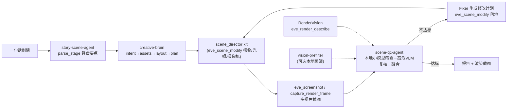

# AI 场景导演（Scene Director）

> 状态：整合打通（story-scene-agent 编排 + scene_director kit + 引擎 MCP 新工具）。
> 编排入口：`tools/story-scene-agent/`；搭台 kit：`src/scripts/scene_director.nut`；
> 引擎侧调度：`src/engine/devtools/McpServer.cpp`。

把散落在仓库各处的 AI 能力（creative-brain 生成、scene-qc 质检修复、vision-prefilter
预筛选、RenderVision 渲染描述、asset-pipeline 素材供给、引擎 MCP 驱动）整合成一条
**可被 Agent 端到端驱动**的流水线：给一句话剧情，就能在引擎里自动摆道具、调光照、架摄像机、
多视角截图、质检迭代修复，最终交付一个质量过关的舞台。

## 目标与效果

- **Agent 可驱动**：无需手改脚本，Agent 通过 MCP 直接搭建 / 调整 / 查看 / 改进场景。
- **自动摆物 / 调摄像机 / 看渲染结果 / 迭代改进**：`eve_scene_modify` 摆物与调光，
  `eve_camera_generate` 生成机位，`eve_screenshot` / `capture_render_frame` / `eve_render_describe`
  看结果，scene-qc 自动修复迭代。
- **剧情 → 合格舞台**：`story-scene-agent` 一句话剧情 → 舞台要点 → 计划 → 搭台 → 质检 → 交付。

## 端到端流程



## 组件与打通点

| 组件 | 角色 | 打通方式 |
|------|------|----------|
| `scene_director.nut` | 搭台 kit：spawn/move/scale/rotate/remove/material/lighting/camera/cameras/info/modify/reset | 嵌入为 `eve.sceneDirectorScript`，MCP 工具自动安装 |
| `eve_scene_modify` | Agent 摆物/调整的统一入口（action+target+params） | 薄调度，转发 `scene_director.modify` |
| `eve_scene_info` | 权威场景真值（props/pos/scale/yaw/tint） | 转发 `scene_director.info` |
| `eve_camera_generate` | 围绕已摆场景生成标准质检机位 | 转发 `scene_director.cameras` |
| `eve_scene_reset` | 清场重置 | 转发 `scene_director.reset` |
| `tools/creative-brain` | 意图解析 / 资产匹配 / 布局 / 计划 | `brain.mcp` 现在把计划步骤翻译成真实 `scene_director.modify` 动作 |
| `tools/scene-qc-agent` | ReAct 巡检 / 三源融合 / 修复迭代 | `config.example.json` 已对齐到真实引擎工具名；截图支持读盘→base64 |
| `tools/vision-prefilter` | 本地轻量视觉预筛选（可选） | 可作 scene-qc `local_screen` 的 OpenAI 兼容后端 |
| `RenderVision` | 引擎内置渲染描述 | `eve_render_describe` 供质检 / 调试 |

## 引擎 MCP 新工具（Agent 驱动核心）

| 工具 | 说明 | 参数 |
|------|------|------|
| `eve_scene_director_install` | 安装搭台 kit（幂等，工具首次使用自动调用） | — |
| `eve_scene_director_status` | kit 状态（installed / propCount / hasCamera） | — |
| `eve_scene_reset` | 清空道具、摄像机、恢复默认光照 | — |
| `eve_scene_modify` | 场景动作 | `action`, `target`, `params` |
| `eve_camera_generate` | 生成标准机位 | `count` |
| `eve_scene_info` | 场景真值 | — |

### `eve_scene_modify` 的 action

`add_object|spawn|place`、`move_object|move`、`scale`、`rotate|rotation`、
`remove_object|remove`、`visibility`、`material`、`lighting|set_lighting`、
`camera`、`cameras`、`info`、`list`、`reset`。

参数示例：

```jsonc
// 摆一棵树
{ "action": "add_object", "target": "tree_0",
  "params": { "id": "tree_0", "kind": "tree", "pos": [4, 0, 3], "scale": [1.2,1.2,1.2], "seed": 5 } }
// 调月光
{ "action": "lighting", "target": "scene",
  "params": { "timeOfDay": "night", "atmosphere": "moonlit", "intensity": 0.8 } }
// 架摄像机
{ "action": "camera", "target": "scene", "params": { "eye": [0,8,16], "target": [0,1,0], "fov": 55 } }
```

### 支持的道具 `kind`

- 图元：`box|cube`、`sphere|ball`、`cylinder|pillar|column|trunk`
- 程序化网格：`tree`、`rock`、`bush`、`skyscraper`、`hexplanet`、`marchingcubes`、
  `fence`、`stonewall`、`bridge`、`greatwall`、`hedge`、`chevaldefrise`
- 地面：`ground|floor`（自动压扁）

## 编排入口：story-scene-agent

```bash
# 起引擎空舞台 + MCP
eve run --debug --mcp-port=7529 examples/ai-stage

# 干跑（无引擎/模型，验证闭环）
cd tools/story-scene-agent
python -m story_scene_agent.cli "月光下骑士与巨龙在古堡前对峙" --dry-run

# 真实搭台 + 质检
python -m story_scene_agent.cli \
    "月光下骑士与巨龙在古堡前对峙" --port 7529 --out-dir stage_duel
```

产物：`stage_duel/story_scene_report.json`（stage / plan / build / qc / final）+ 截图。

## Agent 工作流建议（参考 TEngine 的 AI 开发工作流）

1. **任务分级**：简单加一个道具 → 直接调 `eve_scene_modify`；整幕搭台 → 用
   `story-scene-agent` 全链路；跨模块（素材缺失、特效、动画）→ 并行触发
   `asset-pipeline-brain` / `scene-qc-brain`。
2. **按需查规范**：Agent 摆物前先 `eve_scene_director_status` + 读本文件「支持的 kind /
   action」，避免猜 API；会话内缓存，不重复查。
3. **先干跑再真机**：`--dry-run` 验证闭环，再连真引擎。
4. **冲突标注**：kit / 文档与实际引擎行为不符时，以代码为准并记录差异。

## 测试

```bash
# Python 侧（creative-brain / story-scene-agent 的改动）
python -m pytest tools/creative-brain/tests tools/story-scene-agent/tests -q
# scene-qc
(cd tools/scene-qc-agent && python -m unittest discover -s tests -p "test_*.py")

# 引擎侧（MCP 工具 / kit）
./build/<platform>-debug/test/unit_test --testcase='^devtools\.mcp\..*$'
```

## 后续可扩展

- scene_director 支持外部模型（`.glb`）与动画挂接。
- `eve_scene_modify` 增加 `spawn_effect` / 粒子 / 音频编排。
- 场景持久化为可回放的编排脚本（story → nut 剧本）。
- 与 `eve test` 场景脚本联动的回归断言。
