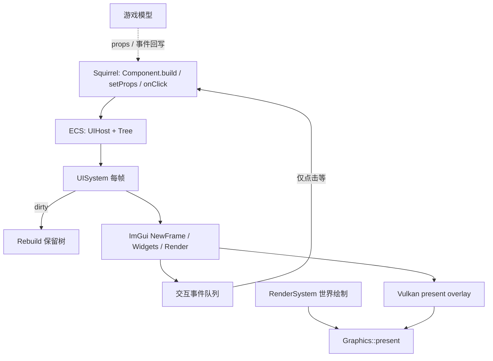
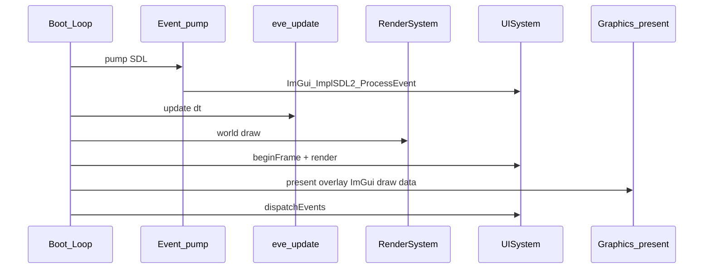

# 声明式游戏 GUI 框架设计

> 状态：B 期已完成（脚本 Component + 高级原语 + 弹性布局）；C 期 DevTools 反射属性面板
> 已完成（脚本类/属性自动扫描 + MVVM 双向绑定），见 §8 C。
> 2026-08-18 差距清单补强：两阶段布局（measure/arrange + margin/padding/min/max/百分比/锚点）、
> Image/九宫格/ImageButton、脚本事件回调、文本换行与 CJK 字体回退、Combo、宿主位移动画、
> UI JSON 序列化（saveTreeJson/loadTreeJson）、手柄导航与 UI 统计；2026-08-19 补滚动虚拟化
> （ScrollList / virtualList，按滚动偏移只绘制可见行）；2026-08-19 再补 UI 内嵌渲染视口
> （Viewport 控件：离屏 Canvas → 纹理注册 → Image 显示 + 输入路由），并新增
> `Graphics::renderScene3DToCanvas`（RenderSystem3D::renderToCanvas 前向离屏 3D 通道）、
> `editor.newHeightmapMesh / updateHeightmapMesh`（高度图 → 地形网格），
> 示例 `examples/terrain-editor`。
> 2026-08-30 新增 3D 世界锚点：`UIHost::WorldAnchor` 由活动 `Camera3D` 投影到 retained
> UI overlay，支持视锥外隐藏/安全边缘钳制、相机缺失/背后状态与距离缩放；HUD、头顶
> 血条、场景标注和编辑器浮层使用同一条 UIHost/UISystem 路径。
> 2026-08-30 第二阶段新增确定性重叠避让：高优先级、近距离、稳定 Host 顺序决定占位，
> 有界位移失败显式进入 `Crowded`，并向脚本公开最终状态与屏幕坐标。
> 2026-08-26 完成框架整合：新增纯数据 `presentation` 层、Squirrel 反射与 Editor
> PropertyModel 适配器、共享 `PropertyView`、Inspector 标量字段迁移，以及 Control 级
> enabled/focus/mouse/accessibility 语义、主题子树作用域和确定性事件冒泡；
> `examples/editor-ui-gallery` 同帧展示游戏 HUD 与编辑器 UI。
> 对外模型：**声明式** retained 组件树 + ECS `UIHost`（非每帧脚本命令式 ImGui）。
> 后端：Dear ImGui（SDL 输入 + Vulkan 绘制），由 C++ `UISystem` 每帧 walk。
> ECS 基础库：[sunxfancy/ECS.hpp](https://github.com/sunxfancy/ECS.hpp)（`external/ECS.hpp`）。

关联文档：[模块设计.md](./模块设计.md)、[依赖项.md](./依赖项.md)、[整体架构.md](./整体架构.md)、[游戏模型设计.md](./游戏模型设计.md)、[2D渲染API设计.md](./2D渲染API设计.md)
代码落点：[`src/modules/ui/`](../../src/modules/ui/)（抽象 [`UIBackend`](../../src/modules/ui/UIBackend.h)；ImGui 实现 [`ui/imgui/`](../../src/modules/ui/imgui/)）


## 1. 目标与非目标

### 1.1 为何不用脚本每帧命令式 ImGui

ImGui 本身是即时模式：每帧都要调用 `Begin`/`Button`/`End`。若由 **Squirrel 每帧大量调用**，会把 VM 调度与跨语言边界压在热路径上，也与引擎「状态机 / 热更新 / 数据驱动」及声明式渲染分工不一致。

正确分工：

| 层 | 职责 | 调用频率 |
|----|------|----------|
| 脚本 | **声明** UI 组件树，**在状态变化时**改 props / `setState`，注册事件回调 | 事件驱动，非「每控件一次 ImGui」 |
| C++ `UISystem` | dirty 时 rebuild 保留树；每帧 walk → ImGui | 每渲染帧，全在原生侧 |
| ImGui + SDL/Vulkan | 绘制与输入命中 | 每帧 |

### 1.2 第一期目标（A）

- CMake 接入 imgui（核心源 + `imgui_impl_sdl` + `imgui_impl_vulkan`）
- ECS：`UIHost`（Meta + Tree）+ `UISystem`
- 保留节点最小集：`Window` / `Text` / `Button` / 简单 `SameLine` 布局
- 脚本：`Component` 风格 `build` → `mount` / `setProps` / `setState` / `onClick`
- 帧序：游戏 `RenderSystem` → `UISystem` → `present`（UI overlay）
- 验收：挂一次面板，点按钮改模型文字；脚本无 per-frame UI 调用

### 1.3 非目标（第一期不做）

- 完整 React Virtual DOM / hooks 全家桶（仅 `build` + dirty 整树重建）
- 每个 Button 一个 ECS Entity
- 脚本侧原始 `imgui.begin/button` 热路径（即时模式仅 C++/DevTools 逃生舱）
- 反射自动生成 DevTools 属性面板（C 期）
- 富文本浏览器级布局、游戏内 WYSIWYG 编辑器

### 1.4 约定默认

| 项 | 默认 |
|----|------|
| React 深度 | 组件化 + `build()` + dirty 重建；不做精细 key-diff |
| ECS 挂载 | Host 为 Entity；控件树在 `Tree` 组件内 |
| 绑定 | props 单向流入；回写仅经事件回调（避免复杂双向 binding） |
| 枚举 | 短 string（≤15）；单返回值 |
| 命名空间 | C++ `eve::ui`；脚本 `eve.UI` / `eve.ui` |


## 2. 架构与数据流



### 2.1 职责切分

| 组件 | 职责 | 不负责 |
|------|------|--------|
| `UIHost` Entity | 一块屏幕/面板挂载点（可见性、layer、modal） | 玩法逻辑 |
| `Tree` 组件 | 保留 `UINode` 数组 + dirty + handler 表 | Vulkan |
| `UISystem` | rebuild、每帧 walk → ImGui、收集事件 | 游戏规则 |
| `UIBackend` | 输入/呈现抽象；默认 `createImGuiBackend()` | 控件树语义 |
| `ui/imgui/ImGuiBackend` | SDL 输入、Vulkan present overlay | 脚本 API |
| `graphics` | present 前调用 overlay 钩子 | UI 树语义 |

### 2.2 与交互层（游戏模型）的关系

对齐 [游戏模型设计.md](./游戏模型设计.md) 四层模型中的 **交互层**：

- UI 是 ViewModel 的可视化：改数据 → 改显示；用户操作 → 事件 → 改模型
- 交互对象可作为 component 挂到模型实体上（`UIHost`），与声明式渲染同表

### 2.3 与声明式 2D 渲染的同构

| 渲染 | GUI |
|------|-----|
| `Renderable2D` + `Transform2D`/`Sprite` | `UIHost` + `Meta`/`Tree` |
| `RenderSystem::render` | `UISystem::render`（`View<UIHost,…>`，含继承子类） |
| 脚本改组件字段 | `select(name)` 后 `setText` / 或直接改 `host->tree()` |
| 禁止 per-sprite `draw` | 禁止 per-frame `imgui.button` |

**ECS 约定：**

- 每个面板一个 `UIHost` 实体；`Meta.name` 用于 `findHost` / `select` / `mountBuildAs`
- 可 `class Hud : public UIHost` 挂玩法组件；仍被 `View<UIHost, Meta, Tree>` 扫到
- `Meta.ownerId` 把 UI 挂到游戏实体 id（`bindOwner` / `findHostByOwner`）
- 点击全局队列：`consumeClick()` → `"hostName/nodeId"`
- 控件仍在 `Tree` 内（不做每 Button 一 Entity）

### 2.4 整合后的分层与依赖方向

依赖只允许自上而下，View 不直接认识 Squirrel VM，Editor 命令也不进入通用模型层：

1. `presentation`：`Value`、`PropertySchema`、`IPropertyModel`、订阅与校验结果；纯 C++、
   无 UI/VM/Editor 依赖。
2. `scriptmodel` / `editor::EditorPropertyModel`：分别把 Squirrel 反射对象和编辑器属性源
   适配为同一个 `IPropertyModel`；Editor 写入只产生 command intent。
3. `ui::PropertyView`：只消费 schema/value，选择控件、生成稳定 ID、双向写回并按 revision
   增量同步；既可嵌入游戏 UI，也可嵌入编辑器面板。
4. `Inspector`、游戏 HUD、Editor shell：组合 View、命令、权限与目标选择；不复制属性控件。
5. `WidgetDesc → UINode → UIHost/UISystem → UIBackend`：保留树、布局、焦点/输入、主题与
   后端呈现。ImGui 只是默认 renderer，不定义公开 UI 语义。

这使“反射生成 UI”成为普通 MVVM adapter，而不是 Inspector 私有代码；游戏内调试器、
运行时编辑菜单和桌面 Editor 可以共享 schema/view，却保留不同命令权限和外壳。

### 2.5 Godot GUI 基线对应

| Godot GUI 概念 | EVEngine 对应 | 本轮状态 |
|---|---|---|
| `Control` 的可见/启用、focus mode、focus neighbor、mouse filter | `UINode` / `WidgetDesc` 的平台中立 Control 语义 | 已实现并序列化 |
| `Container` 自动布局与 size flags | Flex、Row/Column、Toolbar、Sidebar、Toolbox、SplitPane、box model | 已实现核心组合与响应式布局 |
| Theme 继承与局部 override | 全局 preset + `ThemePreset` 子树作用域 + `setThemeScope` | 已实现 dark/light 作用域与嵌套恢复 |
| Inspector 按属性元数据生成 editor | `IPropertyModel` + `PropertyView` + 反射/Editor adapter | 已实现标量生成、校验、双向同步与结构值只读展示 |
| `_gui_input` / mouse filter 传播 | UIEvent target + retained-tree `pass/ignore/stop` 冒泡 | 已实现 click 路由与自动化同路径 |
| 键盘/手柄焦点导航 | 显式邻居 + 稳定 tabIndex fallback + `moveFocus` | 已实现后端中立 API 与 ImGui 键盘桥 |

当前对标的是可协作的基础框架，而不是宣称已有 Godot 的全部控件目录。Tree/TabContainer、
富文本编辑、IME、平台无障碍桥和完整样式资源导入仍应作为后续独立能力建设，不能
重新塞回 Inspector 或 ImGui backend。

Drag & Drop 首期只在 Windows、macOS、Linux 生效。retained 节点保存 payload type 与
owning UTF-8 text，`UISystem` 在完成投递后发布 owning `UIDrop`；源/目标节点地址不进入
跨帧状态。SDL `DROPFILE` 在事件泵释放平台缓冲前同步复制，并统一投影为 `type=file`。
Android、iOS、Web/WASM 保留相同脚本 API，但 `dragDropSupport()` 明确返回
`unsupported-platform`；测试会按当前目标平台验证对应的 supported/unsupported 契约。

### 2.6 与 3D 场景的双向组合

现有 `Viewport` 控件解决“3D 场景嵌入 GUI”；`WorldAnchor` 解决“GUI 跟随 3D 场景”。
脚本在选中/挂载 host 后调用：

```squirrel
ui.setHostOverlay(true)
ui.setHostWorldAnchor(enemyX, enemyY + 2.0, enemyZ)
ui.setHostWorldEdgePolicy("clamp", 12.0)
ui.setHostWorldDistanceScale(true, 10.0, 0.7, 1.2)
ui.setHostWorldOverlap(true, 10, 4.0, 96.0)
```

每帧由 `UISystem` 读取活动 `Camera3D` 并只写 transient 投影结果，不复制 Scene transform
权威状态。玩法/Scene owner 负责提供世界坐标并在目标销毁时禁用锚点；这里不保存 Scene 裸指针，
因此销毁顺序不会悬空。相机先销毁或裁剪配置没有 camera 时状态为 `NoCamera` 且不绘制；相机
恢复、热重载或 host restore 后会从 authoritative world position 自动重建投影。

重叠解析在 measure 后、walk 前运行，读取 Host 的实测/显式尺寸，在屏幕空间按 priority、
depth、stable index 排序并做上下交替的有界搜索。它只写 `screenX/Y`、displacement 和
`Crowded` transient 状态，不改世界坐标，也不创建第二套布局树。固定 Host 可占位但不会
被移动；启用避让的 Host 无空位时不绘制，脚本可据此切换聚类标记或降低信息密度。

遮挡分两层：本轮已处理相机背面与视锥/屏幕边界；真实几何深度遮挡应由 Graphics 的深度查询
capability 后续接入，不能用 UI 自己复制深度或 Scene raycast 作为第二真源。屏幕 HUD 继续不启用
WorldAnchor；场景内可交互 3D 面板若需要透视表面和深度写入，应使用 mesh/material 路径，而不是
把 overlay 硬伪装成世界几何。


## 3. ECS 组件

```cpp
namespace eve::ui {

enum class NodeType : uint8_t { Window, Text, Button, SameLine, Group };

struct UINode {
  NodeType type = NodeType::Text;
  std::string id;          // 稳定 id（事件路由）
  std::string text;        // 标题 / 标签
  bool visible = true;
  int firstChild = -1;
  int nextSibling = -1;
  uint32_t handlerClick = 0; // 0 = none；索引进 Host handler 表
};

class UIHost : public ecs::Entity {
public:
  ENTITY(UIHost, ecs::Entity)
  void release() override;

  struct Meta {
    bool visible = true;
    int layer = 0;
    bool modal = false;
    UIHost *entity = nullptr;
  };

  struct Tree {
    bool dirty = true;
    std::vector<UINode> nodes;
    int root = -1;
    // 脚本/C++ 回调槽；实现侧可用 std::function 或 squirrel 句柄
  };

  COMPONENT(Meta, meta)
  COMPONENT(Tree, tree)
};

class UISystem {
public:
  static void beginFrame();   // ImGui NewFrame（SDL 事件已泵）
  static void render();       // walk hosts → widgets → ImGui::Render
  static void dispatchEvents(); // 帧末把点击投递给脚本
};

}  // namespace eve::ui
```

规则：

1. **不**为每个 Button 建 Entity；Host 少、树在组件内，利于 ImGui 连续 walk。
2. Dirty：`setProps` / `setState` / 结构变化 → `tree.dirty = true`；rebuild 整棵 Host 树（A 期）。
3. 多个 Host：`ecs::View<UIHost, Meta, Tree>`，按 `layer` 排序后绘制。


## 4. 可组合声明式 API

### 4.1 C++（`WidgetDesc`）

```cpp
#include "ui/Widget.h"
using namespace eve::ui;

ui->mount(window("Inventory", {
    text("Hello", "label"),
    group({
        button("Use", "use", [&]{ /* ... */ }),
        sameLine(),
        button("Drop", "drop"),
    }),
}));
ui->setText("label", "Ready");
```

### 4.2 脚本（栈式 builder，挂一次）

```squirrel
ui.beginBuild()
ui.beginWindow("Inventory", "root")
  ui.text("Ready", "status")
  ui.beginGroup("actions")
    ui.button("Use", "use")
    ui.sameLine("")
    ui.button("Drop", "drop")
  ui.end()
ui.end()
ui.mountBuild()

// 状态变化时改 props（非每帧重建）
ui.setText("status", "Used")

// 点击：dispatchEvents 之后
local id = ui.consumeClick()
while (id != "") {
    if (id == "use") { /* 改模型 */ }
    id = ui.consumeClick()
}
```

| 概念 | 含义 |
|------|------|
| `WidgetDesc` / builder | 可任意嵌套 Window/Text/Button/Group/Flex/SameLine |
| `id` | 稳定键；`setText` / `setVisible` / 点击路由 |
| `mount` / `mountBuild` | 声明一次；后续只改 props |
| `onClick`（C++） / `consumeClick`（脚本） | 仅交互时处理 |
| `row` / `column` / `spacer` | 弹性布局；`gap` / `flexGrow` / `align` / `justify` |

### 4.2.1 弹性布局（Flex）

```cpp
ui->mount(window("HUD", {
    row({
        button("Menu", "menu"),
        spacer(),
        text("HP 100", "hp"),
    }, "top").withGap(8.f).withJustify(FlexJustify::Start),
    column({
        text("Quest", "q"),
        button("Track", "track").withFlexGrow(1.f),
    }, "side").withAlign(FlexAlign::Stretch),
}));
```

```squirrel
ui.beginRow("top", 8.0)
ui.setFlexJustify("space-between")
ui.button("Menu", "menu")
ui.spacer("sp")
ui.text("HP 100", "hp")
ui.end()
```

### 4.3 C++ Component（B）

```cpp
class InventoryPanel : public eve::ui::Component {
  std::vector<std::string> items{"Sword"};
  int gold = 10;
  WidgetDesc build() override {
    return window("Inv", {
      text("Gold " + std::to_string(gold), "gold"),
      listButtons("items", items),
      when(gold > 0, button("Buy", "buy")),
    });
  }
};

InventoryPanel panel;
panel.mountAs("inv");
panel.gold = 9;
panel.markDirty();
panel.updateIfDirty();  // key reconcile when structure stable
```

### 4.4 脚本 List / 主题（B）

```squirrel
ui.beginBuild()
ui.beginWindow("Shop", "root")
  ui.beginList("goods")
    ui.listItem("Apple", "goods/0")
    ui.listItem("Bread", "goods/1")
  ui.end()
  ui.separator("s")
  ui.checkbox("Member", false, "mem")
ui.end()
ui.mountBuildAs("shop")
ui.setTheme("dark")   // or "light"; getTheme() returns current name
ui.setNavKeyboard(true)
// dark/light share rounding / borders / spacing / fontScale — only the palette changes
```

### 4.5 脚本 Component（B）

```squirrel
class ShopPanel extends eve.UIComponent {
    gold = 10
    constructor(uiRef) {
        base.constructor(uiRef)
        gold = 10
    }
    function build() {
        local u = ui()
        u.beginWindow("Shop", "root")
        u.text("Gold " + gold, "gold")
        u.slider("Tax", 0.1, 0.0, 1.0, "tax")
        u.progress(gold / 100.0, "bar", "")
        if (gold > 0) u.button("Buy", "buy")
        u.end()
    }
}

local panel = ShopPanel(ui)
panel.mountAs("shop")
// 状态变化时：
panel.gold = 9
panel.setState()
panel.updateIfDirty()  // remountBuildAs + key reconcile
```

UI 基类为 `eve.UIComponent`（`eve.Component` 留给脚本 ECS 数据组件）。


## 5. 保留树 vs ImGui

1. `WidgetDesc`（脚本构建）→ flatten 为 `UINode` arena。
2. 每帧：`UISystem` 只读节点调 `ImGui::*`，**不进入 Squirrel**（除非本帧有待派发事件）。
3. 命中控件后推入 `Event{host, nodeId, kind}`，在 `dispatchEvents` 调脚本。
4. B 期：列表 `key`、局部 dirty。


## 6. 帧生命周期



规则：

1. SDL 事件在 `event.pump` 时交给 ImGui（若 UI 模块已初始化）。
2. `WantCaptureMouse/Keyboard` 为真时，游戏逻辑可选择忽略对应输入。
3. Overlay 在 swapchain render pass 内、`endRenderPass` 之前绘制。
4. modal Host 依赖 ImGui 焦点与捕获标志挡住下层。


## 7. 模块与依赖

- 模块名：`ui`（C++ `eve::ui::UI`，脚本 `eve.UI`）
- 依赖：Window（SDL）、Graphics（Vulkan present 钩子）、ECS.hpp、imgui
- third-party：补齐 imgui 头文件；CMake 编 `imgui` 静态库并安装头路径


## 8. 分期

### A — 最小可玩（进行中）

1. imgui CMake + SDL/Vulkan backend
2. `UIHost` / `Tree` / `UISystem`；Window / Text / Button
3. Graphics present overlay 钩子
4. 脚本 mount / setProps / onClick；C++ 验收测试

### B — 组合与列表

- [x] `List` / `listButtons` / 脚本 `beginList`+`listItem`
- [x] 条件子树 `when` / `whenElse`
- [x] `Component`（C++ `build` / `setState` / `rebuild` / key reconcile）
- [x] 按 key 局部 dirty（`setTreeReconcile` / `applyTreeReconcile`）
- [x] 主题 `Theme` 统一令牌（色板/圆角/边框/间距/字体缩放）+ `setTheme` / `setThemeDark` / `setThemeLight` / `getTheme`；键盘导航开关；与 `setScale` 同步缩放
- [x] 原语扩展：`Separator` / `Checkbox`
- [x] 脚本侧 `class X extends eve.UIComponent { build() }`
- [x] 高级原语：`Slider` / `Progress` / `InputText` / `CollapsingHeader` / `Child`
- [x] `consumeChange` / `setValue` / `WantCapture*` / `setHostModal`
- [x] 弹性布局：`Flex` / `Row` / `Column` / `Spacer`；`gap` / `flexGrow` / `align` / `justify`

### C — DevTools

- [x] 同一 `UISystem`；反射属性面板（见 [界面设计.md](./界面设计.md)）
- [x] 脚本类/属性自动扫描：`Runtime::scanClasses()` 随时扫描根表（含
      `dofile`/`compilestring` 加载的类，热重载自动刷新）；
      实例级反射 API：`createInstance` / `reflectInstance` / `readProperty` /
      `writeProperty` / `classNameOf`
- [x] MVVM 属性面板 `ui.inspect()` / `ui.inspectObject(obj)`：控件变更直接写回
      脚本实例，`sync()` 每帧把模型值拉回视图（双向绑定）；类/实例下拉 + 新增实例
- [x] Squirrel 属性元数据选择控件：`</ editor = "slider", min, max />`、
      `</ editor = "combo", options = "a,b,c" />`、checkbox/input 默认；
      继承成员按所属基类分组（“父类属性面版”）
- [x] 数据库管理面板 `ui.dbOpen()` / `dbRegister(obj)`：按脚本类名动态菜单 +
      实例网格（单元格编辑、+ 新增、删除），数据底座 `ui/ObjectRegistry`
- [x] 嵌套引用编辑：`Runtime` 数组/表读写 API（`arraySize/Get/Set/Append/Remove`、
      `tableKeys/Get/Set/Remove`、`readObjectProperty`）+ Inspector 数组/表展开编辑
      与嵌套实例导航（open / back）
- [x] 场景层级面板 `ui.sceneOpen()`：经 `ISceneQuery` 能力接口渲染节点树，
      选中节点可编辑 transform / visible，Pick 按钮把节点 id 交给脚本回调 →
      `ui.inspectObject()` 联动对象检查器
- [x] 编辑器外壳 `ui.editorOpen()`：菜单栏 + 三栏 dock（Inspector / Database /
      Scene）+ 面板开关（`editorSelectPanel`）
- [x] 示例 `examples/inspector-demo` + 测试（`Inspector.cpp` / `DatabasePanel.cpp` /
      `EditorShell.cpp` / `ScenePanel.cpp`）
- [x] 脚本侧反射 API：`Runtime::initialize()` 后在 `eve.reflect.*` 暴露同一套
      反射层（`classes` / `classInfo` / `createInstance` / `classNameOf` /
      `inspect` / `read` / `write` / `readObject` / `array*` / `table*` /
      `scan` / `scripts`），脚本工具和编辑器可直接读写实例属性
- [ ] 事件/对话编辑器（规划）：`dialogue` 数据已有，可视化编辑 UI 待做
- 原始 ImGui 逃生舱仅限 C++ DevTools


## 9. 验收标准（第一期）

- [x] 工程可编译并链接 imgui；`#include <imgui.h>`
- [x] C++ 创建 `UIHost`，树含 Window+Text+Button；`UISystem` 每帧画出路径存在；**无**脚本 per-frame UI 循环（见 `test/UISystem.cpp`）
- [x] 点击 Button 触发回调并改 Text（C++ handler + `dispatchEvents`）
- [x] `setProps` / `setLabelText` 后保留树字段更新
- [x] 与 boot 帧序对接（`src/scripts/load.nut`）
- [x] 与现有 `RenderSystem` 同帧 Vulkan overlay 实机冒烟（`test/UIOverlaySmoke.cpp`）


## 10. 内部逃生舱

| API | 用途 |
|-----|------|
| 直接 `ImGui::*`（C++） | DevTools、调试 |
| `UISystem::render` | 游戏主路径 |
| 脚本 `imgui.*` | **不提供**为热路径 |
