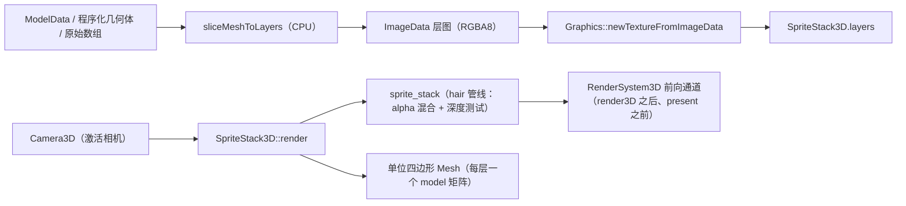

# Sprite-Stacking 伪 3D 模块设计（`spritestack`）

> 状态：已落地三期。一期：CPU 切片（原始网格数组 / model3d / 程序化几何体）+
> Vulkan 前向通道内的叠片渲染 + Squirrel 绑定；二期：多叠片合批（新增
> `Graphics::updateMeshVertices` 原地更新）、投影假阴影、风格化描边、模型文件
> 切片示例；三期：叠片参与 G-Buffer（AO/描边后处理识别叠片，新增 alpha 剔除
> GBuffer 管线 + `RenderSystem3D` 扩展绘制钩子）、合批支持阴影/描边、atlas
> 条带打包工具；四期：叠片投射 CSM 阴影（alpha 剔除 shadow 管线 +
> `RenderSystem3D` 阴影扩展绘制钩子，无 `Light3D` 时回退旧版平行光）。
> WebGPU/WASM 精简构建不包含本模块。

关联：[`模块设计.md`](./模块设计.md)、[`3D渲染管线.md`](./3D渲染管线.md)、
[`风格化渲染模块设计.md`](./风格化渲染模块设计.md)、
[`2D渲染API设计.md`](./2D渲染API设计.md)。

## 1. 目标

在 EVEngine 内提供 sprite-stacking（叠片伪 3D）的完整链路：

1. **切片（离线/运行时 CPU）**：把三角网格沿指定轴切成 N 个薄片，每片正交
   投影成 RGBA 图（带简单 N·view 明暗与可选逐顶点颜色）。
2. **叠片渲染**：把层纹理按世界间距堆叠，作为 alpha 混合、深度测试的切片
   画进 3D 前向通道，与场景网格正确遮挡。
3. **两种形态**：
   - `vertical`（经典）：薄片为朝向相机的竖直 billboard，绕 Y 旋转叠片的
     深度布局，产生「面包切片」伪 3D；
   - `horizontal`：薄片为水平四边形（俯视切片），3/4 相机看到真实体积视差。

非目标（一期）：叠片阴影投射、切片着色器光照（保持 unlit + tint）、
多级 LOD / 实例化批处理、WebGPU WGSL 后端。

二期补充：

- **合批**：`SpriteStackBatch` 把注册叠片按（纹理，色调）分组，每组的全部切片
  烘焙进一个共享 Mesh（世界坐标顶点 + 层 UV），经 `Graphics::updateMeshVertices`
  原地更新，每组一次 `drawMeshShader`。内容变化时重建（与 GPU 同步），静态道具
  收益最大。
- **投影假阴影**：每层切片沿光方向压到 `setShadowPlaneY` 平面，画半透明黑剪影；
  内部抬升 2cm 规避与地面的严格 LESS 深度冲突。
- **描边**：每层画一个放大 k 的黑色剪影垫后，沿相机方向后推 2cm，使切片绘制
  仍能通过深度测试，只留 rim。
- **G-Buffer 参与**：`setGbufferEnabled(true)` 把叠片注册进 `RenderSystem3D`
  的扩展绘制钩子（`addGBufferExtraDrawer`），在 GBuffer pass 内用新增的 alpha
  剔除管线（`mesh3d_gbuffer_alpha.frag`，`Graphics::drawMeshGBufferAlpha`）按
  切片剪影写 depth/normal/albedo，AO / 描边后处理即可识别叠片。
- **CSM 阴影**：`setCastShadow(true)` 把叠片注册进 `RenderSystem3D` 的阴影扩展
  绘制钩子（`addShadowExtraDrawer`），每个级联内用 alpha 剔除 shadow 管线
  （`mesh3d_shadow_alpha.{vert,frag}`，`Graphics::drawMeshShadowAlpha`）把切片
  剪影写进 shadow map；没有 `Light3D` 投射器时用旧版平行光方向回退生成 CSM。

## 2. 调研摘要

对照公开的 sprite-stacking 常见实现（Glauber Kotaki 的 billboard 切片演示、
各类「切模型为层图」工具、PICO-8 社区的 2.5D 叠片），关键共识：

- 切片图应沿模型包围盒均匀分布，厚度可由包围盒自动推导；
- 运行时刻每层是**独立 alpha 混合四边形**，按相机距离由远到近绘制；
- 片数越多体积感越强，但深度排序与 draw call 随之增加（一期不做合批）。

## 3. 架构



- 模块：`eve::spritestack::SpriteStack`（Module）+ `SpriteStack3D`（渲染对象）。
- 依赖：`EVGraphics`、`EVImage`、`EVModel3D`（切片读取 assimp 网格）。
- 切片器纯 CPU（精确横截面算法）：
  1. 每个三角形投影到切面平面，做 2D 逐像素点内测试；
  2. 竖直线与表面的交点深度入桶，去重（共享边/顶点处相邻三角形插值深度
     相同，按相对容差 1e-5 合并）后做奇偶判定：奇数 = 实体内部；
  3. 取切面上方最近的表面作为该像素颜色（保留法线明暗）。
  该算法对闭合网格给出**实心横截面**（如圆柱的水平切面是实心圆盘），而
  不是表面投影产生的空心环。

## 4. Shader

`src/modules/spritestack/shaders/sprite_stack.{vert,frag}`：

- 顶点：MeshVertex 布局 + Mesh3D Frame UBO 前缀（mvp/model/lightDir/lightColor/
  tint/cameraPos），用 push constant `uvRect` 把整张纹理 UV 重映射到层单元
  （支持单张横向 atlas 条带）。
- 片元：`albedo * tint`，alpha 低于 `data[0]`（alphaCutoff）则 discard，
  输出直通 alpha。
- 管线：走 `Graphics::newHairShaderFromSpv`（createMesh3DHairPipeline）——
  alpha 混合、双面、深度测试开、深度写关。

GLSL 预编译到 `*_spv.inc`（`scripts/compile_spritestack_shaders.py`，需 glslc）。

## 5. API（脚本）

```squirrel
spritestack <- eve.SpriteStack();

local layers = spritestack.slicePrimitive("cylinder", 20, 128, 128, "z", 0.0);
local stack = spritestack.newStack(gfx);
for (local i = 0; i < layers.len(); i++) stack.setLayerImage(gfx, layers[i], i);
stack.setThickness(0.13);
stack.setSize(2.4, 2.8);
stack.setYaw(yaw);
stack.setMode("vertical");

function eve_render() {
    gfx.render3D();
    stack.render(gfx);   // 3D 通道内、present 前
}
```

| 入口 | 用途 |
|------|------|
| `slicePrimitive(kind, n, w, h, axis, thickness)` | 程序化几何体切片 |
| `sliceModel(modelData, n, w, h, axis, thickness)` | model3d 模型切片 |
| `newStack(gfx)` | 新建叠片对象（VM 持有） |
| `newBatch(gfx)` | 新建合批对象（VM 持有） |
| `setLayerCount` / `setLayerTexture` / `setLayerImage` / `setLayerFile` / `setLayersFromAtlas` | 图层填充 |
| `setThickness` / `setSize` / `setPosition` / `setYaw` | 变换 |
| `setTint` / `setAlphaCutoff` / `setVisible` / `setMode` | 外观 |
| `setShadowEnabled` / `setShadowOpacity` / `setShadowLight` / `setShadowPlaneY` | 投影阴影 |
| `setOutline` / `getOutlineWidth` / `setOutlineColor` | 描边 |
| `setGbufferEnabled` / `getGbufferEnabled` | 参与 G-Buffer（AO/描边） |
| `setCastShadow` / `getCastShadow` | 投射 CSM 阴影 |
| `render(gfx)` / `renderWithCamera(gfx, cam)` | 3D 通道内绘制 |

合批对象：`add` / `remove` / `clear` / `getStackCount` / `render(gfx)`。

## 6. 渲染细节

- 相机：`render` 默认取第一个 `active` 的 `Camera3D`（与 RenderSystem3D 一致）。
- 排序：每帧计算各层中心到相机的距离平方，按由远到近绘制；
  `vertical` 模式层中心 = 位置 + RotY(yaw)·(0,0,offset)。
- billboard：`right = normalize(cross(up, toCamera))`、`forward` 指向相机，
  local XY 面片朝向相机（圆柱形 billboard，保持竖直）。
- `horizontal`：层中心沿 Y 偏移，面片为水平四边形并绕 Y 旋转 yaw。
- 状态：绘制前设置 view/proj/clip/cameraPos/env；每层切换 `uvRect` push constant。

## 8. 合批实现细节

- 分组键 = (Texture*, 打包 RGBA 色调)；组内切片按相机距离远→近烘焙进顶点缓冲。
- 首个组用 `newMeshFromArrays` 创建，之后用 `updateMeshVertices` 原地更新（顶点
  与索引缓冲复用，容量不足时重分配；重分配前 `waitForSharedGpuResources`）。
- `SpriteStack3D` 维护单调递增 revision，合批据此判断是否需要重建。
- WebGPU 后端 `updateMeshVertices` 返回 false（不参与；WASM 本就不含该模块）。
- 合批会一并烘焙逐叠片的阴影与描边：收集阶段为每片生成带色调的绘制项
  （普通切片用叠片色调、阴影用黑色、描边用描边色），按（纹理，色调）分组。

## 9. G-Buffer 参与实现细节

- `mesh3d_gbuffer_alpha.frag`：与 `mesh3d_gbuffer.frag` 一致，但 `alpha < 0.05`
  discard；`scripts/compile_mesh3d_shaders.py` 预编译成 `.inc`。
- vulkan 后端在 `createGBufferResources` 里用同一 render pass / layout 创建
  `gbufferAlphaPipeline`；`GBufferDraw` 增加 `alphaTest` 标记，录制时按标记切换
  管线。
- `RenderSystem3D::addGBufferExtraDrawer`：通用静态钩子，GBuffer pass 内、不透明
  网格之后调用；GBuffer pass 的条件放宽为「存在网格或存在扩展绘制器」。
- 叠片侧维护全局注册表，`setGbufferEnabled(true)` 注册、析构自动移除；绘制器
  复用 `collectSlices` + `drawMeshGBufferAlpha`。

## 10. Atlas 打包工具

`scripts/pack_sprite_stack_atlas.py`：纯标准库 PNG 解码/编码，把等尺寸层图打包
成横向条带（输出 `width = count*cellW`），可选 JSON 清单；运行时
`setLayersFromAtlas(gfx, atlasTex, count)` 按列 UV 采样，无需 CPU 拆分。

## 11. CSM 阴影实现细节

- `mesh3d_shadow_alpha.vert`：与 `mesh3d_shadow.vert` 同变换，多输出 vUV；
  `mesh3d_shadow_alpha.frag`：`MainTex` alpha < 0.05 discard。
- vulkan 后端新增 `shadowAlphaPipelineLayout`（`texSetLayout` + mat4 push）与
  `shadowAlphaPipeline`（与普通 shadow 管线同样的 depth-only render pass、
  `setDepthBias(0.0f, 0.5f)`）；`ShadowDraw` 增加 `albedo` / `alphaTest`，
  录制时按标记切换管线并绑定纹理描述集。
- `RenderSystem3D` 的 shadow pass 条件放宽：存在阴影扩展绘制器即可运行；
  `shadowCaster` 缺失时以 `gLightDir` + 默认 bias/strength 构造 CSM。
- 叠片侧复用 `collectSlices`（相机朝向卡片）投影到 lightVP 下绘制——
  billboard 阴影的标准近似。

## 7. 验证

- `test/spritestack.cpp`：
  - 切片正确性（box 各层覆盖、sphere 中段比边缘覆盖更多、y 轴俯视切片圆形）；
  - 原始数组输入与异常路径；
  - 渲染回读：vertical/horizontal 各出一张 PNG 到 `build/.../test/out/`，
    校验中心区域有可见像素、不同 yaw 输出不同。
  - 合批：两个共享纹理的叠片一次批量渲染，左右各出现一个可见 blob。
  - 阴影/描边：开启后地面出现暗斑（投影阴影）、剪影面积变大（描边 rim）。
  - GBuffer：开启 outline 后，`setGbufferEnabled` 让描边沿叠片剪影出现。
  - Atlas：单张条带纹理按列切层，渲染出可见叠片。
  - CSM：`setCastShadow` 开启后地面出现剪影阴影（对比关闭时 luma 差值）。
- 示例 `examples/sprite-stack/`：程序化几何体 / rock.obj 实时切片 + 两种模式
  切换 + 阴影/描边 + 三个共享纹理的小石头的合批演示。
