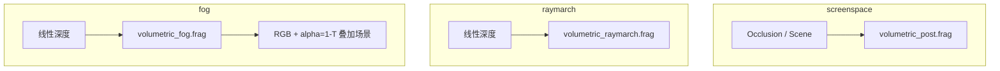

# 体积光 / 体积雾设计

> 状态：screenspace God Rays、depth Ray March 光柱、高度/距离体积雾均已落地。  
> API：`eve.Graphics().newVolumetric()` → `Volumetric`

关联：[`模块设计.md`](./dev/模块设计.md) §4 graphics、现有 `Drawable` / `Shadow` / `Canvas` / `Shader`。

## 1. 目标观感

有尘、有雾的参与介质渲染：

| 模式 | 技术 | 适用 |
|------|------|------|
| `screenspace` | GPU Gems 3 径向模糊 + 尘/雾 tint | 2D / 屏内亮源 |
| `raymarch` | 沿视线积分光柱 + 屏空间遮挡近似 CSM | 3D 线性深度 |
| `fog` | 高度指数 + 距离 ramp 的 Beer-Lambert 体积雾 | 3D 线性深度 |

完整 froxel 3D 纹理网格仍可选后续。

## 2. 公开技术对照

| 路线 | 代表 | 状态 |
|------|------|------|
| 屏幕空间径向模糊 | GPU Gems 3 Ch.13 | ✅ |
| Ray March 光柱 | UE/HDRP 简化 | ✅ |
| 高度/距离体积雾 | Wronski / Frostbite 简化（无 froxel 网格） | ✅ `setMode("fog")` |
| 绑定真实 CSM shadow map | 多 binding 后处理 | 后续 |
| Froxel 体积网格 | Hillaire / Wronski 完整版 | 后续 |

## 3. 架构



## 4. API

```squirrel
vol <- gfx.newVolumetric();
vol.setQuality("medium");

// --- 体积雾 ---
vol.setMode("fog");
vol.setCamera(eye..., target..., up..., fov, aspect, near, far);
vol.setLightDirection(0.3, 1.0, 0.2);
vol.setFogColor(0.55, 0.62, 0.75);
vol.setFogHeight(0.0);
vol.setFogHeightFalloff(0.15);
vol.setFogStart(2.0);
vol.setFogEnd(40.0);
vol.setFogNoise(0.35);
vol.setDensity(0.25);
vol.applyFog(gfx, linearDepthTex); // 输出非预乘雾色 + alpha，SrcAlpha 叠加到场景
```

> 引擎 2D textured pipeline 使用 `SrcAlpha / OneMinusSrcAlpha`。若目标画布已是不透明黑 `(0,0,0,1)`，混合后 alpha 恒为 1；测量雾浓度请清成透明，或读 RGB。

质量档（fog）：

| quality | samples | noise | 默认 density |
|---------|---------|-------|--------------|
| low | 8 | 0.15 | 0.18 |
| medium | 24 | 0.35 | 0.25 |
| high | 48 | 0.45 | 0.32 |

## 5. 验证

- `test/Volumetric.cpp`：含 fog 模式质量、参数往返、applyFog 不透明度、远近深度雾密度对比
