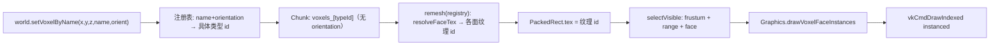

# 体素渲染模块设计 — `voxel`

日期：2026-08-11（2026-08-13 更新：新增方块类型注册表；2026-08-18 更新：接缝消隐 / 邻居失效 / 延迟 remesh / DDA 拾取 / 并行 remesh / 顶点 AO / 持久化 / 流式卸载；2026-08-19 更新：自动流式加载 + 地形生成）  
状态：Phase A 已实现（`src/modules/voxel/` + `Graphics::drawVoxelFaceInstances`）；已新增方块类型注册表 `CubeTypeRegistry`；Phase B 改进（见 [体素引擎差距分析](./体素引擎差距分析.md)）
存放：`docs/dev/`

## 背景与结论

引擎此前没有 3D 体素 / chunk / 贪婪网格管线。现有 `drawMesh` 按实体一次一实例绘制，不适合大规模体素面。因此新增独立模块 **`voxel`**，并在 `graphics`（Vulkan）上增加 **32-bit 打包矩形实例化** 绘制路径。

## 目标

1. **32³ chunk**：体素密铺存储；世界稀疏 chunk 地图
2. **贪婪矩形合并**：暴露面合并为轴对齐矩形，减少实例数
3. **32-bit 打包**：每个矩形一个 `uint32`
   - 3×5 bit：局部坐标 x/y/z（0..31）
   - 2×5 bit：宽/高（存 size−1 → 1..32）
   - 7 bit：贴图索引（0..127）
4. **六向子 chunk**：上下左右前后（±X/±Y/±Z）各一份 instance buffer
5. **可视筛选**：视锥 + 距离 + 朝向剔除后，合并进方向缓冲再实例化绘制

## 非目标（一期）

- ~~跨 chunk 邻接消隐~~ → **2026-08-18 已实现**：`GreedyMesher::ChunkSampler` + `VoxelWorld::chunkNeighborSampler`，接缝共享面按真实邻居剔除
- ~~环境光遮蔽~~ → **2026-08-25 已实现**：矩形 4 角 AO（Minecraft 式），2bit×4 打包，Vulkan/WebGPU shader 一致应用
- ~~持久化~~ / ~~流式卸载~~ → **2026-08-18 已实现**：`serializeWorld`/`deserializeWorld` + `saveWorld`/`loadWorld` + `unloadChunksOutside`；自动加载侧（生成器/读档循环）待接
- ~~自动流式加载~~ → **2026-08-19 已实现**：`streamAround`（直接复用 `procgen::TerrainSampler`，未新增模块）
- LOD / 增量局部 remesh（现为整 chunk remesh；32³ 整块重建已足够快，且有并行 remesh，见差距分析 P2）

## 模块位置

```text
src/modules/voxel/
  Voxel.h/.cpp          Module facade + Squirrel（只暴露 newCubeTypes / newWorld）
  CubeType.h            方块类型定义（名字、各面纹理、方向性、组合声明）
  CubeTypeRegistry.*    方块类型注册表（add / loadFromJson / resolveFaceTex / variantId）
  VoxelPack.h           32-bit PackedRect
  FaceDir.h             6 方向 + rotateFaceY（绕 Y 旋转）
  GreedyMesher.*        贪婪 2D 合并（按注册表解析各面纹理）
  Chunk.h               32³ + 6 face buffers
  Frustum.h             viewProj → 6 planes
  VoxelWorld.*          稀疏世界 + selectVisible + drawVisible + 注册表持有

src/modules/graphics/
  Graphics.h            drawVoxelFaceInstances(...)
  vulkan/Graphics.*     实例化管线 + unit quad
  shaders/voxel_rect.*  vert/frag + SPIR-V .inc
```

脚本：`voxel <- eve.Voxel()`。

## 数据流



## 方块类型注册表（2026-08-13 新增）

`CubeType` 定义一种方块：名字、各面图集纹理（`faceTex[6]` 按 `FaceDir` 顺序 PosX..NegZ）、是否方向性、组合声明（`composeGroup` / `connects`，本期仅建模，行为后置）。

```cpp
struct CubeType {
    std::string name;
    uint8_t id = 0;            // 0 保留为空气
    uint8_t faceTex[6] = {};   // 各面纹理索引
    bool directional = false;  // 可绕 Y 轴旋转
    std::string composeGroup;  // 同组可组成更大结构（行为后置）
    bool connects = false;     // 连接纹理提示
};
```

`CubeTypeRegistry` 负责注册与查询，并在创建世界时传入（世界内部拷贝）。

### 方向性：orientation 不进 Chunk

方向性方块在**设置各面纹理时**用 `orientation ∈ {0,1,2,3}` 绕 Y 轴旋转 `faceTex`，展开成 4 个**具体类型变体**（连续 id）；运行时 Chunk 只存「类型 id」，网格器不再旋转。

```cpp
uint8_t resolveFaceTex(const CubeTypeRegistry &types, uint8_t id, FaceDir dir) {
    const CubeType *t = types.find(id);
    if (!t) return id;                 // 未注册 → 退化为“所有面 = 原 id”
    return t->faceTex[int(dir)];
}
```

- 旋转只作用于 4 个水平面（±X/±Z），±Y 顶/底不变（`FaceDir::rotateFaceY`）。
- `setVoxelByName(name, orientation)` 由世界解析成具体类型 id 后写 Chunk。
- 网格器输出 `PackedRect.tex` 始终是「各面纹理 id」（0..127），`Graphics` 无需感知「类型」概念。

### 向后兼容

空注册表 + 直接传 id 时，`resolveFaceTex` 退化为 `id`，行为与旧「体素值 == 纹理 id」完全一致，因此既有 `setVoxel(x,y,z,tex)` 语义不变。

### JSON 加载

`CubeTypeRegistry::loadFromJson(json, error)` 复用 `data::JsonDocument` / Poco JSON 解析，元素形如：

```json
[
  { "name": "grass", "faceTex": [1, 1, 2, 3, 1, 1] },
  { "name": "furnace", "faceTex": [4, 4, 4, 4, 5, 4], "directional": true }
]
```

## 打包布局

| 位域 | 含义 |
|------|------|
| 0..4 | x |
| 5..9 | y |
| 10..14 | z |
| 15..19 | width − 1 |
| 20..24 | height − 1 |
| 25..31 | texture index |

切向约定：

| 面 | width | height |
|----|-------|--------|
| ±X | Z | Y |
| ±Y | X | Z |
| ±Z | X | Y |

正方向外表面在着色器中置于 `voxel+1` 平面（5 bit 坐标仍存体素索引 0..31）。

## 可见性

`VoxelWorld::selectVisible(viewProj, eye, viewRange, faceCull)`：

1. chunk AABB ↔ 视锥（RH + ZO，与 `setMesh3DViewProj` 一致）
2. chunk 中心与相机距离 ≤ `viewRange`（`viewRange≤0` 关闭）
3. **仅对通过视距/视锥的 chunk 调用 `ensureMeshed`**（视距外的脏 chunk 不重建）
4. `faceCull`：仅保留 `dot(outwardNormal, eye − center) > 0` 的面缓冲
5. 结果为 `DrawBatch` 列表；`drawVisible` 逐批调用 `drawVoxelFaceInstances`

## 射线拾取（2026-08-18 新增）

`VoxelWorld::raycast(ox,oy,oz,dx,dy,dz,maxDist, hit*, prev*, face*)`：Amanatides & Woo DDA，
返回首个固体方块 + 命面前的空气方块（放置用）+ 进入面法线。脚本侧
`world.raycast(...)` 后经 `lastRaycastHit()` / `getRaycastHit*` / `getRaycastPrev*` /
`getRaycastFace*` 读取。

## 并行 remesh（2026-08-18 新增）

`remeshDirty(maxThreads)`：0=自动（`hardware_concurrency`，上限 4）；1=串行；>1=指定 worker。
每 worker 处理互不重叠的 chunk 切片，采样器只读 chunk map；线程创建失败自动回退串行。
输出与串行逐位一致（`test/voxel.cpp` 有对照用例）。

## 顶点 AO 与持久化/流式（2026-08-18 晚新增）

### 顶点 AO

`GreedyMesher` 为每个合并矩形计算 4 角 AO（角部两邻 + 对角，`side1&&side2 ? 0 : 3−Σ`），
打包为 `2bit×4` 的 32-bit 字（0xFF=全亮），与 `PackedRect` 平行存储于 `Chunk::ao_[6]`。
`Graphics::drawVoxelFaceInstances(packed, count, ..., ao)`（Vulkan）新增实例 binding 2；
`voxel_rect` shader 按 unit-quad 角选 AO 并乘光照；Vulkan 与 WebGPU 均有像素回归测试。
CPU 镜像：`VoxelRectDecode::decodePackedRect(..., aoWord)`。

### 持久化 / 流式卸载

- `serializeWorld(out)`：`EVVX` 魔数 + 版本 + 数量 + 每 chunk（坐标 + 32³ 原始体素），小端可移植。
- `deserializeWorld(data, size)`：校验魔数/版本/长度后整体替换世界；加载后 chunk 标脏、按需重建网格。
- `unloadChunksOutside(cx, cy, cz, radius)`：卸载中心半径外的 chunk，自动清空可见批次。
- 脚本：`saveWorld() -> ByteData`、`loadWorld(ByteData) -> bool`、`unloadChunksOutside(...)`。

### 自动流式加载 + 地形生成（2026-08-19 新增）

`streamAround(cx, cy, cz, radius, generator)`：先卸载半径外 chunk，再补建半径内缺失 chunk
（球形，chunk 坐标），对新 chunk 调用生成器（缺省用世界内置地形采样），最后并行
`remeshDirty`。地形采样复用 procgen 模块的 `procgen::TerrainSampler`（确定性 Perlin fBm），
`terrainHeightAt` 按世界坐标采样保证跨 chunk 无缝；voxel 侧按草皮/泥土/石头分层填充列。
脚本：`world.setTerrain(seed, top, sub, stone, base, amp, scale)` + `world.streamAround(cx,cy,cz,radius)`。

## Graphics API

```cpp
gfx.begin3DFrame();
gfx.setMesh3DViewProj(proj * view);
world.selectVisible(proj * view, eye, 128.f, true);
world.drawVisible(gfx, atlasTex, /*tilesPerRow=*/16);
```

Vulkan：共享 unit quad（4 顶点 / 6 索引，绕序 `0-2-1` / `0-3-2` 与外法线一致）+ per-draw instance VBO（`VK_VERTEX_INPUT_RATE_INSTANCE`），push constant 传 `viewProj` / chunk origin / faceDir / atlas 分格。

## 测试

`test/voxel.cpp`（CPU）：打包/别名/掩码/最大字段、脏标记与 remeshDirty、负坐标与跨 chunk、空/满层/柱/L/棋盘/描边环/阶梯/3³挖空/十字平面/纹理切分（多 id/空隙不合并）/满 chunk 32²/隧道/顶层 y=31/八角点/对角面/壳层、邻接消隐、六轴朝向与视距/视锥（含上下远处拒绝）、`viewRange` 近邻筛选、null viewProj、selectVisible 替换、Decode 双三角绕序/六面/负原点/UV 网格（含 tex127@16、tilesPerRow≤0）、`meshFace`/`meshChunk` 空体/追加/多纹理、`drawVisible(nullptr)`、多 chunk 可见子集与 batch 指针，以及**方块类型注册表**（add/loadFromJson/方向性变体/`resolveFaceTex`/`setVoxelByName`/各面纹理解析/`faceTex=0` 合法图集/空注册表向后兼容）。

`test/voxel_render.cpp`（GPU）：smoke、空世界、空实例/null packed、非法 faceDir、需 begin3DFrame、±faceDir 别名（含全部 `+/-` 轴）、null atlas / drawVisible null atlas、大实例/扩容/256 压力、远 chunk、多 chunk 合批/异色/负原点、深度近遮远、多帧图集切换、六向环视/单帧六向手动、**多格图集**（4×4…32×2、tex0–127）、宽 32×1 / 高 1×32 / 满层俯视、tilesPerRow 错配与 0 clamp、挖洞变暗、视锥剔除、sparse 多纹理柱、编辑 remesh、range cull、chunk seam、注册表多面纹理渲染冒烟。

门面已收敛：`Voxel` 只暴露 `getChunkSize` / `newCubeTypes` / `newWorld(types)`，`packRect`/`unpackRect*`/`meshVoxels`/`getMeshFace*`/`newChunk` 等实现细节移出门面（测试改为直接引用 `VoxelPack` / `GreedyMesher`）。
