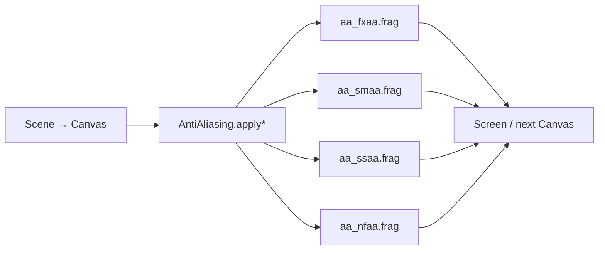

# 抗锯齿（Anti-Aliasing）设计

> 状态：图像空间经典 AA（FXAA / SMAA / SSAA / NFAA）已落地。  
> API：`eve.Graphics().newAntiAliasing()` → `AntiAliasing`

关联：[`模块设计.md`](./模块设计.md) §4 graphics、现有 `Canvas` / `Shader` / `Volumetric` 后处理路径。

## 1. 目标

为 2D / 3D 离屏结果提供可切换的经典抗锯齿，不改动 Vulkan 主管线的 sample count。

| 模式 | 技术 | 适用 |
|------|------|------|
| `fxaa` | FXAA 3.11 风格：亮度边搜索 + 亚像素混合 | 通用、低开销 |
| `smaa` | SMAA 启发的单 Pass 形态学 AA（适配单 `MainTex` 后处理） | 边缘质量优先 |
| `ssaa` | 超采样 Resolve（box / tent / Gaussian） | 先画到更大 Canvas 再下采样 |
| `nfaa` | Normal Filter AA：沿亮度梯度切向模糊 | 轻量滤波 |

硬件 MSAA / 完整多 Pass SMAA（edge+weight LUT）/ TAA 需要额外绑定或历史缓冲，列为后续。

## 2. 架构



与 `Volumetric` / `StylePass` 相同：`drawTexturedRectShader` + push constant uniforms + 嵌入 SPIR-V。

## 3. API

```squirrel
aa <- gfx.newAntiAliasing();
aa.setQuality("medium");   // low | medium | high
aa.setMode("fxaa");        // fxaa | smaa | ssaa | nfaa

// 场景画到 sceneCanvas 后：
aa.applyCanvas(gfx, sceneCanvas);           // 写到当前绑定目标 / 屏幕
// 或
aa.applyCanvasTo(gfx, sceneCanvas, dest);

// SSAA：先按 suggestScale 建高分辨率 Canvas
aa.setMode("ssaa");
sw <- aa.resolutionFor(screenW);
sh <- aa.resolutionFor(screenH);
hi <- gfx.newCanvas(sw, sh);
// ... 渲染到 hi ...
aa.applyCanvasTo(gfx, hi, screenCanvas);
```

质量档会重置各模式默认参数（阈值、搜索步数、核半径、`ssaa.scale` 等）；仍可用 `setFloat` 覆盖当前模式参数。

## 4. 着色器与编译

| 文件 | 数组 |
|------|------|
| `aa_fxaa.frag` | `aa_fxaa_frag_spv.inc` |
| `aa_smaa.frag` | `aa_smaa_frag_spv.inc` |
| `aa_ssaa.frag` | `aa_ssaa_frag_spv.inc` |
| `aa_nfaa.frag` | `aa_nfaa_frag_spv.inc` |

```sh
python3 scripts/compile_graphics_aa_shaders.py   # 需要 PATH 上的 glslc
```

## 5. 后续

- [ ] Vulkan 硬件 MSAA（swapchain / offscreen sample count + resolve）
- [ ] 多贴图 SMAA 1x（edge / blend weight + area/search LUT）
- [ ] TAA（历史缓冲 + 相机 jitter / velocity）
