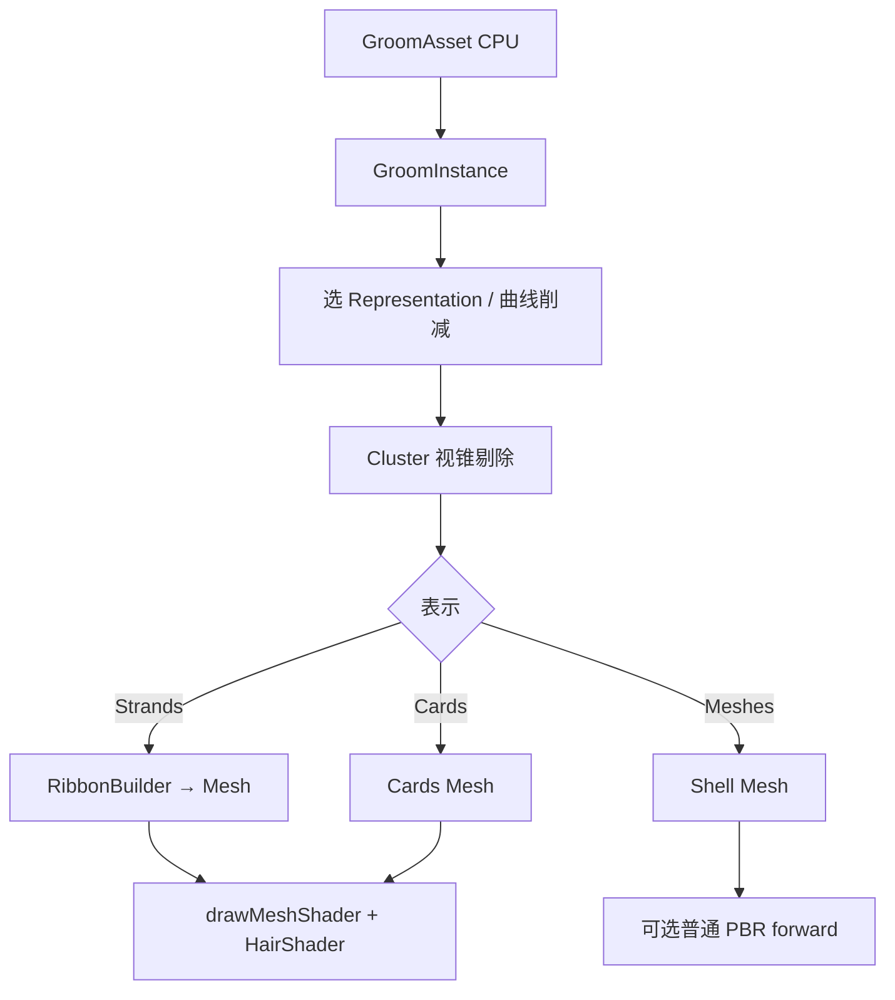

# 毛发 Groom 子系统设计（graphics/hair）

> 状态：**设计已确认，分阶段实施中**。日期：2026-09-14  
> 目标：在 EVEngine `graphics` 下新增 **Groom 风格高质量毛发子系统**，覆盖发丝数据、LOD（strands / cards / meshes）、集群剔除、各向异性着色，并与现有 `hair` pass / Kajiya-Kay 卡片着色演进衔接。  
> 非目标（首期）：完整 Niagara 级物理、光线追踪发丝、MetaHuman 级 crowd 流式、直接拷贝 UE 私有源码。

关联：[`3D渲染管线.md`](./3D渲染管线.md)、[`贴花渲染模块设计.md`](./贴花渲染模块设计.md)、
[`模块编排与裁剪架构.md`](./模块编排与裁剪架构.md)、
[`重构代码质量与系统完整性规范.md`](./重构代码质量与系统完整性规范.md)、
[`领域短根继承与跨域组合架构.md`](./领域短根继承与跨域组合架构.md)、
[`Result检查与不得丢弃返回值规范.md`](./Result检查与不得丢弃返回值规范.md)。

---

## 1. 调研结论（UE5 Groom / HairStrands）

UE 源码位于私有仓库；本设计依据 **Epic 公开文档、Python API、Alembic for Grooms 规范、社区架构剖析（DeepWiki 等）**，对齐其**领域模型与管线职责**，在 EVEngine 中**重新实现**，不复制 Epic 代码。

### 1.1 公开可核对的核心对象

| UE 概念 | 职责 | EVEngine 对应（计划） |
|---------|------|----------------------|
| `UGroomAsset` | 多 group 容器：strands / cards / meshes / materials / physics / LOD / interpolation | `eve::graphics::hair::GroomAsset` |
| `UGroomComponent` | 运行时实例：绑资产、强制 LOD、`use_cards`、仿真设置 | `eve::graphics::hair::GroomInstance` |
| `UGroomBindingAsset` | 发根投影到骨骼网格；无绑定时运行时投影成本高 | `GroomBinding`（P4） |
| `FHairStrandsDatas` | 点（pos/radius/U）+ 曲线（offset/count/length）+ 可选属性 | `StrandsDatas` |
| Guides + Interpolation | 少数引导发驱动多数渲染发 | `Guides` + `interpolateStrands`（P4） |
| Cluster culling | 空间簇做视锥/LOD 细粒度剔除 | `ClusterGrid`（P2） |
| `GroomManager` / Resources | GPU 资源、流式、LOD 选择 | `GroomResources`（P2+，先 CPU 网格） |
| Renderer bookmarks | LOD → binding → guide/strands 插值 → cards → debug | 先挂 `RenderSystem3D` hair pass；专用 strand pass 后期 |

参考公开文档：

- [Groom Asset Editor User Guide](https://docs.unrealengine.com/4.27/en-US/WorkingWithContent/Hair/GroomAssetEditor/)
- [Alembic for Grooms Specification](https://docs.unrealengine.com/4.27/en-US/WorkingWithContent/Hair/AlembicForGrooms/)
- [unreal.GroomAsset / GroomComponent Python API](https://dev.epicgames.com/documentation/en-us/unreal-engine/python-api/class/GroomAsset)
- DeepWiki Hair Rendering 结构图（`HairStrandsDatas` / `GroomResources` / cluster / LOD）

### 1.2 UE 渲染与 LOD 要点

1. **三种几何表示**：`Strands`（近景高保真）→ `Cards`（中距）→ `Meshes`（远景壳）；由 screen size / Auto LOD 切换。  
2. **CPU LOD** 可切三种表示；**GPU LOD** 更细但通常仅 strands 曲线削减。  
3. **集群**：按 world size 分簇，用于 culling 与细粒度 LOD。  
4. **阴影**：deep shadow / 发丝阴影密度；生产中常需 raytraced hair 或降曲线数控噪。  
5. **插值**：Rigid / Offset / Smooth；可选 RBF；guides 可 import 或由 density 生成。  
6. **导入**：Alembic `ICurves` + `groom_*` 属性（`groom_group_id`、`groom_guide`、`groom_width`、`groom_root_uv`、`groom_color` 等）。

### 1.3 与现有 EVEngine hair 的差距

| 已有 | 缺口 |
|------|------|
| `Material` shading `"hair"` / `isHair` | 无独立发丝资产与 group |
| `newHairShader` + Kajiya-Kay 卡片 | 无 strands 曲线几何与 ribbon 扩展 |
| `RenderControl` pass `"hair"`（transparent 排序） | 无 strands/cards/meshes LOD 切换 |
| GrassField 式「烘焙网格 + draw」范式可参考 | 无 cluster、guides、binding、仿真 |

**结论**：现有 hair 是 **卡片着色路径**；Groom 子系统应作为 **graphics 域卫星目录** `src/modules/graphics/hair/`，消费并扩展该路径，而不是新建顶层模块。

---

## 2. 目标与非目标

### 2.1 目标

- 在 `graphics` 下提供可裁剪、可测试的 **Groom 数据与运行时绘制**。  
- 发丝可 **程序化生成**（头皮采样），并为后续 Alembic 导入留稳定 schema。  
- 近景用 **ribbon/strand** 几何 + 各向异性着色；中远景可降到 **cards / mesh shell**。  
- API 遵守 Result / 短根 / 所有权规范；脚本绑定与 `GrassField` 同级清晰。

### 2.2 非目标（明确推迟）

| 项 | 阶段 |
|----|------|
| 完整 Marschner + dual scattering + voxel transmittance | P3 起近似，完整 BRDF 更后 |
| Deep shadow map / 发丝 RT | P3+ |
| 骨骼绑定 + RBF | P4 |
| Niagara/XPBD 发丝仿真 | P5 |
| Alembic 导入器 | P6 |
| Groom Asset Editor 面板 | P7（`graphics/hair/editing`） |

---

## 3. 架构选型

### 3.1 放置位置

```
src/modules/graphics/hair/          ← 运行时子系统（归入 graphics GLOB，非独立 eve_declare_module）
  StrandsDatas.h/.cpp
  GroomAsset.h/.cpp
  GroomInstance.h/.cpp
  Cluster.h/.cpp
  RibbonBuilder.h/.cpp              ← strands → 三角带/卡片网格
  Procedural.h/.cpp                 ← 头皮泊松/Halton 生长
  Binding.h/.cpp                    ← P4
docs/dev/毛发Groom子系统设计.md
test/hair_groom.cpp
```

理由：

- AGENTS.md：**域卫星放在宿主包下**，禁止新开顶层 `*_hair` 模块。  
- `GrassField` / `HairShader` 已在 graphics；Groom 与之共享 Mesh/Shader/Texture 所有权模型。  
- 若未来要裁剪，可用 `EVENGINE_EXCLUDED_MODULE_FILES` 或 profile 排除 `hair/*.cpp`，不必先做独立 LAYER 模块。

### 3.2 所有权

| 对象 | 所有者 | 说明 |
|------|--------|------|
| `GroomAsset` | 调用方（或日后 Asset 系统） | CPU 权威数据；可共享只读 |
| `GroomInstance` | 调用方 | 运行时；GPU Mesh/Shader/Texture 由 Graphics 拥有 |
| `StrandsDatas` | 属 Asset group 或 bake 临时 | 不跨帧裸指针外泄 |
| 绘制用 `Mesh*` | Graphics | 与 GrassField 一致 |

### 3.3 与 RenderSystem3D 的挂钩

短期（P1–P2）：

- `GroomInstance::draw(model)` → `Graphics::drawMeshShader` + `newHairShader()`，走现有 **hair 半透明排序**（调用方在 3D 帧内、与其它 hair 一致的时机 draw）。  
- 不改 `RenderControl` pass 图；文档约定调用点。

中期（P3）：

- 可选注册 `RenderSystem3D` capture/extra drawer（仿 GrassField 反射探针钩子）。  
- 专用 strand 宽度/覆盖率管线若引入，再扩展 `Graphics` 工厂，避免 WebGPU/Vulkan 分叉 silently。

---

## 4. 数据模型（对齐 UE，精简）

```text
GroomAsset
└─ groups[] : GroomGroup
     ├─ name / groupId
     ├─ strands : StrandsDatas          // 渲染曲线
     ├─ guides  : StrandsDatas?         // 仿真/插值引导（可空）
     ├─ cards   : MeshDesc?             // LOD 卡片
     ├─ mesh    : MeshDesc?             // LOD 壳
     ├─ lods[]  : { screenSize, Representation, curveDecimate, vertexDecimate, thicknessScale }
     └─ render  : { rootRadius, tipRadius, baseColor, roughness, ... }

StrandsDatas
├─ points[] : { position, radius, u }   // u ∈ [0,1] 根→尖
├─ curves[] : { pointOffset, pointCount, length }
└─ optional attrs : color[], roughness[]（P2+ packed）

Representation = Strands | Cards | Meshes | None
```

Alembic 映射预留（P6）：`groom_group_id` → groupId；`groom_guide` → guides；width → radius；`groom_root_uv` / `groom_color` → attrs。

---

## 5. 运行时流水线



**Ribbon 扩展（P1）**：每条曲线相邻控制点挤出视角对齐或固定切向四边形；根粗尖细；切线写入 normal/tangent 通道供 Kajiya-Kay。这是在现有 mesh3d 顶点布局上的务实路径，避免首期引入硬件 line / analytic strand 原语。

---

## 6. 公共 API 草案（Result 优先）

```cpp
namespace eve::graphics::hair {

enum class Representation : uint8_t { Strands, Cards, Meshes, None };

struct StrandPoint { glm::vec3 position; float radius; float u; };
struct StrandCurve { uint32_t pointOffset = 0; uint32_t pointCount = 0; float length = 0.f; };

class StrandsDatas {
public:
  [[nodiscard]] Result<void> validate() const;
  [[nodiscard]] size_t curveCount() const;
  [[nodiscard]] size_t pointCount() const;
  // ... span accessors，不暴露可变 vector 引用到公共边界
};

struct ProceduralParams {
  int strandCount = 1024;
  int pointsPerStrand = 8;
  float length = 0.18f;
  float rootRadius = 0.0012f;
  float tipRadius = 0.0004f;
  uint32_t seed = 1;
  float minSlopeDot = 0.35f;
};

[[nodiscard]] Result<StrandsDatas> generateOnMesh(
    const float* posXYZ, const float* nrmXYZ, int vertexCount,
    const uint32_t* indices, int indexCount,
    const ProceduralParams& params);

[[nodiscard]] Result<RibbonMesh> buildRibbons(const StrandsDatas& strands,
                                              const glm::vec3& viewOrSide,
                                              float widthScale = 1.f);

class GroomAsset { /* groups, lod table, Result addGroup / setLod */ };

class GroomInstance {
public:
  explicit GroomInstance(Graphics* gfx);  // gfx non-null 或 Result 工厂
  [[nodiscard]] Result<void> setAsset(const GroomAsset& asset); // 拷贝/共享策略文档化
  [[nodiscard]] Result<void> bakeProcedural(...);
  void setForcedLod(int lod);           // -1 = auto
  void setUseCards(bool);
  void update(float dt);                // P5 仿真入口；前期 sway 可选
  void draw(const glm::mat4& model);
};

}  // namespace eve::graphics::hair
```

`Graphics::newGroomInstance()` 与 `newGrassField()` 对称；Squirrel 绑定在 Graphics.cpp 注册。

禁止：新增 `bool` 表示可失败操作、`lastError`、公共 API 返回可变内部容器引用。

---

## 7. 分阶段实施计划

### Phase 1 — 数据 + 程序化发丝 + Ribbon 绘制（本迭代）

- [x] `StrandsDatas` / `validate` / 统计  
- [x] `generateOnMesh` / `generateOnPlane`  
- [x] `buildRibbons` → `Mesh`  
- [x] `GroomInstance::bakeProcedural` + `draw`（复用 `hair::createShader`）  
- [x] `Graphics::newGroomInstance` + 脚本绑定  
- [x] `test/hair_groom.cpp`：数据不变量、ribbon 拓扑、可选 GPU smoke  
- [x] 本设计文档入库  

**验收**：程序化头皮数千丝 ribbon 网格可 draw；单测无 GPU 也能过 validate/拓扑。

### Phase 2 — GroomAsset 多 Group + LOD + Cluster

- [x] `GroomAsset` 多 group  
- [x] LOD 表：screen size → Representation + curve/vertex decimation + thicknessScale  
- [x] `ClusterGrid` 构建与 CPU 视锥剔除  
- [x] `GroomInstance` 多 group 合并 ribbon bake（`appendRibbonMesh`）  
- [ ] Cards 几何 LOD：**不在本分支重复实现** — 由 `graphics/HairCards`（PR #400 `cursor/hair-cards-dynamicbone-1f76`）负责；本子系统仅保留 `Representation::Cards` 枚举与接线点  


### Phase 3 — 着色与阴影增强

- [x] 在现有 Kajiya-Kay 上增加 Marschner 近似推常量（R/TT/TRT 简化）  
- [x] 可选简单自阴影（分析型 fiber wrap + root AO 推常量）；文档说明与 UE deep shadow 差距  

### Phase 4 — Binding / Guides

- [x] 发根到蒙皮三角投影；`GroomBinding`  
- [x] Guides → strands 权重插值（Rigid/Offset/Smooth）  

### Phase 5 — 仿真

- [ ] 轻量 XPBD/Verlet 仅 guides；或桥接 physics 模块（capability，禁向上硬 include）  

### Phase 6 — Alembic 导入

- [ ] 遵循 Epic *Alembic for Grooms* 属性表；产出 `GroomAsset`  

### Phase 7 — 编辑器卫星

- [ ] `graphics/hair/editing` + 可选 editor 面板；不进 runtime-only profile  

每阶段单独 PR 粒度优先；接口变更时同步后端与测试，避免半截 CI。

---

## 8. 测试策略

| 层级 | 内容 |
|------|------|
| 单测 CPU | validate、程序化数量、ribbon 索引奇偶、cluster AABB、LOD 选择 |
| GPU smoke | `newGroomInstance` + bake + 一帧 draw（xvfb + Lavapipe） |
| 图像（可选） | ClassicScenes 式短时截图，非 Xvfb framebuffer |
| 架构门 | `ARCHITECTURE_BASE=HEAD make check/architecture-contracts`（触及公共 API 时） |

---

## 9. 风险与缓解

| 风险 | 缓解 |
|------|------|
| 发丝半透明排序爆炸 | 先 cluster 批 + 强制 cards 远景；控制 strandCount |
| Header 改动导致 Ninja unscanned 陈旧布局 | 改广泛头后 clean 或 touch 依赖 TU |
| WebGPU 无 SPIR-V hair | 继续走已有 WGSL hair 路径；新 shader 双后端同步 |
| 范围失控 | 严格按 Phase；本迭代交付 P1 + P2(Cluster)；Cards 几何交给 HairCards PR |

---

## 10. 架构规范落地清单（交接用）

| 规范 | 本设计如何满足 |
|------|----------------|
| Result / nodiscard | bake、validate、generate、setAsset 可失败路径用 `Result` |
| 短根 / 无万能 GameObject | `GroomAsset` / `GroomInstance` 为 graphics 域类型；与 scene 用 Link（后期） |
| 单一权威状态 | CPU strands 在 Asset；Instance 持烘焙 GPU 网格与 LOD 状态 |
| 可选依赖 | 不硬依赖 animation/physics；P4/P5 用 capability |
| 模块边界 | 文件在 `graphics/hair/`，不新增顶层模块 |
| 债务标记 | 新 TODO 必须带 owner/issue/reason/expiry |

---

## 11. 本迭代交付物（Phase 1）

1. 本文档  
2. `src/modules/graphics/hair/*` 最小可运行实现  
3. Graphics 工厂与绑定  
4. `test/hair_groom.cpp`  
5. 构建与测试证据  

后续 Phase 在本文追加「实施记录」小节，避免第二份真相源。

## 12. 实施记录

### 2026-09-14 — Phase 1 落地

已提交分支 `cursor/graphics-hair-groom-7698`：

- 源码：`src/modules/graphics/hair/{StrandsDatas,Procedural,RibbonBuilder,GroomAsset,GroomInstance,Hair}.*`
- 工厂：`Graphics::newGroomInstance()`；Squirrel 仅绑定无失败 getter/`draw`（`Result` API 仍为 C++）
- 测试：`test/hair_groom.cpp` — `ctest -R 'graphics\.hair'` **6/6 Passed**
- Binding Contract：0 unresolved（getter 必须在 `.cpp` 定义，内联头会报 UNRESOLVED）

下一步按 §7 Phase 2：多 group LOD 表示切换（cards）+ Cluster 视锥剔除。

### 2026-09-14 — Phase 2（Cluster，不含 Cards 烘焙）

同分支续做：

- 新增：`ClusterGrid`（根位置哈希建簇 + AABB + CPU 视锥剔除 + `filterStrandsByCurves`）
- `GroomInstance`：`setClusterCullingEnabled` + `updateVisibility(viewProj)`；LOD 选择暴露 `getActiveLodIndex` / `getActiveRepresentation`
- **不**新增 `CardsBuilder`：Cards 几何由 PR #400 `HairCards` 拥有；`Representation::Cards` 暂返回 `Unsupported`
- 测试：`clusterGridAabbAndCull` / `groomAssetLodRepresentationNone`
- 脚本：补充 LOD/cluster 只读 getter 与 culling 开关（可失败 API 仍 C++-only）

下一步：与 HairCards 合并后接线 `Representation::Cards`；再进入 §7 Phase 3 着色增强。

### 2026-09-14 — Phase 2 多 group bake + Phase 3 Marschner 推常量

同分支续做：

- `RibbonBuilder::appendRibbonMesh`：多段 ribbon 索引 rebase 合并
- `GroomInstance::rebuild`：遍历全部 group，按 LOD + 可选 cluster 可见性 bake，合成单一 GPU mesh
- Hair shader：`marschnerR` / `marschnerTT` / `marschnerTRT`（push `data[9..11]`），GLSL + WGSL + SPIR-V 同步；`setMarschnerLobes` / getters + 脚本绑定
- 测试：`appendRibbonMeshRebasesIndices`、`groomAssetMultiGroup`、`groomInstanceMultiGroupAndMarschner`；HairShader param 计数 9→12

未做：Cards 接线（等 PR #400）。

### 2026-09-14 — Phase 3 自阴影收尾

- Hair shader push `data[12..14]`：`selfShadowStrength` / `selfShadowBias` / `rootAoStrength`
- 分析型自阴影：`smoothstep` 包裹 N·L + 沿丝 `UV.y` root AO（**不是** deep shadow map / 透射体积）
- `GroomInstance::setSelfShadow` + 脚本绑定；默认 0.35 / 0.25 / 0.3，strength=0 关闭
- 与 UE groom deep shadow / virtual shadow map 差距：无发丝密度体积、无级联深度、无屏幕空间透射；仅作近景卡片的廉价接触暗化

下一步：与 HairCards（PR #400）合并后接线 `Representation::Cards`；再进入 §7 Phase 4 Binding/Guides。

### 2026-09-15 — Phase 4 Binding / Guides

- `Binding.h/.cpp`：`GroomBinding::build` 将发根投影到最近蒙皮三角（barycentric）；`deform` 支持 Rigid / Offset（法线旋转），输入为打包三角网格（不硬依赖 animation 模块）
- `Guides.h/.cpp`：`extractGuides` 密度抽稀；`buildGuideWeights` kNN 反距离权重；`interpolateStrands` Rigid / Offset / Smooth
- `GroomGroup::guides` 可选字段 + validate；Cards 接线仍等 PR #400

下一步：与 HairCards 合并后接线 `Representation::Cards`；再进入 §7 Phase 5 仿真（guides XPBD / physics capability）。
