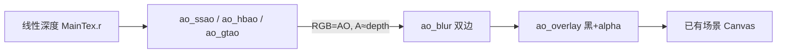

# 环境光遮蔽（Ambient Occlusion）设计

> 状态：屏幕空间 SSAO / HBAO / GTAO + 双边模糊 + 暗化叠加已落地。  
> API：`eve.Graphics().newAmbientOcclusion()` → `AmbientOcclusion`

关联：[`模块设计.md`](./模块设计.md) §4 graphics、[`3D渲染管线.md`](./3D渲染管线.md)、现有 `Volumetric` / `Canvas` / `Shader`。

## 1. 目标观感

接触缝、墙角、物体接缝处的柔和环境阴影，不依赖额外灯光：

| 模式 | 技术 | 适用 |
|------|------|------|
| `ssao` | Crytek/Mittring 半球采样 SSAO | 通用、便宜 |
| `hbao` | NVIDIA Horizon-Based AO | 更稳的水平线积分 |
| `gtao` | Jimenez / Frostbite 风格 Ground-Truth AO（简化） | 更接近余弦加权可见性 |

输入为线性深度纹理（R 通道，与 `Volumetric::newLinearDepthTexture` 相同约定）。法线由深度差分重建，因此不依赖 GBuffer。

3D 默认路径的 `applyFromGBuffer` 采 GBuffer D32（`.r` = Vulkan NDC z）和世界法线；固定螺旋核 + 软遮挡，不再做逐像素 `hash12` 旋转。前景剪影用厚度衰减，避免把附近物体印到地面上。Canvas 上的 `compute` / `blur` / `overlay` 仍用 8-bit 线性深度。

## 2. 公开技术对照

| 路线 | 代表 | 状态 |
|------|------|------|
| SSAO（随机半球） | Crytek 2007 / Mittring | ✅ |
| HBAO | Bavoil / Sainz (NVIDIA) | ✅ |
| GTAO | Jimenez et al. / Frostbite | ✅ 简化（无时域累积） |
| 双边模糊 | 深度感知平滑 | ✅ AO+depth 打包 |
| 暗化叠加 | `alpha = (1-ao)*intensity` | ✅ 适配 SrcAlpha 混合 |
| 物体空间 / VXAO / RTAO | — | 后续 |

## 3. 架构



单 sampler 限制下，计算 Pass 把 AO 写入 RGB、线性深度写入 A，供模糊做深度权重。

## 4. API

```squirrel
ao <- gfx.newAmbientOcclusion();
ao.setMode("ssao");          // "ssao" | "hbao" | "gtao"
ao.setQuality("medium");     // "low" | "medium" | "high"
ao.setCamera(eye..., target..., up..., fov, aspect, near, far);
ao.setRadius(0.75);
ao.setBias(0.025);
ao.setIntensity(1.0);
ao.setPower(1.5);

depth <- /* 线性深度 Texture，或 ao.newLinearDepthTexture(...) */;
aoCanvas <- gfx.newCanvas(ao.resolutionFor(w), ao.resolutionFor(h));
ao.computeTo(gfx, depth, aoCanvas);

blurred <- gfx.newCanvas(w, h);
ao.blurTo(gfx, aoCanvas.getTexture(), blurred);

// 在已画好的场景上叠加暗化
ao.applyOverlay(gfx, blurred.getTexture());
```

质量档：

| quality | samples / dirs×steps | downscale | 默认 radius |
|---------|----------------------|-----------|-------------|
| low | 8 / 4×4 | 4 | 0.55 |
| medium | 16 / 6×6 | 2 | 0.75 |
| high | 24 / 8×8 | 1 | 1.0 |

## 5. 验证

- `test/AmbientOcclusion.cpp`：模式/质量往返、盒体深度缝隙处 AO 变暗、模糊不炸、overlay 压暗角落
