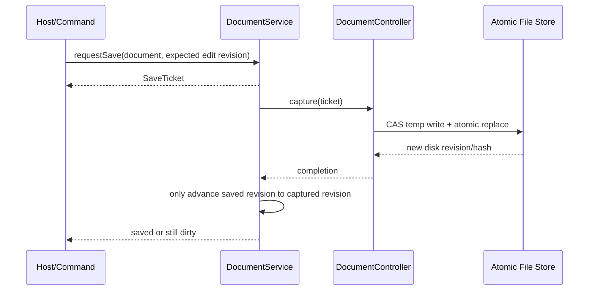

# EVEngine 编辑器具体 API 与组件设计

日期：2026-08-24
状态：可发布设计与实现说明
前置文档：[`游戏内容编辑器组件设计分析`](游戏内容编辑器组件设计分析.md)
目标读者：引擎核心、场景、UI、资源管线、游戏玩法及工具开发者
目标版本：Editor API V2（兼容现有 `src/modules/editor/` 的渐进演进）

## 1. 设计目标

本设计把 EVEngine 编辑能力定义为一套与宿主无关的运行时协议，使以下场景共享同一业务实现：

1. 官方开发编辑器编辑项目场景、Prefab、材质和资产；
2. 模拟经营/沙盒游戏中的玩家建造模式编辑运行世界；
3. 游戏模块向官方编辑器注入项目专用工具和诊断；
4. Squirrel、MCP、CLI 和测试直接执行相同命令；
5. 单机 SaveGame、多人服务器世界和用户创作包使用不同持久化/权威后端。

核心约束：

- Tool、Command、Target、Constraint、Transaction 不依赖 UI 框架；
- UI 只消费 descriptor 和 state，不直接修改业务对象；
- 开发编辑器与玩家 UI 共享语义，不共享像素布局；
- 写操作必须可预检、提交、取消、撤销并返回结构化诊断；
- 跨模块调用遵循 capability，禁止新增向上 `#include`；
- 所有可恢复引用使用稳定 ID，不把裸指针写进历史、文档或异步任务；
- `editing-runtime` 可进入发布包，`authoring` 服务默认不能进入发布包；
- C++ 使用强类型枚举；Squirrel/MCP 边界映射为稳定小写字符串。

## 2. 与现有 API 的关系

现有 API 不删除：

- `IEditorTool` 与 `EditorSession` 继续承担工具生命周期和输入路由；
- `IEditableTarget`、`IGridTarget`、`IIntFieldTarget`、`IScalarFieldTarget` 继续作为目标 capability；
- `IEditCommand`、`EditorTransactions`、`IEditConstraint` 继续支持局部可撤销编辑；
- `IEditorOverlay`、`IEditorInspector` 继续作为简单宿主适配接口；
- `TransformGizmo`、`FieldBrushTool`、Tile/Heightmap target 继续可用。

V2 采用以下增量升级：

| V1 | V2 演进 | 兼容方式 |
|---|---|---|
| `ToolDescriptor` 仅 id/label/shortcut | 增加 category、icon、requirements、visibility | 原字段保留，默认值兼容 |
| `IEditableTarget::query<T>()` 使用 `dynamic_cast` | 增加稳定 `CapabilityId` 查询 | 进程内旧 target 走 fallback adapter |
| `IEditCommand::apply()` 返回 bool | 增加结构化 `EditResult` 适配层 | `LegacyEditCommandAdapter` 转换 |
| `EditorTransactions` 仅内存栈 | 增加 scope、receipt、origin、revision、authority | 旧 session 使用 local authority |
| `IEditConstraint` 返回一段字符串 | 增加 rule id、severity、quick fix、cost | 旧结果映射为 diagnostic |
| `IEditorInspector` 即时修改引用值 | 增加 Property schema/read/write command | 简单 Tool setting 仍可用旧接口 |
| `IEditorHost` 传递 JSON 字符串 | 新增类型化 `IEditingHost` | DevTools JSON host 成为 presenter adapter |

不建议一次性重写现有模块。每一阶段必须保持 `test/editor.cpp` 和现有 Squirrel API 通过。

## 3. 模块与目录

建议新增 `editing-runtime` 和 `authoring` 构建组，不强制新增同名 CMake target。物理代码拆分如下：

```text
src/modules/editor/
  core/
    EditorIds.h
    EditorValue.h
    EditorResult.h
    EditorContext.h
    EditorCommand.h
    EditorTransaction.h
    EditorSelection.h
    EditorProperty.h
    EditorRegistry.h
  runtime/
    EditorSession.*
    EditorAuthority.*
    EditorPersistence.*
    EditorRuntimeProfile.*
  tools/
    EditorTool.h
    TransformGizmo.*
    FieldBrushTool.*
  presentation/
    EditorPresentation.h
    EditorDescriptors.h

src/modules/authoring/
  document/
    DocumentService.*
    DocumentController.h
    AutosaveService.*
  asset/
    AssetDatabase.*
    AssetImporter.*
    ImportCoordinator.*
  command/
    AuthoringCommands.*
  validation/
    ValidationService.*
  build/
    CookService.*

src/modules/editorui/
  DeveloperEditingHost.*
  WorkspaceService.*
  PropertyGrid.*
  ContentBrowser.*
  OutlinerPanel.*
  SceneViewport.*

src/modules/<domain>/editor/
  <Domain>EditorExtension.*
  <Domain>PropertyProvider.*
  <Domain>Tools.*
```

如果暂时不新增 target，可先在 `src/modules/editor/` 内按子目录实现；模块依赖仍按最终边界检查。

建议 manifest 形态：

```cmake
eve_declare_module(NAME editor LAYER 0 SCRIPT Editor SLOT editor
                   GROUP 2d 3d web editing-runtime)
eve_declare_module(NAME authoring LAYER 5
                   DEPS editor filesystem data
                   GROUP authoring)
eve_declare_module(NAME editorui LAYER 6
                   DEPS editor authoring ui window input
                   GROUP authoring)
```

现有 `editor` 位于 L6，需要在实际迁移前用 `scripts/module_depgraph.py` 验证是否能下沉；如果现有可选 `procgen` 适配阻止下沉，应把 Heightmap adapter 移回 `procgen/editor/`，而不是让通用编辑协议依赖高层业务模块。

## 4. 基础类型与命名

### 4.1 稳定 ID

进程内和持久化边界统一使用语义明确的 ID：

```cpp
namespace eve::editor {

using Revision = std::uint64_t;
using Sequence = std::uint64_t;

template<class Tag>
struct StrongId {
    std::string value;
    StrongId() = default;
    explicit StrongId(std::string value) : value(std::move(value)) {}
    bool empty() const noexcept { return value.empty(); }
    auto operator<=>(const StrongId&) const = default;
};

struct StableIdTag;
struct SessionIdTag;
struct TargetIdTag;
struct ObjectIdTag;
struct ComponentIdTag;
struct DocumentIdTag;
struct TransactionIdTag;
struct CommandIdTag;
struct ToolIdTag;
struct RuleIdTag;
struct AssetGuidTag;
struct CapabilityIdTag;
struct PropertyPathTag;

using StableId      = StrongId<StableIdTag>;
using SessionId     = StrongId<SessionIdTag>;
using TargetId      = StrongId<TargetIdTag>;
using ObjectId      = StrongId<ObjectIdTag>;
using ComponentId   = StrongId<ComponentIdTag>;
using DocumentId    = StrongId<DocumentIdTag>;
using TransactionId = StrongId<TransactionIdTag>;
using CommandId     = StrongId<CommandIdTag>;
using ToolId        = StrongId<ToolIdTag>;
using RuleId        = StrongId<RuleIdTag>;
using AssetGuid     = StrongId<AssetGuidTag>;
using CapabilityId  = StrongId<CapabilityIdTag>;
using PropertyPath  = StrongId<PropertyPathTag>;

}
```

第一版可以用 `std::string` 避免引入 UUID 库；生成器输出 128-bit 随机/时间无关 ID 的小写十六进制文本。ID 规则：

- 注册类型 ID 使用反向域或模块前缀：`eve.scene.transform.translate`；
- 实例 GUID 不带路径含义；
- `PropertyPath` 使用稳定字段 ID，不使用本地化显示名；
- Script/MCP 看到字符串；C++ 不允许不同 ID 类型隐式互换；
- ID 比较大小写敏感，输入边界统一规范为小写。

### 4.2 Value

命令 payload、属性和自动化使用同一值类型，禁止内部服务互传任意 JSON 字符串：

```cpp
struct Vec2Value { double x = 0, y = 0; };
struct Vec3Value { double x = 0, y = 0, z = 0; };
struct Vec4Value { double x = 0, y = 0, z = 0, w = 0; };
struct ColorValue { double r = 0, g = 0, b = 0, a = 1; };
struct AssetRefValue { AssetGuid guid; std::string subresource; };
struct ObjectRefValue { TargetId target; ObjectId object; ComponentId component; };

class EditorValue {
public:
    using Array = std::vector<EditorValue>;
    using Object = std::map<std::string, EditorValue>;
    using Storage = std::variant<std::monostate, bool, std::int64_t, double,
                                 std::string, Vec2Value, Vec3Value, Vec4Value,
                                 ColorValue, AssetRefValue, ObjectRefValue,
                                 Array, Object>;
    // type(), get<T>(), tryGet<T>(), equality, deterministic encode/decode
};
```

要求：

- 浮点序列化拒绝 NaN/Infinity；
- Object 使用确定性 key 顺序；
- Asset/Object 引用为独立 variant，不伪装成字符串；
- 大二进制不进入 `EditorValue`，只传 artifact/source handle；
- 数组/对象设深度、数量和字节上限，尤其是网络与 MCP 输入。

### 4.3 结果与诊断

所有跨服务调用返回结构化结果：

```cpp
enum class EditorStatus {
    Applied, Pending, NoOp, Rejected, Conflict,
    NotFound, Unsupported, Cancelled, Failed
};

enum class DiagnosticSeverity { Info, Warning, Error };

struct DiagnosticLocation {
    std::optional<DocumentId> document;
    std::optional<AssetGuid> asset;
    std::optional<ObjectRefValue> object;
    std::optional<PropertyPath> property;
    std::string sourceFile;
    int line = 0;
};

struct EditorDiagnostic {
    RuleId rule;
    DiagnosticSeverity severity = DiagnosticSeverity::Error;
    std::string message;
    DiagnosticLocation location;
    std::optional<CommandId> quickFix;
    EditorValue quickFixPayload;
};

template<class T = std::monostate>
struct EditorResult {
    EditorStatus status = EditorStatus::Failed;
    T value{};
    std::vector<EditorDiagnostic> diagnostics;
    bool accepted() const;
};
```

预期失败不抛异常。参数编程错误可用 `EV_PARAM_CHECK`；磁盘冲突、权限拒绝、预算不足和命令不可用必须返回结果。日志是诊断的副本，不能成为调用方判断成功的唯一方式。

## 5. Host Profile 与功能裁剪

```cpp
enum class HostKind { Developer, RuntimeBuilder, RuntimeAdmin, Automation };

enum class HostFeature : std::uint64_t {
    None              = 0,
    ProjectDocuments  = 1ull << 0,
    SourceAssets      = 1ull << 1,
    RuntimeWorld      = 1ull << 2,
    ArbitraryScript   = 1ull << 3,
    BuildCook         = 1ull << 4,
    SourceControl     = 1ull << 5,
    MultiplayerSubmit= 1ull << 6,
    UserCreations     = 1ull << 7,
    DebugOverride     = 1ull << 8
};

struct HostProfile {
    HostKind kind = HostKind::RuntimeBuilder;
    HostFeature features = HostFeature::RuntimeWorld;
    std::vector<CommandId> commandAllowList;
    std::vector<CapabilityId> capabilityAllowList;
    std::size_t maxUndoBytes = 16 * 1024 * 1024;
    std::size_t maxPayloadBytes = 256 * 1024;
};
```

`HostProfile` 是能力上限，不是唯一权限判断。多人世界仍由 Authority 按玩家、对象和命令复验。

```cpp
class IEditingHost {
public:
    virtual ~IEditingHost() = default;
    virtual const HostProfile& profile() const = 0;
    virtual IEditorInputRouter& input() = 0;
    virtual IEditorPresenter& presenter() = 0;
    virtual ITaskFeedback& tasks() = 0;
    virtual void requestFrame() = 0;
};
```

`IEditingHost` 是实例对象，由 Host factory/应用入口持有，不注册为单例 capability；同一进程可以同时存在开发窗口、游戏预览和 automation host。可通过 capability 注册的是 `IEditingHostFactory`，而不是某个当前窗口。

实现：

- `DeveloperEditingHost`：Dock、菜单、键鼠、多窗口、文档 Tab；
- `RuntimeEditingHost`：游戏 HUD、手柄/触摸、世界空间 overlay；
- `AutomationEditingHost`：无 UI，直接提交命令并收集快照；
- 现有 `IEditorHost`：保留为 JSON View host，由 `DeclarativeHostPresenterAdapter` 接到 `IEditorPresenter`。

发布 Cook 从 manifest 和 `HostProfile` 生成命令/属性白名单。运行时不得只靠 UI 隐藏危险命令；`CommandService` 在执行点再次检查 profile。

## 6. Registry 与扩展生命周期

编辑类型使用集中 registry，注册发生在模块初始化、项目扩展加载或插件启用阶段；帧中不修改注册表。

```cpp
class IEditorRegistry {
public:
    virtual EditorResult<> registerTool(ToolDescriptor, ToolFactory) = 0;
    virtual EditorResult<> registerCommand(CommandDescriptor, CommandHandler) = 0;
    virtual EditorResult<> registerPropertyProvider(PropertyProviderDescriptor,
                                                     PropertyProviderFactory) = 0;
    virtual EditorResult<> registerPanel(PanelDescriptor, PanelFactory) = 0;
    virtual EditorResult<> registerAssetType(AssetTypeDescriptor,
                                              AssetTypeFactory) = 0;
    virtual EditorResult<> registerValidator(ValidationDescriptor,
                                              ValidatorFactory) = 0;
    virtual EditorResult<> registerOverlay(OverlayDescriptor, OverlayFactory) = 0;
    virtual void unregisterOwner(std::string_view ownerModule) = 0;
};
```

Descriptor 通用字段：

```cpp
struct ExtensionDescriptorBase {
    std::string ownerModule;
    std::string displayNameKey;
    std::string descriptionKey;
    std::string iconSemantic;
    int order = 0;
    std::vector<CapabilityId> requiredCapabilities;
    HostFeature requiredHostFeatures = HostFeature::None;
};
```

规则：

- 重复 ID 默认拒绝；测试/热重载可显式 `replaceOwnerVersion`；
- registry 拥有 descriptor 和 factory，不拥有 provider 模块；
- 模块析构前必须 `unregisterOwner`，再销毁实现；
- 由 `module_manifest.cmake` 派生注册入口，不手改中央 boot list；
- 项目扩展只能注册 HostProfile 允许的类型；
- 未知组件文档可保真，但 UI 显示 Missing Provider，不执行未知代码。

## 7. EditorSession V2

### 7.1 配置与依赖

```cpp
struct EditorSessionConfig {
    SessionId id;
    HostProfile profile;
    std::string workspace;
    bool restoreSelectionOnUndo = true;
    bool enableLocalUndo = true;
};

struct EditorSessionServices {
    IEditorCommandService* commands = nullptr;
    ISelectionService* selection = nullptr;
    IFocusService* focus = nullptr;
    IEditAuthority* authority = nullptr;
    IEditPersistence* persistence = nullptr;
    IEditorHistory* history = nullptr;
    IValidationService* validation = nullptr;
};

class EditorSession {
public:
    static std::unique_ptr<EditorSession> create(
        EditorSessionConfig, EditorSessionServices);

    EditorResult<> bindTarget(IEditableTarget*);
    EditorResult<> unbindTarget();
    EditorResult<> addTool(IEditorTool*);              // V1 non-owning
    EditorResult<> createTool(const ToolId&);          // V2 factory-owned
    EditorResult<> activateTool(const ToolId&);
    EditorResult<> cancelGesture(CancelReason);
    EditorResult<TransactionReceipt> execute(const CommandRequest&);
    void update(float dt);
    void drawOverlay(IEditorOverlay&);
};
```

依赖要求：

- Session 拥有 factory 创建的 Tool；外部 `addTool` 保持非拥有兼容语义；
- Target、Authority、Persistence、服务均为非拥有，必须比 Session 活得久；
- Session 解绑 Target 前先 cancel gesture 和 rollback preview；
- Host 可以销毁重建，Session 不依赖 Host 窗口生命周期；
- 一个 Target 可被多个只读 Session 观察；写权限由 Authority 决定；
- 默认不允许两个本地写 Session 同时持有同一 Document lease。

### 7.2 Context

```cpp
struct EditorContextSnapshot {
    SessionId session;
    HostKind host;
    TargetId target;
    Revision targetRevision = 0;
    SelectionSnapshot selection;
    FocusSnapshot focus;
    UserIdentity user;
    std::vector<std::string> inputContexts;
};

class EditorContext {
public:
    EditorSession& session() const;
    IEditableTarget* target() const;
    IEditAuthority& authority() const;
    IEditPersistence& persistence() const;
    ISelectionService& selection() const;
    const HostProfile& profile() const;
    EditorContextSnapshot snapshot() const;

    template<class Capability> Capability* targetCapability() const;
    EditorResult<TransactionReceipt> execute(const CommandRequest&) const;
};
```

所有延迟动作保存 `EditorContextSnapshot` 和 expected revision；不得在异步完成或上下文菜单点击时重新读取“当前选择”。

## 8. 输入、手势和工具 API

### 8.1 归一化输入

现有 Pointer/Key 事件扩展为设备无关事件：

```cpp
enum class InputDevice { Mouse, Touch, Pen, Gamepad, XR, Automation };
enum class PointerPhase { Down, Move, Up, Cancel, Hover, Wheel };

struct EditorPointerEvent {
    PointerPhase phase;
    InputDevice device;
    std::uint32_t pointerId;
    std::uint32_t buttonMask;
    Vec2Value screen;
    Vec2Value viewport;
    Vec2Value delta;
    double pressure = 1.0;
    double wheel = 0.0;
    ModifierMask modifiers;
    std::uint64_t timestampUs;
};

struct EditorActionEvent {
    std::string action;       // confirm/cancel/delete/duplicate/nudge...
    double value = 1.0;
    InputDevice device;
};
```

Tool 优先响应语义 action，必要时响应原始 pointer/key。Runtime Host 将手柄和触摸映射为相同 action；不要在 Tool 内判断键码 `W`、鼠标右键或平台。

### 8.2 ToolDescriptor

```cpp
enum class ToolMultiplicity { SingletonPerSession, MultipleInstances };

struct ToolDescriptor : ExtensionDescriptorBase {
    ToolId id;
    std::string category;
    std::string defaultAction;
    ToolMultiplicity multiplicity = ToolMultiplicity::SingletonPerSession;
    std::vector<CapabilityId> targetRequirements;
    PropertySchema settings;
    bool supportsContinuousGesture = false;
    bool supportsPlanningMode = false;
};
```

### 8.3 IEditorToolV2

```cpp
class IEditorToolV2 : public IEditorTool {
public:
    virtual ~IEditorToolV2() = default;
    virtual ToolResponse actionEvent(EditorContext&,
                                     const EditorActionEvent&) {
        return ToolResponse::ignored();
    }
    virtual PropertyObjectRef settingsObject() { return {}; }
    virtual EditorResult<> cancelV2(EditorContext& context,
                                    CancelReason reason) {
        (void)reason;
        cancel(context); // 调用 V1 virtual
        return {EditorStatus::Applied};
    }
};
```

`ToolDescriptor` 直接以向后兼容的默认字段扩展；V1 `IEditorTool` 的 activate/deactivate/pointerEvent/update/drawOverlay/inspect/cancel 保持不变。Session 对 `IEditorToolV2` 做可选查询以获得语义 action、声明式 settings 和结构化 cancel；旧工具自动使用 V1 路径。V2 工具手势状态机固定为：

```text
Inactive -> Ready -> Previewing -> Committing -> Ready
                       |              |
                       +-> Cancelling +-> Failed/Conflict -> Ready
```

Tool 只保存临时输入状态和 preview handle，不保存跨文档业务权威。工具切换、Target 解绑、窗口失焦、权限撤销、Play 状态切换都必须触发 cancel。

## 9. Target 与 Capability

### 9.1 IEditableTargetV2

```cpp
struct TargetDescriptor {
    TargetId id;
    std::string type;
    Revision revision = 0;
    bool readOnly = false;
    std::vector<CapabilityId> capabilities;
};

class IEditableTargetV2 : public virtual IEditableTarget {
public:
    virtual ~IEditableTargetV2() = default;
    virtual TargetDescriptor describe() const = 0;
    virtual void* queryCapability(const CapabilityId&) = 0;
    virtual EditorResult<PreviewHandle> preview(const DomainOperation&) = 0;
    virtual EditorResult<> updatePreview(PreviewHandle,
                                          const DomainOperation&) = 0;
    virtual EditorResult<> cancelPreview(PreviewHandle) = 0;
    virtual EditorResult<TargetSnapshot> snapshot(const SnapshotQuery&) const = 0;

    template<class Capability>
    Capability* query() {
        return static_cast<Capability*>(
            queryCapability(Capability::editorCapabilityId()));
    }
};
```

现有 `IEditableTarget` 的 `targetId/revision/dirtyRegion/query<T>()` 不修改。Session 先查询 `IEditableTargetV2`；旧 target 由 `LegacyEditableTargetAdapter` 补充 describe/preview/snapshot。迁移期 capability 查询先尝试稳定 ID，再 fallback 到现有 `dynamic_cast`。跨 DLL/插件边界最终只用显式 capability ID，避免依赖 RTTI ABI。

### 9.2 标准 capability

```text
eve.editor.target.grid
eve.editor.target.int-field
eve.editor.target.scalar-field
eve.editor.target.scene-hierarchy
eve.editor.target.transform
eve.editor.target.component-set
eve.editor.target.property
eve.editor.target.spline-network
eve.editor.target.asset-reference
eve.editor.target.graph
eve.editor.target.timeline
```

场景示例：

```cpp
class ITransformEditTarget {
public:
    static CapabilityId editorCapabilityId();
    virtual EditorResult<TransformValue> readTransform(ObjectId) const = 0;
    virtual EditorResult<DomainOperation> makeSetTransform(
        ObjectId, TransformValue, TransformSpace) const = 0;
    virtual EditorResult<BoundsValue> worldBounds(ObjectId) const = 0;
};

class ISceneHierarchyEditTarget {
public:
    static CapabilityId editorCapabilityId();
    virtual EditorResult<SceneObjectSnapshot> get(ObjectId) const = 0;
    virtual PagedResult<SceneObjectSummary> children(
        ObjectId parent, PageRequest) const = 0;
    virtual EditorResult<DomainOperation> makeCreate(const CreateObjectRequest&) = 0;
    virtual EditorResult<DomainOperation> makeDelete(std::span<const ObjectId>) = 0;
    virtual EditorResult<DomainOperation> makeReparent(const ReparentRequest&) = 0;
};
```

读取返回值快照；不能返回内部 vector 引用或 SceneNode 裸指针。Scene module 使用现有 host name + node ID 的稳定思想实现 ObjectId adapter。

## 10. DomainOperation、Command 与 Handler

需要区分两种“命令”：

- **Editor Command**：用户意图入口，例如 `scene.place.start`、`edit.undo`；
- **Domain Operation**：可验证、可序列化的业务变化，例如 `scene.object.create.v1`。

一个 Editor Command handler 可以生成一个或多个 Domain Operation，并在一个事务中提交。

```cpp
struct CommandDescriptor : ExtensionDescriptorBase {
    CommandId id;
    std::string category;
    std::string defaultShortcut;
    PropertySchema payloadSchema;
    bool paletteVisible = true;
    bool createsTransaction = true;
    bool automationAllowed = true;
};

struct CommandRequest {
    CommandId id;
    EditorValue payload;
    CommandSource source;
    EditorContextSnapshot context;
    std::optional<Revision> expectedRevision;
    bool dryRun = false;
};

class IEditorCommandHandler {
public:
    virtual EditorResult<CommandPlan> plan(const CommandRequest&) = 0;
    virtual EditorResult<TransactionReceipt> execute(
        const CommandRequest&, const CommandPlan&) = 0;
};
```

`plan()` 必须无持久副作用，返回将影响的对象、文档、成本、权限和诊断。普通 UI 可直接 plan+execute；危险/高成本操作展示确认；MCP dry-run 只返回 plan。

Domain Operation：

```cpp
struct DomainOperation {
    std::string type;         // scene.transform.set.v1
    TargetId target;
    EditorValue payload;
    EditorValue inverse;      // 可选；也可由 target 在 commit 时产生
    std::vector<ObjectRefValue> affectedObjects;
    std::vector<PropertyPath> affectedProperties;
    std::string mergeKey;
};
```

Operation type 必须带 schema 版本。网络/历史/自动保存只传已注册类型；未知类型拒绝执行但可保留在只读诊断中。

## 11. Transaction、Preview 与 Undo

### 11.1 状态模型

```cpp
enum class TransactionState {
    Planning, Previewing, PendingAuthority, Committed,
    Rejected, Conflicted, RolledBack, Failed
};

enum class ActionOrigin { User, Game, Script, Automation, Importer, Network };

struct TransactionSpec {
    TransactionId id;
    std::string label;
    ActionOrigin origin;
    TargetId target;
    Revision baseRevision;
    std::string mergeKey;
    bool restoreSelection = true;
};

struct TransactionReceipt {
    TransactionId id;
    TransactionState state;
    Revision beforeRevision;
    Revision afterRevision;
    std::vector<ObjectRefValue> affectedObjects;
    CostSummary cost;
    std::vector<EditorDiagnostic> diagnostics;
    std::string authorityReceipt;
};
```

### 11.2 服务

```cpp
class ITransactionService {
public:
    virtual EditorResult<TransactionHandle> begin(const TransactionSpec&) = 0;
    virtual EditorResult<PreviewHandle> preview(
        TransactionHandle, const DomainOperation&) = 0;
    virtual EditorResult<> updatePreview(
        TransactionHandle, PreviewHandle, const DomainOperation&) = 0;
    virtual EditorResult<TransactionReceipt> commit(TransactionHandle) = 0;
    virtual EditorResult<> rollback(TransactionHandle, CancelReason) = 0;
    virtual EditorResult<TransactionReceipt> undo(const UndoRequest&) = 0;
    virtual EditorResult<TransactionReceipt> redo(const RedoRequest&) = 0;
};
```

连续拖动：

1. Pointer Down 创建 transaction，并捕获 before；
2. Move 更新同一 preview，不推进正式 revision；
3. Pointer Up 由 Authority preflight/commit，生成一个 receipt；
4. Cancel 恢复 before，不进入 history；
5. 多次数值输入使用 `mergeKey` 在时间窗内合并。

Undo 策略：

- Developer/单机本地：执行 inverse operation；
- 多人服务器：Undo 是一条新的补偿事务，不删除历史；
- 预算命令：inverse 同时退款/恢复资源，Authority 再校验；
- 派生数据刷新不进入用户 Undo，但 receipt 记录 task links；
- 历史只保存稳定 ID/值，不保存 target 指针；
- 超出内存预算时按事务边界淘汰最旧条目，并标记 checkpoint。

现有 `EditorTransactions` 成为 `LocalTransactionBackend`，`IEditCommand` 通过 adapter 包装成 Domain Operation receipt；新功能不得继续扩张旧 bool-only 接口。

## 12. Constraint、Policy 与 Authority

三者职责不同：

- Constraint：几何/数据规则，例如坡度、碰撞、边界、类型兼容；
- Policy：玩法/产品规则，例如解锁、造价、领地、对象数量、用户等级；
- Authority：最终提交者，例如 Document、SaveGame、本地世界或服务器。

```cpp
enum class Decision { Allow, AllowWithWarning, Reject, RequireConfirmation };

struct EditDecision {
    RuleId rule;
    Decision decision = Decision::Allow;
    std::vector<EditorDiagnostic> diagnostics;
    std::optional<DomainOperation> normalizedOperation;
    CostSummary cost;
};

class IEditRule {
public:
    virtual ~IEditRule() = default;
    virtual EditDecision evaluate(
        const EditorContextSnapshot&, const DomainOperation&) const = 0;
};

class IEditAuthority {
public:
    virtual ~IEditAuthority() = default;
    virtual EditorResult<AuthorityPlan> preflight(
        const TransactionSpec&, std::span<const DomainOperation>) = 0;
    virtual EditorResult<TransactionReceipt> commit(
        const AuthorityPlan&) = 0;
    virtual EditorResult<> compensate(const TransactionReceipt&) = 0;
};
```

Rule pipeline 顺序固定：schema -> target capability -> geometry/data constraint -> gameplay policy -> permission -> cost reservation -> authority revision。Normalized Operation 必须显式返回，禁止规则在调用者不知情时原地篡改输入。

标准 Authority：

```text
DocumentAuthority       写 SceneDocument，检查 document revision
LocalWorldAuthority     单机运行世界，内存提交
SaveGameAuthority       运行世界 + SaveGame journal/checkpoint
ServerWorldAuthority    RPC 提交，服务端重跑所有规则
UserCreationAuthority   白名单资产/属性，导出前安全验证
ReadOnlyAuthority       只允许 preview/query
```

## 13. Selection、Focus 与 Clipboard

```cpp
enum class SelectionDomain { Scene, Asset, Graph, Timeline, UI, Custom };

struct SelectionItem {
    SelectionDomain domain;
    TargetId target;
    StableId item;
    std::string type;
};

struct SelectionSnapshot {
    std::string channel;
    std::vector<SelectionItem> items;
    std::optional<SelectionItem> primary;
    Sequence sequence = 0;
};

class ISelectionService {
public:
    virtual SelectionSnapshot snapshot(std::string_view channel) const = 0;
    virtual EditorResult<> replace(std::string_view channel,
                                   std::span<const SelectionItem>,
                                   SelectionReason) = 0;
    virtual EditorResult<> toggle(std::string_view channel,
                                  const SelectionItem&) = 0;
    virtual Subscription subscribe(SelectionCallback) = 0;
};
```

推荐 channel：`global.scene`、`global.assets`、`document.<id>.graph`、`document.<id>.timeline`。Scene View、Outliner 和 Inspector 使用同一 scene channel；材质图内部选择不覆盖场景选择。

Focus snapshot 包含 host、workspace、panel、document、input contexts。Shortcut 从高到低解析：Modal -> TextInput -> Gesture -> Tool -> Document -> Workspace -> Global。

Clipboard 使用带 MIME-like type 的内部 payload：

```text
application/x-eve-scene-objects+json;version=1
application/x-eve-graph-nodes+json;version=1
application/x-eve-properties+json;version=1
text/plain
```

粘贴必须重新生成实例 ID，保留资产 GUID，外部数据经过 schema/大小/权限验证。

## 14. Property 系统

### 14.1 Schema

```cpp
enum class PropertyType {
    Bool, Int, Float, String, Enum, Color,
    Vec2, Vec3, Vec4, Transform, AssetRef, ObjectRef,
    Struct, Array, Map, Action, ReadOnlyText
};

enum class PropertyFlag : std::uint64_t {
    None       = 0,
    ReadOnly   = 1ull << 0,
    Advanced   = 1ull << 1,
    EditorOnly = 1ull << 2,
    Runtime    = 1ull << 3,
    Replicated = 1ull << 4,
    Transient  = 1ull << 5,
    Dangerous  = 1ull << 6,
    MultiEdit  = 1ull << 7
};

struct NumericMetadata {
    std::optional<double> minimum;
    std::optional<double> maximum;
    std::optional<double> step;
    std::string units;
    int precision = 3;
};

struct PropertyDescriptor {
    PropertyPath path;
    std::string displayNameKey;
    std::string descriptionKey;
    std::string category;
    PropertyType type;
    PropertyFlag flags;
    EditorValue defaultValue;
    NumericMetadata numeric;
    std::vector<EnumItemDescriptor> enumItems;
    std::vector<std::string> assetTypeFilters;
    std::string visibleWhen;
    std::string enabledWhen;
    std::string presenterHint;
    std::vector<RuleId> validators;
};

struct PropertySchema {
    std::string typeId;
    std::uint32_t version = 1;
    std::vector<PropertyDescriptor> properties;
};
```

`visibleWhen/enabledWhen` 使用受限表达式，只能读取同一对象的属性和 HostFeature，不能执行脚本。

### 14.2 读写

```cpp
enum class PropertyReadState { Value, Mixed, Missing, Error };

struct PropertyReadResult {
    PropertyReadState state;
    EditorValue value;
    std::vector<EditorDiagnostic> diagnostics;
};

class IPropertyProvider {
public:
    virtual PropertySchema schema(const SelectionSnapshot&) const = 0;
    virtual PropertyReadResult read(const SelectionSnapshot&,
                                    const PropertyPath&) const = 0;
    virtual EditorResult<DomainOperation> makeSet(
        const SelectionSnapshot&, const PropertyPath&,
        const EditorValue&, PropertySetMode) const = 0;
    virtual EditorResult<DomainOperation> makeReset(
        const SelectionSnapshot&, const PropertyPath&) const = 0;
};
```

Presenter 先 read，再通过命令提交 makeSet；不得获得 setter 函数。多选只显示 provider 声明 `MultiEdit` 且 schema 兼容的交集。连续滑杆使用 preview transaction；文本输入在确认或失焦时提交。

开发 Inspector 与游戏属性面板消费相同 schema：

- Developer presenter 展示 Advanced/EditorOnly/debug；
- Runtime presenter 只展示 Runtime 且 profile 允许的字段；
- Agent presenter 导出 JSON Schema 和命令 payload；
- 属性显示名本地化，但 `PropertyPath` 永不本地化。

## 15. Presentation Descriptor 与 UI Adapter

共享的是语义描述，不是 UI widget tree：

```cpp
struct ActionDescriptor {
    CommandId command;
    std::string labelKey;
    std::string iconSemantic;
    std::string group;
    int order = 0;
    std::string confirmationKey;
};

struct PaletteDescriptor {
    StableId id;
    std::string titleKey;
    std::vector<ToolId> tools;
    std::vector<ActionDescriptor> actions;
};

struct PanelDescriptor : ExtensionDescriptorBase {
    StableId panelType;
    std::string defaultRegion;
    bool singleton = true;
    std::vector<std::string> selectionChannels;
};

class IEditorPresenter {
public:
    virtual void presentPalette(const PaletteDescriptor&,
                                const PaletteState&) = 0;
    virtual void presentProperties(const PropertySchema&,
                                   const PropertyState&) = 0;
    virtual void presentDiagnostics(std::span<const EditorDiagnostic>) = 0;
    virtual ConfirmationToken confirm(const ConfirmationDescriptor&) = 0;
};
```

UI adapter：

- `DockPresenter`：Menu/Toolbar/Inspector/Content Browser；
- `GameHudPresenter`：建造 palette、成本栏、确认/取消、手柄焦点；
- `TouchPresenter`：大触点、世界空间 handle；
- `JsonViewPresenter`：映射到现有 `IEditorHost::applyEditor`；
- `AutomationPresenter`：不绘制，只保存状态快照。

Presenter 产生的事件必须回到 CommandService，不得直接调用 Target。

## 16. Overlay、Viewport 与 Gizmo

现有 `IEditorOverlay` 的 line/circle/rectangle/text 保留，扩展语义 primitive：

```cpp
class IEditorOverlayV2 : public IEditorOverlay {
public:
    virtual void polyline(std::span<const OverlayPoint>, const OverlayStyle&) = 0;
    virtual void mesh(const OverlayMeshRef&, const TransformValue&,
                      const OverlayStyle&) = 0;
    virtual void icon(const OverlayPoint&, std::string_view semantic,
                      const OverlayStyle&) = 0;
    virtual void billboard(const OverlayPoint&, const OverlayBillboard&) = 0;
    virtual void heatmap(const OverlayFieldRef&, const OverlayStyle&) = 0;
    virtual void beginPickScope(StableId pickId) = 0;
    virtual void endPickScope() = 0;
};
```

OverlayStyle 增加 depth mode、layer、interaction state、accessibility label。Developer 可显示 debug overlay；Runtime profile 只注册玩家可见 overlay。

Viewport adapter 负责 screen/ray/world/grid 转换：

```cpp
class IEditorViewport {
public:
    virtual ViewportId id() const = 0;
    virtual Ray screenToRay(Vec2Value) const = 0;
    virtual Vec2Value worldToScreen(Vec3Value) const = 0;
    virtual EditorResult<PickResult> pick(const PickRequest&) = 0;
    virtual CameraSnapshot camera() const = 0;
    virtual void frame(const BoundsValue&) = 0;
};
```

Tool 输入采用 viewport coordinates，并按需要查询 `IEditorViewport`。Gizmo 只生成 Transform preview operation；不直接写 SceneNode。开发与游戏可替换 gizmo 美术、手柄大小和输入映射。

## 17. Document 组件

Document 只属于 `authoring`；运行时建造模式使用 Target + Persistence，不要求伪装成项目文档。

### 17.1 身份和状态

```cpp
enum class DocumentKind {
    Scene, Prefab, Material, MaterialFunction, MaterialInstance,
    AnimationClip, AnimationGraph, ParticleGraph, UiDocument,
    Timeline, ProjectSettings, ImportSettings, Generic
};

struct DocumentKey {
    DocumentKind kind;
    AssetGuid asset;
    auto operator<=>(const DocumentKey&) const = default;
};

enum class DocumentState {
    Loading, Ready, Saving, Conflict, Failed, Closed
};

struct DocumentRevision {
    Revision edit = 0;
    Revision saved = 0;
    Revision disk = 0;
    Revision preview = 0;
};

struct DocumentSnapshot {
    DocumentId id;
    DocumentKey key;
    std::string title;
    std::string resourceUri;
    DocumentState state;
    DocumentRevision revision;
    std::vector<StableId> viewIds;
    std::vector<EditorDiagnostic> diagnostics;
    bool dirty() const { return revision.edit != revision.saved; }
};
```

Asset GUID 是文档身份，路径只是位置。Save As 新资产生成新 GUID；重命名/移动不改变 DocumentKey。

### 17.2 Controller 和 Service

```cpp
struct SaveTicket {
    StableId id;
    DocumentId document;
    Revision capturedEditRevision;
    Revision expectedDiskRevision;
    std::string expectedContentHash;
    std::optional<std::string> destinationUri;
};

class IDocumentController {
public:
    virtual ~IDocumentController() = default;
    virtual EditorResult<DocumentContentSnapshot> capture() const = 0;
    virtual EditorResult<TaskHandle> save(const SaveTicket&) = 0;
    virtual EditorResult<> discard() = 0;
    virtual EditorResult<> reload(const DiskState&) = 0;
    virtual EditorResult<> migrate(std::uint32_t fromVersion) = 0;
};

class IDocumentService {
public:
    static constexpr const char* capabilityName = "IDocumentService";
    virtual EditorResult<DocumentSnapshot> open(const DocumentKey&) = 0;
    virtual EditorResult<> attachView(DocumentId, StableId view) = 0;
    virtual EditorResult<> detachView(DocumentId, StableId view) = 0;
    virtual EditorResult<SaveTicket> requestSave(DocumentId,
                                                  SaveRequest) = 0;
    virtual EditorResult<TaskHandle> executeSave(const SaveTicket&) = 0;
    virtual EditorResult<> close(DocumentId, ClosePolicy) = 0;
    virtual std::vector<DocumentSnapshot> documents() const = 0;
    virtual Subscription subscribe(DocumentEventCallback) = 0;
};
```

保存时序：



保存期间继续编辑时，新 edit revision 仍保持 dirty，不能因旧 ticket 成功被误清除。磁盘 content hash/revision 不匹配进入 Conflict，不自动覆盖。

### 17.3 自动保存和崩溃恢复

Autosave 写 `Saved/Autosave/<project>/<document>.draft`，不覆盖正式资产。草稿包含 base disk hash、document schema、edit revision 和内容；启动时仅对比并提示恢复。关闭时统一由 `CloseCoordinator` 收集所有 dirty/conflict/pending 文档，一次性完成 Save/Discard/Cancel，不由各面板弹各自对话框。

## 18. AssetDB 与资产组件

### 18.1 AssetRecord

```cpp
enum class AssetStatus {
    Ready, Scanning, Importing, Stale, MissingSource,
    MissingArtifact, Warning, Error, Deleted
};

struct AssetRecord {
    AssetGuid guid;
    std::string logicalUri;       // content://World/Park.evscene
    std::string typeId;
    std::uint32_t schemaVersion;
    std::string sourceUri;
    std::string sourceHash;
    std::string importerId;
    std::uint32_t importerVersion;
    std::string settingsHash;
    std::vector<ArtifactKey> artifacts;
    std::vector<std::string> tags;
    AssetStatus status;
    std::vector<EditorDiagnostic> diagnostics;
};

enum class DependencyKind { Hard, Soft, EditorOnly, Build, Source };

struct AssetDependency {
    AssetGuid from;
    AssetGuid to;
    DependencyKind kind;
    PropertyPath sourceProperty;
};
```

### 18.2 查询 API

```cpp
struct AssetQuery {
    std::vector<std::string> typeIds;
    std::vector<std::string> pathPrefixes;
    std::vector<std::string> tagsAll;
    std::string text;
    std::optional<AssetStatus> status;
    std::optional<bool> modified;
    AssetSort sort = AssetSort::Name;
};

class IAssetDatabase {
public:
    static constexpr const char* capabilityName = "IAssetDatabase";
    virtual EditorResult<AssetRecord> find(AssetGuid) const = 0;
    virtual EditorResult<AssetRecord> findByUri(std::string_view) const = 0;
    virtual PagedResult<AssetRecord> query(const AssetQuery&,
                                           PageRequest) const = 0;
    virtual PagedResult<AssetDependency> dependencies(
        AssetGuid, DependencyDirection, PageRequest) const = 0;
    virtual EditorResult<DeletePlan> planDelete(
        std::span<const AssetGuid>) const = 0;
    virtual Subscription subscribe(AssetEventCallback) = 0;
};
```

查询线程安全，不加载完整资产。Record 是值快照；分页 token 绑定 index generation，索引变化时返回 Conflict/expired token，由 UI 重新查询。

### 18.3 资产类型与编辑器工厂

```cpp
struct AssetTypeDescriptor : ExtensionDescriptorBase {
    std::string typeId;
    std::vector<std::string> sourceExtensions;
    std::vector<std::string> authoringExtensions;
    std::string iconSemantic;
    bool creatable = false;
    bool runtimeVisible = true;
    HostFeature requiredFeatures;
};

class IAssetTypeProvider {
public:
    virtual AssetTypeDescriptor descriptor() const = 0;
    virtual EditorResult<AssetGuid> create(const CreateAssetRequest&) = 0;
    virtual EditorResult<std::unique_ptr<IDocumentController>> open(
        AssetGuid) = 0;
    virtual IAssetPreviewProvider* previewProvider() = 0;
    virtual IAssetEditorFactory* editorFactory() = 0;
};
```

双击资产流程：AssetDB type ID -> AssetTypeRegistry -> editor factory -> DocumentService open -> Workspace attach view。没有专用 editor 时使用 GenericProperty/Metadata viewer；未知 type 只读显示元数据。

## 19. Import、Artifact 与 Cook API

### 19.1 Importer

```cpp
struct ImporterDescriptor : ExtensionDescriptorBase {
    std::string importerId;
    std::uint32_t version;
    std::vector<std::string> sourceExtensions;
    std::vector<std::string> outputTypes;
    PropertySchema settingsSchema;
    bool supportsHeadless = true;
};

struct ImportRequest {
    std::string sourceUri;
    std::string destinationUri;
    std::optional<AssetGuid> existingAsset;
    EditorValue settings;
    BuildTarget target;
};

struct ImportProduct {
    AssetRecord record;
    std::vector<ArtifactWrite> artifacts;
    std::vector<AssetDependency> dependencies;
    ThumbnailRequest thumbnail;
};

class IAssetImporter {
public:
    virtual const ImporterDescriptor& descriptor() const = 0;
    virtual EditorResult<ImportPlan> plan(const ImportRequest&) = 0;
    virtual EditorResult<ImportProduct> execute(
        const ImportRequest&, IImportContext&) = 0;
};
```

ImportCoordinator 状态机：

```text
Queued -> Inspecting -> Importing -> Validating -> Publishing -> Ready
                     \-> Cancelled/Error (保留上一成功产物)
```

Importer 在 worker thread 生成临时文件，不能直接发布 AssetDB。Coordinator 验证 GUID、依赖和 artifact hash 后原子发布，再在主线程发送 AssetChanged/HotReload。过时任务根据 request generation 丢弃。

### 19.2 Artifact

```cpp
struct ArtifactKey {
    AssetGuid asset;
    std::string kind;
    BuildTarget target;
    std::string contentHash;
    std::string toolchainVersion;
};

class IArtifactStore {
public:
    virtual bool contains(const ArtifactKey&) const = 0;
    virtual EditorResult<ArtifactReader> open(const ArtifactKey&) const = 0;
    virtual EditorResult<> publish(const ArtifactKey&, TempArtifact) = 0;
    virtual EditorResult<> prune(const ArtifactPruneQuery&) = 0;
};
```

Artifact 可删除重建，不是业务权威。Editor preview 和 runtime load 通过 key 读取成功发布产物，绝不读取 importer 的临时输出。

### 19.3 Cook

```cpp
struct CookRequest {
    BuildTarget target;
    std::vector<AssetGuid> roots;
    std::vector<std::string> includeTags;
    std::vector<std::string> excludeTags;
    bool dryRun = false;
    bool incremental = true;
};

struct CookReport {
    std::vector<AssetGuid> closure;
    std::vector<ChunkReport> chunks;
    std::vector<EditorDiagnostic> diagnostics;
    std::uint64_t compressedBytes = 0;
    std::uint64_t uncompressedBytes = 0;
};

class ICookService {
public:
    virtual EditorResult<CookPlan> plan(const CookRequest&) = 0;
    virtual EditorResult<TaskHandle> execute(const CookPlan&) = 0;
    virtual EditorResult<CookReport> report(TaskHandle) const = 0;
};
```

Cook 根必须显式。遍历 Hard/Build 依赖，Soft 依赖按规则，排除 EditorOnly；检查发布 profile 不包含 authoring-only 命令/schema/provider。

## 20. 场景编辑组件

### 20.1 SceneDocument 数据契约

```cpp
struct SceneObjectRecord {
    ObjectId id;
    ObjectId parent;
    std::string name;
    TransformValue localTransform;
    bool visible = true;
    bool editorOnly = false;
    std::vector<std::string> tags;
    std::vector<ComponentRecord> components;
    std::optional<PrefabInstanceRecord> prefab;
};

struct ComponentRecord {
    ComponentId id;
    std::string typeId;
    std::uint32_t schemaVersion;
    EditorValue fields;
    EditorValue unknownFields;
};

struct SceneDocumentData {
    std::uint32_t schemaVersion;
    AssetGuid scene;
    std::vector<SceneObjectRecord> objects; // deterministic object-id order
    EditorValue environment;
    EditorValue editorMetadata;
};
```

运行时 handle/指针、GPU handle、临时 selection 不入文档。组件字段按稳定 field ID 排序；未知字段保真。SceneDocument adapter 发布到预览 Scene host，预览 runtime 的对象 ID 与文档 ObjectId 保持映射。

### 20.2 SceneEditingTarget

```cpp
class SceneEditingTarget final : public IEditableTargetV2,
                                 public ISceneHierarchyEditTarget,
                                 public ITransformEditTarget,
                                 public IComponentEditTarget,
                                 public IPropertyEditTarget {
public:
    static std::unique_ptr<SceneEditingTarget> forDocument(
        DocumentId, IScenePreviewBridge&);
    static std::unique_ptr<SceneEditingTarget> forRuntimeWorld(
        RuntimeWorldId, ISceneRuntimeBridge&);
};
```

两个 factory 产生相同 capability，区别在 authority/persistence：

- forDocument -> DocumentAuthority + SceneDocumentPersistence；
- forRuntimeWorld -> Local/ServerWorldAuthority + SaveGame/Server persistence。

这正是场景 Tool 同构复用的关键。Tool 不能向下转型判断是哪一种 target。

### 20.3 OutlinerDataSource

```cpp
struct OutlinerQuery {
    ObjectId root;
    std::string text;
    std::vector<std::string> typeFilters;
    std::vector<std::string> tags;
    bool includeHidden = true;
};

struct OutlinerRow {
    ObjectId id;
    ObjectId parent;
    std::string name;
    std::string type;
    bool hasChildren;
    bool visible;
    bool locked;
    PrefabState prefabState;
    Revision rowRevision;
};

class IOutlinerDataSource {
public:
    virtual PagedResult<OutlinerRow> rows(const OutlinerQuery&,
                                          PageRequest) const = 0;
    virtual Subscription subscribe(OutlinerDiffCallback) = 0;
};
```

数据源推增量 diff：Insert/Remove/Move/Update/Reset。UI 虚拟化，只为可见行请求数据。重命名、重父级、显示切换均发 Command，不从 row 直接写对象。

### 20.4 标准场景命令

```text
scene.object.create
scene.object.delete
scene.object.duplicate
scene.object.rename
scene.object.reparent
scene.object.set-visible
scene.transform.set
scene.transform.nudge
scene.selection.frame
scene.component.add
scene.component.remove
scene.component.reorder
scene.asset.place
scene.prefab.create
scene.prefab.apply-overrides
scene.prefab.revert-overrides
scene.prefab.unpack
```

命令 payload 例：

```json
{
  "id": "scene.transform.set",
  "payload": {
    "objects": ["obj-7f...", "obj-92..."],
    "space": "world",
    "pivot": "selection-center",
    "transform": {
      "position": [12.0, 0.0, 5.0],
      "rotationEulerDeg": [0.0, 30.0, 0.0],
      "scale": [1.0, 1.0, 1.0]
    }
  },
  "expectedRevision": 104
}
```

JSON 仅表示 Script/MCP 边界；C++ 内部使用强类型 `TransformCommandPayload`。

### 20.5 Place Tool

```cpp
struct PlaceableDescriptor {
    StableId archetype;
    std::string labelKey;
    std::string iconSemantic;
    std::optional<AssetGuid> asset;
    std::vector<CapabilityId> requirements;
    PropertySchema initialProperties;
};

class IPlaceableProvider {
public:
    virtual PagedResult<PlaceableDescriptor> query(
        const PlaceableQuery&, PageRequest) const = 0;
    virtual EditorResult<PlacementPlan> plan(
        const PlaceableDescriptor&, const PlacementProbe&) = 0;
};
```

Place Tool 负责光标、吸附、旋转、连续建造和 preview；Provider 负责 archetype；Constraint 负责碰撞/坡度；Policy 负责造价/解锁；Authority 负责最终创建。开发 Editor 与游戏建造 HUD 只更换 Presenter。

## 21. Prefab API

```cpp
struct PrefabObjectKey {
    AssetGuid prefab;
    ObjectId sourceObject;
};

struct PropertyOverride {
    PrefabObjectKey object;
    ComponentId sourceComponent;
    PropertyPath property;
    EditorValue value;
};

struct PrefabInstanceRecord {
    AssetGuid prefab;
    std::map<ObjectId, ObjectId> sourceToInstance;
    std::vector<PropertyOverride> overrides;
    std::vector<PrefabStructuralOverride> structuralOverrides;
};

class IPrefabService {
public:
    virtual EditorResult<AssetGuid> createFromSelection(
        const SelectionSnapshot&, const CreatePrefabRequest&) = 0;
    virtual EditorResult<PrefabDiff> diffInstance(ObjectId root) const = 0;
    virtual EditorResult<DomainOperation> makeApplyOverrides(
        ObjectId root, std::span<const OverrideId>) = 0;
    virtual EditorResult<DomainOperation> makeRevertOverrides(
        ObjectId root, std::span<const OverrideId>) = 0;
    virtual EditorResult<DomainOperation> makeUnpack(ObjectId root,
                                                     UnpackMode) = 0;
};
```

Prefab 内部稳定 ID 不因实例化改变；实例保存映射。Prefab 资产变化传播时按 source ID 三方合并：old base、new base、instance override。无法迁移的 override 标记 orphan，不能静默丢弃。

玩家蓝图可以复用 Prefab 数据结构，但使用 UserCreationAuthority：只允许白名单 component/type/property，不可包含 EditorOnly、任意脚本或源路径。

## 22. Material 与通用 Graph API

### 22.1 Graph Core

```cpp
struct GraphPinId { StableId node; StableId pin; };

struct GraphNodeRecord {
    StableId id;
    std::string typeId;
    std::uint32_t schemaVersion;
    Vec2Value position;
    EditorValue properties;
};

struct GraphEdgeRecord {
    StableId id;
    GraphPinId from;
    GraphPinId to;
};

struct GraphDocumentData {
    std::string domain;
    std::uint32_t schemaVersion;
    std::vector<GraphNodeRecord> nodes;
    std::vector<GraphEdgeRecord> edges;
    EditorValue parameters;
};

class IGraphDomainProvider {
public:
    virtual GraphDomainDescriptor descriptor() const = 0;
    virtual PagedResult<GraphNodeTypeDescriptor> nodeTypes(
        const GraphNodeQuery&, PageRequest) const = 0;
    virtual ConnectionDecision canConnect(GraphPinId, GraphPinId) const = 0;
    virtual EditorResult<GraphCompileResult> compile(
        const GraphDocumentData&, const GraphCompileOptions&) = 0;
};
```

通用命令：

```text
graph.node.create / delete / move / set-property
graph.edge.connect / disconnect
graph.selection.duplicate
graph.comment.create
graph.layout.align / distribute
graph.parameter.create / rename / delete / set-default
```

Graph Canvas 只关心节点、pin、连线和选择；业务域 provider 决定节点目录、类型系统和编译。

### 22.2 Material Domain

```cpp
struct MaterialDomainDescriptor {
    std::vector<std::string> shadingModels;
    std::vector<MaterialOutputDescriptor> outputs;
    std::vector<std::string> previewMeshes;
};

struct MaterialCompileResult {
    EditorStatus status;
    Revision documentRevision;
    ArtifactKey shaderArtifact;
    MaterialStats stats;
    std::vector<EditorDiagnostic> diagnostics;
};

class IMaterialEditorService {
public:
    virtual EditorResult<TaskHandle> compile(
        DocumentId, MaterialCompileOptions) = 0;
    virtual EditorResult<MaterialCompileResult> result(TaskHandle) const = 0;
    virtual EditorResult<> publishPreview(
        DocumentId, Revision, const ArtifactKey&) = 0;
    virtual EditorResult<MaterialInstanceHierarchy> instances(
        AssetGuid material) const = 0;
};
```

编译使用 revision token。若任务完成时文档已更新，artifact 可进入缓存但不能发布为当前 preview。场景只接收最近一次成功编译；失败时保留上一成功材质并显示错误。

Material Instance 使用 parent GUID + parameter overrides；参数 ID 来自 graph parameter stable ID，重命名不破坏实例引用。

## 23. 游戏玩法扩展 API

### 23.1 扩展入口

```cpp
class IGameEditorExtension {
public:
    static constexpr const char* capabilityName = "IGameEditorExtension";
    virtual ~IGameEditorExtension() = default;
    virtual std::string ownerModule() const = 0;
    virtual void registerTypes(IEditorRegistry&) {}
    virtual void registerCommands(IEditorRegistry&) {}
    virtual void registerTools(IEditorRegistry&) {}
    virtual void registerProperties(IEditorRegistry&) {}
    virtual void registerValidation(IEditorRegistry&) {}
    virtual void registerPresentation(IEditorRegistry&) {}
    virtual void configureSession(EditorSessionBuilder&,
                                  const ProjectContext&) {}
};
```

游戏模块构造时 `cap::addListener<IGameEditorExtension>(&extension, priority)`；Editor bootstrap 遍历扩展。发布游戏若使用 runtime builder，也遍历同一扩展，但 registry 根据 HostProfile 过滤 Developer-only descriptor。

### 23.2 Descriptor 可见性

```cpp
enum class ExtensionAudience : std::uint32_t {
    Developer = 1u << 0,
    Player    = 1u << 1,
    Admin     = 1u << 2,
    Automation= 1u << 3
};

struct ExtensionVisibility {
    ExtensionAudience audience;
    std::string predicate; // 受限表达式：feature/unlock/role/platform
};
```

业务扩展可以为同一 Tool 注册多个 PaletteDescriptor：开发版放入 `Level/Ride`，玩家版放入 `Build/Rides`；ToolId 不变。

### 23.3 过山车轨道示例

领域 capability：

```cpp
class ITrackNetworkEditTarget {
public:
    static CapabilityId editorCapabilityId();
    virtual EditorResult<TrackSnapshot> track(StableId track) const = 0;
    virtual EditorResult<PlacementProbe> probeSegment(
        StableId track, const TrackControlPoint&) const = 0;
    virtual EditorResult<DomainOperation> makeAppendSegment(
        StableId track, const TrackSegmentSpec&) const = 0;
    virtual EditorResult<DomainOperation> makeMoveControlPoint(
        StableId point, const TrackControlPoint&) const = 0;
};
```

Tool：

```cpp
class TrackBuildTool final : public IEditorTool {
public:
    ToolResponse pointerEvent(EditorContext&, const EditorPointerEvent&) override;
    ToolResponse actionEvent(EditorContext&, const EditorActionEvent&) override;
    void emitOverlay(EditorContext&, IEditorOverlay&) override;
private:
    std::optional<PreviewHandle> preview_;
    TrackSegmentSpec draft_;
};
```

规则组合：

```text
TrackContinuityConstraint   切线连续、轨距、最小半径
TerrainCollisionConstraint  地形/建筑/其他轨道碰撞
ParkBoundaryPolicy          园区所有权
RideUnlockPolicy            科技和设施解锁
ConstructionCostPolicy      造价计算与资源预留
ServerPermissionPolicy      多人角色权限
```

Developer Host：

```cpp
auto session = makeDeveloperSession(sceneDocumentTarget);
session->addRule(trackContinuity);
session->addRule(terrainCollision);
session->activateTool(ToolId{"park.track.build"});
// Dock presenter 显示精确曲率、G-force 预测、调试线。
```

Runtime Host：

```cpp
auto session = makeRuntimeBuilderSession(serverWorldTarget, playerIdentity);
session->addRule(trackContinuity);
session->addRule(terrainCollision);
session->addRule(parkBoundary);
session->addRule(rideUnlock);
session->addRule(constructionCost);
session->activateTool(ToolId{"park.track.build"});
// Game HUD 显示价格、解锁状态、确认/取消；服务器复验并扣款。
```

两端使用相同 `TrackBuildTool`、target capability 和 Domain Operation。开发版不是一套近似轨道算法，玩家版也不复制 gizmo/preview/undo。

### 23.4 玩法注入官方编辑器

```cpp
class ParkEditorExtension final : public IGameEditorExtension {
public:
    void registerTools(IEditorRegistry& r) override {
        r.registerTool(trackToolDescriptor(), [] { return makeTrackBuildTool(); });
        r.registerTool(pathToolDescriptor(), [] { return makeGuestPathTool(); });
    }
    void registerPresentation(IEditorRegistry& r) override {
        r.registerPanel(guestHeatmapPanel(), makeGuestHeatmapPanel);
        r.registerOverlay(rideEnvelopeOverlay(), makeRideEnvelopeOverlay);
    }
    void registerValidation(IEditorRegistry& r) override {
        r.registerValidator(rideEntranceValidator(), makeRideEntranceValidator);
    }
};
```

扩展使用正式游戏模拟接口读取 G-force、游客寻路、经济数据；不得复制一份 editor-only 计算。必要时运行系统暴露只读快照 capability。

## 24. Persistence API

```cpp
enum class PersistenceKind {
    ProjectDocument, SaveGame, ServerWorld,
    UserCreation, Transient
};

struct PersistenceKey {
    PersistenceKind kind;
    std::string namespaceId;
    StableId object;
};

class IEditPersistence {
public:
    virtual ~IEditPersistence() = default;
    virtual PersistenceKind kind() const = 0;
    virtual EditorResult<TaskHandle> persist(
        const TransactionReceipt&, const TargetSnapshot&) = 0;
    virtual EditorResult<TargetSnapshot> restore(
        const PersistenceKey&, const RestoreOptions&) = 0;
    virtual EditorResult<MigrationPlan> planMigration(
        const PersistenceKey&, std::uint32_t fromVersion) = 0;
};
```

具体后端：

- `SceneDocumentPersistence`：确定性文本、atomic save、Git 友好；
- `SaveGamePersistence`：checkpoint + journal，按游戏存档策略压缩；
- `ServerWorldPersistence`：服务端 event log + snapshot，receipt 是幂等键；
- `UserCreationPersistence`：白名单 schema、依赖闭包、安全 Cook、签名/版本；
- `TransientPersistence`：教程、规划、不落盘。

Persistence 只接收 committed receipt/snapshot，不参与 preview。Authority commit 成功但异步 persistence 失败时事务仍是 committed，状态进入 `PersistencePending/Error` 并可重试；不得偷偷回滚已经被服务器/玩法接受的世界状态。

## 25. Squirrel API

### 25.1 设计规则

- C++ enum 映射为小写 kebab-case 字符串；
- 返回 table：`{ status, value, diagnostics }`，预期失败不只返回 bool；
- 对象 handle 使用 stable ID + generation，不暴露指针生命周期；
- 回调异常捕获为 diagnostic，事务自动 rollback；
- 脚本工具可以进入 runtime build，但任意 `runScript` 只属于 Developer profile；
- payload 经过 PropertySchema 校验和大小限制。

### 25.2 创建 Session

```squirrel
local editor = eve.Editor();

local session = editor.createSession({
    id = "park-builder",
    profile = "runtime-builder",
    workspace = "park-build",
    undoBytes = 16 * 1024 * 1024
});

session.bindTarget(world.getEditingTarget());
session.setAuthority(world.getServerAuthority());
session.setPersistence(saveGame.getEditPersistence());
session.activateTool("park.track.build");
```

### 25.3 注册脚本工具

```squirrel
editor.registerTool({
    id = "park.scenery.place",
    label = "editor.park.scenery.place",
    category = "park.scenery",
    icon = "place-scenery",
    audiences = ["developer", "player"],
    requires = ["eve.editor.target.scene-hierarchy"],
    settings = {
        rotationStep = { type="float", default=15.0, min=1.0, max=90.0 },
        randomYaw = { type="bool", default=false }
    }
}, function() {
    return ParkSceneryTool();
});
```

### 25.4 执行和 dry-run

```squirrel
local plan = session.plan({
    id = "scene.asset.place",
    expectedRevision = session.targetRevision(),
    payload = {
        asset = "asset-guid",
        position = [10.0, 0.0, 20.0]
    }
});

if (plan.status == "applied" && plan.value.cost.money <= player.money) {
    local result = session.executePlan(plan.value.id);
    if (result.status != "applied") {
        foreach (d in result.diagnostics) print(d.message + "\n");
    }
}
```

### 25.5 Property

```squirrel
local schema = session.properties("global.scene");
local value = session.getProperty("transform.position");
session.setProperty("transform.position", [1.0, 2.0, 3.0], {
    expectedRevision = session.targetRevision(),
    mode = "absolute"
});
```

现有 `newSession/newScriptTool` 继续保留；V2 API 首先在新名字下提供，稳定后再给旧 API 文档添加迁移提示。

### 25.6 当前可运行的 V2 脚本桥（2026-08-24）

当前实现先在兼容的 `newSession()` 上提供共享命令协议，避免在完整 Session Builder 落地前制造第二套执行路径：

```squirrel
local editor = eve.Editor();
local session = editor.newSession();

for (local i = 0; i < session.getCommandCount(); ++i) {
    print(session.getCommandId(i) + "\n");
}

local planned = session.planCommand("park.attraction.place", {
    asset = "asset-guid",
    position = [10.0, 0.0, 20.0],
    options = { snap = true }
});

if (planned.accepted) {
    local receipt = session.executePlan(planned.planId, {});
    print(receipt.transactionState + "\n");
}
```

已实现方法：

- `getCommandCount/getCommandId/getCommandName/getCommandCategory`：按当前 `HostProfile` 过滤发现；
- `planCommand(id, payload)`：Squirrel table/array 与 `EditorValue` 递归映射，来源标记为 `Script`；
- `executePlan(planId, context)`：使用 Session 内保留的不可变 plan + payload，成功后一次性消费；
- `executeCommand(id, payload)`：兼容非 plan 命令，仍经过同一 HostProfile、payload budget 和异常诊断；
- 返回 `{status, accepted, diagnostics, ...}`，事务执行额外返回 transaction id/state/revision/authority receipt。

这里的第二个 `executePlan` 参数暂作为脚本上下文 table 和 VM 句柄载体，后续 Session Builder 完成时合并 expected revision、authority token 和 cancellation 等选项。它不参与业务 mutation。

## 26. MCP/Automation API 映射

MCP 只需要少量通用工具，不按每个 UI 按钮造工具：

```text
eve_editor_capabilities
eve_editor_sessions
eve_editor_snapshot
eve_editor_commands
eve_editor_command_plan
eve_editor_command_execute
eve_editor_undo
eve_editor_redo
eve_editor_properties
eve_editor_property_get
eve_editor_property_set
eve_editor_diagnostics
eve_asset_query
eve_asset_dependencies
eve_document_list
eve_document_save
eve_task_status
```

游戏扩展命令通过 `eve_editor_commands` 的 schema 自动被发现。示例：

```json
{
  "command": "park.track.append-segment",
  "session": "park-authoring",
  "expectedRevision": 812,
  "dryRun": true,
  "payload": {
    "track": "track-main",
    "end": [38.0, 12.0, 50.0],
    "bankDeg": 20.0
  }
}
```

执行返回 plan/receipt、cost、affected objects、diagnostics 和新 revision。Automation origin 在 History 可见并可 Undo。MCP 不调用 `IEditorHost::setEditorValue` 来间接触发业务修改；该 API 只用于测试 presenter。

## 27. 线程、异步与事件

线程规则：

- Registry 修改、Session、Target preview/commit 默认主线程；
- Asset query 可任意线程；
- Import、hash、thumbnail decode、shader compile、Cook 在 worker；
- GPU resource publish 在 graphics 指定线程；
- worker 不持有 Document/Scene 裸指针，只持 stable ID、revision 和不可变快照；
- 异步完成通过 task queue 回主线程，根据 generation/revision 决定发布或丢弃。

统一 Task：

```cpp
enum class TaskState { Queued, Running, Succeeded, Failed, Cancelled };

struct TaskSnapshot {
    TaskHandle id;
    std::string type;
    TaskState state;
    double progress; // 0..1，未知时 optional
    std::string stage;
    std::vector<EditorDiagnostic> diagnostics;
};
```

事件必须有 sequence：

```cpp
struct EditorEvent {
    Sequence sequence;
    std::string type;
    StableId subject;
    Revision revision;
    EditorValue payload;
};
```

Subscriber 检测 sequence gap 后请求 snapshot，不猜漏掉的 diff。UI 订阅使用 RAII `Subscription`，Panel 销毁自动退订。

## 28. 生命周期与所有权

推荐启动顺序：

```text
Capability registry
-> editor core registries
-> runtime/domain modules
-> game editor extensions
-> authoring services (developer only)
-> host/presenters
-> sessions/workspaces
```

关闭顺序反向：

```text
block new commands
-> cancel gestures/previews
-> resolve pending authority/tasks
-> coordinate dirty documents
-> destroy sessions/panels
-> unregister extensions/providers
-> destroy domain modules
```

所有权表：

| 对象 | 拥有者 | 引用方式 |
|---|---|---|
| Descriptor/Factory | Registry | 值/可调用对象 |
| Factory 创建的 Tool | Session | `unique_ptr` |
| V1 外部 Tool | 调用方 | Session 非拥有指针 |
| Target | Document/World adapter owner | Session 非拥有 + stable TargetId |
| DocumentController | DocumentService | `unique_ptr` |
| Panel | WorkspaceService | `unique_ptr` |
| Task | TaskService | TaskHandle |
| History entries | HistoryService | 值快照/operation bytes |
| Capability provider | 业务模块 | `cap::provide/addListener` 非拥有 |

Capability provider 必须在模块销毁前 revoke/removeListener。Session 不跨模块卸载继续调用 provider；扩展卸载事件先取消相应 Tool 并关闭/降级 Panel。

## 29. 安全与发布边界

Runtime builder 的威胁模型包括恶意客户端、修改后的 UI、超大 payload、非法资产 GUID、递归 Prefab/图、越界数值和未授权命令。必须在服务层保证：

- HostProfile allowlist 在 CommandService 执行点检查；
- Server Authority 重新验证 schema、revision、权限、Constraint、Policy 和 cost；
- 客户端 preview 不作为权威；
- 运行时 Property schema 排除 EditorOnly/Dangerous/任意脚本字段；
- UserCreation 只引用 Cook manifest 白名单资产；
- 数组、图节点、对象数、文本、深度、操作频率均限额；
- Operation type 和版本必须注册；
- receipt/request ID 幂等，重放不重复扣款/创建；
- 路径使用逻辑 URI，禁止 `..`、绝对路径和任意文件协议；
- 游戏脚本扩展受发布 manifest 约束，不提供 developer `runScript`。

开发编辑器可拥有更高权限，但外部文件变化和保存仍使用 CAS，不因“本机”而忽略冲突。

## 30. 错误处理与可观测性

每个命令/事务/任务生成 trace context：session ID、command ID、transaction ID、target ID、base/new revision、origin、duration。默认日志只记录摘要，不记录可能敏感的完整文档/payload。

Metrics（开发构建）：

```text
editor.command.count/duration/failure
editor.transaction.preview_ms/commit_ms/rollback_count
editor.history.bytes/entries
editor.asset.query_ms/result_count
editor.import.duration/cache_hit
editor.document.save_ms/conflict_count
editor.graph.compile_ms/stale_result_count
editor.runtime.authority_rtt_ms/rejection_count
```

History Panel 展示 receipt 摘要；Diagnostics Panel 按 rule/severity/document/task 聚合。Quick Fix 仍是普通 Command，受 profile 与 authority 检查。

## 31. C++ 注册示例

```cpp
namespace eve::park {

class ParkEditorExtension final : public editor::IGameEditorExtension {
public:
    std::string ownerModule() const override { return "park"; }

    void registerCommands(editor::IEditorRegistry& registry) override {
        registry.registerCommand(
            makeAppendTrackCommandDescriptor(),
            [](const editor::CommandRequest& request) {
                return planAndExecuteAppendTrack(request);
            });
    }

    void registerTools(editor::IEditorRegistry& registry) override {
        registry.registerTool(
            makeTrackBuildToolDescriptor(),
            [] { return std::make_unique<TrackBuildTool>(); });
    }

    void registerValidation(editor::IEditorRegistry& registry) override {
        registry.registerValidator(
            makeRideConnectivityDescriptor(),
            [] { return std::make_unique<RideConnectivityValidator>(); });
    }
};

ParkEditorExtension g_editorExtension;

void ParkModule::registerCapabilities() {
    eve::cap::addListener<editor::IGameEditorExtension>(&g_editorExtension);
}

void ParkModule::unregisterCapabilities() {
    eve::cap::removeListener<editor::IGameEditorExtension>(&g_editorExtension);
}

}
```

公开 C++ API 按仓库规范添加完整 Doxygen `@brief/@param/@return`。新 provider 不通过 include 访问 editorui；它只依赖 editor protocol。

## 32. ABI 与版本策略

第一阶段所有模块同仓库同工具链构建，可使用 STL 类型。为未来二进制插件预留：

- capabilityName、CommandId、ToolId、type ID 永久稳定；
- descriptor 带 `apiVersion` 和 `structSize`；
- Domain Operation type 带 schema version；
- 文档/SaveGame 必须有 migration；
- 插件边界最终提供 C ABI 或 Pimpl span/view，不能承诺当前 STL virtual ABI 稳定；
- 已发布 Squirrel/MCP 字符串 ID 视为兼容 API，重命名需 alias 和弃用期。

```cpp
struct ApiHeader {
    std::uint32_t apiVersion = 2;
    std::uint32_t structSize = sizeof(ApiHeader);
};
```

V2 不承诺让旧二进制插件直接加载；目标是源代码兼容和数据/命令 ID 兼容。

## 33. 测试契约

### 33.1 Core

- 不同强类型 ID 不可隐式互换；
- EditorValue 确定性 round-trip、深度/大小限制；
- Command payload schema 拒绝未知/非法字段；
- context snapshot 在选择变化后仍指向原目标；
- duplicate registry ID 被拒绝，owner unload 完整移除；
- HostProfile 隐藏和执行层都拒绝 authoring-only 命令。

### 33.2 Transaction

- preview update 不推进正式 revision；
- cancel 完整恢复 before 且不进入 History；
- commit 只生成一个 receipt；
- stale expected revision 返回 Conflict；
- continuous edit 正确 merge；
- compound operation 中途失败完整 rollback；
- server undo 产生补偿事务且不会重复退款。

### 33.3 Document/Asset

- 保存期间继续编辑仍 dirty；
- 外部同内容 timestamp 变化不产生冲突；
- 外部不同内容 + 本地 dirty 进入 Conflict；
- atomic save 失败保留旧文件；
- GUID 在 move/rename 后保持；
- duplicate GUID 被诊断；
- import 失败保留上一 artifact；
- stale worker result 不覆盖新 generation；
- asset delete plan 列出全部 referencer。

### 33.4 同构测试

同一 fixture 运行两次：

```cpp
runToolContract(DeveloperHostFixture{}, SceneDocumentTargetFixture{});
runToolContract(RuntimeHostFixture{}, RuntimeWorldTargetFixture{});
```

断言：

- 相同输入生成相同 Domain Operation type/payload；
- Presenter 不影响业务差异；
- Document/SaveGame persistence 恢复后目标语义等价；
- Developer-only rule 缺失不改变核心几何规则；
- Runtime gameplay Policy 能增加 cost/permission 而不修改 Tool；
- Game extension 在不链接 editorui 的情况下注册；
- Server Authority 拒绝伪造客户端已通过结果。

### 33.5 性能门

- 100k AssetRecord 分页/过滤；
- 50k Outliner row 的增量 diff 和虚拟列表；
- 60 Hz preview 下无历史膨胀；
- 10k 节点图局部编辑不全量复制；
- 大场景 snapshot 分页/区域化；
- runtime command payload/authority rate limit。

## 34. 实施切片

### Slice A：核心值类型与命令（不改 UI）

新增 ID、EditorValue、EditorResult、CommandDescriptor/Registry、ContextSnapshot。用 adapter 包住现有 `IEditCommand`。验收：旧 editor 测试不变，新命令可 headless 调用。

### Slice B：Session/Transaction/Authority

扩展 EditorSession 依赖注入；实现 LocalWorldAuthority、LocalTransactionBackend、receipt/history。验收：FieldBrushTool 在旧 bool API 与新 receipt API 都能 Undo。

### Slice C：Property 与双 Presenter

实现 PropertySchema/Provider、Developer 简单 Inspector presenter、Runtime HUD fixture presenter。验收：同一 Transform property 在两套 UI 通过相同命令修改。

### Slice D：SceneTarget 双后端

实现 SceneDocumentTarget 与 RuntimeWorldTarget，均暴露 hierarchy/transform/property capability。验收：Place/Transform Tool 同构 fixture。

### Slice E：Document/AssetDB

实现 DocumentService、atomic save、Asset GUID/index/query/dependency、Content Browser 数据源。验收：导入 -> 放置 -> 保存 -> 重开闭环。

### Slice F：游戏扩展

选一个仓库示例（建议 building/road/tile 或新增最小 park-builder fixture）注册 Tool、Policy、Overlay 和 Panel。验收：官方开发 Editor 和游戏内 HUD 使用同一 Tool。

### Slice G：Graph/Material

实现 Graph Core、Material domain、revision-aware compile/publish。验收：编译失败保留上一材质，成功结果热更新预览。

### 34.1 当前实现状态（2026-08-24）

- Slice A：强类型 ID、`EditorValue/EditorResult`、`HostProfile`、命令注册/过滤/执行和旧事务适配已完成；
- Slice B：plan/dry-run、Local/ReadOnly Authority、可逆 Domain Operation、Transaction receipt、Undo/Redo 已完成；
- Slice C：Property Schema/Provider、Developer/Runtime Presenter、共享 Property Edit Intent 已完成；
- Slice D：`SceneDocumentTarget` 与 `RuntimeWorldTarget`、Hierarchy/Transform capability、共享 Place/Transform Tool Logic 已完成；
- Slice E：内存 AssetDB、磁盘 `.evmeta` GUID sidecar 扫描/轮询、导入协调、依赖查询、真实磁盘 atomic save、双 revision/content-hash 冲突检测、autosave/recovery 和导入到重开闭环已完成；
- Slice F：游戏扩展注册表、audience/profile 过滤、工具/面板/规则注入、owner-scoped unload 和异常回滚已完成；
- Slice G：领域无关 Graph Core、Material 类型连接/确定性编译、可取消后台任务队列、revision-aware preview publish 已完成；
- Squirrel：共享命令发现、结构化 payload、retain plan、execute plan 和结构化 receipt 已完成。
- MCP：通过 `IEditorAutomation` capability 暴露 commands/plan/commit/execute/cancel/undo/redo/diagnostics；DevTools 不反向依赖 editor 模块；
- Runtime Publish：显式 deny-by-default manifest、运行时 command/tool/palette/rule 裁剪、开发者 feature 拒绝和非 EditorOnly/Source 资产闭包已完成；
- Persistence：SceneDocument 与 SaveGame 通过同一 checkpoint + Domain Operation journal 契约持久化；
- Shared State：presentation-neutral Selection/Focus channel、extension-owned Validation 和统一 Diagnostic channel 已完成。

本轮新增/回归的 `editor.v2` 测试与 MCP 实际调用共 40/40 通过，MCP tools/list 与真实 `eve_editor_execute` TCP 调用也纳入测试，模块依赖图无新增 back-edge。P0/P1 原先明确列出的实现缺口（MCP 映射、真实磁盘 atomic store、后台编译队列/取消、发布清单裁剪、SaveGame 同构持久化、磁盘资产 sidecar/watch、Selection/Focus/Validation/Task/Diagnostic）已补齐。AssetDB 的 URI 唯一索引已由 O(n) 发布检查改为哈希索引，并通过 100k AssetRecord 建库、过滤、分页和 URI 查询契约（本机 Debug 单 case 3.74 秒）。全仓公开头 Doxygen 完整度审计继续作为质量维护项，不再作为 P0/P1 功能阻塞项。

## 35. 首批决策记录

以下决策作为实现默认值，除非出现实证阻碍不再反复讨论：

1. 编辑协议可发布，开发 authoring 服务不可发布；
2. Host、Target、Authority、Persistence 分离；
3. UI 不拥有业务状态；
4. Tool 产生/请求 Domain Operation，不直接持久化；
5. 同一 Tool 可挂开发 Presenter 与游戏 Presenter；
6. 游戏扩展通过 registry/capability 注入官方编辑器；
7. Script/MCP/UI 走同一 CommandService；
8. 稳定 ID + revision 是异步、Undo、网络和持久化基础；
9. Source/Authoring/Artifact 三层资产分离；
10. 当前 V1 API 通过 adapter 渐进迁移，不做破坏式重写。

## 36. 完成定义

Editor API V2 的基础层只有在以下闭环全部成立时才算完成：

1. C++、Squirrel、MCP 均能发现并执行同一注册命令；
2. 命令支持 plan/dry-run、preview、commit、cancel、undo、diagnostic；
3. 同一 Scene Tool 同时操作 SceneDocumentTarget 和 RuntimeWorldTarget；
4. Developer Presenter 与 Game Presenter 不包含业务 setter；
5. 游戏模块无需修改 editor/editorui 即可注入完整专用编辑能力；
6. SaveGame/Server/UserCreation 后端不能访问 authoring-only 能力；
7. Document 保存、外部冲突和异步 revision race 有契约测试；
8. Asset GUID、依赖、导入产物和 Cook 闭环可 headless 验证；
9. 发布包只包含 manifest 明确选择的 runtime editing provider；
10. 所有公开头按 Doxygen 规范记录参数、返回、所有权、线程和生命周期。

这套 API 的最终衡量标准不是“编辑器面板数量”，而是某项编辑能力能否在不复制业务代码的情况下，从开发编辑器自然迁移为玩家玩法，并能把真实游戏系统反向带入项目编辑器。
