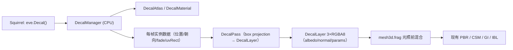

# 贴花渲染模块设计（Decal）

> 状态：设计草案（尚未实施）。日期：2026-08-22
> 目标：在 EVEngine 现有前向 PBR + GBuffer 架构上，提供一套运行时贴花系统，
> 能在任意模型表面制作 **凹坑 / 脏污 / 血渍 / 划痕 / 烧灼 / 发光符文** 等效果，
> 并给美术/策划留一个稳定的 Squirrel API。
>
> 关联：[`3D渲染管线.md`](./3D渲染管线.md)、[`风格化渲染模块设计.md`](./风格化渲染模块设计.md)、
> [`环境光遮蔽模块设计.md`](./环境光遮蔽模块设计.md)、[`模块编排与裁剪架构.md`](./模块编排与裁剪架构.md)。

## 1. 需求拆解：贴花在改什么

贴花本质不是"画一张图"，而是**在已有 PBR 表面参数上做局部覆盖 / 混合**。
先按效果拆出它们分别动了哪些通道，才能决定渲染管线怎么设计：

| 效果 | albedo | normal | roughness | metallic | emissive | height / AO |
|------|--------|--------|-----------|----------|----------|-------------|
| 凹坑 / 弹坑 | 中心变暗 | **凹陷法线**（中心内凹） | 略升高 | — | — | 高度降低 + 边缘 AO |
| 脏污 / 尘土 | 乘色 / 灰度覆盖 | 微扰动 | 升高 | 降低 | — | 边缘 AO |
| 血渍（湿） | 暗红 | — | **降低**（高光湿面） | — | 微弱可选 | — |
| 血渍（干） | 暗红棕 | — | 升高 | — | — | 边缘积色 |
| 划痕 / 刮擦 | 亮线 | 拉长微扰 | 升高 | 保持金属本色 | — | — |
| 焦痕 / 弹孔 | 黑 core + 烧焦环 | 边缘凸起 | 升高 | — | 余烬可选 | — |
| 苔藓 / 锈蚀 | 乘色 | 凹凸起伏 | 升高 | 降低 | — | — |
| 发光符文 | — | — | — | — | **✓** | — |

结论：贴花系统至少需要同时改 **albedo / normal / roughness / metallic / emissive**
五个 PBR 通道（height 与 AO 是加分项）。只做"半透明四边形叠色"的方案只能覆盖脏污和血渍，
做不了凹坑（凹坑本质是改法线）。

## 2. 方案对比与选型

### 2.1 三种路线

| 路线 | 原理 | 优点 | 缺点 |
|------|------|------|------|
| **A. 体积投影贴花**（box projection，读深度重建世界坐标后投影） | 每个贴花一个单位盒，片元着色器从深度缓冲重建世界坐标，变换到贴花局部系后采样贴花图集，写入屏幕空间"表面参数层" | 与模型无关、运行时任意增删、可改法线、可批量 | 屏幕空间，依赖深度/法线缓冲；低模边缘有精度问题；曲面有翘边风险 |
| **B. UV 空间网格贴花**（model-space overlay，把贴花画进模型自己的 overlay 纹理） | 每个模型一张 overlay 图集（albedo/normal/params），在 `mesh3d.frag` 里按模型 UV 混合 | 跟着模型走、无深度问题、LOD 一致、常驻 | 只作用于"拥有 overlay 图层"的模型；任意世界表面（墙/地）做不到；需要为每个模型生成专属图 |
| **C. 几何形变**（位移贴图 / tessellation / compute displacement） | 真改顶点位置 | 阴影与轮廓真实 | 成本高、破坏批处理、LOD/碰撞不同步；仅适合英雄道具 |

### 2.2 调研摘要

实现前对照的常见工程路径：

- **Valve / Frostbite / UE4/5 的 deferred decal**：不透明几何后、光照前，向 G-buffer 投影贴花盒，
  片元从深度重建坐标、反变换到贴花局部空间，按 `dot(surfaceNormal, decalForward)` 剔除背面，
  再用 premultiplied alpha 混合进 albedo / normal / roughness。这是本设计的路线 A 来源。
- **Left 4 Dead 2 的血渍系统**：贴花图集 + 命中点随机朝向 + 数量上限按种类配额，避免场景被血刷屏。
- **War Thunder 的车体贴花**：UV 空间贴花图集（路线 B），常驻、随模型走。
- **视差遮蔽映射（POM）**：引擎 `src/modules/graphics/shaders/parallax_map.glsl` 已实现，
  可把贴花 height 通道当"假凹坑"用（轮廓级遮挡，不改几何）。

### 2.3 推荐组合

**以路线 A 为运行时主系统，路线 B 作为"常驻模型效果"的二期扩展，凹坑用
"法线贴花（默认） + POM 假位移（进阶）"，真几何形变列为未来选项。**

理由：引擎现状是前向 PBR + 可采样 GBuffer（深度 D32 / 法线 / albedo），正好具备路线 A
需要的全部输入（见 §3）；路线 A 一次设计就能覆盖 §1 里除真几何凹坑外的所有效果，
且不破坏现有网格批处理与阴影。

## 3. 与现有管线的挂钩点（代码核对）

当前 3D 帧序（`src/modules/graphics/RenderSystem3D.cpp` `render()` +
`src/modules/graphics/RenderControl.cpp` `compile()`）：

```
shadow → gbuffer → forward（mesh3d PBR / clustered / hair）→ FXAA / AO / 2D / present
```

对本设计有利的既有事实：

1. **GBuffer 已可采样**：`src/modules/graphics/GBuffer.h` 暴露 `hwDepth`（D32，
   `.r` = Vulkan NDC z）与 `normal`（world normal * 0.5 + 0.5）。AO 的
   `shaders/ao_from_depth.frag` 已经示范了 `invViewProj` 重建世界坐标的整套数学。
2. **mesh3d 描述符集已预留深度槽**：`GraphicsPipeline.cpp` `createMesh3DPipeline()`
   的 `mesh3dSetLayout` 有 binding 0..7，其中 **binding 7 已绑定场景深度**
   （`mesh3dSetFor(..., depthTex, ...)`，`Graphics3D.cpp`）；`RenderSystem3D.cpp:878`
   在 forward 前调用 `setMesh3DSceneDepth(hwDepth)`。即每个 mesh3d draw 已经能拿到
   D32 深度，但当前没有 shader 使用它——贴花正好用它。
3. **GBuffer / scene color 资源是懒创建 + 每帧槽双缓冲**：`createGBufferResources`
   （`Graphics3D.cpp`）的模式可以直接复用来建贴花缓冲。
4. **feature 开关机制成熟**：`RenderControl` 的 `kKnownFeatures` + `setFeature` 联动
   （如 `ao` → 强制 `gbuffer`），加一个 `"decal"` feature 即可。
5. **双后端**：`IGraphics3D` 由 Vulkan 与 WebGPU 共同实现；两端均实现原生
   GBuffer 贴花通道；新增后端也必须通过
   `supportsDecal()` 明确声明能力，不能静默忽略贴花绘制。

## 4. 总体架构



### 4.1 新模块

`cmake/module_manifest.cmake` 增加一行（按现有格式，不改任何手写 EVELIBS 列表）：

```cmake
eve_declare_module(NAME decal LAYER 4 SCRIPT Decal SLOT decal
                   DEPS graphics
                   GROUP 3d)
```

模块内部文件：

| 文件 | 职责 |
|------|------|
| `src/modules/decal/DecalManager.h/.cpp` | 贴花列表、生命周期、剔除、批数据生成 |
| `src/modules/decal/DecalMaterial.h/.cpp` | 贴花材质（图集引用 + 混合模式 + 通道强度） |
| `src/modules/decal/DecalAtlas.h/.cpp` | 图集打包 / uvRect 解析 |
| `src/modules/decal/shaders/decal_box.vert/.frag` | 投影贴花 shader |
| `src/modules/decal/Decal.cpp` | Squirrel 绑定（`Decal` class） |
| `test/decal.cpp` | 单元 / 冒烟测试 |

跨模块约束（遵守 `模块编排与裁剪架构.md`）：

- `decal` 只向下依赖 `graphics`；**不依赖 scene / physics**。命中点与法线由上层
  （脚本组合 scene 的 `pickScreenAt` / `pickRayAt`，或未来 physics 3D）传入。
- 供 editor/devtools 等上层模块使用的能力接口放 `src/engine/common/DecalQuery.h`
  （`IDecalQuery`：spawn / list / clear / setLimit），由 decal 模块
  `eve::cap::provide` 注册——与 `IPhysicsQuery` / `ISceneQuery` 同一模式，
  需要时再补，不是 P0 必须。

### 4.2 Pass 编排

`RenderControl`：

- `kKnownFeatures` 增加 `"decal"`；
- `setFeature("decal", true)` 时强制 `gbuffer`（贴花需要 hwDepth + normal）；
- `compile()` 顺序：`shadow → gbuffer → decal → forward → hair`。

### 4.3 DecalLayer 资源

在 `Graphics` 后端加一组懒创建、每帧槽双缓冲（`kAsyncResourceCopies`）的屏幕缓冲，
照抄 `createGBufferResources` 的建图 / 采样 / 布局切换模式：

| 纹理 | 格式 | 内容 |
|------|------|------|
| `decalAlbedo` | RGBA8 | RGB = albedo 值，A = coverage（alpha-over 合成） |
| `decalNormal` | RGBA8 | RGB = world normal * 0.5 + 0.5，A = coverage |
| `decalParams` | RGBA8 | R = roughness，G = metallic，B = emissive，A = height / 边缘 AO |

1x 分辨率（同 GBuffer，MSAA 只作用于 scene color，不影响本层）。feature 关时
mesh3d 绑定 1×1 占位纹理（白 a=0 / flat normal），保证 descriptor 布局统一。

### 4.4 DecalPass 片元逻辑（路线 A 核心）

每个贴花画一个单位立方体（`model = T(position) * R(Z→normal, 随机yaw) * S(size, size, depth)`），
render pass 无深度附件（不写深度），fragment 里：

1. `uv = gl_FragCoord.xy * texelSize`；
2. 采样 `hwDepth.r`（D32，NDC z）→ `ndcToViewZ` → `invViewProj` 重建 `worldPos`
   （数学与 `ao_from_depth.frag` 完全一致）；
3. `local = invDecal * worldPos`，任一 |local| > 0.5 则 discard（含 z 厚度裁剪，
   这是贴花不会"穿透到墙后"的关键）；
4. 采样 GBuffer normal，`dot(surfaceN, decalForward) < 0.1` 则 discard（背面剔除）；
5. `atlasUV = local.xy + 0.5`，采样贴花图集（albedo / normal / params）+ 可选掩膜；
6. `coverage = atlasAlpha × fade × edgeFalloff`，以 alpha-over
   （`setAlphaBlending(3)`，SrcAlpha / OneMinusSrcAlpha）写入 3 个 RT
   （非预乘：RGB 存目标值，A 存 coverage；重叠贴花按 over 合成）。

### 4.5 mesh3d 前向集成（改动点）

- `mesh3dSetLayout` 增加 binding 8/9/10（decalAlbedo / decalNormal / decalParams）；
  `mesh3dSetFor` 增加 3 个纹理参数（`Mesh3dSetKey` 同步扩）。
- **默认 PBR 与 clustered 变体同一 PR 改完**（layout 不能分裂，见 AGENTS.md 协作约定）；
  hair / toon 一期只绑占位纹理、不采样，行为不变。
- `mesh3d.frag` 在 `N` 计算完之后、光照循环之前插入贴花混合（这是关键位置：
  法线改了，CSM / GI / IBL / 所有灯的光照会一起响应）：

```glsl
// 伪代码：mesh3d.frag main() 内，applyNormalMap 之后、shadeLight 循环之前
vec2 sUV = gl_FragCoord.xy * decalTexel;          // 由 textureSize 求
vec4 dA = texture(decalAlbedoSampler, sUV);
float cov = clamp(dA.a, 0.0, 1.0);
if (cov > 0.001) {
    albedo    = mix(albedo, dA.rgb, cov);                    // over
    vec4 dN   = texture(decalNormalSampler, sUV);
    N         = normalize(mix(N, dN.xyz * 2.0 - 1.0, clamp(dN.a, 0.0, 1.0)));
    vec4 dp   = texture(decalParamsSampler, sUV);
    roughness = mix(roughness, dp.r, cov);                   // 强度已阻尼进目标值
    metallic  = mix(metallic,  dp.g, cov);
    emissive += dA.rgb * dp.b;                               // 颜色 × 发光强度
}
```

约束与已知边界：

- **贴花不产生自己的阴影**：阴影 / AO / 体积光继续用网格本身（这是特性，不是缺陷；
  假凹坑的法线变化已足够让 CSM 看到细节，但 `normalStrength` 建议默认 ≤ 0.6，
  并沿用现有 slope bias，避免法线突变引发 acne）。
- **混合模式一期实现 `over`**：`multiply / screen / add` 在 API 层接受，GPU 端
  统一 alpha-over；`add` 效果通过 emissive 通道表达（贴花颜色 × 强度，光照后叠加）。
- **实例化批**：贴花按（图集纹理 + 混合模式）分组，每组一次 instanced draw，
  每实例 112B SSBO（model / uvRect / 通道强度 / 混合模式），上限 512/帧。
- **hair / 半透明网格不接收贴花**（在另一 pass，一期明确不支持，文档注明）。
- **WebGPU 后端**：使用 WGSL 全屏三角形完成相同的深度重建、盒体裁剪、法线拒绝、
  边缘羽化与前向合成；`supportsDecal() == true`。Vulkan 与 native Dawn 由
  `graphics.backendParity.decalLayerProjection` 做语义和像素产物校验。

## 5. 数据与资源

### 5.1 贴花图集（DecalAtlas）

- 每个贴花类型占图集一个 uvRect（albedo / normal / params 三张同尺寸图，或
  albedo RGBA + normal RG + params 两张压缩打包，P1 再做）。
- 资源描述用 JSON（引擎已有 data/JsonDocument 与资源缓存管线），例如
  `assets/decals/blood_splat.decal.json`：

```json
{
  "atlas": "decals/atlas/blood",
  "uvRect": [0.0, 0.0, 0.5, 0.5],
  "blend": "over",
  "albedoStrength": 1.0,
  "normalStrength": 0.0,
  "roughnessStrength": 1.0,
  "size": 0.5,
  "depth": 0.15,
  "lifetime": 0,
  "mask": "decals/masks/splat"
}
```

加载复用 `image` 模块解码 + `gfx.newTextureFromImageData` / `newTextureFromFile`
（`src/modules/graphics/Graphics.cpp` 已有脚本入口），P0 可以先不建 JSON，
由 DecalMaterial 代码构造默认值，JSON 解析放 P1。

### 5.2 DecalMaterial 字段

```cpp
class DecalMaterial {
    Texture *albedo = nullptr;   // 图集纹理（可空 → 纯参数贴花，如只改粗糙度）
    Texture *normal = nullptr;
    Texture *params = nullptr;
    Texture *mask   = nullptr;   // 可选掩膜，控制图集内覆盖形状
    std::string blend = "over";  // over | multiply | screen | add | alpha
    float albedoStrength = 1.f, normalStrength = 0.f;
    float roughStrength = 0.f, metalStrength = 0.f, emissiveStrength = 0.f;
    float heightStrength = 0.f;  // P2 POM 假凹坑用
    float size = 0.5f, depth = 0.15f;
    float lifetime = 0.f;        // 0 = 常驻
    float fadeIn = 0.f, fadeOut = 0.f;
};
```

## 6. 放置、生命周期与配额

### 6.1 放置

- 推荐入口是脚本组合：`scene.pickScreenAt(...)` / `pickRayAt` 得到命中点与法线，
  再调 `decal.project(...)`。decal 模块自身不解析命中。
- 朝向：局部 Z 轴贴合法线，绕 Z 随机 yaw（`randomYaw` + `seed`，同一 seed 结果稳定）。
- 防 z-fighting：贴花盒中心沿法线抬 0.005～0.01，投影深度默认 0.15（曲面 / 墙角
  建议 0.1 以下，配合边缘羽化）。

### 6.2 生命周期

- 出生 → 淡入 → 常驻 → 淡出 → 回收；`lifetime == 0` 表示常驻（血渍默认常驻，
  由数量配额回收）。
- fade 参数每帧由 CPU 更新进实例 buffer（不重建描述符）；淡出结束时从列表移除。

### 6.3 配额（L4D2 式防刷屏）

- 全局 `maxDecals`（默认 256，可配）；超出时按"最旧 / 最远"淘汰。
- 按种类配额：如 `decal.setLimit("blood", 64)`——血渍打多了先清最旧血渍，
  不挤掉弹孔。

## 7. Squirrel API（稳定扩展面）

```squirrel
decal <- eve.Decal();   // DecalManager 单例（SLOT decal）

id <- decal.project(x, y, z, nx, ny, nz, "decal/blood_splat", {
  size = 0.5, depth = 0.15,
  randomYaw = true, seed = 12345,
  blend = "over",
  albedoStrength = 1.0, normalStrength = 0.0,
  roughnessStrength = 1.0, emissiveStrength = 0.0,
  fadeIn = 0.1, lifetime = 0, fadeOut = 0.5,   // lifetime 0 = 常驻
  mask = "decals/masks/splat"
});

// 屏幕拾取放置（脚本层组合，不需要 decal 依赖 scene）
hit <- scene.pickScreenAt(host, cam, sx, sy, w, h);
decal.project(hit.x, hit.y, hit.z, hit.nx, hit.ny, hit.nz, "decal/bullet_hole", {...});

decal.remove(id);
decal.clearAll();
decal.setLimit("blood", 64);
decal.setEnabled(gfx, true);        // 对应 feature "decal"
decal.count();                      // 当前存活数
```

命名/参数风格对齐现有模块（`eve.Stylize()`、`setFloat("name", v)` 的命名旋钮模式）。

## 8. 效果配方（实现时要落进 shader / 资源的内容）

### 8.1 凹坑 / 弹坑（用户重点）

- **默认：法线贴花**。贴图做成"中心内凹 + 外圈微凸"的凹陷法线，加一张暗色
  albedo 核 + 边缘 AO（params.a）。视觉上高光与阴影会自然给出凹陷感。
- **进阶：POM 假位移**（P2）。复用 `parallax_map.glsl` 的思路：decalParams.a 存高度，
  在 `mesh3d.frag` 里对 base albedo/normal 的采样 UV 做视差偏移，得到轮廓级遮挡。
  注意 POM 是每像素步进，贴花区域内才启用，避免整面成本。
- **真几何凹坑**（P3 选项）：对英雄道具，把贴花高度烘焙进网格位移（CPU / gpgpu），
  阴影才真实；默认不做，因为会破坏批处理与 LOD。

### 8.2 脏污 / 尘土

`blend = "multiply"` + albedo 灰褐覆盖 + `roughness ↑`、`metallic ↓`、
`normalStrength` 低（微扰动）；可叠一张大范围低 alpha 的"世界空间脏污"贴花
（size 2～5m），或用贴花在墙角/地面交界做沉积带。

### 8.3 血渍

- 湿血：暗红 albedo + **roughness 降低**（湿面高光），可选微弱 emissive 反光；
- 干血：暗红棕 + roughness 升高 + 边缘积色；
- 血泊：同一贴花 + 沿法线投影的椭圆 SDF 形状（图集里做），地面用
  `randomYaw` 打散；`setLimit("blood", ...)` 防刷屏。

### 8.4 划痕 / 烧灼 / 发光

- 划痕：亮色 albedo 细线 + 拉长 normal 扰动 + 高 roughness；
- 烧灼：黑 core + 烧焦环 + 边缘凸起法线；
- 发光符文：纯 emissive 贴花（`albedoStrength=0`），叠加到 `emissive` 通道，
  在 tonemap 前加入，可做淡入淡出/脉冲。

## 9. 性能预算与优化

| 项 | P0 默认 | 后续优化 |
|----|---------|----------|
| Draw 数 | 按（图集纹理 + 混合模式）分组的实例化单 draw（frustum + 距离阈值剔除） | 更多按 atlas 归并（bindless 图集） |
| 分辨率 | 1x 全屏 3×RGBA8 | 半分辨率 / 脏矩形（只 clear 有贴花的区域） |
| 剔除 | AABB vs frustum（复用 `aabbIntersectsFrustum` 思路，`SceneBounds.h`） | 投影面积 < 阈值跳过；贴花只近景 |
| 纹理 | 每贴花类型一张 atlas | mipmap + 随机抖动消除远景 shimmer |
| CPU | fade 每帧线性更新 | 空闲贴花冻结，避免无谓写缓冲 |

带宽参考：1080p 下 3×RGBA8 ≈ 25MB/帧 的写入 + 前向全屏采样 3 次。
这是"全屏表面参数层"路线的固定成本，所以 feature 默认关、按需开（编辑器里
做成开关），半分辨率选项留给移动端。

## 10. 测试与验证

- `test/decal.cpp`（zeroerr，CTest 进程隔离）：
  - CPU：project / remove / clearAll / 生命周期与 fade / 配额淘汰顺序；
  - atlas：uvRect 解析、越界校验；
  - feature 联动：`setFeature("decal", true)` 隐含 `gbuffer`；
  - WebGPU：`supportsDecal() == true`，并与 Vulkan 比较 DecalLayer 和前向合成帧。
- GPU 冒烟：圆柱 / 墙场景 + 三类贴花（凹坑、脏污、血渍）渲染 PNG，
  参照 `stylize.render.cylinderStyleGallery` 的输出模式（`build/.../test/out/`）。
- 验证清单：
  1. 贴花不穿透到墙后（z 厚度裁剪）；
  2. 贴花跟随曲面法线、随机 yaw 稳定（同 seed 同结果）；
  3. fade 淡入淡出正确；
  4. `EVENGINE_VULKAN_VALIDATION=1` 下无 VUID；
  5. 修改 `mesh3d.frag` 后跑 `scripts/compile_graphics_*_shaders.py`（glslc）再构建
     （沿用现有 shader 编译约定）。
- CI：新 shader 编译脚本 + `decal.*` ctest 过滤，遵守 AGENTS.md 的
  "每模块独立测试文件"约定。

## 11. 分阶段实施计划

| 阶段 | 内容 | 交付物 |
|------|------|--------|
| **P0 框架** | `"decal"` feature + DecalLayer 资源 + DecalPass（albedo-only）+ mesh3d binding 8/9/10 占位 + DecalManager + 脚本 `project/clear` | 能在墙上贴出脏污/血渍颜色的最小闭环 |
| **P1 完整 PBR** | normal/roughness/metallic/emissive 混合、uvRect/贴图/混合模式 API、frustum 剔除、实例化批、headless 读回验证 | 覆盖 §1 全部效果（凹坑=法线贴花） |
| **P2 扩展** | 模型常驻贴花（路线 B overlay 图层）、POM 假凹坑、编辑器 gizmo（`IDecalQuery` 能力）、血泊 SDF、shader 变体统一 | 角色战损/皮肤、可编辑放置 |
| **P3 可选** | 真几何位移（英雄道具）、半分辨率 decal layer | 移动端与旗舰表现 |

## 12. 风险与对策

| 风险 | 对策 |
|------|------|
| 曲面/墙角贴花翘边、漏色 | z 厚度裁剪 + 边缘羽化 + 沿法线偏移；大尺寸贴花避开法线不连续处；`normalStrength ≤ 0.6` |
| 改 `mesh3dSetLayout` 影响所有 mesh 变体 | 默认 + clustered **同一 PR 一次改完**；hair/toon 用占位纹理，避免 layout 分裂；注意 AGENTS.md 的"改广泛 header 后要 clean build / touch TU"警告 |
| 全屏层带宽 | feature 默认关、按需开；半分辨率选项；贴花只近景 |
| 假凹坑在阴影里的 acne | 法线混合强度上限 + 沿用 slope bias；validation 冒烟检查 |
| 贴花与 MSAA / FXAA 的交互 | DecalLayer 1x（同 GBuffer），在光照内混合，不受 FXAA 影响 |
| 双后端漂移 | `IGraphics3D` 加接口，WebGPU 先返回不支持，Vulkan 先行落地 |

## 13. 关键文件索引

| 主题 | 位置 |
|------|------|
| Pass 编排 / feature | `src/modules/graphics/RenderControl.cpp` |
| GBuffer 包装 | `src/modules/graphics/GBuffer.h` |
| GBuffer 资源懒创建模式 | `src/modules/graphics/vulkan/Graphics3D.cpp` `createGBufferResources` |
| mesh3d 描述符集（binding 0..7，含深度槽） | `src/modules/graphics/vulkan/GraphicsPipeline.cpp` `createMesh3DPipeline` |
| mesh3d 每 draw 绑定 | `src/modules/graphics/vulkan/Graphics3D.cpp` `mesh3dSetFor` |
| 前向渲染入口 / 深度注入 | `src/modules/graphics/RenderSystem3D.cpp` `render()`（878 行附近） |
| 前向 PBR shader | `src/modules/graphics/shaders/mesh3d.frag` |
| 世界坐标重建参考 | `src/modules/graphics/shaders/ao_from_depth.frag` |
| 假位移参考 | `src/modules/graphics/shaders/parallax_map.glsl` |
| 能力接口模式 | `src/engine/common/Capability.h`、`src/engine/common/PhysicsQuery.h` |
| 模块注册 | `cmake/module_manifest.cmake` |
