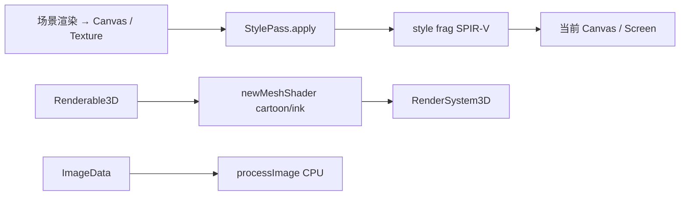

# 风格化渲染模块设计（`stylize`）

> 状态：已落地一期（后处理四风格 + 卡通/水墨网格着色 + CPU `processImage`）。  
> 脚本：`stylize <- eve.Stylize();`

关联：[`模块设计.md`](./模块设计.md) §15c、[`2D渲染API设计.md`](./2D渲染API设计.md)、现有 `graphics` Shader / Canvas。

## 1. 目标

在 EVEngine 内提供可插拔的 **NPR（非真实感）风格化渲染**能力，覆盖：

| 风格 id | 中文 | 典型管线 |
|---------|------|----------|
| `cartoon` | 卡通 / 赛璐璐 | 亮度分带 + 色阶量化 + **剪影描边**（忽略贴图色带伪边）；3D 复用 cel/toon |
| `watercolor` | 手绘水彩 | 宣纸底、纸纹 UV 扰动、渗色、边缘积色、颗粒 |
| `ink` | 水墨 / 墨绘 | 物体蒙版墨阶、剪影笔触、扩散、宣纸合成；3D 视向剪影 |
| `pixel` | 像素 | 低分辨率 UV 吸附、剪影 1px 描边、调色板 / Bayer |

非目标（一期不做）：完整离线路径追踪、多 Pass 物理颜料仿真、可编辑笔刷笔触系统。

## 2. 调研摘要（开源 / 文献）

实现前对照了常见工程与论文路径：

- **卡通**：Unity Toon Shader (UTS3)、AleToonURP / ToonURP、ToonForge NPR — 核心为 N·L 分带、描边（几何外扩或屏幕空间深度/法线/亮度 Sobel）、可选 MatCap / Rim。
- **像素**：`unity-isometric-pixel-pipeline`、`bevy_pixel_art_shader` — 低内部分辨率渲染 → 描边 → sharp upscale；CIELAB/步进调色板 + 屏幕 Bayer dither。
- **水彩**：Bousseau / Montesdeoca 等 — 边缘变暗、substrate 颗粒、纸纹扭曲、渗色；实时多以图像空间后处理近似。
- **水墨**：Park et al. Sumi-e、Godot Sumi-E、Ink-Wash Painting Style Rendering — 剪影（视向·法线）、墨阶 tone map、高斯扩散、纸张合成。

本模块采用 **图像空间后处理为主 + 可选物体空间网格着色**，以适配引擎现有 Vulkan 前向路径，避免引入独立渲染管线。

## 3. 架构



- **后处理**：`Graphics::newShaderFromSpv` + `drawTexturedRectShader`（默认 `textured.vert`）。
- **网格**：`newMeshShaderFromSpv`；`cartoon` 复用 `mesh3d_toon_*`；`ink` 使用 `ink_mesh.frag` + toon 顶点布局。
- **参数**：push constant `float data[32]`，脚本侧 string 命名（`setFloat("bands", 4)`），与引擎约定一致。

## 4. API（稳定扩展面）

一期效果可继续迭代；**对外接口先留稳**，后续多 Pass / GBuffer / 自定义 SPIR-V 接在这些入口上。

```squirrel
stylize <- eve.Stylize();

// 能力查询（feature: "post" | "mesh" | "cpu" | "gbuffer"）
stylize.supports("ink", "mesh");
stylize.getStyleParamName("pixel", 0); // "pixelSize"

pass <- stylize.newPass(gfx, "watercolor");
pass.setFloat("bleed", 0.7);
pass.setTime(t);
pass.applyCanvas(gfx, srcCanvas);
pass.applyTo(gfx, srcTex, dstCanvas); // 显式目标（链式管线用）

// 自定义后处理 SPIR-V：自行 newShaderFromSpv + declareFloat，再包一层
custom <- stylize.newPassFromShader("my_outline", myShader);

// 多 Pass ping-pong（可分离渗色 / 描边后再上色等）
chain <- stylize.newChain();
chain.add(passA);
chain.add(passB);
chain.apply(gfx, srcTex, destCanvas, tempCanvas);

meshSh <- stylize.newMeshShader(gfx, "ink");
img2 <- stylize.processImage(img, "pixel");
```

| 入口 | 用途 |
|------|------|
| `newPass` / `newPostShader` | 内置风格后处理 |
| `newPassFromShader` | 自定义 / 未来注册风格的 Shader 包装 |
| `newMeshShader` | 物体空间 cel / 水墨 |
| `newChain` + `StyleChain` | 多 Pass 序列（需 `temp` ping-pong） |
| `StylePass.applyTo` | 显式写入 Canvas，不依赖当前 bind |
| `supports(style, feature)` | `"gbuffer"` 预留（深度/法线描边，当前恒为 false） |
| `getStyleParam*` | 工具 / UI 枚举 push-constant 旋钮 |
| `processImage` | CPU 回退 |

C++ 头文件：`Stylize.h` / `StylePass.h` / `StyleChain.h`。

## 5. Shader 参数（默认值见 `StyleShaders.cpp`）

### cartoon（post）
`bands`, `outlineStrength`, `outlineThreshold`, `posterize`, `texelW/H`, `time`, `softEdge`, `outlineWidth`, `shadowLift`

### watercolor（post）
`blurAmount`, `edgeDarken`, `paperStrength`, `distortion`, `bleed`, `saturation`, `texelW/H`, `time`, `granulation`

### ink（post）
`inkContrast`, `washLevels`, `edgeThreshold`, `diffusion`, `paperR/G/B`, `inkDensity`, `texelW/H`, `time`, `edgeStrength`

### pixel（post）
`pixelSize`, `paletteSteps`, `ditherStrength`, `toonBands`, `sharpness`, `texelW/H`, `time`, `screenW/H`, `outline`

`StylePass::apply` 会按源纹理与目标尺寸自动写入 `texel*` / `screen*`。

## 6. 构建与资源

- GLSL：`src/modules/stylize/shaders/*.frag`
- 预编译：`python3 scripts/compile_stylize_shaders.py`（需 `glslc`）→ `*_frag_spv.inc`
- 模块目标：`EVStylize`（`create_module` + `EVELIBS`）

## 7. 验证

- `test/stylize.cpp`：风格注册、CPU 四风格、GPU `StylePass` + mesh shader 冒烟
- `stylize.render.cylinderStyleGallery`：程序化圆柱体（`Graphics::newMeshCylinder`）渲染四风格 PNG
- 手工：场景 → Canvas → `pass.applyCanvas` 切换四风格对比

## 8. 圆柱体风格图廊

由 `stylize.render.cylinderStyleGallery` 渲染验证（粗色带 albedo、3/4 视角、**中等定向光 + 环境光**，避免高光漂白）；产物写到 `build/.../test/out/`，文档图廊为手抄样例。  

实现贴近调研管线：`cartoon` = 物体空间三色 ramp + **剪影描边**；`watercolor` = 宣纸底 + 纸高程 UV 扰动 / 渗色 / 边缘积色 / 谷底颗粒（Bousseau·Montesdeoca）；`ink` = 物体蒙版 + 柔和墨阶 + 剪影笔触 + 宣纸合成（Park Sumi-e）；`pixel` = 内部分辨率吸附 + 剪影 1px 描边 + 调色板 / Bayer。

> 说明：一期是**单 Pass 图像空间近似**，观感会对齐 UTS / 水彩文献 / Sumi-e 的关键视觉线索（分带、积色、宣纸、像素格），但达不到多 Pass 深度法线描边或离线颜料仿真的完整品质。

### 基础（无风格）


### 卡通 `cartoon`


### 水墨 `ink`


### 水彩 `watercolor`


### 像素 `pixel`


图片路径：`docs/images/stylize/cylinder_*.png`（测试输出：`build/.../test/out/cylinder_*.png`）。
