# 示例渲染画廊（Example Render Gallery）

这里收录 EVEngine 自带示例的**真实渲染截图**：每张图都由引擎加载对应示例后，
把交换链上刚呈现的一帧通过 `gfx.saveFramePng()` 原样输出，没有经过外部截图工具，
也没有任何后期处理。截图在 Windows + 原生 GPU 环境下生成。

## 如何复现

```powershell
# 方式一：直接运行示例（手动选择想看的画面）
eve run examples/weather

# 方式二：自动抓帧（引擎跑 N 帧后自行保存交换链帧并退出）
./scripts/capture_example.ps1 -Example weather -Out docs/images/examples/weather.png -Frames 300
```

`scripts/capture_example.ps1` 依赖仓库内的 `scripts/capture_root.nut`（一个复刻
`load.nut` 启动流程的包装根脚本），可用 `-Eve` 指定 eve 可执行文件路径。

## 能力一览

| 示例 | 截图 | 展示的能力 | 运行 |
|------|------|-----------|------|
| `basic` | 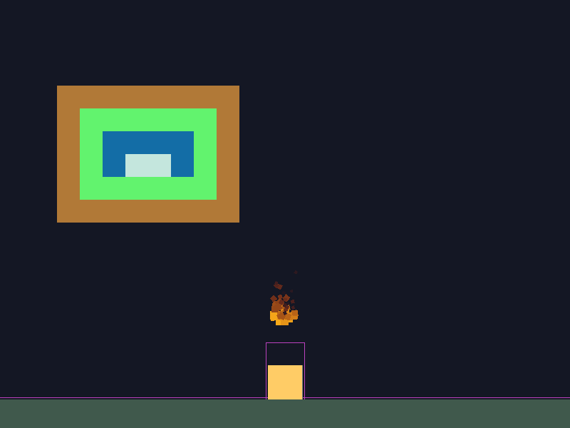 | 2D 基础示例：瓦片地图、2D 物理（刚体/地面/重力）、粒子、调试绘制 | `eve run examples/basic` |
| `weather` | 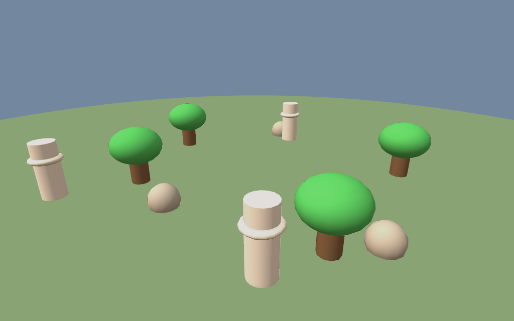 | 3D 天气实验室：雨 / 雪 / 雾 / 风暴气氛、天空与雾效、自动环绕相机 | `eve run examples/weather` |
| `waterfall-demo` | 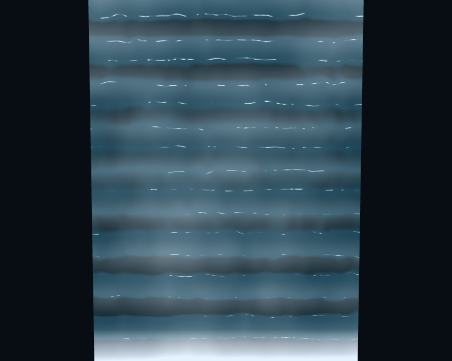 | 流动水面着色器：瀑布水流、泡沫、湍流、反射 | `eve run examples/waterfall-demo` |
| `building-3d` | 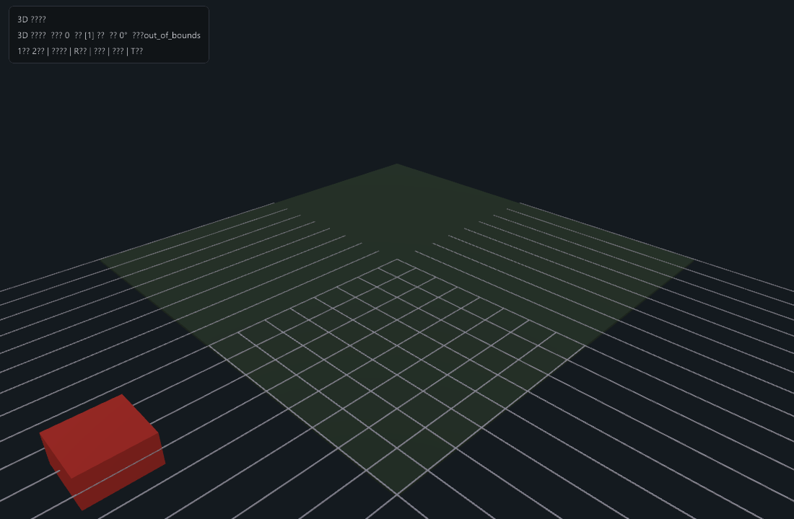 | 3D 建筑场景与基础光照 | `eve run examples/building-3d` |
| `camera-controllers` | 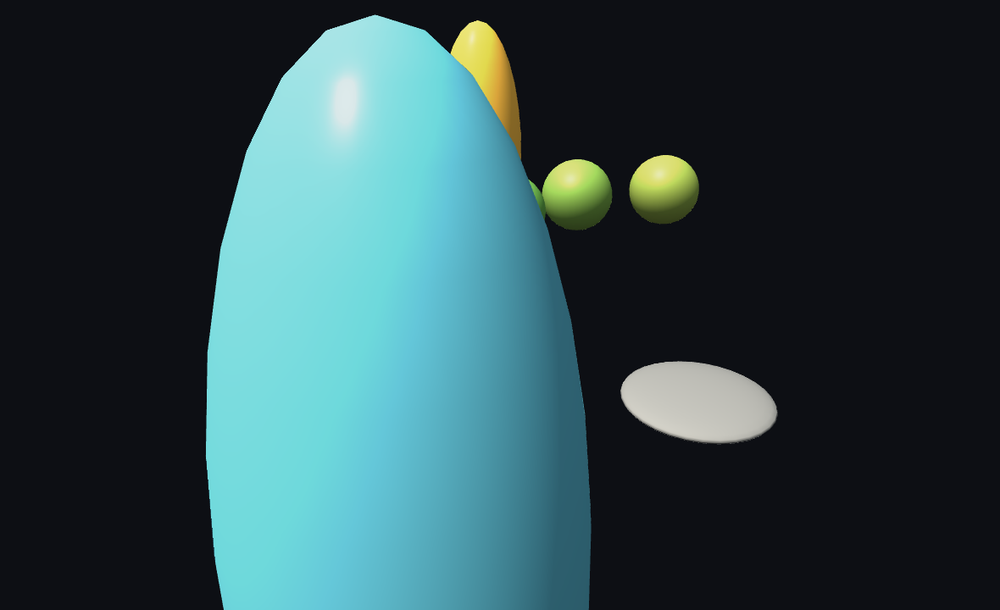 | 多种 3D 相机控制器（环绕 / 跟随 / 自由视角） | `eve run examples/camera-controllers` |
| `sprite-stack` | 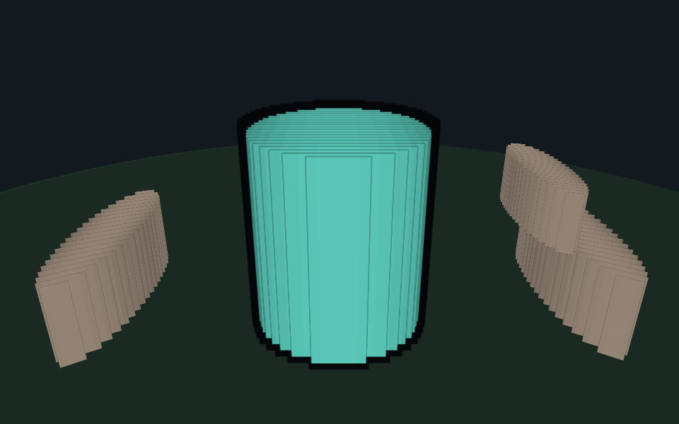 | 2.5D 精灵切片：程序化几何切成多层 RGBA，叠片伪 3D 渲染 | `eve run examples/sprite-stack` |
| `rock-generator` | 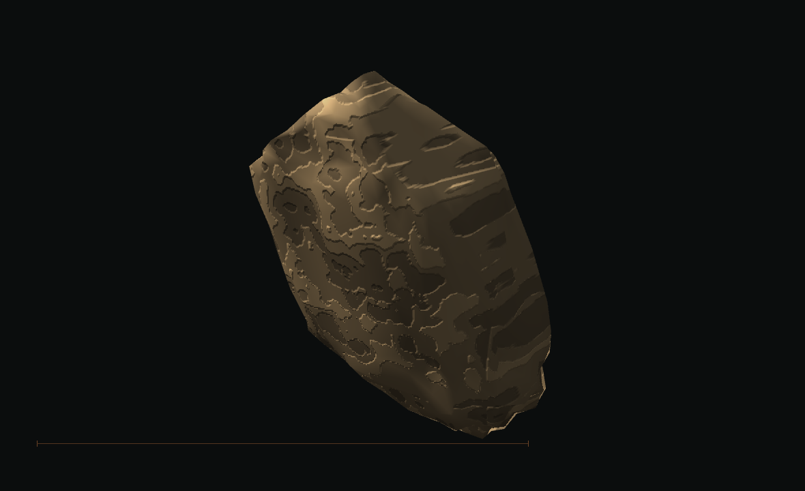 | 程序化岩石（`mesh.rock`）：确定性 seed、侵蚀 / 断裂、多 LOD | `eve run examples/rock-generator` |
| `tree-generator` | 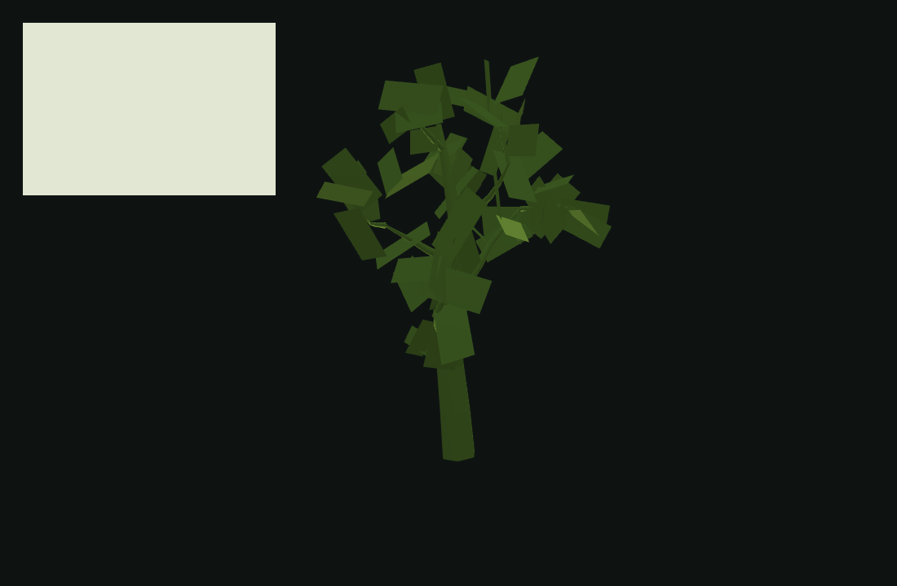 | 程序化树木（`mesh.tree`）：Weber–Penn / 空间殖民枝干算法、叶片系统 | `eve run examples/tree-generator` |
| `bush-generator` | 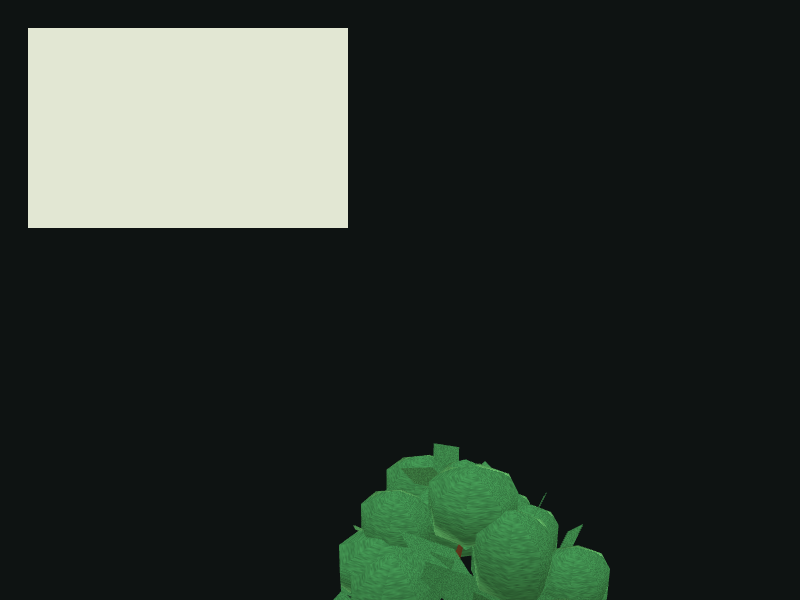 | 程序化灌木（`mesh.bush`）：叶片簇 / 叶卡 / 枝干 | `eve run examples/bush-generator` |
| `roguelike-generator` | 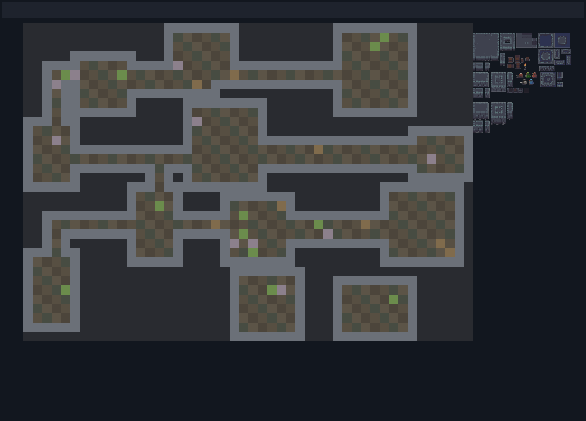 | 程序化地牢（`level.roguelike`）：房间 + 走廊、自动贴图、装饰与物件 | `eve run examples/roguelike-generator` |
| `hex-levels` | 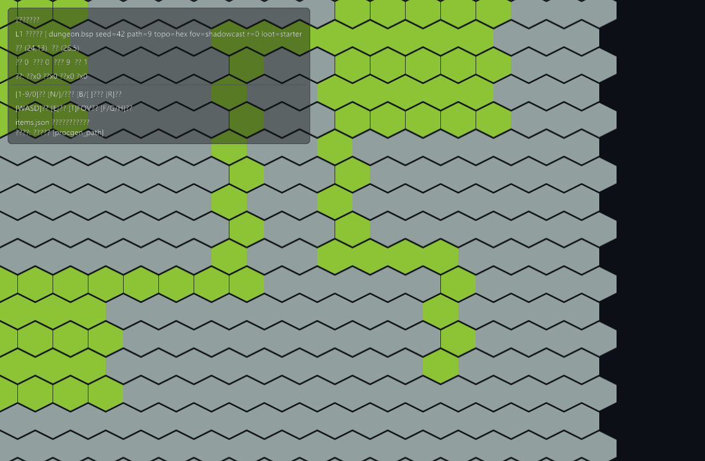 | 六边形网格关卡与瓦片渲染 | `eve run examples/hex-levels` |
| `procgen` | 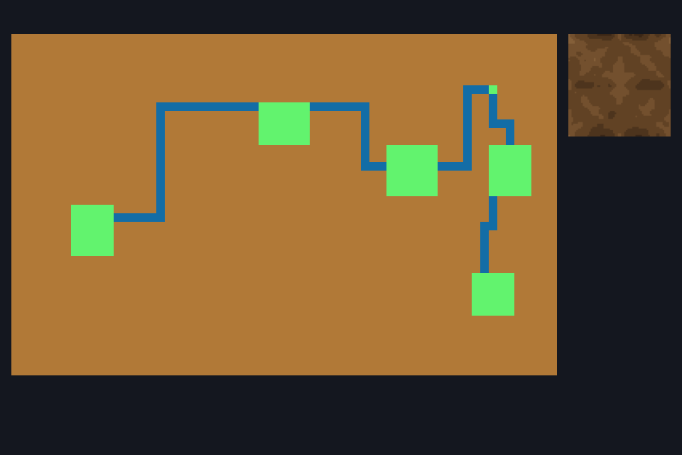 | 程序化生成综合示例（网格 / 纹理配方） | `eve run examples/procgen` |
| `metroidvania` | 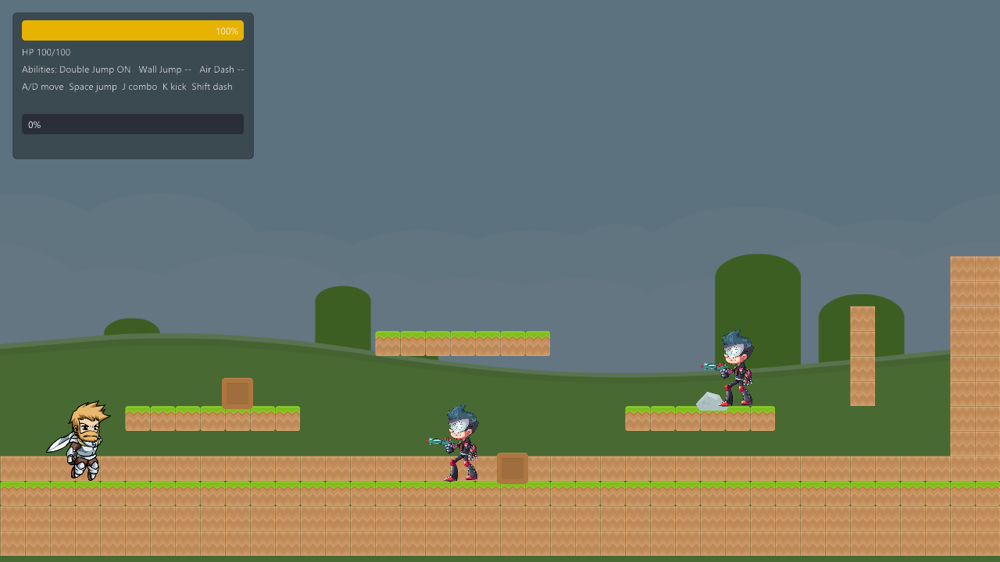 | 2D 平台动作：物理驱动移动、连招 / 踢击、Spine 角色动画与 Boss 战 | `eve run examples/metroidvania` |
| `rpg` | 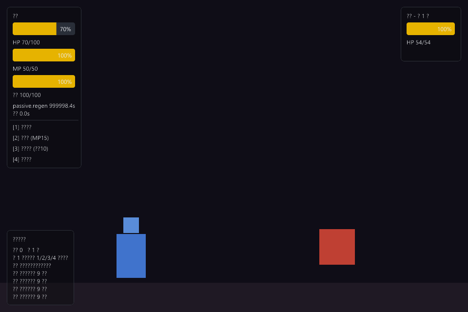 | 2D 地牢生存 RPG：属性 / 效果 / 状态 / 技能 / 结算五套系统 | `eve run examples/rpg` |

> 提示：更多示例见 `examples/`，部分示例以交互为主（如编辑器、卡牌、对话），
> 静态截图不足以体现其交互性，因此未收录在本画廊中。
