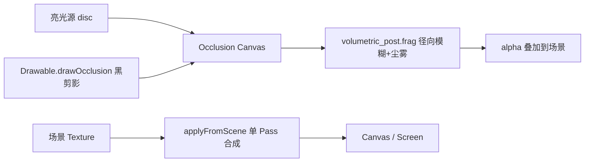

# 体积光（屏幕空间）设计

> 状态：一期已落地（屏幕空间 God Rays + 尘雾，2D/3D 共用后处理）。  
> API：`eve.Graphics().newVolumetric()` → `Volumetric`

关联：[`模块设计.md`](./dev/模块设计.md) §4 graphics、现有 `Drawable` / `Shadow` / `Canvas` / `Shader`。

## 1. 目标观感

有尘、有雾的**真体积光观感**（参与介质散射），一期用 **屏幕空间径向模糊**（GPU Gems 3 / Mitchell）近似光柱，并叠加：

- 颗粒尘埃（高频噪声 scintillation）
- 朝向光源的柔和雾感（距离衰减 haze）

后续可在不改对外 API 的前提下换 Ray March / Froxel。

## 2. 公开技术对照

| 路线 | 代表 | 一期选用 |
|------|------|----------|
| 屏幕空间径向模糊 | GPU Gems 3 Ch.13 | ✅ |
| Ray March + Shadow Map | UE / HDRP volumetric | 二期（依赖深度 RTT） |
| Froxel 体积雾 | Frostbite / Wronski | 暂缓 |

## 3. 架构



遮挡与阴影同构：

| 阴影 | 体积光遮挡 |
|------|------------|
| `MeshRenderer.castShadow` | `Drawable.castOcclusion` / `Renderable*.castOcclusion` |
| `drawMeshShadow` | `Graphics::drawOcclusion*` / `Volumetric::drawOccluder*` |

## 4. API

```squirrel
gfx <- eve.Graphics();
vol <- gfx.newVolumetric();
vol.setQuality("low");    // "low" | "medium" | "high"
vol.setLightScreenUV(0.7, 0.2);
vol.setShaftColor(1, 0.95, 0.85);
vol.setFogColor(0.5, 0.6, 0.75);
vol.setFloat("dustAmount", 0.3);
vol.setIntensity(1.0);

// --- 路径 A：专用遮挡图（推荐 2D）---
ow <- vol.resolutionFor(gfx.getWidth());
oh <- vol.resolutionFor(gfx.getHeight());
occ <- gfx.newCanvas(ow, oh);
gfx.setCanvas(occ);
vol.beginOcclusionMap(gfx, ow * 0.7, oh * 0.2, 20.0);
vol.drawOccluders2D(gfx);           // ECS Sprite.castOcclusion
// 或 vol.drawOccluderSolid / drawOccluderTexture / drawOccluder(drawable, mat)
gfx.setCanvas();
vol.scatter(gfx, occ.getTexture()); // 写入当前目标（shafts，带 alpha）

// --- 路径 B：从场景直接散射（适合 3D 亮光源在画面内）---
vol.applyFromScene(gfx, sceneTex);
```

质量档：

| quality | downscale | samples | dust/fog |
|---------|-----------|---------|----------|
| low | 4 | 16 | 弱 |
| medium | 2 | 48 | 中 |
| high | 1 | 96 | 强 |

## 5. 关键类型扩展

- `Drawable`：`setCastOcclusion` / `getCastOcclusion` / `drawOcclusion`
- `Texture` / `Mesh`：覆写 `drawOcclusion`（2D 仿射黑剪影）
- `Renderable2D.Sprite.castOcclusion`、`Renderable3D.MeshRenderer.castOcclusion`
- `Light2D` / `Light3D`：`setVolumetric` / `setVolumetricIntensity`（标记体积光源，供后续自动收集）

## 6. 资源

- GLSL：`src/modules/graphics/shaders/volumetric_post.frag`
- 预编译：`python3 scripts/compile_graphics_volumetric_shaders.py` → `*_spv.inc`

## 7. 验证

- `test/Volumetric.cpp`：质量档、遮挡 flag、occlusion scatter、applyFromScene、Light 标记
