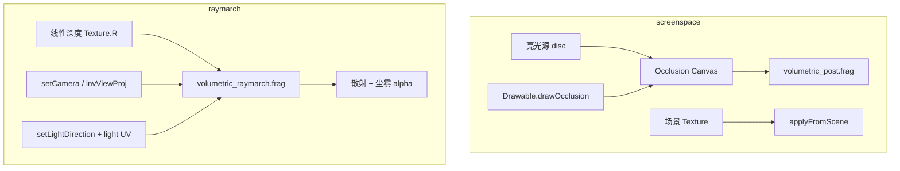

# 体积光设计

> 状态：一期屏幕空间 God Rays + 二期深度 Ray March（屏空间遮挡近似 CSM）已落地。  
> API：`eve.Graphics().newVolumetric()` → `Volumetric`

关联：[`模块设计.md`](./dev/模块设计.md) §4 graphics、现有 `Drawable` / `Shadow` / `Canvas` / `Shader`。

## 1. 目标观感

有尘、有雾的**真体积光观感**（参与介质散射）：

| 阶段 | 技术 | 适用 |
|------|------|------|
| 一期 `screenspace` | GPU Gems 3 径向模糊 + 尘/雾 | 2D / 屏内亮源 |
| 二期 `raymarch` | 沿视线积分 + 屏空间向光源步进遮挡 | 3D 深度图（线性 depth） |

Froxel 网格体积雾仍暂缓。

## 2. 公开技术对照

| 路线 | 代表 | 状态 |
|------|------|------|
| 屏幕空间径向模糊 | GPU Gems 3 Ch.13 | ✅ `setMode("screenspace")` |
| Ray March + 遮挡 | UE/HDRP 简化；单 sampler 下用深度屏空间阴影近似 CSM | ✅ `setMode("raymarch")` |
| 绑定真实 CSM shadow map | Frostbite / 多 binding 后处理 | 后续（需扩展 2D shader 描述符） |
| Froxel | Hillaire / Wronski | 暂缓 |

## 3. 架构



遮挡与阴影同构：

| 阴影 | 体积光遮挡 |
|------|------------|
| `MeshRenderer.castShadow` | `Drawable.castOcclusion` / `Renderable*.castOcclusion` |
| `drawMeshShadow` | `Graphics::drawOcclusion*` / `Volumetric::drawOccluder*` |
| CSM PCF | Ray march 内屏空间向 `lightUV` 步进（单 sampler 近似） |

## 4. API

```squirrel
vol <- gfx.newVolumetric();
vol.setQuality("medium"); // low | medium | high

// --- screenspace ---
vol.setMode("screenspace");
vol.setLightScreenUV(0.7, 0.2);
vol.beginOcclusionMap(gfx, lx, ly, 20);
vol.drawOccluders2D(gfx);
vol.scatter(gfx, occTex);
// 或 vol.applyFromScene(gfx, sceneTex);

// --- raymarch（3D）---
vol.setMode("raymarch");
vol.setCamera(eyeX,eyeY,eyeZ, tx,ty,tz, ux,uy,uz, fovY, aspect, nearZ, farZ);
vol.setLightDirection(0.5, 1.0, 0.3);
vol.setLightScreenUV(0.8, 0.15);
vol.setDensity(0.4);
vol.rayMarch(gfx, linearDepthTex); // R = 线性深度 0..1
```

质量档：

| quality | screenspace samples | raymarch samples | shadowSteps | downscale |
|---------|---------------------|------------------|-------------|-----------|
| low | 16 | 8 | 4 | 4 |
| medium | 48 | 24 | 8 | 2 |
| high | 96 | 48 | 16 | 1 |

C++ 辅助：`newLinearDepthTexture(gfx, w, h, depth01Fn, userdata)` 生成测试/工具用深度图。

## 5. 相关类型

- `Drawable`：`setCastOcclusion` / `drawOcclusion`
- `Renderable2D/3D`：`castOcclusion`
- `Light2D/3D`：`setVolumetric` / `setVolumetricIntensity`

## 6. 资源

- `volumetric_post.frag` / `volumetric_raymarch.frag`
- `python3 scripts/compile_graphics_volumetric_shaders.py`

## 7. 验证

- `test/Volumetric.cpp`：质量档、遮挡 flag、scatter、applyFromScene、ray march 散射/遮挡、drawOccluders2D、参数往返
