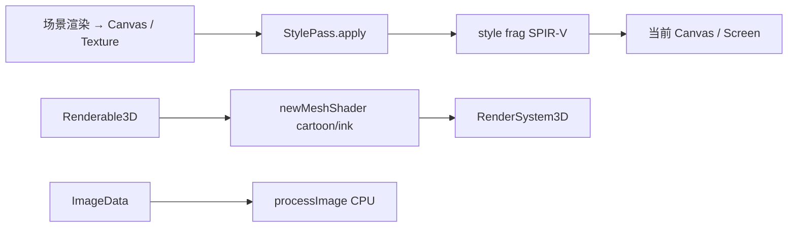

# 风格化渲染模块设计（`stylize`）

> 状态：已落地一期（后处理四风格 + 卡通/水墨网格着色 + CPU `processImage`）。  
> 脚本：`stylize <- eve.Stylize();`

关联：[`模块设计.md`](./模块设计.md) §15c、[`2D渲染API设计.md`](./2D渲染API设计.md)、现有 `graphics` Shader / Canvas。

## 1. 目标

在 EVEngine 内提供可插拔的 **NPR（非真实感）风格化渲染**能力，覆盖：

| 风格 id | 中文 | 典型管线 |
|---------|------|----------|
| `cartoon` | 卡通 / 赛璐璐 | 亮度分带 + 色阶量化 + Sobel 描边；3D 复用 cel/toon |
| `watercolor` | 手绘水彩 | 纸纹 UV 扰动、渗色模糊、边缘积色、颗粒 |
| `ink` | 水墨 / 墨绘 | 墨阶量化、轮廓、扩散、宣纸底色；3D 视向剪影 |
| `pixel` | 像素 | 低分辨率 UV 吸附、调色板量化、Bayer 抖动 |

非目标（一期不做）：完整离线路径追踪、多 Pass 物理颜料仿真、可编辑笔刷笔触系统。

## 2. 调研摘要（开源 / 文献）

实现前对照了常见工程与论文路径：

- **卡通**：Unity Toon Shader (UTS3)、AleToonURP / ToonURP、ToonForge NPR — 核心为 N·L 分带、描边（几何外扩或屏幕空间深度/法线/亮度 Sobel）、可选 MatCap / Rim。
- **像素**：`unity-isometric-pixel-pipeline`、`bevy_pixel_art_shader` — 低内部分辨率渲染 → 描边 → sharp upscale；CIELAB/步进调色板 + 屏幕 Bayer dither。
- **水彩**：Bousseau / Montesdeoca 等 — 边缘变暗、substrate 颗粒、纸纹扭曲、渗色；实时多以图像空间后处理近似。
- **水墨**：Park et al. Sumi-e、Godot Sumi-E、Ink-Wash Painting Style Rendering — 剪影（视向·法线）、墨阶 tone map、高斯扩散、纸张合成。

本模块采用 **图像空间后处理为主 + 可选物体空间网格着色**，以适配引擎现有 Vulkan 前向路径，避免引入独立渲染管线。

## 3. 架构



- **后处理**：`Graphics::newShaderFromSpv` + `drawTexturedRectShader`（默认 `textured.vert`）。
- **网格**：`newMeshShaderFromSpv`；`cartoon` 复用 `mesh3d_toon_*`；`ink` 使用 `ink_mesh.frag` + toon 顶点布局。
- **参数**：push constant `float data[32]`，脚本侧 string 命名（`setFloat("bands", 4)`），与引擎约定一致。

## 4. API 草图

```squirrel
stylize <- eve.Stylize();
pass <- stylize.newPass(gfx, "watercolor");
pass.setFloat("bleed", 0.7);
pass.setTime(t);
// 先把场景画进 srcCanvas，再绑到屏幕或另一张 Canvas：
pass.applyCanvas(gfx, srcCanvas);

meshSh <- stylize.newMeshShader(gfx, "ink");
entity.setShader(meshSh);

img2 <- stylize.processImage(img, "pixel");
```

C++：`Stylize::newPass` / `newPostShader` / `newMeshShader` / `processImage`；`StylePass::apply` / `applyCanvas`。

## 5. Shader 参数（默认值见 `StyleShaders.cpp`）

### cartoon（post）
`bands`, `outlineStrength`, `outlineThreshold`, `posterize`, `texelW/H`, `time`, `softEdge`

### watercolor（post）
`blurAmount`, `edgeDarken`, `paperStrength`, `distortion`, `bleed`, `saturation`, `texelW/H`, `time`, `granulation`

### ink（post）
`inkContrast`, `washLevels`, `edgeThreshold`, `diffusion`, `paperR/G/B`, `inkDensity`, `texelW/H`, `time`, `edgeStrength`

### pixel（post）
`pixelSize`, `paletteSteps`, `ditherStrength`, `toonBands`, `sharpness`, `texelW/H`, `time`, `screenW/H`

`StylePass::apply` 会按源纹理与目标尺寸自动写入 `texel*` / `screen*`。

## 6. 构建与资源

- GLSL：`src/modules/stylize/shaders/*.frag`
- 预编译：`python3 scripts/compile_stylize_shaders.py`（需 `glslc`）→ `*_frag_spv.inc`
- 模块目标：`EVStylize`（`create_module` + `EVELIBS`）

## 7. 验证

- `test/stylize.cpp`：风格注册、CPU 四风格、GPU `StylePass` + mesh shader 冒烟
- 手工：场景 → Canvas → `pass.applyCanvas` 切换四风格对比
