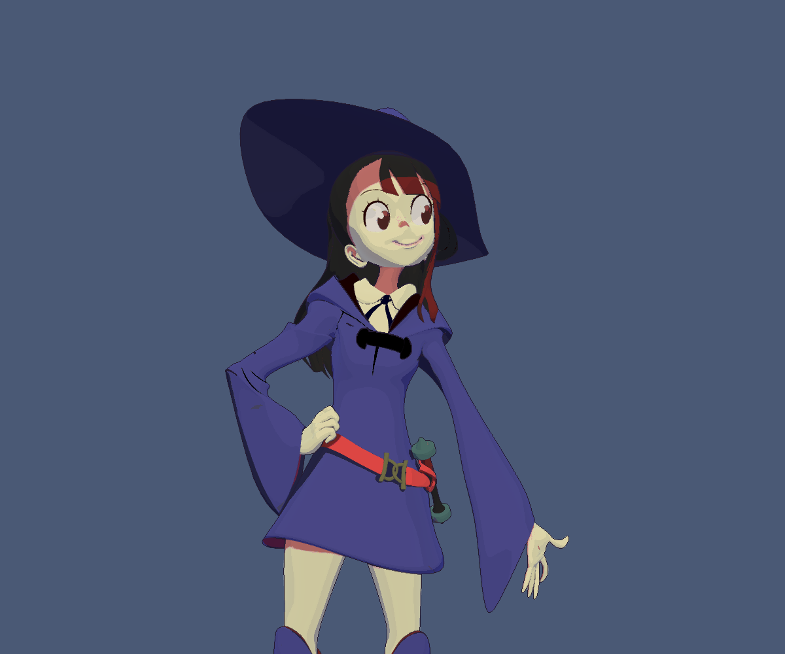
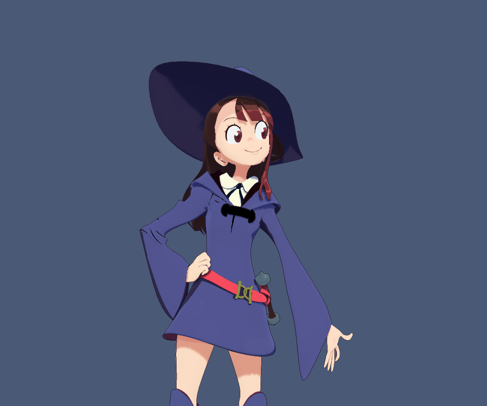

# Anime Character Lab

使用本地 Little Witch Academia 模型检查 `stylize.newMeshShader(gfx, "anime")`。
模型：[Little Witch Academia](https://sketchfab.com/3d-models/little-witch-academia-52d2cafc27c1440c987764294a89d2eb)，
作者 [qnaman](https://sketchfab.com/qnaman)，许可为 **CC Attribution — Creative Commons Attribution 4.0 International (CC BY 4.0)**。
许可链接：[CC BY 4.0](https://creativecommons.org/licenses/by/4.0/)。
本站示例作了静态格式转换、纹理编码与路径修正、描边壳替换及材质/光照调整；原作者不代表认可这些修改。
模型与派生渲染图的署名及许可详见 [ATTRIBUTION.md](ATTRIBUTION.md)。
模型、纹理及转换产物仅保存在忽略目录中，不随引擎代码分发；使用者须遵守原资源许可。

同镜头引擎实机截图（模型 © qnaman，CC BY 4.0；渲染修改见署名文件）：

旧 cartoon：


新 anime：


## 准备与运行

Windows 需要 MSVC、CMake、Ninja、Pillow 和已安装的 Debug Assimp 库。
在仓库根目录执行，用自己的第三方安装路径替换 `--assimp-prefix`：

```powershell
python examples/anime-character-lab/prepare.py C:/Users/xiaofans/Downloads/little-witch-academia --assimp-prefix C:/Users/xiaofans/Workspace/Agents/EVEngine/build/third-party-binary/win32-debug
make run/win32-debug GAME=examples/anime-character-lab
```

转换器保留原始几何、UV、材质分区并烘焙节点变换，合并重复顶点，输出**静态** OBJ。
原下载目录不会被修改。16 位 `hairs.png` 转成引擎支持的 RGBA8；修正 FBX 中指向作者电脑的纹理路径。
原模型的反向黑色描边壳（材质 `Black`）不提交绘制，改用屏幕空间深度/法线描边。
未删去角色身体部位。这不是动画或骨骼导入验证。

直接导入此 FBX 的大量独立网格在本机曾发生上传停滞；这个场景使用显式静态转换规避它，
没有宣称修好了通用 FBX 上传问题。

未准备本地模型时（例如干净的 CI checkout），日志给出资产准备说明并保持场景运行，
不宣称角色已经加载；已有文件无法解码仍作为错误报告。可连接这个场景执行
`python examples/anime-character-lab/verify.py --expect-missing-assets` 验证该状态。

控制：`1` 新材质，`2` 旧 cartoon，`3` 全身/近景，`4/5/6` 主光/侧光/背光，`A/D` 环绕。
两种材质共享纹理、相机、几何、灯光、描边和抗锯齿设置。
近景关闭地台以免遮挡角色细节，全身保留地台接收投影。

## 材质约定

`anime` 是独立的网格风格，不改变现有 `cartoon`，不提供 CPU 或全屏后处理版本。
它保留 albedo 色彩，使用带导数抗锯齿的明暗分界、可调彩色阴影、三层级联投影、
9 次采样 PCF、级联交界渐变、发束高光、表面高光、受光方向约束的边缘光。
Vulkan GLSL 与 WebGPU WGSL 使用相同参数顺序和方程；WebGPU 投影采样遵循其 Y 翻转约定。

```squirrel
local shader=stylize.newMeshShader(gfx,"anime");
shader.sendFloat("hair",1.0);
material.setShader(shader);
material.setShadingModel("custom");
```

参数通过 `stylize` 的现有参数目录查询，目录是默认值和范围的唯一来源：

- `shadowThreshold / shadowSoftness / shadowStrength`：明暗分区；`shadowR/G/B`：暗部色相。
- `castShadowStrength`：接收实时投影强度；还需 RenderControl 开启 shadow、投影方向光和对象接收标记。
- `skin`：肤色阴影；`skinDetail` 默认 1，完整保留原纹理。此模型的烘焙红影较重，场景取 0.25，属于明确的美术校色。
- `hair / specularStrength / specularPower`：近似竖向发束的各向异性高光。
- `surfaceSpecular`：独立的表面高光，默认 0；场景只为金属扣启用。
- `rimStrength / fillGradient`：轮廓补光、连续的弱明暗渐变。
- `unlit`：保留眼睛等绘制细节的未受光颜色。

未启用投影光源、对象不接收投影或 shadow 功能关闭时，投影可见度明确为 1，仍保留材质明暗。
无时间和随机数输入；固定相机/灯光时输出稳定。它并不包含专用脸部 SDF、头发深度脸影、
逐像素材质 lightmap、头发切线贴图或生产级角色动画管线，不能据此声称与原神完整管线等价。
不同角色仍需配合其模型、UV 和专用材质贴图调整。

## 着色器迭代与回归

离线源文件是 `src/modules/stylize/shaders/anime_mesh.frag` 和 `anime_shadow.glsl`；
WGSL 对应文件为 `anime_mesh_wgsl.inc`。修改方程时同步两种后端。
`python scripts/compile_stylize_shaders.py` 更新引擎嵌入的 SPIR-V。

无需重建引擎的本地调色：

```powershell
python examples/anime-character-lab/compile_shader.py
# 使用本次构建的 eve，不能使用尚未包含 anime 风格的旧 SDK：
build/win32-debug/src/engine/eve.exe run --mcp-port=7537 examples/anime-character-lab
python examples/anime-character-lab/verify.py
```

`compile_shader.py` 调用 `glslc` 和 `spirv-val`，生成忽略的 `shaders/compiled.nut`；
MCP 内执行 `reloadAnime()` 即替换已创建的材质管线。只有参数布局不变时才能这样替换。
新增/调整参数声明顺序必须重建引擎、重启场景。

新增的脚本绑定 `gfx.replaceShaderFromSpv(shader, vertexWords, fragmentWords)` 返回
现有投影 Result（检查 `.ok`）；错误保留旧管线与参数。每个数组元素必须是 uint32 范围的整数。
数组仅在调用期间借用，数据复制到原有 Graphics 替换 API；Shader 仍归 Graphics 所有。
调用限定在 VM/渲染所属线程，不调用用户回调、不持有跨帧临时指针。
空 vertexWords 表示采用原有后端的默认顶点着色器规则；fragmentWords 不可为空。
这是受信任开发工具接口，不能把任意外部字节码当作安全输入；先运行离线 SPIR-V 验证器。

`verify.py` 使用引擎 MCP 截图，不截桌面。它检查非法整数/魔数拒绝、失败前后逐字节相同截图、
同一有效着色器重载前后相同截图、投影开关确实改变画面，并保存新旧近景/全身与不同灯光/角度。
脚本结束后恢复新材质、主光和近景；输出目录 `verification/` 不提交。

## 关联渲染修复

延迟创建或改变尺寸的 G-buffer 过去没有更新已建立的阴影渲染图，导致描边读取未写入的图像。
现在先等待已提交 GPU 工作、销毁引用旧目标的渲染图，再释放目标；下次录制从当前目标重建。
同时修正 G-buffer 包装纹理/可见性缓冲尺寸，并让空场景的读回执行 clear-only pass。
相关实现从过大的 Graphics3D.cpp 移到 GraphicsDeferredGraph.cpp。

`test/graphics_deferred_targets.cpp` 用真实像素覆盖先呈现加载画面、后创建 G-buffer、调整尺寸、
删除全部几何后清空深度的路径；`test/stylize_anime.cpp` 覆盖材质参数契约及真实 GPU 管线。
新增部分没有 ECS System、Link、持久格式、向上模块依赖或第二份权威材质状态。
