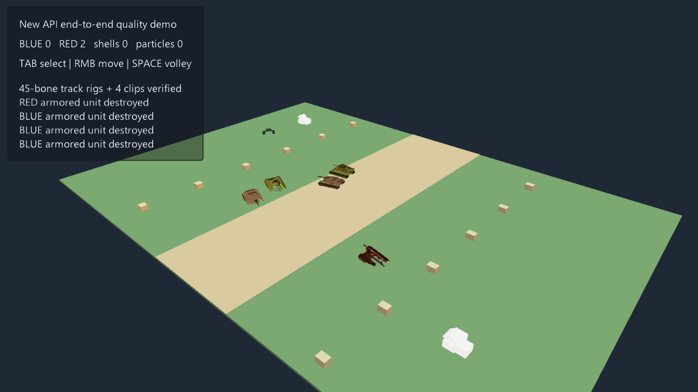

# Armored Command 3D

3D RTS API quality demo validated against the latest `dev` source build.

- Four imported Quaternius tanks with 45-bone animated tracks and forward,
  reverse, left-turn, and right-turn clips.
- The downloaded GLB variants keep their embedded materials; the model's `-X`
  forward axis is normalized to the demo's `+X` movement/aiming convention.
- Six autonomous units, selection/move orders, synchronized volleys, animated
  recoil, 3D shells, muzzle/impact/smoke particles, damage tint and wreck fall.
- A 68 x 48 battlefield (twice the original width and length), half-scale
  vehicles, and brighter ambient/directional lighting for RTS readability.
- Kenney modular command posts with piece-wise animated collapse.



Controls: `Tab` selects a blue unit, right mouse issues a move order, and
`Space` fires a synchronized volley.

Run with a current-source build (the older installed SDK predates EveScript
`persist`):

```powershell
make run/win32-debug GAME=examples/armored-command-3d
```

## Assets

- Quaternius Animated Tank Pack, CC0 1.0:
  <https://quaternius.com/packs/animatedtanks.html>
- Poly Pizza GLB mirror and metadata:
  <https://poly.pizza/bundle/Animated-Tank-Pack-0tfvbeAJkU>
- Kenney Modular Buildings, CC0 1.0; license retained beside the GLB files.
