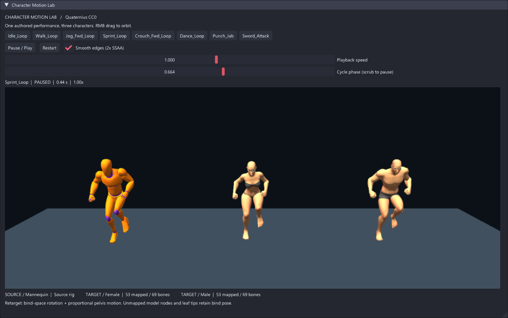

# Character Motion Lab

三个人物并排演示同一套作者制作的动作：左侧为 Quaternius 动作库自带的
Mannequin，中央和右侧为 Universal Base Characters 免费版的 Female / Male。

```sh
make run/win32-debug GAME=examples/character-motion-lab
# 或使用包含 AnimRetargetProfile 的较新 SDK：
eve run examples/character-motion-lab
```

- 八个动作按钮：待机、走路、慢跑、冲刺、蹲走、舞蹈、出拳、挥剑。
- 切换动作有 0.22 秒交叉淡化；攻击动作也循环，便于观察。
- Pause / Play 暂停和继续，Restart 从头播放。
- Playback speed 调速；Cycle phase 同步定位三个角色并暂停。
- 在场景区域按住鼠标右键水平拖动，绕人物旋转观察。
- 默认开启 Smooth edges：以视口双倍宽高渲染，用 2× SSAA tent 滤波缩回视口；
  UI 文字不参与滤波。取消勾选可即时对比原始边缘，也可降低 GPU 开销。
- 这是动作观察台：角色保持在各自展示位置，不提供角色移动控制或武器道具。

## 重定向路径

从动画库自身构建源骨架、导入源 clip，再通过显式 `AnimRetargetProfile`
映射生成每个目标角色的 clip。不是把源通道直接当作目标骨架通道导入。
`DEF-hips -> pelvis`、脊柱、四肢和手指共 53 个节点匹配；目标导入骨架有
69 个节点，16 个未匹配节点为 4 个模型/容器节点及 12 个指趾末端。
这些节点保留目标 bind transform；未匹配名单会打印到启动日志。

使用 skeleton-space bind rotation correction 和自动骨盆位移比例调整。
两个目标模型共用命名约定，但实际绑定骨架和身体比例不同。所有 model、
skeleton、clip、player、skin 与 texture 引用都保留在场景状态中；在主线程
使用引擎传入的 dt 更新，不在回调间保存临时 pose。禁用热重载以避免重复
创建场景对象；修改脚本后重新启动。未更改引擎公共 API、格式或模块边界。

本例不加入脚底接地 IK、根运动位移控制或碰撞修正；因此不是脚滑或接地
精度的自动验收。动作质量由源素材和现有重定向器共同决定。

抗锯齿复用现有 `AntiAliasing` 的 SSAA medium 路径。源 Canvas 按实际视口
像素尺寸创建，仅在尺寸变化时重建；目标 Canvas 仍归 UI 所有，不跨帧缓存。
2× 宽高意味着约四倍场景像素量，外加一次滤波。它不依赖历史帧，因此没有
历史累积导致的动画拖影；不保证消除所有运动中的亚像素闪烁。

## 验证

```sh
python examples/character-motion-lab/validate_assets.py
```

离线校验文件 SHA-256、glTF 依赖、骨架节点数和八个指定动作。
在运行场景的引擎 MCP `eve_run_script` 中执行 `dofile("smoke.nut");`，
检查八动作 x 三角色 x 五时间点的实际 CPU 蒙皮数据是否有限且处于合理范围。
该检查会临时改变姿态，结束后恢复当前选择的动作并从头播放。

素材来源、原始归档哈希、许可及导入修正在 [素材说明](assets/quaternius/README.md)。



本次验证使用本机现有 Windows Debug 引擎（2026-09-05 构建）。素材校验、
120 个姿态的全顶点蒙皮检查通过，并人工检查了行走、舞蹈、冲刺截图。
动作按钮、暂停/继续、暂停时切换动作、重播通过引擎 MCP 的真实 UI 事件路径复核。
未重新编译当前 worktree 的引擎，也未运行全仓测试。
