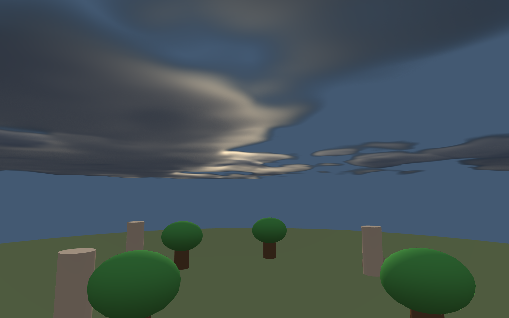

# Day / Night Cycle

The scene also renders a procedural volumetric cloud deck. Its direct-light direction
and atmosphere-attenuated RGB are read from `DayNight` every frame, so noon cloud
silverlining and warm sunset glow remain synchronized with the sky and scene lighting.



A 3D diorama that demonstrates the EVEngine **DayNight module**: a time-of-day
solar orbit, a procedural skybox that rotates with the sun, and switchable
night lighting systems (moonlight, starlight, fire, fireflies).

## Run

```sh
eve run examples/daynight
```

## Controls

- `Space` — pause / resume the clock.
- `Up` / `Down` — speed up / slow down the day.
- `Left` — reset to solar noon.
- `L` — toggle moonlight.
- `F` — toggle fireflies.
- `M` — toggle the campfire point light.
- Camera auto-orbits the diorama.

## Scene

Trees, pillars and rocks on a disc ground plane. The DayNight module drives the
directional sun (angle + warm falloff), the procedural sky cubemap (IBL
environment with a sun disc and night stars), the clear color, and the camera
ambient. Below the horizon the named night-light systems come alive as `Light3D`
entities: a cool moon directional light, a starlight ambient boost, a warm fire
point light and a ring of gently-drifting fireflies.
