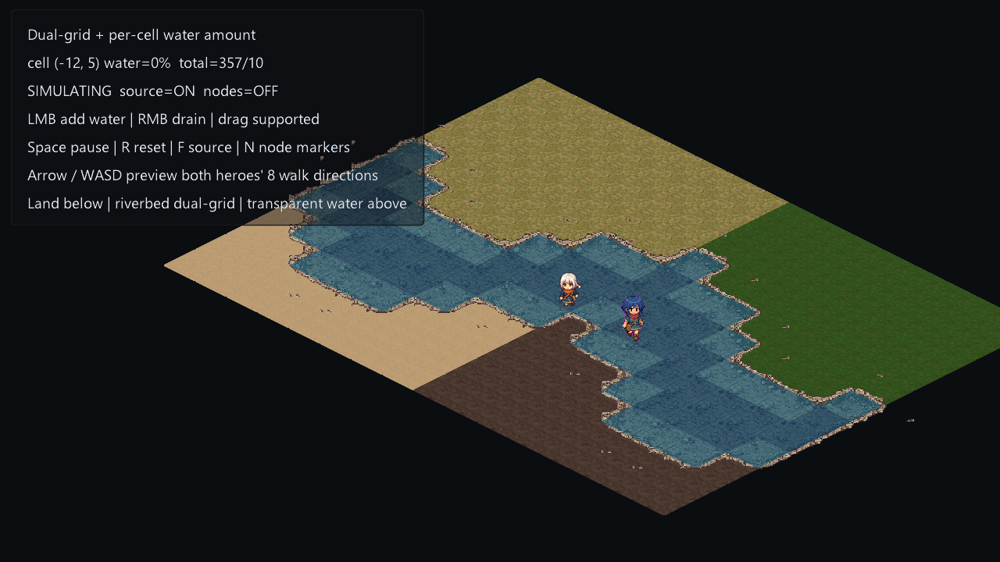

# Dual-grid dynamic water



Runnable 2.5D water prototype with two deliberately separate data paths:

- `WaterField.amount[]` is the CPU-authoritative per-cell water quantity.
- `assets/riverbed.png` is the supplied 4×4 isometric dual-grid sheet. Its 16
  skewed diamonds are unpacked into a conventional atlas at load time.
- `assets/terrain/c14-land-atlas.png` supplies four interchangeable land tiles:
  yellow grass, green grass, sand and mud.
- An invisible logical `TileLayer` marks wet riverbed cells as filled.
- `Map.resolveDualGrid()` derives the half-cell-offset riverbed display layer;
  black source pixels are transparent and reveal the selected land beneath.
- White-haired and blue-haired characters each use a `6×8` transparent atlas:
  eight directions, six walking frames per direction, with shared feet anchors.
- A `16×12` Canvas mirrors depth and flow as an RGBA data texture.
- A Vulkan GLSL / WebGPU WGSL shader inverse-projects each screen pixel into
  logical isometric coordinates and samples the four shared water nodes.

This separation means ordinary level changes only update the tiny data Canvas.
The dual-grid shore is resolved again only when a cell crosses the wet threshold.

## Run

```powershell
make run/win32-debug GAME=examples/dynamic-water-grid
```

Controls:

- Left mouse: add water to the hovered logical cell.
- Right mouse: drain water.
- `Space`: pause/resume simulation.
- `R`: reset the winding river.
- `F`: toggle the inlet source.
- `N`: show the authoritative per-cell sample nodes.
- Arrow keys / `WASD`: preview both characters' eight facing directions.

The simulation processes each undirected grid edge once and writes transfers to
a delta buffer, so results do not depend on traversal direction. Each edge can
spend at most 22% of its source cell per fixed step, preventing four neighbours
from removing more water than exists.

## Imported terrain and riverbed art

The imported `assets/riverbed.png` is already active. `buildImportedShoreAtlas()`
extracts its 16 isometrically arranged `61×31` frames and repacks them row-major.
Neutral pixels below 15% brightness are color-keyed to transparency. Those dark
regions are land cut-outs, not water: they expose whichever terrain tile is
drawn below. The opaque tan pixels are the riverbed itself.

The land atlas was imported from the supplied `C14 45°地表素材` pack using source
images `16.png`, `97.png`, `21.png` and `30.png`. The reproducible importer is
`assets/terrain/import_terrain_tiles.py`.

The source positions are the standard SpriteCook/common dual-grid frame order,
so `Map.resolveDualGrid()` can select them with its default mask table. Frame 12
is the unused empty state; masks 1–15 address the remaining frames. To replace
the sheet later, keep the same 4×4 isometric arrangement:

```squirrel
shoreTexture = buildImportedShoreAtlas();
shoreLayer.setTileset(shoreTexture, 1, 4);
shoreLayer.setTilesetTileSize(61, 31);
```

The display layer projects these source frames into `80×40` world cells with
nearest sampling. Rendering is explicitly split into three passes: land plus
riverbed, transparent water, then characters.

Shader channel contract for the data Canvas:

- R: normalized water depth.
- G: signed logical-X flow mapped from `[-1,1]` to `[0,1]`.
- B: signed logical-Y flow mapped from `[-1,1]` to `[0,1]`.
- A: reserved; currently `1`.

Gameplay must continue reading `WaterField.amount`; the RGBA Canvas is a
quantized rendering mirror, not authoritative state.

## Player walk atlas

`assets/characters/white-haired-girl/walk-8dir.png` and
`assets/characters/blue-haired-girl/blue-haired-girl-walk-8dir-64.png` are the
game-ready atlases. Each has native `64×64` cells, six columns and eight rows
in this order: south,
southeast, east, northeast, north, northwest, west, southwest. The example
registers each region as a custom tile visual, so both sprites stay at their
native pixel scale and their feet remain fixed on their isometric tile centres.

Only the two runtime atlases are part of the example. Generation prompts,
individual frames, previews and QA reports are intentionally kept out of the
repository.
