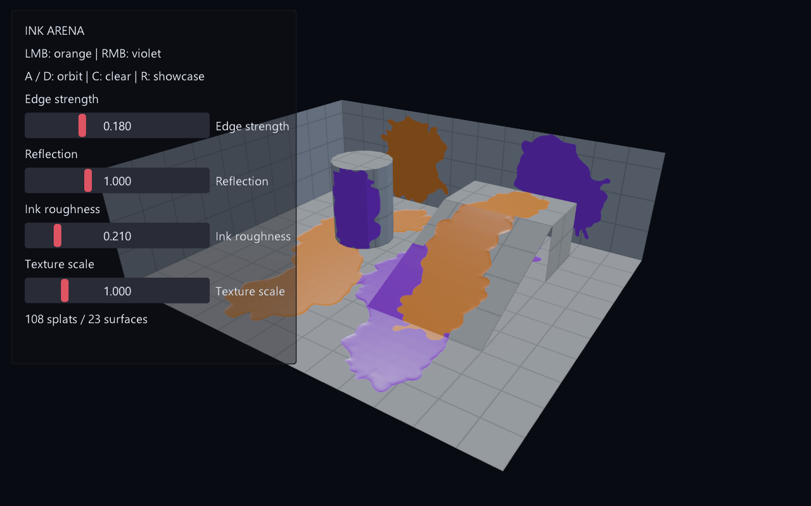

# Ink Arena — GPU surface paint

参考用户提供的 `Splatoon Mine.unitypackage`，以 GPU 片元着色器向持久 RGBA8 画布喷墨。



## 运行与操作

需要包含本次画布修正和 SPIR-V 脚本加载绑定的 Vulkan 引擎。本工作树：

```powershell
build/ink-arena/src/engine/eve.exe run examples/ink-arena
```

鼠标左键喷橙墨，右键喷紫墨；快速拖动会按屏幕距离补点；A / D 转动相机；
C 清空；R 恢复展示；Z 撤销最近一笔 GPU 喷墨；B 将当前命令设为不可撤销检查点。
四个滑条实时调整边缘强度、反光强度、粗糙度、纹理比例，不修改已有墨迹。
`parameters.nut` 定义默认值，运行时调整不写回磁盘。
纹理比例控制世界空间格纹和细纹频率：2 表示密度翻倍，不改变喷射半径。
鼠标操作面板时不会向场景喷墨。

## GPU 路径

CPU 只计算射线、随机笔刷参数及每个表面的投影系数，提交有界矩形。
`shaders/paint.frag` 在 GPU 上采样原包笔刷、执行深度衰减，硬件混合更新持久颜色与覆盖率。
RGB 使用 SrcAlpha / OneMinusSrcAlpha，alpha 使用 One / OneMinusSrcAlpha，
等价于参考公式 `field = lerp(field, colorRGBA, coverage)`。
GPU Canvas 是唯一墨迹状态，正常游玩不维护 CPU 像素镜像、不逐像素调用脚本或上传喷墨纹理。
这使用 GPU 光栅化与混合，不是 ComputeShader 移植。

命中后的 UV 中心、椭圆半径、颜色校验和裁剪像素矩形统一由 Image 模块的
可复用的 `UvPaintRegion` 生成；`UvPaintSession` 的 CPU 可撤销绘制与本示例 GPU Canvas
使用同一命令语义。两者只保留各自必要的执行后端，避免维护第二套 UV 边界算法。
GPU 路径保存确定性的轻量笔触命令用于撤销后重放，不保存 CPU 像素镜像；检查点只移动
撤销边界，因此仍由 Canvas 唯一拥有像素状态。自动验证还覆盖快速拖动补点、原子失败、
撤销重放、检查点和 108 笔调试构建性能预算。

`ink.frag` 提取覆盖轮廓、重建世界空间边缘法线、计算 GGX 高光与解析环境反射。
显式双线性采样补偿 Canvas 默认最近邻采样。双色显示为窄抗锯齿覆盖边界，
有意区别于原材质直接混合 RGB。固定双色参数在脚本与材质中保持配套。

GPU 提交必须在修改下个投影的 push constants 前完成；当前每个受影响表面立即提交，
以后仍可进一步改成批次常量快照以减少同步。当前窗口运行已足够快，不使用 CPU 回退。

## 启动性能与验证（2026-09-10）

同一机器、Debug 引擎、23 个表面、108 次喷墨：

- 原始 CPU 脚本喷墨：12.837 秒。
- 优化后 CPU 脚本喷墨：约 3.9 秒，正常首帧 5.241 秒。
- GPU 喷墨：约 0.10 秒。此计时包括命令准备、提交和当前离屏同步，不是纯 GPU timestamp。

```powershell
$env:EVENGINE_VULKAN_VALIDATION='1'
build/ink-arena/src/engine/eve.exe run --root scripts/capture_root.nut examples/ink-arena
```

验证模式才启用命令日志和 GPU 读回。独立 CPU 世界坐标算法比对 1,863 个采样点，
最大 RGBA 误差 1/255（允许误差 0.025，覆盖浮点与 RGBA8 舍入）。
20 项原有运行检查、23 个表面读回及 GPU/CPU 对比通过。
新增 RGBA8 画布持久性原生测试与 shader 加载测试：2 cases、20 assertions 通过。
最终 Vulkan 验证未报告错误；仍有系统层版本及未使用顶点属性警告。
图像由引擎 swapchain readback 输出，成功标记为 `INK_VERIFY_COMPLETE` 与 `CAPTURED`。
不能只依据捕获入口的退出码判断通过。

裁剪引擎构建、模块依赖、架构源码门禁与 7 个 fixtures、`git diff --check` 通过。
Windows make 包装入口有 shell/Python 路径限制，架构门禁以同一 Python 脚本及 unittest 执行。
未运行完整引擎套件、远端 CI 或 WebGPU 验证。

## 引擎修正与范围

RGBA8 离屏画布以前每次提交都由 render pass 清空，导致只剩最后一次笔触。
现在使用 LOAD 保留内容，只在 pending clear 时显式清除；首次提交也会初始化。
新增 `Canvas.readPixels()` 提供结构化结果和独立、脚本所有的快照，仅用于检查。
离屏绘制与管线代码从大文件拆出，没有修改 Graphics 类布局或新增模块。

HDR 保持原有实现；诊断中发现其部分绘制/读回路径不能满足此持久性测试，
本次不宣称 HDR 累积支持。此次修改仅覆盖 GPU 喷墨所需的 RGBA8 路径。

场景使用显式静态 UV 表面，不包括任意网格展开、UV 扩边、移动或变形网格、
自动绕直角包裹、遮挡剔除、Unity C# 场景、潜墨角色或多人占地玩法。
反射是解析环境，不是 Unity 反射探针。原始笔刷权利归原作者；
`assets/source.json` 记录源包 SHA-256 与 GUID，场景由 `generate_scene.py` 生成。

重新编译 shader：

```powershell
glslangValidator -V examples/ink-arena/shaders/paint.frag -o examples/ink-arena/shaders/paint.frag.spv
glslangValidator -V examples/ink-arena/shaders/ink.frag -o examples/ink-arena/shaders/ink.frag.spv
```
最终正常运行（未启用验证层）：喷墨 0.048 秒，首帧 1.389 秒。验证层下约 0.10 秒。
