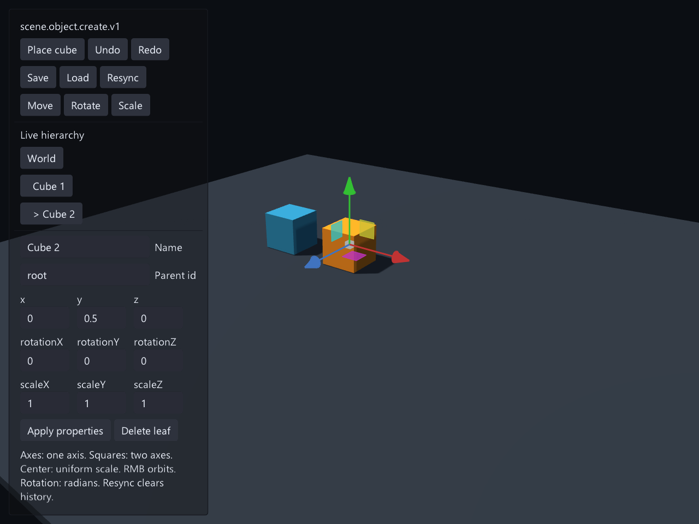
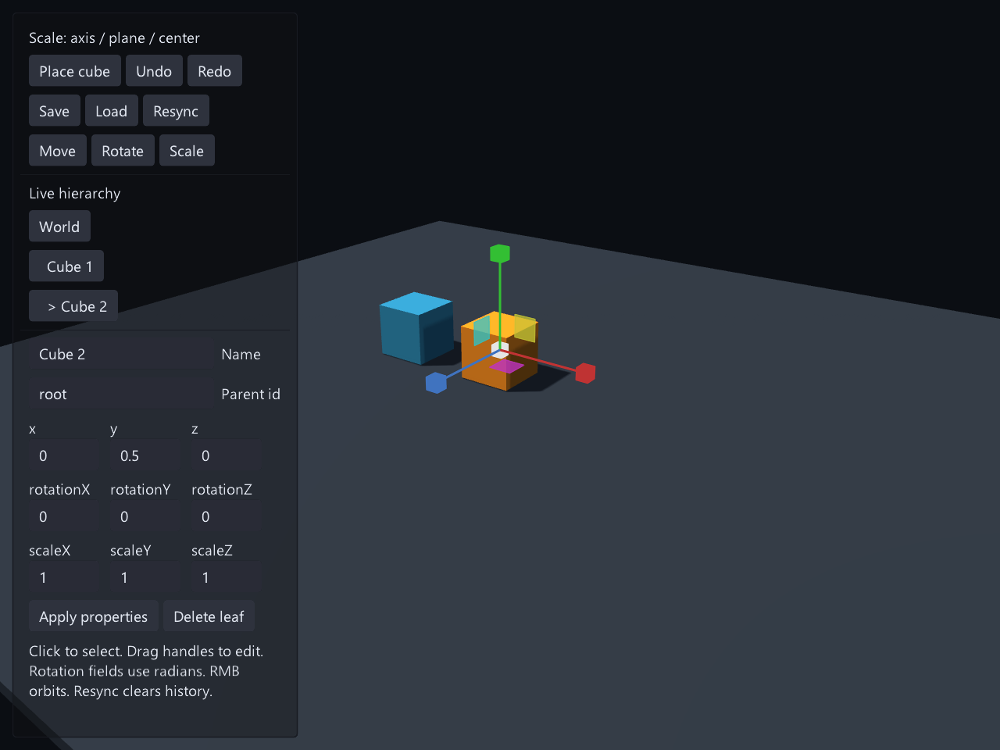

# 可组合场景编辑示例

运行：`make run/win32-debug GAME=examples/scene-editor`（其他平台替换构建配置）。
需要 scene、scene_editing、scene_editor，以及 graphics、ui、editor 及其依赖。

这个例子提供层级选择、世界拾取、创建/删除叶节点、名称/父级/TRS 编辑、移动/旋转/缩放 Gizmo、
撤销重做和 JSON 保存恢复。右键旋转相机；旋转数值使用弧度。
平移、旋转和缩放 Gizmo 使用隔离的 Box3D 碰撞预览；缩放会同步更新组内偏移及每个对象的
box、sphere、capsule 或 convex 碰撞体，释放时把整个选择组提交为一次事务；Ctrl 点击可多选。
Drop 让选择组在预览世界中落下并在稳定后自动提交；Surface 点击目标表面后按法线对齐，随后可 Commit
或 Cancel。Point 让物体留在原位并朝向鼠标射线，Rotate Gizmo 使用独立的物理旋转策略。
预览期间正式场景不会改变，外部修订会让提交明确返回 Conflict。Resync 从运行时重新创建会话并清空历史。

移动用箭头和 XY/YZ/XZ 平面手柄；缩放用轴端方块、双轴平面与中心方块。
中心缩放保留原有长宽高比例；双轴移动吸附不会改变锁定轴。
`scene_visuals.nut` 提供受光网格、方向光、环境光和接收阴影的地面。
显示网格按世界空间顶点更新，保留父级非均匀缩放产生的形变；网格和显示实体复用。

所有面板、选择、输入、相机、图元绘制和文件路径都在 `scene_components.nut` 中，开发者可以替换。
权威修改统一使用以下组件，不依赖本示例 UI：

```squirrel
local opened = eve.SceneEditorModule().createLiveSession("my-scene", "my-host");
if (!opened.ok) throw opened.status.summary;
local session = opened.value;
local created = session.execute("scene.object.create.v1",
    {object="crate", name="Crate", parent="", position=[0.0,0.0,0.0]});
if (!created.ok) throw created.status.summary;
local undone = session.undo();
if (!undone.ok) throw undone.status.summary;
```

不绑定运行时的文档编辑使用 `createSession(id)`；C++ 使用 `SceneEditorSession`，
也可以直接组合底层 Scene Target、CommandRegistry 和 Coordinator。

`scene.object.update.v1` 将 name、parent、position、rotation、scale 一起原子提交；
还可以分别使用 create/delete/rename/reparent 和 `scene.transform.set.v1`。
物理摆放由 `beginPhysicsPlacement`、`updatePhysicsPlacement` / `updatePhysicsPlacementPose` /
`updatePhysicsPlacementTransform`、
`alignPhysicsPlacementToSurface`、`commitPhysicsPlacement` 和 `cancelPhysicsPlacement` 组成。宿主可为每个对象提供
box、sphere、capsule、convex 或 auto 预览体。一个对象可通过 `colliders` 提供多个带局部位姿的 Shape，
并用 `colliderPolicy` 选择 existing、generated 或两者。资源侧推荐用
`cachePhysicsPlacementCompound(object, resourceKey, parts)` 登记离线凸分解结果；旧的
`cachePhysicsPlacementHull` 仍用于单凸包。auto 会核对 `colliderResourceKey`，过期返回 Conflict，缺失返回
NotFound，不会静默退化成盒体。

Collider 缓存使用 `eve.scene.physics-placement-collider-cache` schema 2；
`savePhysicsPlacementColliderCacheJson()` / `restorePhysicsPlacementColliderCacheJson(text)` 只负责确定性编解码，
文件位置仍由宿主拥有。恢复先完整验证，再原子替换当前缓存。示例把缓存保存为
`scene-components-colliders.json`。

`admission` 可按 layer bit、tag、disabled/locked 和世界空间范围过滤背景对象；如果规则会排除选中对象，
开始预览会明确拒绝。设置支持 XYZ 重力、六轴运动锁、最大角速度、按 bounds 调速及远距追赶阈值。
物理世界统一使用世界空间；跨父节点多选提交时，会根据每个父节点（包括同时移动的选中父节点）的最终世界姿态
逆变换回局部 TRS。不能无损表示为 TRS 的层级剪切会明确拒绝。
存档使用 `saveJson()` / `restoreJson(text)`，只包含层级、名称和 TRS，资源与组件由各领域负责。
示例写入用户保存目录的 `scene-components.json`，不会覆盖项目源文件。

运行时被其他系统改动后，旧会话拒绝冲突提交；由宿主选择 Resync 时机。
已有 Link/行为会在编辑中保留；本组件拒绝删除仍带关联的节点。
会话在 owner thread 使用；Host 可先销毁，但 ECS table 必须比会话长寿。

参见 `../scene-builder-game`：同一组件只开放游戏内需要的命令和 UI。




