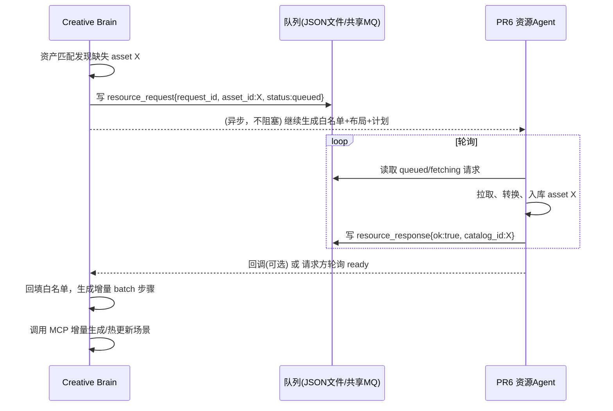

# 与【PR6 资源 Agent】的异步通信协议

> 状态：**协议规范**（首版）。运行时客户端桩在
> [`brain/resource_proto.py`](../brain/resource_proto.py)，本文档是唯一权威定义。

## 目标

当 Creative Brain 需要某资产，而引擎资产标签库（catalog）中不存在该资产时，
它异步请求【PR6 资源 Agent】从外部素材源拉取。请求不阻塞场景生成管线：
Creative Brain 先生成可用资产白名单并输出标准生成计划；缺失资产稍后由资源
Agent 回填，回填后可通过增量 batch 或热更新补充进场景。

## 术语

| 术语 | 说明 |
|------|------|
| `Creative Brain`（请求方） | 生成场景配置 / 资产白名单 / 布局规则，发起资产拉取请求 |
| `PR6 资源 Agent`（处理方） | 外部素材拉取、转换、入库，并把结果写入资产目录 / catalog |
| `request_id` | 一次异步请求的全局唯一标识（Creative Brain 生成，uuid hex） |
| `resource_request` | 请求消息（写队列） |
| `resource_response` | 处理结果消息（回填队列 / 回调） |

## 传输

- 采用 **文件队列 + 可选 JSON-RPC 回调**，开箱即用、跨进程、可审计：
  - 请求方写 `resource_request` 到出队目录（`data/resource_requests.json`）。
  - 处理方轮询该队列，处理完写 `resource_response` 到结果目录
    （`data/resource_responses.json`），或回调请求方暴露的端点。
- 队列文件为**单行 JSON 数组**，追加即原子写整个文件（首版规模小，够用）。
- 若要低延迟，可替换为共享 MQ / Redis / gRPC，消息结构保持一致。

## 消息结构（JSON Schema 摘要）

### 1. `resource_request`

```json
{
  "$schema": "https://evengine.dev/schema/resource-request.json",
  "type": "object",
  "required": ["request_id", "asset_id", "requester", "created_at"],
  "properties": {
    "request_id":  {"type": "string"},
    "asset_id":    {"type": "string", "description": "缺失的资产 / recipe id"},
    "requester":   {"type": "string", "const": "creative-brain"},
    "style":       {"type": "string", "description": "目标场景风格，辅助素材筛选"},
    "requested_by": {"type": "string", "description": "场景名 / 调用上下文"},
    "status":      {"type": "string", "enum": ["queued", "fetching", "ready", "failed"]},
    "created_at":  {"type": "number", "description": "epoch seconds"}
  }
}
```

示例：

```json
{
  "request_id": "9f8a3c2b1d0e",
  "asset_id": "model.ruin_arch",
  "requester": "creative-brain",
  "style": "overgrown ruins",
  "requested_by": "ruin_piazza",
  "status": "queued",
  "created_at": 1776000000.0
}
```

### 2. `resource_response`

```json
{
  "$schema": "https://evengine.dev/schema/resource-response.json",
  "type": "object",
  "required": ["request_id", "asset_id", "ok", "updated_at"],
  "properties": {
    "request_id": {"type": "string"},
    "asset_id":   {"type": "string"},
    "ok":         {"type": "boolean"},
    "asset_path": {"type": ["string", "null"], "description": "落地后的资源路径"},
    "catalog_id": {"type": ["string", "null"], "description": "入库后的 catalog id"},
    "error":      {"type": ["string", "null"], "description": "失败原因"},
    "updated_at": {"type": "number"}
  }
}
```

## 状态机

```
      request()                资源Agent 开始处理          成功 / 入库
queued -----------> fetching ------------------------> ready
                     |                                   |
                     |           失败                     v
                     +--------------------------------> failed
```

| 状态 | 含义 | 责任方 |
|------|------|--------|
| `queued` | 已入队待处理 | Creative Brain |
| `fetching` | 资源 Agent 正在拉取/转换 | PR6 资源 Agent |
| `ready` | 已入库，可用 | PR6 资源 Agent |
| `failed` | 拉取失败（含 error 字段） | PR6 资源 Agent |

## 时序



## 与 Creative Brain 的集成点

- 匹配阶段：`assets.match_to_config` 返回 `missing_assets`。
- 入队：`ResourceBroker.request(asset_id, style=...)` 写 `queued` 请求。
- 消费响应：`ResourceBroker.import_json(response)` 将对应请求置为 `ready/failed`。
- 回填：plan 的 `missing_assets` 清空后，用
  `brain.mcp.run_batch` 把新增资产以增量 `place` 步骤推给引擎热更新。

## 环境变量

| 变量 | 默认 | 含义 |
|------|------|------|
| `EVE_CB_RESOURCE_QUEUE` | `data/resource_requests.json` | 出队文件路径 |
| `EVE_CB_RESOURCE_OUTBOX` | `data/resource_responses.json` | 结果回填文件路径 |

## 扩展（非首版）

- 批量请求（一次携带多 `asset_id`）。
- 优先级 / TTL / 重试上限。
- 流式进度事件（`status: downloading`, `converting`）。
- 通过资源 Agent 回调 Creative Brain 的 JSON-RPC 端点（替代轮询）。
